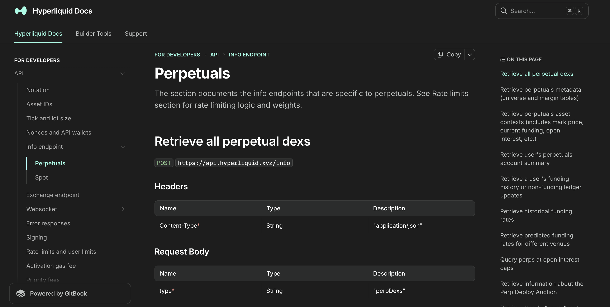
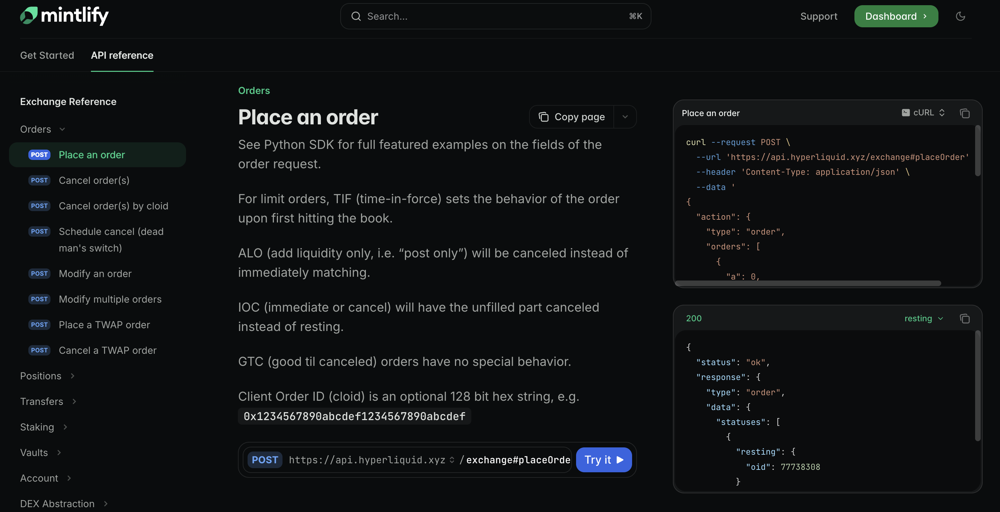

import { Callout } from 'fumadocs-ui/components/callout';
import { Steps, Step } from 'fumadocs-ui/components/steps';

A few weeks ago I migrated a GitBook API reference to Mintlify. The GitBook version was functional, but it ran into its limits on an API-heavy page: no native OpenAPI rendering, no try-it playground, and a sidebar that has to be hand-built every time an endpoint ships. Mintlify was the test target because it generates all three from a valid OpenAPI schema, with no extra setup.

I picked Hyperliquid's perpetuals API as the conversion source. It's a well-known reference and it's the kind of single-URL, multi-endpoint API common in the space. All 30 perpetuals info operations post to `POST /info` and use a `type` field in the body to distinguish between them. That single URL is the first quirk the GitBook source hides.

The entire conversion for this paritcular challenge was done through Claude. Getting consistent output took more iteration than I expected because the GitBook source format and the OpenAPI spec don't map cleanly to each other, and Mintlify's parser is strict in ways the spec doesn't warn you about. This post is about those constraints and how to spell them out in your prompt so the first conversion comes out right.


**Before**


**After**

## Why Mintlify renders OpenAPI differently

GitBook treats API documentation as just another markdown page. You write it, you format it, you ship it. There's no schema validation, no structured sidebar. The result looks fine but requires a lot of manual maintenance as endpoints change.

Mintlify takes a different approach. You give it a valid OpenAPI 3.1.0 schema and it generates the reference automatically: sidebar navigation grouped by tags, request and response schema explorers, and an interactive playground on every endpoint. The tradeoff is that it's strict. A malformed schema or an incorrect YAML value doesn't produce a warning. It either silently drops the page from the sidebar or renders nothing at all.

That strictness is what caused most of the problems below.

## Problem 1: OpenAPI doesn't support multiple operations on the same URL

Hyperliquid's info endpoint is a single URL with a single HTTP method. All 30 perpetuals info operations post to `https://api.hyperliquid.xyz/info` and use a `type` field in the request body to distinguish between them: `"meta"`, `"clearinghouseState"`, `"fundingHistory"`, and so on.

OpenAPI expects paths to be unique combinations of URL and HTTP method. `POST /info` is one slot. Trying to describe 30 operations under that one key produces an invalid schema.

**The fix:** path fragments. The OpenAPI spec allows fragments in path keys, and they are ignored at runtime. So `/info#meta` and `/info#clearinghouseState` are distinct keys in the `paths` object even though both hit the same endpoint.

```yaml
paths:
  "/info#meta":
    post:
      operationId: retrievePerpetualsMeta
      summary: Retrieve perpetuals metadata
      # ...
  "/info#clearinghouseState":
    post:
      operationId: retrieveUsersPerpetualsSummary
      summary: Retrieve user's perpetuals account summary
      # ...
```

Mintlify picks up each `operationId` and renders them as separate sidebar entries. This pattern isn't prominently documented but it works consistently across the full schema.

## Problem 2: GitBook's markdown syntax doesn't translate to anything standard

GitBook uses its own templating layer on top of markdown. The Hyperliquid source had this on every heading and parameter table:

```markdown
<mark style="color:green;">`POST`</mark> `https://api.hyperliquid.xyz/info`

| Content-Type<mark style="color:red;">\*</mark> | String | "application/json" |
| type<mark style="color:red;">\*</mark>         | String | "meta"             |
```

`<mark style="color:green;">` wraps the HTTP method. `<mark style="color:red;">\*</mark>` marks required fields. Response sections sit inside `` and `` blocks that GitBook renders as tabbed panes. None of this has an OpenAPI equivalent.

**The fix:** Claude handles the stripping correctly when given a representative sample and a clear target format. The `required` array in each request body picks up the right fields based on the red asterisk pattern. The tab blocks get flattened into `requestBody` and `responses` objects. The only part that doesn't work automatically is multi-tab responses, which is its own problem.

## Problem 3: Multiple response tabs collapse into one example

Several endpoints return two different response shapes depending on which dex you're querying. In GitBook these appear as two tabs. The first pass from the model produced a single `example:` key, which means the second response shape was silently dropped.

The correct structure in OpenAPI is named `examples` (plural) under the response content, which is what triggers Mintlify to render a tab picker:

**Singular form** (drops the second shape):

```yaml
responses:
  "200":
    content:
      application/json:
        example:
          funding: "0.0000125"
          markPx: "14.3161"
```

**Named examples** (renders a tab picker):

```yaml
responses:
  "200":
    content:
      application/json:
        examples:
          FirstPerpDex:
            summary: "First perp dex response"
            value:
              funding: "0.0000125"
              markPx: "14.3161"
          HIP3Dex:
            summary: "HIP-3 dex response"
            value:
              funding: "0.0002110251"
              markPx: "25451.0"
```

**The fix:** tell the model explicitly to use named `examples` on any response where the source shows multiple tabs.

## Problem 4: Inline JSON comments break the schema

The source JSON examples had inline comments carrying real information:

```json
{
  "marginMode": "strictIsolated", // "strictIsolated" means margin cannot be removed
  "onlyIsolated": true            // deprecated. Means either "strictIsolated" or "noCross"
}
```

JSON doesn't support comments. Leaving them in an `example:` block breaks schema validation. Dropping them means losing the deprecation note and the behavioral explanation.

**The fix:** strip the comments from the `example:` block and move the text to `x-comment` on the corresponding schema property. It's an extension field, not part of the OpenAPI spec, but Mintlify passes extension fields through to the rendered output.

```yaml
onlyIsolated:
  type: boolean
  x-comment: deprecated. Means either "strictIsolated" or "noCross"
marginMode:
  type: string
  x-comment: '"strictIsolated" means margin cannot be removed, "noCross" means only isolated margin allowed'
```

That said, `x-comment` is invisible in other renderers. If the reference ever moves platforms, that information disappears. The cleaner long-term approach is to convert those comments to proper `description` values on each schema property.

## Problem 5: Mintlify enforces strict string quoting in example blocks

<Callout type="warn">
This was the problem that took the most iteration. Mintlify requires every string value inside `example:` and `value:` blocks to be explicitly double-quoted. Numbers, booleans, and `null` stay bare. When this breaks, Mintlify often renders an empty page with no error message rather than surfacing a parse error.
</Callout>

A value like `"A"` (used as the ask/sell side indicator) parses as the bare letter `A` in YAML when unquoted. A hex address like `0xa166e3fa...` starts with `0x` and can be misread by some parsers. The output I ended up with still has one slip: the candle snapshot example has `"s": BTC` with `BTC` unquoted. It doesn't break rendering because `BTC` isn't a YAML special value, but it's the kind of inconsistency that accumulates when quoting is left to the model.

**The fix:** tell the model to use a custom PyYAML `SafeDumper` that forces double-quoting on all string values when generating the schema:

```python
import yaml

class QuotedStr(str):
    pass

def quoted_representer(dumper, data):
    return dumper.represent_scalar('tag:yaml.org,2002:str', data, style='"')

yaml.add_representer(QuotedStr, quoted_representer, Dumper=yaml.SafeDumper)

def quote_strings(obj):
    if isinstance(obj, str):
        return QuotedStr(obj)
    if isinstance(obj, dict):
        return {k: quote_strings(v) for k, v in obj.items()}
    if isinstance(obj, list):
        return [quote_strings(v) for v in obj]
    return obj
```

Passing every example dict through `quote_strings()` before serializing enforces consistent output without hand-editing each block.

## Problem 6: YAML block scalars and description strings with special characters

Two smaller formatting issues that cause silent failures in Mintlify.

**Block scalars in example blocks.** YAML supports `|` (literal) and `>-` (folded) block scalars for multiline strings. These work fine in `description:` fields but break silently inside `example:` blocks. Anything nested in an example that would normally use block style needs flow notation instead:

```yaml
# Avoid inside example blocks
levels:
  - - px: "29792.0"
      sz: "5.0"

# Use flow notation for arrays-of-arrays
levels: [[{"px": "29792.0", "sz": "5.0", "n": 1}], [{"px": "29800.0", "sz": "3.0", "n": 1}]]
```

**Description strings with colons or embedded quotes.** A description like `"A" = ask/sell` opens with a quotation mark, which YAML misreads. Single-quoting the entire value avoids the escaping problem:

```yaml
# Avoid
description: "\"A\" = ask/sell"

# Use
description: '"A" = ask/sell'
```

Both fixes belong in the prompt as explicit rules, since the model doesn't reliably apply them without instruction.

## Problem 7: Discriminated union types need explicit modeling

Some fields in the source had two valid types that the model didn't always catch. The `oid` parameter on the order status endpoint accepts either a `uint64` integer or a 16-byte hex string. The response itself has two shapes: one when the order exists and one when it doesn't.

These map cleanly to `oneOf` once identified:

```yaml
oid:
  oneOf:
    - type: integer
      format: uint64
    - type: string
  description: Either u64 representing the order id or 16-byte hex string representing the client order id
```

**The fix:** instruct the model to use `oneOf`/`allOf` for discriminated variants and extract shared types into `components/schemas` with `$ref`. The Hyperliquid schema ended up with shared types for `Address`, `Fill`, `OpenOrder`, `FrontendOpenOrder`, `BookLevel`, and `Candle`.

## How to replicate this

Drop your markdown API file into Claude along with the prompt below. That's the entire process. The prompt covers the structural decisions, the Mintlify-specific YAML rules, and the Python generation script. If your source schema has quirks not mentioned here, add them to the prompt directly. The more specific you are about edge cases in your source format, the less cleanup you'll need afterward.

```md
Convert the provided Markdown API reference into a valid OpenAPI 3.1.0 YAML file
targeting Mintlify documentation platform.

---

Structure

- One file, `openapi: 3.1.0`, with `info`, `servers`, `tags`, `paths`,
  `components/schemas`.
- All operations share the same URL and HTTP method. Use path fragments for unique
  keys: `/info#operationName`. The fragment is ignored at runtime.
- `operationId`: camelCase derived from the endpoint name.
- `summary`: copied verbatim from the `##` heading.
- `tags`: group operations into logical sections.
- Response schemas → named `components/schemas` entries, referenced via `$ref`.
  Use `oneOf`/`allOf` for discriminated variants.
- Path order must match the Markdown heading order exactly.

Fidelity

- Copy every `summary` verbatim.
- Keep `description` fields as prose.
- Preserve inline comments from response examples (e.g. `// this is optional`)
  as `x-comment` on the relevant schema property.
- Deprecated endpoints: set `deprecated: true` with the deprecation note in
  `description`.
- Include at least one `example` on each request body; use named `examples` on
  responses where the docs show multiple tabs.

Mintlify YAML

- Quote **all** string values inside `example:` and `value:` blocks. Numbers,
  booleans, and `null` stay bare. Everything else gets `"..."`. No exceptions.
- Never use `>-` or `|` inside example blocks.
- Use flow notation (`[{...}]`) for arrays-of-arrays in examples.
- Use `|` (literal block scalar) for multiline `description` fields only.
- Schema `description` with colons or quotes → single-quote the whole value:
  `description: '"A" = ask/sell'`.

Generation

Write and run a Python script using PyYAML with a custom `SafeDumper` that
double-quotes all `str` values. Dump with `default_flow_style=False,
sort_keys=False`. Then validate:

1. Parse with `yaml.safe_load`.
2. Print every `operationId` + `summary` pair and confirm they match source headings.
3. Assert every value inside `example:`/`value:` blocks is a number, boolean,
   `null`, or quoted string.
```

## Final words

The path fragment pattern for single-URL APIs is the first thing to get right. Without it, Mintlify gives you an empty sidebar rather than an error. After that, get the quoting enforced programmatically before previewing anything. Mintlify's rendering failures for malformed examples are almost never explicit, and tracking down which operation caused a missing page is tedious.

The overall approach works well as an AI-assisted task. The model handles the structural translation reliably once the edge cases are spelled out. What it doesn't catch on its own is Mintlify-specific rendering quirks, and most of the prompt above is exactly that.

After this first run I reused the prompt on two more single-URL APIs (one perpetuals, one spot), both with the same quoting script. Each one rendered cleanly in Mintlify's preview on the first try.

That said, the quoting script is the part that ages the worst: Mintlify may fix its parser, and when it does, half these fixes will become unnecessary. The path-fragment trick and the `oneOf` modeling will stay. 

If a quirk not covered here breaks your migration, the prompt probably needs another rule, and I'd rather add it to the prompt than have you patch around it.