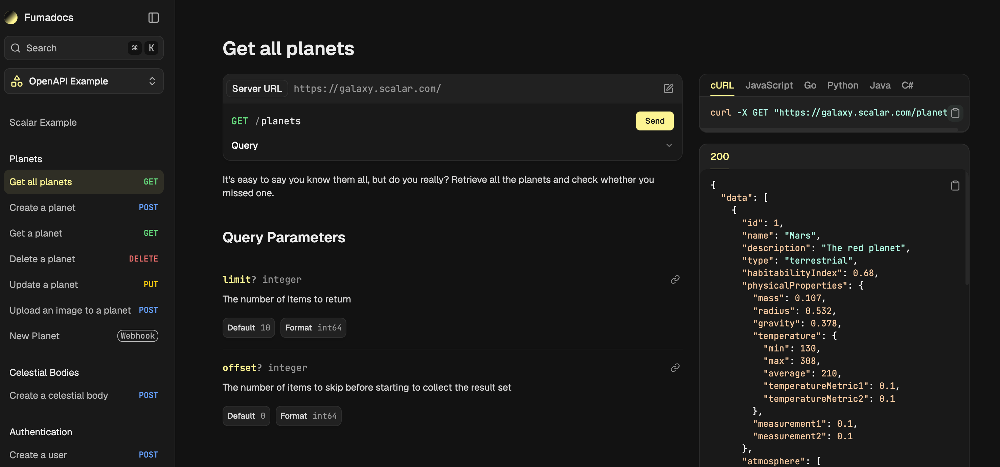
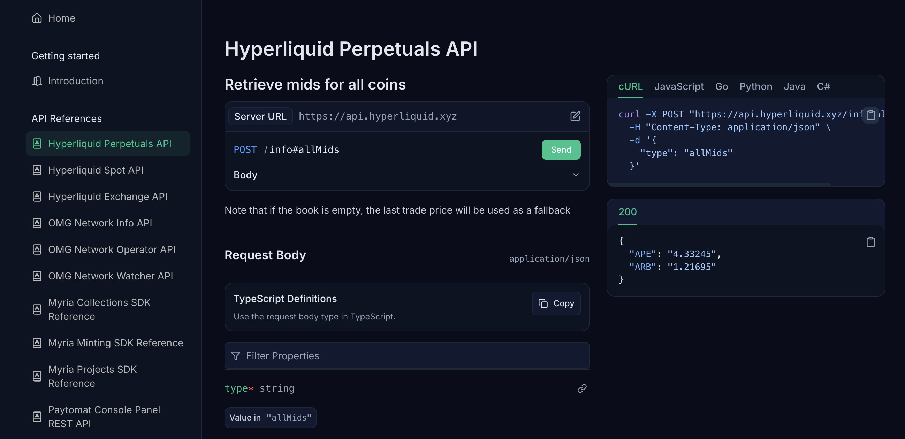

import { Callout } from 'fumadocs-ui/components/callout';
import { Steps, Step } from 'fumadocs-ui/components/steps';

The problem with most OpenAPI generators is that they assume you're building a traditional documentation portal. Every operation gets its own page, its own route, and its own spot in the sidebar. That works well when you're documenting a large API and developers are usually searching for a specific endpoint. It doesn't work nearly as well when you want to present an API as a cohesive product.



I ran into this while building a portfolio site with Fumadocs. Instead of spreading endpoints across dozens of pages, I wanted a single reference page that displayed the entire specification in one place. The layout I was after had documentation on the left, code samples and an interactive playground on the right, and every endpoint available without navigating between routes.

Fumadocs doesn't provide this out of the box. Its default OpenAPI integration is similar to the rest of the industry, but it wasn't the experience I was after. So I decided to build it myself.

The approach ended up being surprisingly flexible. Although I originally created it for a portfolio project, the same routing and rendering logic works just as well for a full documentation portal because it isn't tied to a specific site structure. Once the system parses the OpenAPI spec, everything is generated from it.

From there, the challenge became figuring out how to turn a route-per-operation system into a single-page API reference without fighting Fumadocs' existing architecture.



My own use case is six files across two projects: three Hyperliquid APIs ([perps](/portfolio/api/hyperliquid-perps/), [spot](/portfolio/api/hyperliquid-spot/), [exchange](/portfolio/api/hyperliquid-exchange/)) and three OMG Network APIs ([info](/portfolio/api/omg-info/), [operator](/portfolio/api/omg-operator/), [watcher](/portfolio/api/omg-watcher/)). Each one needed its own page at a clean URL, with the two-column layout and the interactive playground that come standard with Fumadocs OpenAPI.

Getting there meant working against the grain of how Fumadocs generates OpenAPI pages in the first place, so that's where the actual build starts.

## Why the default setup wasn't enough

Fumadocs OpenAPI generates its pages from the dereferenced schema during the source loader step, and the unit it generates a page for is a single operation. There's no concept anywhere in the library of a "spec group," a page that renders every operation in one file together. 

To get that page, I needed a route that doesn't correspond to anything the loader produces. I had to invent it and wire it in by hand, on top of the routes Fumadocs already generates for me.

The site exports statically, so every route the app will ever serve has to be declared at build time, with no fallback to catch anything I missed. That meant the new group routes needed an entry in `generateStaticParams()` alongside the auto-generated operation params, one per spec:

```ts
const openapiGroupSlugs = Object.keys(SPEC_PATHS).map((key) => ({
  slug: ['api', key],
}));
```

Next, I created a `SPEC_PATHS` map that links each API identifier to its OpenAPI file on disk. I also added a matching `SPEC_TITLES` map to provide human-friendly names in the UI:

```ts
export const SPEC_PATHS: Record<string, string> = {
  'hyperliquid-perps':    path.join(process.cwd(), 'content/api/hyperliquid-perps.yaml'),
  'hyperliquid-spot':     path.join(process.cwd(), 'content/api/hyperliquid-spot.yaml'),
  'hyperliquid-exchange': path.join(process.cwd(), 'content/api/hyperliquid-exchange.yaml'),
  'omg-info':             path.join(process.cwd(), 'content/api/omg-info.yaml'),
  'omg-operator':         path.join(process.cwd(), 'content/api/omg-operator.yaml'),
  'omg-watcher':          path.join(process.cwd(), 'content/api/omg-watcher.yaml'),
};
```

Because both `generateStaticParams()` and the route itself read from these same two maps, adding a seventh spec later really is two lines: one new path, one new title. The harder part was never the config. It was getting the route to render the right thing once that URL existed.

## What I tried before reading the schema directly

My first attempt was to find whatever function Fumadocs OpenAPI uses internally to turn a parsed operation into props for `APIPage`, import it directly, and call it once per operation inside my own loop. The library already does this work somewhere, since it's how the default per-operation pages render. I found the function in the package source and wired it into my group route.

That attempt didn't survive a production build. The import resolved fine in dev, then failed under Turbopack once I tried to build for static export. I don't have the exact error text anymore since I dropped the approach the same afternoon, but the shape of it was a module resolution failure: Turbopack couldn't trace the internal file path I was reaching into from outside the package's public exports. A Webpack-based build might have handled it differently. I didn't test that, because by then I'd found a second approach that didn't depend on undocumented internals at all.

`createOpenAPI` exposes a `getSchema()` method that returns the same dereferenced schema the library uses internally, just without the part that turns it into page props. So instead of importing Fumadocs' internals, I read the schema myself and built the operations list by hand:

```ts
const schema = await openapi.getSchema(specPath);
const { dereferenced } = schema;
const methodKeys = ['get', 'put', 'post', 'delete', 'options', 'head', 'patch', 'trace'] as const;
...
``` 

Webhooks get the same treatment from `dereferenced.webhooks`. The resulting array goes straight into `APIPage` alongside `document`, `showTitle`, and `showDescription`, and the group page renders every operation in the spec on one route. 

I kept the default per-operation pages working too, since deep links to a single endpoint are still useful elsewhere on the site. Those still come from `source.getPage(slug)` and `openapiData.getAPIPageProps()`, completely unchanged. Both routing paths live in the same `page.tsx`, one manual branch for spec group pages and one untouched branch for everything Fumadocs already generates.

## That one CSS import

The group page rendered with every operation in place, but the UI was renderring incorrectly. Everything sat in a single column instead of the two-column docs-left, code-right layout I'd been building toward, and nothing in the props or the component looked off. It wasn't a long search, maybe fifteen minutes, but it was the kind of fifteen minutes that feels longer because nothing about the symptom points at the cause.

<Callout type="warn">
`fumadocs-openapi` ships its own CSS preset, separate from the core Fumadocs UI preset. Importing the UI preset alone gets you working components in the wrong format, with no runtime warning that a stylesheet is missing.
</Callout>

The fix was one more import in `global.css`:

```css
@import 'fumadocs-openapi/css/preset.css';
```

That line turns on the desired layout, the request and response panels, and the language tabs for code samples. I'd assumed the UI preset covered anything OpenAPI-related too, since the component itself ships from `fumadocs-openapi`. It doesn't, and it's an easy one to miss if you're not specifically looking for a second preset file.

## How to set this up on your own Fumadocs site

This is the full path from a bare Fumadocs install to a working spec group page, in the order I'd build it again.

<Steps>
<Step>
### Define your spec config

Create one file that maps a short key to a YAML path on disk and a display title. Everything else in this setup reads from these two objects, so this is the only place a new spec gets added later.

```ts
// lib/openapi.ts
import { createOpenAPI } from 'fumadocs-openapi/server';
import path from 'path';

export const SPEC_PATHS: Record<string, string> = {
  'your-spec-key': path.join(process.cwd(), 'content/api/your-spec.yaml'),
};

export const SPEC_TITLES: Record<string, string> = {
  'your-spec-key': 'Your API name',
};

export const openapi = createOpenAPI({
  input: Object.values(SPEC_PATHS),
});
```
</Step>
<Step>
### Wire the OpenAPI source into your content source

`openapiSource()` generates the default per-operation pages from your specs. Merge its files with whatever else your `loader()` already serves, and register the plugins it needs.

```ts
// lib/source.ts
import { loader } from 'fumadocs-core/source';
import { openapiPlugin, openapiSource } from 'fumadocs-openapi/server';
import { openapi } from '@/lib/openapi';

const openapiFiles = await openapiSource(openapi, {
  baseDir: 'api',
});

export const source = loader({
  baseUrl: '/docs',
  source: {
    files: [
      // ...your existing docs files,
      ...openapiFiles.files,
    ],
  },
  plugins: [openapiPlugin()],
});
```
</Step>
<Step>
### Create a shared APIPage component

Wrap `createAPIPage` once and reuse it in both the group route and the default per-operation route, so the two stay visually consistent.

```tsx
// components/api-page.tsx
import { openapi } from '@/lib/openapi';
import { createAPIPage } from 'fumadocs-openapi/ui';

export const APIPage = createAPIPage(openapi, {});
```
</Step>
<Step>
### Build the group route from the dereferenced schema

In your catch-all page, check for the group route before falling through to the default Fumadocs page lookup. Read the schema with `getSchema()`, walk the HTTP methods for every path, and pass the resulting array straight into `APIPage`.

```tsx
// app/[[...slug]]/page.tsx
import { openapi, SPEC_PATHS, SPEC_TITLES } from '@/lib/openapi';
import { APIPage } from '@/components/api-page';
import { notFound } from 'next/navigation';

const methodKeys = ['get', 'put', 'post', 'delete', 'options', 'head', 'patch', 'trace'] as const;

export default async function Page({ params }: { params: Promise<{ slug?: string[] }> }) {
  const { slug = [] } = await params;

  if (slug[0] === 'api' && slug.length === 2) {
    const specPath = SPEC_PATHS[slug[1]];
    const title = SPEC_TITLES[slug[1]];
    if (!specPath || !title) notFound();

    const schema = await openapi.getSchema(specPath);
    const { dereferenced } = schema;

    const operations: any[] = [];
    for (const [path, pathItem] of Object.entries(dereferenced.paths ?? {})) {
      if (!pathItem) continue;
      for (const method of methodKeys) {
        const operation = (pathItem as any)[method];
        if (!operation) continue;
        operations.push({
          method,
          path,
          pathItem,
          operation,
          displayName: operation.summary || (pathItem as any).summary || operation.operationId || path,
        });
      }
    }

    const webhooks: any[] = [];
    for (const [name, pathItem] of Object.entries((dereferenced as any).webhooks ?? {})) {
      if (!pathItem) continue;
      for (const method of methodKeys) {
        const operation = (pathItem as any)[method];
        if (!operation) continue;
        webhooks.push({
          method,
          name,
          pathItem,
          operation,
          displayName: operation.summary || (pathItem as any).summary || name,
        });
      }
    }

    return (
      <APIPage
        document={specPath}
        operations={operations}
        webhooks={webhooks}
        showTitle
        showDescription
      />
    );
  }

  // fall through to your existing source.getPage(slug) logic
}
```
</Step>
<Step>
### Register every spec as a static param

If the site exports statically, the group routes need to be declared explicitly. They won't be picked up by `source.generateParams()`, since they don't correspond to anything the loader generated.

```ts
export async function generateStaticParams() {
  const params = source.generateParams();

  const openapiGroupSlugs = Object.keys(SPEC_PATHS).map((key) => ({
    slug: ['api', key],
  }));

  return [...openapiGroupSlugs, ...params];
}
```
</Step>
<Step>
### Match generateMetadata to the same route check

Whatever condition you use to detect the group route in `page.tsx`, use the exact same condition in `generateMetadata`. It's easy to write one as `slug[0] === 'api'` and the other as `slug[0] === 'openapi'`, since you'll be thinking in terms of "the OpenAPI route" in one place and "the `/api/` URL" in the other. They need to be the same string.

```ts
export async function generateMetadata({ params }: { params: Promise<{ slug?: string[] }> }) {
  const { slug = [] } = await params;

  if (slug[0] === 'api' && slug.length === 2) {
    const title = SPEC_TITLES[slug[1]];
    if (!title) return {};
    return { title };
  }

  // fall through to your existing metadata logic
}
```
</Step>
<Step>
### Import the OpenAPI CSS preset

This is the one easy to skip, since the component itself ships from `fumadocs-openapi`, so it's reasonable to assume the core UI preset already covers it.

```css
@import 'fumadocs-ui/css/preset.css';
@import 'fumadocs-openapi/css/preset.css';
```
</Step>
</Steps>

If you follow those steps, every spec in `SPEC_PATHS` will get a full reference page at `/api/<spec-key>`, with the two-column layout, the live playground, and multi-language code samples.

## Summary

As a result, six specs are live on the portfolio right now, and the setup is generic enough that I'm planning to reuse it as-is for client documentation portals, which was the actual point of building it this way instead of hardcoding it to my own six files. The config-driven part held up well: every spec I've added since the first one really has been two lines.

The parts worth watching if you're adapting this yourself are the two I ran into directly, the route name needing to match everywhere it's checked, and the CSS preset needing its own import. Neither is hard once you know to look for it. Both are the kind of thing you only find by hitting them once.