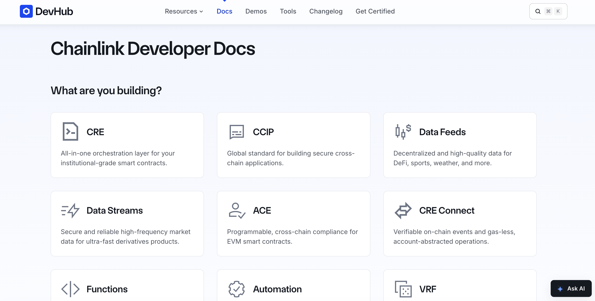

- **Role:** Technical Writer, embedded with the developer relations team
- **Engagement:** February 2021 to September 2021

## Background

Chainlink is a decentralized oracle network that connects smart contracts to off-chain data, external APIs, and other blockchains. Its documentation needed to serve a fast-growing range of integration patterns, from price feeds to automation, while staying approachable to engineers building on EVM-compatible chains for the first time.

## Goal

My role was to make the developer portal something the community could contribute to directly, give engineers runnable examples for the integration patterns they actually needed, and close the gap on the questions that kept resurfacing in support channels and at hackathons.

## Key problems solved

### Problem 1: No option for community to contribute to the docs

**Challenge**: The portal was hosted on Read the Docs, with no path for external contributions and a structure that hadn't kept pace with the growing number of integrations and data providers Chainlink supported.

**Solution**: I helped structure and migrate the Chainlink developer portal into an open-source, Eleventy-based site, with content organized so both the internal team and outside contributors could submit changes directly instead of routing everything through a closed process.

**Impact**: Developer engagement increased 25–35%.

### Problem 2: A continuously expanding integration surface outpacing documentation

**Challenge**: Chainlink kept expanding new price and data feeds, new integration points, new Automation features. Each addition needed its own guide before engineers could use it, with new ones landing as fast as the product shipped.
 
**Solution**: I delivered guides and tutorials as each new integration shipped, covering it end to end: making job requests, pulling Arbitrum price feeds, working with Flight Aware data, checking L2 sequencer health, and registering Automation upkeep among them.

**Impact**: Gave engineers a self-serve path through the most common integrations, reducing the back-and-forth needed to get a first integration working.

### Problem 3: No feedback loop between support and the docs

**Challenge**: The same gaps surfaced repeatedly, both in general developer support and during hackathons, where teams under time pressure ran into the same blockers as engineers integrating outside of an event.

**Solution**: I participated in hackathons and hang out in developer's Discord, gathering developer feedback in real time and feeding it back into the docs rather than answering the same questions individually each time they came up.

**Impact**: Support question volume dropped 30–40%.

## Final deliverables

- An open-source [developer portal](https://github.com/smartcontractkit/documentation)
- [Chainlink API Calls](/portfolio/chainlink/api-calls) guide
- [Arbitrum Feeds](/portfolio/chainlink/arbitrum-feeds) integration guide
- [Flight Aware](/portfolio/chainlink/flight-aware) integration guide
- [L2 Sequencer Health Flag](/portfolio/chainlink/health-flag) guide
- [How to Register Upkeep](/portfolio/chainlink/register-upkeep)
- [How to Make an Existing Job Request](/portfolio/chainlink/job-requests)