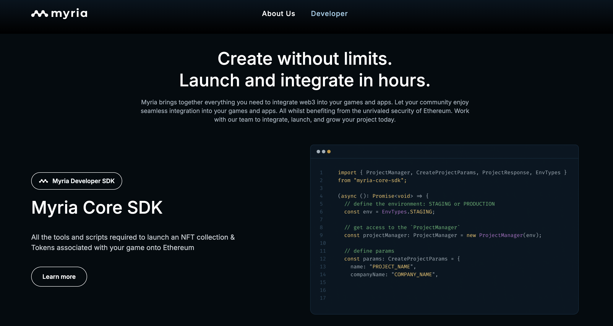
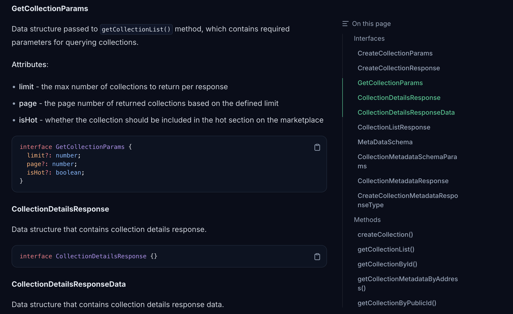

- **Role:** Technical Writer, embedded with the engineering team
- **Engagement:** June 2022 to December 2022

## Background

Myria is a gaming ecosystem built to help developers launch and scale games on Ethereum. The project needed a scalable solution to serve public-facing documentation for integration partners.

## Goal

My role was to build Myria's developer documentation from nothing: give partners a self-serve way to integrate, cut down the manual steps standing between a new partner and a working integration, and reduce how often the same questions landed in support.

## Key problems solved

### Problem 1: No developer portal to integrate against

**Challenge**: Myria had no public developer documentation. Partners evaluating or building on the platform had nothing to work from and depended entirely on direct access to the engineering team.

**Solution**: I built the developer portal from scratch, covering SDK references, guides, and samples for the platform.

**Impact**: Attracted multiple high-quality partners within the first few weeks, including AB de Villiers, LeapBlock Studios, and Crystal of Fate.

### Problem 2: No reference for partners' recurring questions

**Challenge**: Before a partner could do anything with the SDK, they had to generate a Stark key, a manual step with no tooling behind it. From there, the SDK itself spanned collections, minting, and project management, with no runnable example to show how the pieces fit together.

**Solution**: I built an SDK helper on the developer portal to generate a Stark key directly, removing that manual step, and a TypeScript SDK samples app covering the SDK's core flows as runnable examples partners could start from.

**Impact**: Decreased partner integration time by 70–80%.

### Problem 3: No feedback loop between support and the docs

**Challenge**: Beyond the core SDK, partners needed answers on things like marketplace interactions and other day-to-day tasks, and without documented references for them, the same questions kept landing in support.

**Solution**: I wrote a broad set of SDK references, along with smaller guides for tasks like marketplace mint transactions.

**Impact**: Reduced technical support ticket volume by 50–60%.

## Final deliverables

- A developer portal built from scratch, covering SDK references, guides, and samples
- A Stark key generator helper built into the portal (no longer publicly accessible; Myria's docs are no longer open source)
- A [TypeScript SDK samples app](/portfolio/myria/samples-app)
- SDK references including [Collections](/portfolio/myria/collections), [Minting](/portfolio/myria/minting), and [Projects](/portfolio/myria/projects), among others
- Smaller guides for marketplace interactions and related tasks, including [mint transactions](/portfolio/myria/mint-transactions)
- A [quickstart guide](/portfolio/myria/quickstart) for new partners

## What happened next

The role was eliminated during a company-wide restructuring following multiple rounds of layoffs.