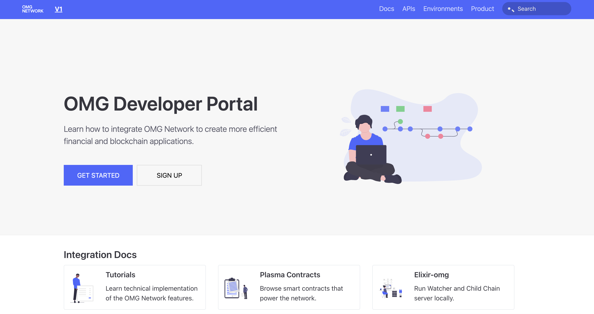
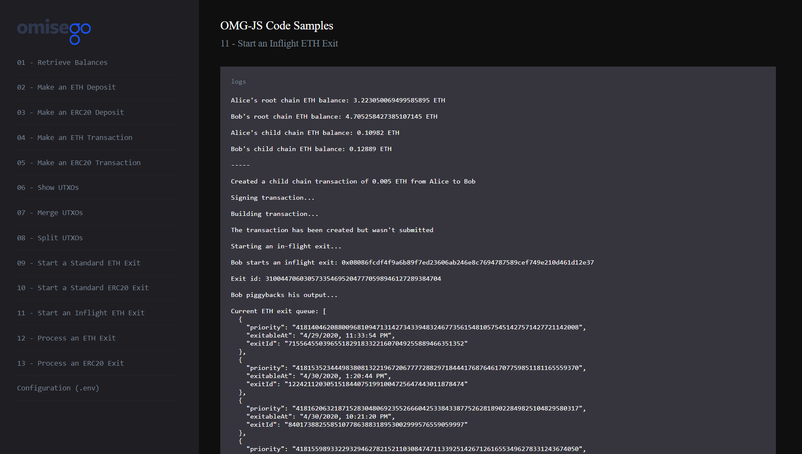
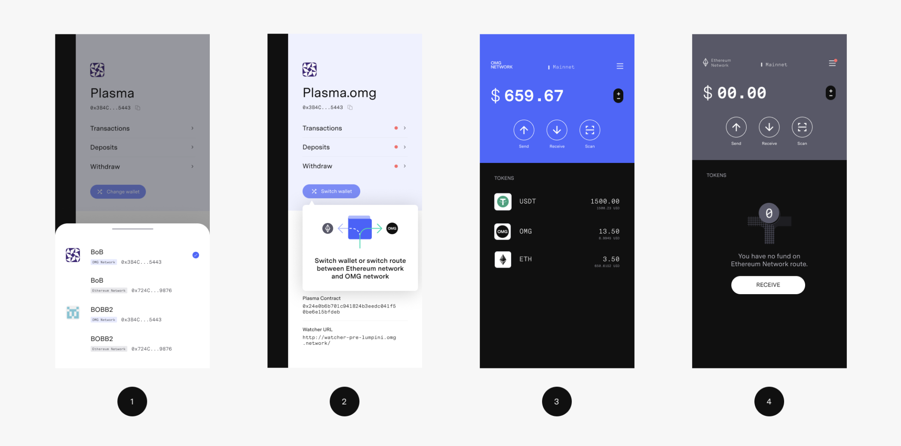
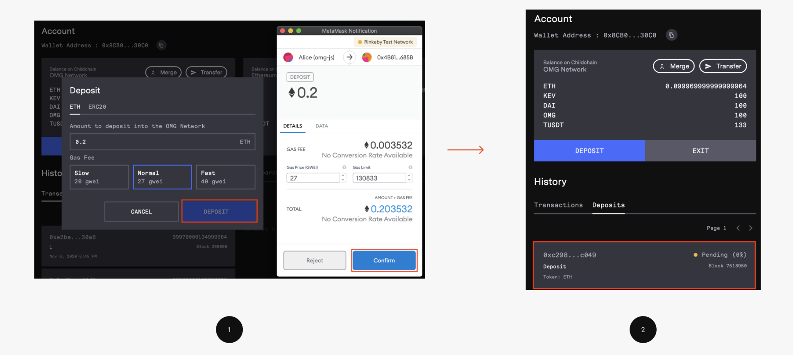

- **Role:** Technical Writer, embedded with the engineering team
- **Engagement:** March 2020 to December 2020

## Background

OMG Network is a Layer 2 scaling solution for Ethereum. Its growth depended on exchanges, wallet providers, and other platforms being able to integrate without first becoming experts in the protocol's UTXO model and Plasma architecture.

## Goal

My role was to shorten that integration path so partners could ship without extended back and forth with the core engineering team, and to keep the developer portal accurate as the protocol kept changing under it.

## Approach

Over the course of the engagement, I rebuilt the documentation around how partners actually integrate: a docs-as-code portal that stayed in sync with releases, a runnable samples app for engineers who wanted to start from working code, end-to-end use-case guides for exchanges and wallets, a no-code quickstart for non-developers doing early evaluation, and a technical specification written to withstand jury-level scrutiny for Reddit's scaling competition.

## Key problems solved

### Problem 1: Public docs couldn't keep pace with a protocol in motion

**Challenge**: A protocol was under active development, however documentation had a separate cycle from the code. Internal docs existed but there wasn't a clear structure, clarity, and direction about public ones.

**Solution**: I built and maintained the Docusaurus-based developer portal on a docs-as-code workflow: content lived as React and Markdown in version control, went through the same review process as code changes, and shipped alongside protocol releases instead of trailing them.

**Impact**: 10 hours a week saved on average compared to the previous maintenance process.

### Problem 2: No fast path from omg-js to a working transaction

**Challenge**: The `omg-js` library exposed a wide surface area: deposits, transfers, UTXO splitting and merging, standard exits, and in-flight exits. A partner's engineering team could read every page of documentation and still spend hours assembling a working project around the library before seeing a single transaction succeed.

**Solution**: I built and documented a JavaScript samples application covering each of these operations as a runnable example, with a pre-filled testnet configuration so a new integrator could clone the project, drop in their own keys, and watch a transaction go through within minutes instead of days. The app became the reference engineers used before opening a support ticket.

**Impact**: Integration time dropped from 2 hours to 3 minutes for partners using the samples app directly.

### Problem 3: Integrators had no single path through the protocol

**Challenge**: There was no single resource that covered the full scope of integration with the OMG Network, causing engineers to piece things together from the protocol's source code and scattered documentation, then surfacing gaps as support requests.

**Solution**: I wrote two use-case guides, one for exchanges and one for wallets, that walked an integrator through the entire scope as a single linear path. Each guide opened with the relevant personas and user stories, then worked through address generation, querying patterns, UTXO merge strategy, Watcher setup, and the wallet rebalancing steps needed before go-live.

The guides also called out the parts of the process specific enough to each partner's stack that they were intentionally left open, rather than prescribing a UI flow that wouldn't fit every exchange.

**Impact**: Integration time for key partners dropped 60 to 70 percent after these guides shipped.

### Problem 4: Non-developers couldn't evaluate the protocol without writing code

**Challenge**: Before a partner's development team commited time to a full integration, someone on their side, needed to see the entire lifecycle work: deposit funds, send a transaction, then withdraw back to Ethereum. Doing that through raw `omg-js` calls meant writing a project just to confirm the protocol behaves the way the docs say it does.

**Solution**: I wrote a quickstart built around the network's hosted Web Wallet, giving non-developers a way to see the full deposit-to-exit lifecycle with no code involved. It covered connecting a Web3 wallet, including hardware signing through a Ledger device, funding an Ethereum wallet, depositing ETH and ERC20 tokens, sending a transfer, then submitting and processing a standard exit through its challenge period, entirely through the browser.

It was written for a wider audience than the integration guides: partners doing early due diligence, exchange and wallet teams sizing up the work, and developers who wanted to see Plasma's deposit and exit mechanics firsthand.

**Impact**: Gave non-technical evaluators and early-stage partners a self-serve way to confirm the protocol worked as documented, without involving engineering time on either side.

### Problem 5: Reddit's bake-off jury needed an implementable spec, not a pitch

**Challenge**: OMG Network was a finalist in Reddit's Great Scaling Bake-Off, a public competition to select the scaling solution behind Reddit's Community Points program. The submission was read by a technical jury and by Reddit's own engineering team, and a marketing-style proposal was inappropriate and coudln't hold up to that scrutiny.

**Solution**: I authored the bulk of the Community Points Engine technical specification: personas and user stories for community members, moderators, and Reddit's internal team, the full system architecture covering the browser extension client, fee-relayer server, smart contracts, and MultiBaaS admin dashboard, the transaction lifecycle as a step by step flow, and the relayer API's endpoints.

The spec also included real load-test results rather than projected ones. The team ran a multi-hour stress test against the live integration environment, executing over 100,000 simulated claim and transfer transactions, and the spec published the methodology along with queryable transaction hashes so the numbers could be independently verified.

**Impact**: The submission received the highest ranking from the Reddit team and community among the bake-off entries.

## Final deliverables

- A React-based [developer portal](https://github.com/omgnetwork/omgnetwork.github.io) maintained on a docs-as-code workflow
- [Wallet](/portfolio/omg-network/wallet-use-case/) and [exchange](/portfolio/omg-network/exchange-use-case) integration use-case guides
- [A Web Wallet quickstart](/portfolio/omg-network/web-wallet) covering deposits, transfers, and exits through the hosted browser wallet
- A documented [JavaScript samples application](/portfolio/omg-network/samples-app) covering deposits, transfers, UTXO management, and exits
- Maintenance and updates to three existing API references: [Info](/portfolio/api/omg-info), [Operator](/portfolio/api/omg-operator), and [Watcher](/portfolio/api/omg-watcher)
- [The Community Points Engine technical specification](/portfolio/omg-network/community-points) submitted to [Reddit's Great Scaling Bake-Off](https://www.reddit.com/r/ethereum/comments/i19us9/omg_networks_great_reddit_scaling_bakeoff_proposal/)
- Operational how-tos for partners running their own infrastructure: [running a Watcher](/portfolio/omg-network/run-watcher), [managing a Watcher](/portfolio/omg-network/manage-watcher), [managing a VPS](/portfolio/omg-network/how-to-manage-vps), and [working with the MultiBaaS](/portfolio/omg-network/multibaas) admin dashboard

## What happened next

OMG Network was acquired in late 2020, followed by a cross-department restructuring that eliminated the technical writer role.