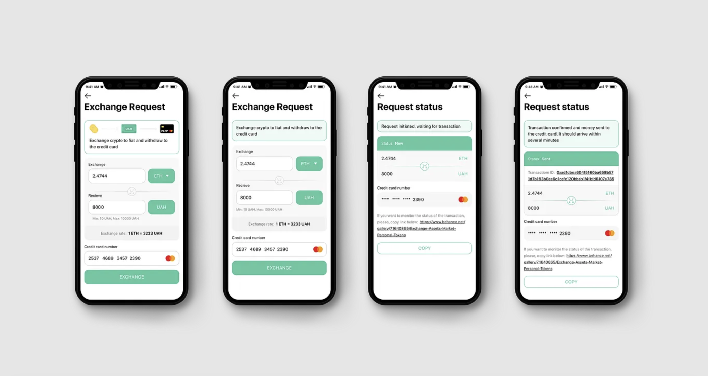

- **Role:** Technical Writer / Content Manager
- **Engagement:** January 2017 to September 2019

## Background

Paytomat built infrastructure for merchants to accept cryptocurrency through existing point-of-sale systems. The company started with a small bootstrap raise from Dash DAO. Once that early product validated the idea, the team began building toward a bigger product vision and needed to start building an audience around it.

## Goal

My role covered the company's audience and content work as it scaled past its initial bootstrap, plus maintaining the API documentation and coordinating with point-of-sale partners as integrations shipped.

## Key problems solved

### Problem 1: There was no content strategy around the product

**Challenge**: Paytomat had no content strategy at all. Early traction from the Dash DAO-funded bootstrap had validated the idea, but there was nothing in place to build an audience as the company moved toward a larger product vision.

**Solution**: I helped to build and ran the company's content strategy, aligned with the broader push toward that bigger product.

**Impact**: Increased audience engagement by 35–45% within the first few weeks.

### Problem 2: No material for non-technical clients to evaluate

**Challenge**: Outside of a technical audience, prospective clients had no in-depth material explaining what Paytomat was building or why it mattered.

**Solution**: I contributed to two whitepapers laying out the product and its direction in more depth than the content strategy alone covered.

**Impact**: Increased interest from non-technical clients by 30–40%.

### Problem 3: API docs needed to stay current as POS integrations shipped

**Challenge**: Paytomat was integrating with multiple point-of-sale providers, including NCR, Poster, and 1C. Each integration meant the API documentation had to track what was actually shipping, and coordination was needed between Paytomat's team and each provider to keep both sides aligned.

**Solution**: I maintained the API documentation as these integrations went live and coordinated between Paytomat's engineering team and the POS providers' teams to keep the integrations and the docs in sync.

**Impact**: Kept documentation accurate across three concurrent POS integrations without it trailing behind what partners were shipping.

## Final deliverables

- A content strategy supporting Paytomat's broader product push
- Contributions to two [whitepapers](https://github.com/thisonedev/thisonedev.github.io/blob/master/content/portfolio/paytomat/paytomat-2.0.pdf)
- Maintained [API documentation](/portfolio/paytomat/console-api) for the Console Panel REST API
- Integration coordination with point-of-sale providers NCR, Poster, and 1C

## Notable participation

Alongside this work, I represented Paytomat at Malaysia's MaGIC Accelerator Program over a four-month period, joined a Google Design Sprint, and took part in a National Ukrainian Record for the largest number of cryptocurrency purchases at a single location within three hours.