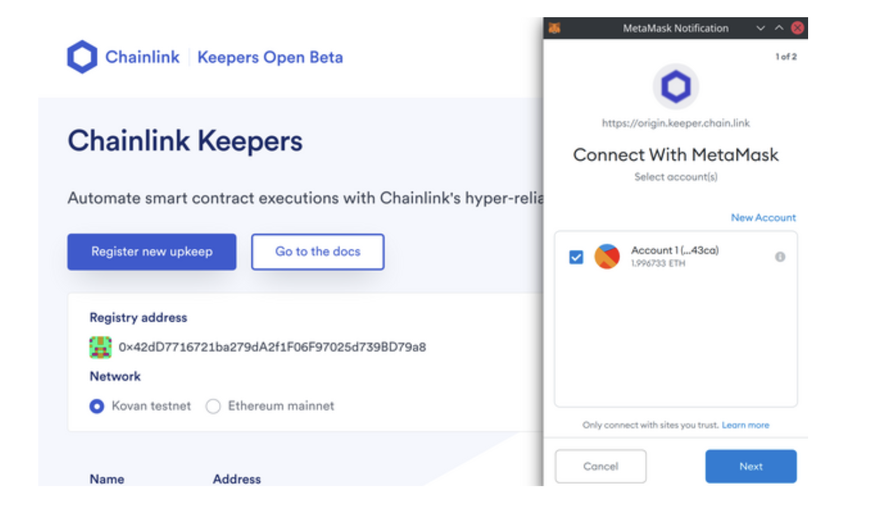
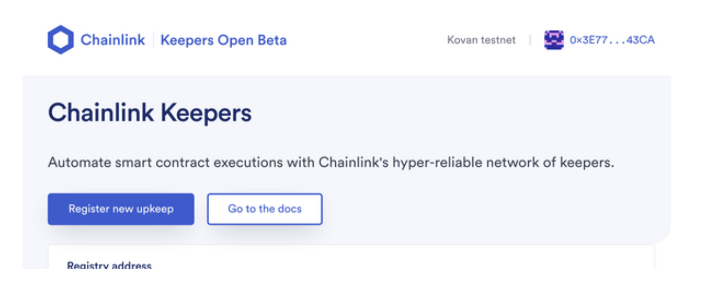
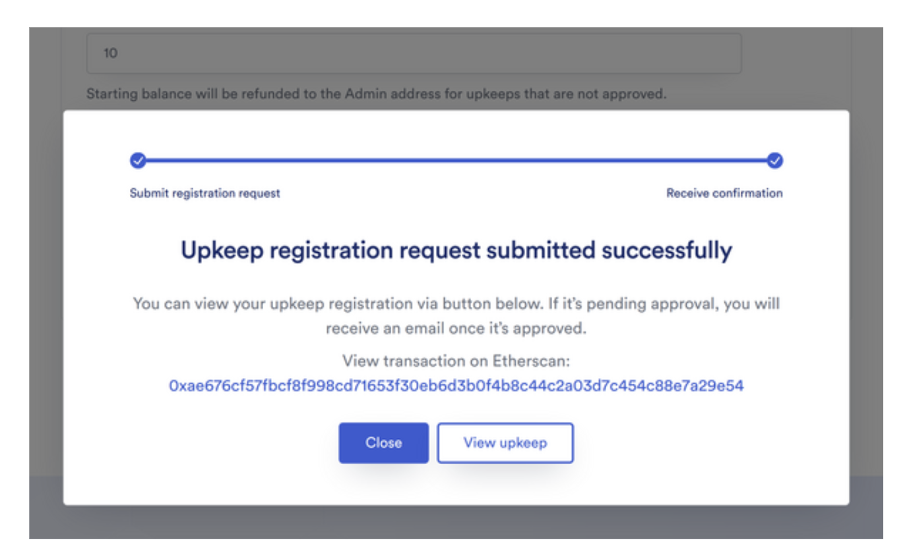
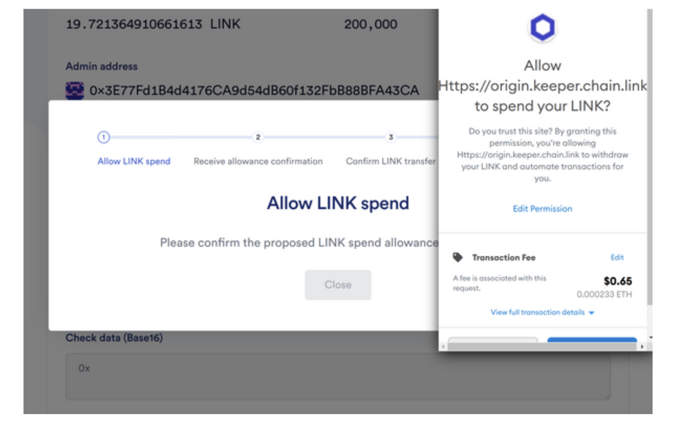
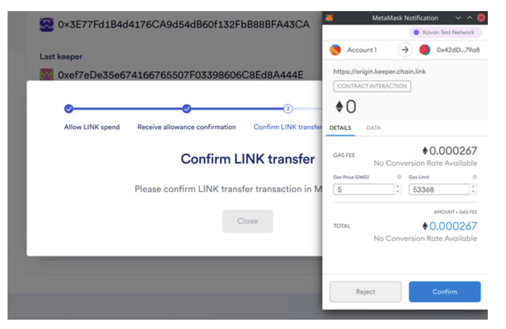
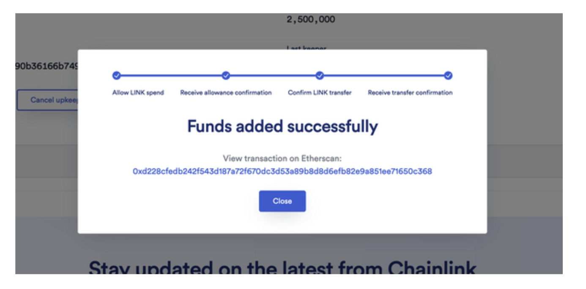

After you deploy a Keeper-compatible contract, you must register it with the Chainlink Keeper Network. You can do this via the [Chainlink Keepers App](https://automation.chain.link/).

After you register, you can interact directly with the registry contract functions such as `cancelUpkeep` and `addFunds`.

### Register and fund Upkeep on the Chainlink Keeper Network

1. Connect your wallet with the button in the top right corner and choose a chain. The Chainlink Keeper Network currently supports Ethereum Mainnet or Kovan.

2. Click the Register new upkeep  button

3. Fill out the registration form
The information you provide will be publicly visible on the blockchain. Your email address will be encrypted.

Make sure you have LINK to fund your Upkeep with. [Learn how to acquire testnet LINK](https://docs.chain.link/docs/acquire-link/).

> **FUNDING NOTE**
> You should fund your contract with more LINK that you anticipate you will need. The network will not check or perform your Upkeep if your balance could be too low based on current exchange rates.

Your balance will be charged LINK based on a 20% premium over the gas cost to `performUpkeep`. There's currently a ~80k gas overhead from the registry. The premium and overhead are not fixed and will change over time.

The gas limit of the example counter contract should be set to 200,000.

4. Press Register upkeep and confirm the transaction in MetaMask
This will send a request to the Chainlink Keeper Network which will need to be manually approved. This is a temporary step during the Beta, and requests are automatically approved on testnets, so you should be up and running in a matter of minutes.

**Upkeep registration request submitted successfully**
You can view your upkeep registration via button below. If it's pending approval, you will receive an email once it's approved.
View transaction on Etherscan: [0xae676cf57fbcf8f998cd71653f30eb6d3b0f4b8c44c2a03d7c454c88e7a29e54](https://kovan.etherscan.io/tx/0xae676cf57fbcf8f998cd71653f30eb6d3b0f4b8c44c2a03d7c454c88e7a29e54)

5. Add funds to your Upkeep
Your contract was provided initial funding as part of the registration step, but once this runs out, you'll need to add more LINK to your Upkeep.

* Click **View Upkeep** or navigate back to the home page of the **[Chainlink Keepers App](https://automation.chain.link)** and click on your recently registered Upkeep.
* Press **Add funds** button.
* Approve the LINK spend allowance.

* Confirm LINK transfer transaction in MetaMask.

* Receive a success message and verify that the funds were added to the Upkeep.

### How funding works
Your balance is reduced each time a Keeper executes your `performUpkeep` method.
There is no cost for `checkUpkeep` calls.

If you want to automate adding funds, you can directly call the `addFunds()` function on the `KeeperRegistry` contract.

Anyone can call the `addFunds()` function, not just the Upkeep owner.

To withdraw funds, cancel the Upkeep.

### Maintaining a minimum balance
To ensure that the Chainlink Keepers are compensated for performance, there is an expected minimum balance on each Upkeep. If your funds drop below this amount, the Upkeep will not [be performed] for your Upkeep, and the max gas multiplier (see `gasCeilingMultiplier` in configuration of the registry).

It is recommended that you maintain a balance that is a multiple (3-5x) of the minimum balance to account for gas price fluctuations.

### Congratulations!
After you register your Upkeep, it has been approved, and you have added sufficient funds, the Chainlink Keeper Network will begin to simulate `checkUpkeep` calls and execute your contract's `performUpkeep` function as needed.

You have now built and registered a Keeper Compatible contract with the Chainlink Keeper Network. Wohoo!