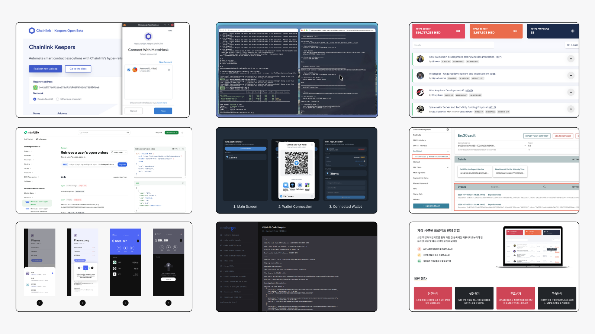

Hi! I'm Dmytro - a senior technical writer with strong knowledge of APIs, docs-as-code tools, blockchain ecosystems, and AI workflows.

I ship apps, CLIs and content that reduce support overhead by double digits, speed up product integration for international clients, and create a seamless developer experience.

Independent since 2023, building and researching across web3. Currently open to new roles.

This vault is a collection of my work: API and SDK references, apps, guides, tutorials, experiments, and more.

