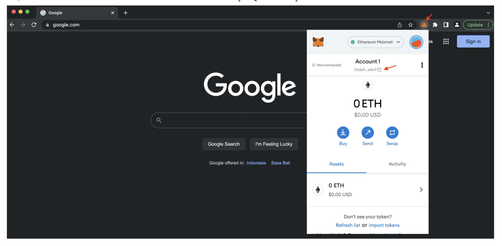
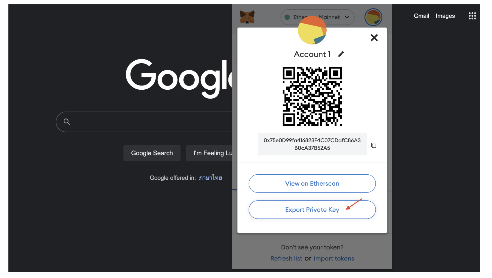
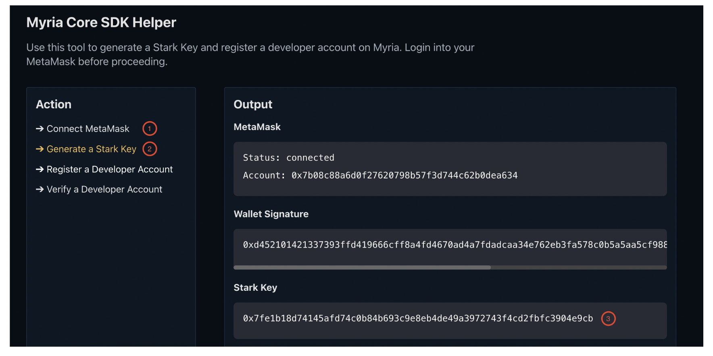
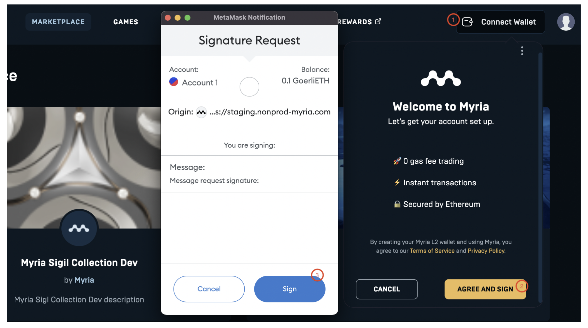

Learn how to start integrating with Myria.

*By the end of the quickstart, you will:*
* Learn how to interact with MetaMask
* Generate a Stark Key
* Register a developer account on Myria

### Prerequisites
*   **Browser that supports MetaMask**: Chrome, Firefox, Brave, or Edge
---

### 1. Web3 Setup
Myria integration requires a Web3 wallet address and the corresponding Stark Key derived from that wallet. The steps below show how to generate both of them.

#### 1.1 Create a Web3 wallet
If you don’t have a Web3 wallet already, you need to create one. MetaMask is the most commonly used wallet. You can download it from the [official website](https://metamask.io/). After you install the wallet, follow these steps:
1. Select Create a Wallet
2. In the Help us to improve MetaMask section choose No Thanks to avoid data collection
3. Fill out and confirm your password
4. Backup your secret phrase
5. Finish the installation

You should see your MetaMask wallet in the upper right corner.



#### 1.2 Export a private key
Each wallet represents a set of public and private keys:
*   **The public key** - wallet address to receive funds
*   **The private key** - "master password" for making transaction signatures

As a developer, you will often use public and private key pairs. Make sure to store them safely but have quick access when needed. To export the private key, open your MetaMask and follow these steps:
1. Click on **⋮** and select Account details
2. Select Export private key
3. Enter your password
4. Copy and save your private key



> Don't lose your private keys and seed phrases. Otherwise, you won't be able to recover your funds.

#### 1.3 Generate a Stark Key
Myria solution uses Starkware technology that implements different hash functions and signatures from Ethereum. Therefore, you must have a separate Stark Key to handle authentication and identity on Myria.

You can generate your Stark Key Pair by deriving it from the Ethereum Key Pair via the [SDK Helper tool](https://myria.com/developer/sdk-helper).



**Things to consider:**
*  Each address can generate only one Stark Key.
*  The Stark Key format used in your app should look like this: `0x + STARK_KEY`.

**Example:**
```text
0x43be26f8a75d1fc532a871ed88561f75fadd1a901b4fed01d0c8ef48762f1a9
```
---

### 2. Register a Developer Account
Developer accounts represent developer identities on Myria and required to do most of the operations on the network. You can register a developer account using the [Myria NFT Marketplace](https://myria.com/marketplace) as follows:
1. Select Connect Wallet
2. Click AGREE AND SIGN
3. Sign a transaction in your MetaMask

