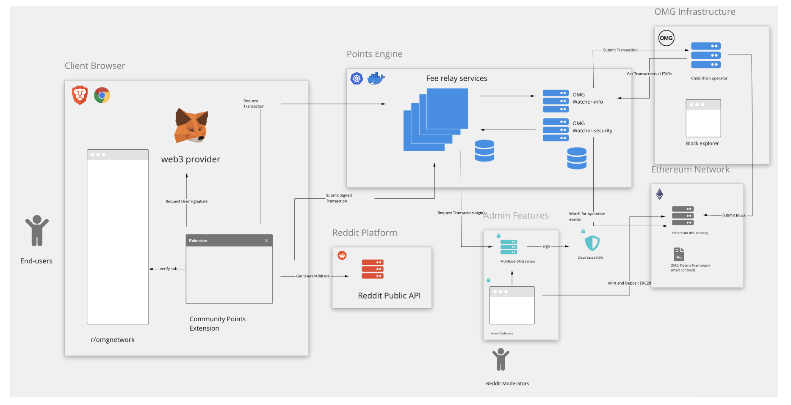
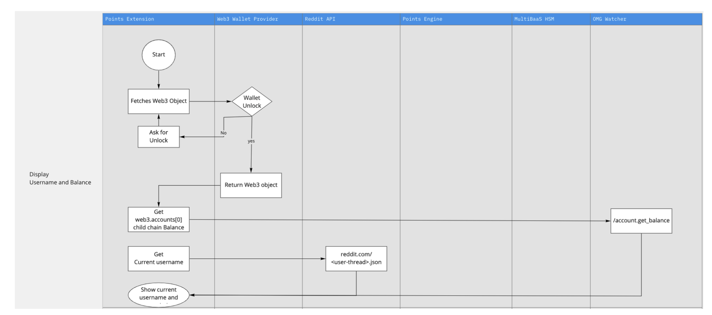
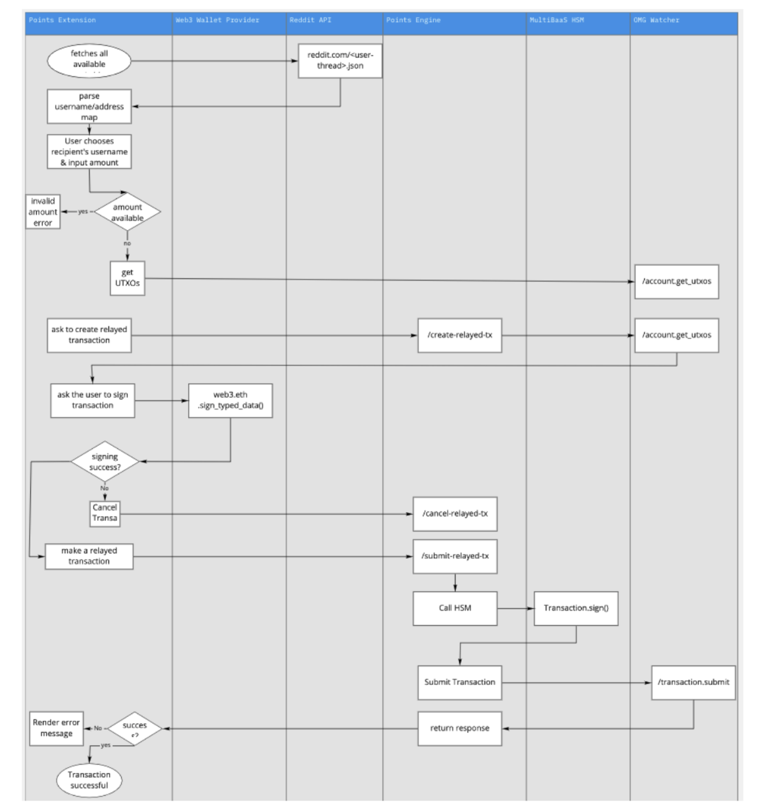
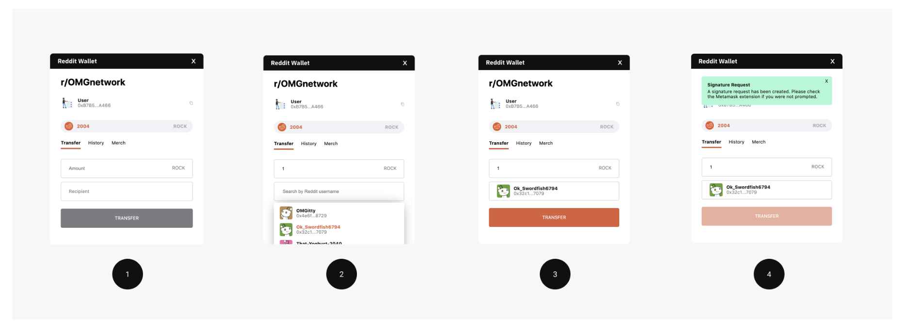
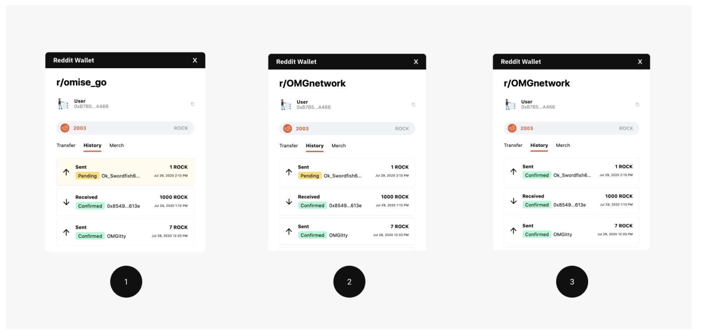
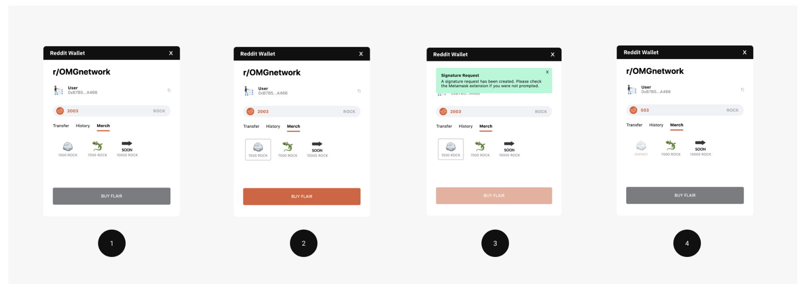
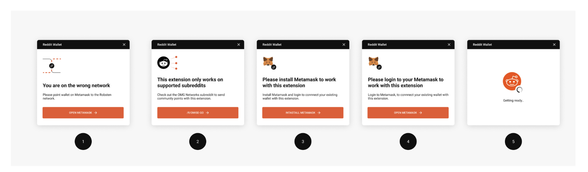
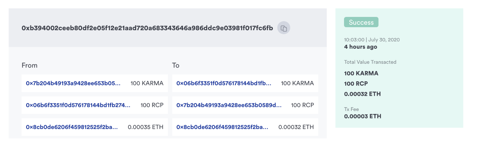

## 1. Introduction
### 1.1 Overview
The main goal of the product is to give communities a means to create scalable points and rewards systems in a trustless manner. 
Due to technical limitations, the public blockchain infrastructure such as Ethereum cannot handle the required load of the modern points applications, thus a corresponding scaling solution should be introduced.

[Community Points Engine](https://github.com/omgnetwork/community-points) (CPE) is a working proof of concept application that utilizes OMG Network as a trustless, high throughput settlement rail for community points transactions. 
The full demonstration consists of a working application, and this document which contains details on how special claim, burn, and subscription transactions can be implemented on the network. 
We demonstrate a full picture of how end users can have true ownership of community points and transact them in a manner that is fast, fee-less, trustless, and usable. 
All with the security guarantee offered by the Ethereum blockchain.

The demonstration consists of 5 different components:
- **Community Points Client**: a chrome plugin that simulates client application that demonstrates Web 2.0 usability.
- **Community Points Server**: a fee relayer server that absorbs transaction fees for users.
- **Community Points Contracts**: a set of smart contracts that govern ERC20 Tokens.
- **Community Points Claim demo**: a script that demonstrates claim transaction.
- **Community Points Admin Dashboard**: a MultiBaaS dashboard that gives an administrator/moderator simple access to make transactions and treasury management.

The working application doesn't include the following components:
- Design blueprint for complete implementation.
- 25,000 subscriptions: due to time constraints, we were not able to demonstrate subscription transactions. However, we have proposed 2 designs for how this functionality could be implemented.

### 1.2 Glossary / Terminology
- **CPE** - Community Points Engine.
- **Community Points platform** - a platform where the Community Points system is being hosted, such as Reddit.
- **Community Points server** - a server that allows performing fee-less transactions for users of a given Community Points platform.
- **OMG Network** - a Layer 2 scaling solution for the Ethereum network.
- **Rootchain** - the Ethereum network.
- **Child chain** - the OMG Network.
- **Plasma** - the name of a scaling solution of the OMG Network.
- **Smart contract** - a self-executing contract that is running on a blockchain network, such as Ethereum.
- **Mint/minting** - an event of issuing/creating new tokens on the Ethereum network.
- **KARMA** - a reputation token that can be distributed by the Community Points platform to users on the OMG Network. These tokens allow users to claim points of a given community.
- **ROCK** - a community point token for r/OMGnetwork.
- **Burn/burning** - an event of eliminating existing tokens out of circulation on the Ethereum or OMG Network. This event implies that the tokens are sent to the non-recoverable address.
- **Fee Relay** - a method to allow for a third party wallet application to absorb the transaction fee for an end-user.
- **TCO** - a total cost of ownership.

### 1.3 Product Requirements
##### User Personas
- **Customers/community members** (e.g. subreddit community) - participants of a given Community Points system, service, network, website, portal, app, or forum who want to receive rewards, prizes, or discounts to stay more engaged.
- **Moderator or admin** (e.g. subreddit moderator) - a person(s) who creates rules, coordinates users' activity, helps to solve problems within a particular Community Points system.
- **Management team** (e.g. Reddit Community Points team) - a group of people who manage technical and operational requirements for a given Community Points system.

##### User Stories
- As a user, I can send tokens to another user via OMG Network in my browser while engaging with my community.
- As a user, I can see the balance of my tokens and my username in the browser while engaging with my community.
- As a user, I can view the history of transactions while engaging with my community.
- As a user, I can purchase various digital items while engaging with my community.
- As a moderator, I can mint, distribute, and burn tokens.
- As a management team, I can absorb transaction fees for users.
- As a management team, I'm sure that my production service can run on the OMG Network with an expected load.

### 1.4 Requirements
The proposal fulfills all the below requirements.

##### Scaling
Over a 5 day period, your scaling PoC should be able to handle:
- 100,000 point claims (minting & distributing points)
- 75,000 one-off points burning
- 100,000 transfers

##### Decentralization
The solution takes numerous trade-offs in having a central point of control, but still maintains trustless ownership of user funds.

##### Usability
- Transactions complete in a reasonable amount of time (seconds or minutes, not hours or days).
- Exiting is fast & simple.

##### Interoperability
- Scaling solution should be extensible and allow third parties to build on top of it.
- APIs should be well documented and stable.
- Documentation should be clear and complete.
- Third-party permissionless integrations should be possible & straightforward.
- Simple is better. Learning an uncommon or proprietary language should not be necessary. Advanced knowledge of mathematics, cryptography, or L2 scaling should not be required. Compatibility with common utilities & toolchains is expected.

##### Bonus Points
- Build an extra use case for Community Points.

##### Security
The proposed solution fulfills the following security criteria:
- Balances and transactions cannot be forged, manipulated, or blocked by Reddit or anyone else.
- Users should own their points and be able to get on-chain ERC20 tokens without permission from anyone else.
- Points should be recoverable to on-chain ERC20 tokens even if all third-parties involved go offline.
- A public, third-party review attesting to the soundness of the design should be available.

##### Bonus points
- Public, third-party implementation review available or in progress.
- Compatibility with HSMs & hardware wallets.

## 2. Proposed Solution / Design
### 2.1 Demo Application Architecture



##### Community Points Client
We are utilizing the web browser as the user interface for this demonstration due to the simplicity of integration with current ecosystem tooling. The currently supported browsers are Brave and Chrome. Here are different components to the interface:
- **r/OMGnetwork**: the application is designed to work while the user is interacting in a specific community, in this case, it is r/OMGnetwork. This is also a way to introduce the product in a seamless manner and not risk breaking the experience of the Community Points platform.
- **Web3 provider**: any Web3 provider that injects a Web3 object into the DOM, exposes the current user's Ethereum account balance, and supports EIP712 transaction signing. Because we are reliant on a non-custodial solution, users will have full ownership of funds. For the demonstration, we push the responsibility of Web3 and wallet provider to MetaMask.
- **Community Points extension**: the user interface and core business logic for the user. It interacts with a few different services including the public Reddit API, Web3 provider, and fee relayer service. It currently offers multiple functionalities:
    - Transact community points without fee tokens.
    - Purchase items (e.g. Flair) with community points token.
    - Address identity via community usernames.
    - View balance, and transaction history.

A browser extension is the easiest way to deploy and develop as a PoC. The Community Points client could be running on any other platform including natively on desktop and mobile as long as wallet signing APIs are provided. 

Our extension demonstrates how Community Points functionality can be introduced in a manner that is abstracted away from typical blockchain usability thus allowing the end-user to retain the same experience as community points transactions on regular Web 2.0.

##### Community Points Platform: Reddit

The Community Points Engine runs on top of an existing Community Points platform. In our case, we leverage Reddit's public API for the following functions:
- **User identity**: to reduce complexity around maintaining usernames and wallet address relation, we rely on the Community Platform's API as the sole identity provider. However, a more robust or trustless identity approach could be introduced.
- **Online items purchases**: we rely on authenticated API to fetch and redeem online items of each user. This allows a user on our platform to burn points in exchange for premium flair.

##### Community Points Server

The server-side of the Community Points Engine is where most of the complexity is handled. The server consists of multiple horizontally scaled Node.js services connected to a relational database. The services can perform the following features:
- **Fee-relayed transactions**: the clients of the CPE can make fee-less transactions. From the usability perspective, it means that the user can make transactions on the network without paying transaction costs. This is also a useful abstraction for user onboarding without requiring additional ERC20 tokens and ETH. Fee-relay transactions is a design pattern and can be implemented natively on the OMG Network's UTXO transaction model.
- **Serve multiple concurrent client transactions**: we utilize different services as a way of handling complex UTXO management. This means that the higher load on the network will not deteriorate the experience of other users. More client applications may transact with Points at the same time. This service meets the requirements for better transactional scalability and usability while preserving Plasma security.
- **Cloud-based HSM module**: Given that compromised private keys can have catastrophic consequences for operators, we ensure that different key management approaches and standards are possible. High throughput hot wallet transactors like fee relayers are best managed on a Cloud-based hardware security module to be compliant with enterprise best practices. This implementation utilizes the MultiBaaS module along with Azure Vault.

We support modern operational standards and run this application inside a Docker container, orchestrated on Kubernetes with Google Cloud as the deployment target. However, infrastructure requirements can change based on the client's demand.

###### Admin/Moderator Dashboard
Treasury and fund management are difficult to achieve on a public blockchain, especially for platform administrators and moderators who are non-crypto natives. We show that we can provide a highly usable abstraction for back-office operations via an admin dashboard provided on the MultiBaaS.

Our community moderators can sign in via role-based access (RBAC) to make deposits, transactions, and Community Points distribution right on the dashboard without prior Web3 experience. They can have a choice to choose between non-custodial wallets such as MetaMask and Cloud HSM.

###### Blockchain Infrastructure
This is the settlement layer of community points transactions as well as how the Community Points Engine maintains its trustlessness guarantees. You can read more about the [Plasma protocol here](https://plasma.io).

#### 2.1.1 Application Flow & Diagrams

##### Swimlane Diagrams

1. Display username and balance



2. Make a fee-less transaction



##### Application Flow
1. A user goes to a subreddit that supports community points (e.g. r/OMGnetwork).
2. An extension verifies that the user is located on a supported subreddit and prompts a signature request to connect via a Web3 wallet (e.g. MetaMask).
3. A user confirms the signature and appears on the main screen of the extension.
4. An extension fetches the user’s data from the Reddit Public API and presents this info to the extension interface.
5. A user fills the amount and recipient username and initiates the transaction request to a fee relayer via an extension.
6. An extension fetches and takes spendable user’s UTXO(s) that can cover the defined amount in the transaction.
7. An extension makes a POST request `/create-relayed-tx` to create a relayed transaction.
8. A fee relayer fetches its UTXO that can cover the transaction fee, and creates a transaction based on the user’s UTXO(s) and fee relayer’s UTXO.
9. A fee relayer requests a user to sign a relayed transaction.
10. A user signs a transaction with a Web3 wallet. If a user doesn’t sign a transaction, the extension cancels it by sending a POST request `/cancel-relayed-tx` to a fee relayer.
11. An extension sends a POST request `/submit-relayed-tx` to a fee relayer to submit a transaction.
12. A fee relayer signs the transaction and submits it to the OMG Network via the Watcher service. If you want the fee relayer to sign a transaction via HSM, you need to make a request to a MultiBaas platform first.
13. Child chain operator creates a block on the OMG Network and submits it to the Ethereum network.
14. After the transaction is confirmed, the user receives a notification and can view the transaction in the Block Explorer.

#### 2.1.2 Server
**Fee Relayer API**
This section demonstrates a general overview of the Fee Relayer API. For more details, please refer to [Community Points Swagger document](https://swagger.io).

##### Create a Relayed Transaction
Constructs a relayed transaction.
```bash
POST /create-relayed-tx
```
##### Attributes
- **utxos** [tx_input] Yes Transaction UTXOs
- **amount** BigNum, string, int Yes Amount of tokens to send
- **to** string Yes Receiver address

##### Submit a Relayed Transaction
Submits a relayed transaction.
```bash
POST /submit-relayed-tx
```
##### Attributes
- **tx** tx Yes Transaction body
- **signatures** [string] Yes A list of signatures to sign a transaction

##### Cancel a Relayed Transaction
Cancels a transaction.
```bash
POST /cancel-relayed-tx
```
- **tx** tx Yes Transaction body

#### 2.1.3 Client
##### Views
- **Main View**: The main view displays the name of the community points page (e.g. subreddit), the wallet address, and the current balance of the token that represents this particular Community Points system. A user should be able to copy the address by selecting it or clicking the copy button near the address. Additionally, the view contains Transfer, History, and Merch tabs that represent corresponding data or actions. By default, a selected tab is set to Transfer.
- **Transfer View**: Each user should be able to transfer funds to another user. One should put an amount and a recipient address that can represent a username (e.g. subreddit account name) or an Ethereum address, and confirm the transaction with a Transfer button. The username should be searchable.

- **History View**: The History View contains a list of transaction history for a token that represents a defined points system, in which the user is currently located (e.g. r/OMGnetwork subreddit). Each transaction item includes:
    - An icon that represents sending or receiving of funds.
    - Sent or Received message for a corresponding transaction type.
    - Transaction status: Pending or Confirmed.
    - A wallet address of the recipient or sender (depending on transaction type).
    - The amount and token symbol.
    - A copy button that copies the recipient or sender.
    - Link to blockchain explorer (Rinkeby, Ropsten, or Mainnet).

- **Merch View**: The Merch View contains a list of digital goods (e.g. flair) a user can purchase. Each item should have its own icon and price. Each purchase is associated with certain metadata that defines a possessed item and implies the burning of tokens (sending tokens to non-recoverable address).

- **Notification Views**: An extension should notify users when: loading, on an unsupported community points page, missing MetaMask extension, not logged in with MetaMask, or connected to the wrong network.


### 2.2 Proposed Contracts Design
We try to balance implementation complexity with the necessary trustlessness requirement as outlined in the specs. However, tokenomics is a complex topic that requires a substantial amount of iterative design process. For the purpose of this application, we will treat the subscription process as a black box, while offering 2 design choices that Community Points can take into production with sample code for demonstration purposes. Each solution design makes tradeoffs in cost, complexity, and feature requirements.

The proposed solutions to facilitate claims and subscriptions include:
1. Simple Claim and Subscription with full compatibility with current OMG Network V1.
2. Claim and Subscription as special OMG Plasma Framework transaction types.

##### 2.2.1 Smart Contracts
The current design consists of 4 contracts:
- **Distribution**: This contract holds the main logic to decide how many community points (e.g. subreddit points) should be distributed on each round. This contract mints the community points according to the formula in this contract. For each round, it records the `baseSupply` and `availablePoints`. `baseSupply` is an integer that decreases a certain percentage on each round. The `availablePoints` is the amount of points that can be distributed on a certain round. `availablePoints` equals to `baseSupply` + 50% of the burned points on the previous round.
- **Subreddit Point**: This is an ERC20 contract for the subreddit points. It should enable the Distribution contract to mint community points on each round.
- **KARMA token**: This is a representative of KARMA. It is an ERC20 token that can be distributed by the Community Points platform (e.g. Reddit) to users on the OMG Network. Users can use the received KARMA to create a "Claim" transaction to receive points of a given community.
- **Subscription token**: Instead of having an expiration date on each subscription, we use a simpler design where a subscription token represents the subscription status of a certain period. Proof of ownership of the token shows the subscription status.

##### 2.2.2 User Flow
- **Distribute KARMA to user**: Community Points platform (e.g. Reddit) should from time to time (or on-demand) mint KARMA token (ERC20) on the Ethereum and deposit it to the OMG Network. Community Points platform should send KARMA to its users according to their activities on the platform.
- **User claiming community points**: With the KARMA given by Community Points platform, the user can ask for an atomic swap transaction as the claim of the community points. The server generating the transaction would provide the transaction with the community points according to the percentage of the KARMA amount and the total KARMA of the distribution round. After the transaction is generated, both the user and the Community Points server would sign the transaction then submit it to the OMG Network.
- **User subscribes to a periodical (e.g. monthly) subscription**: The community owner would deploy and mint the subscription token contract every certain period. After that, the subscription token would be deposited to the OMG Network. For the user to subscribe, the user can ask for an atomic swap transaction that swaps the community points to the subscription token.

##### 2.2.3 Claim Transaction Demo
The current implementation is based on the design outlined above. The demo represents a script that mints KARMA and RCP tokens (community points), deposits them to the OMG Network, and performs an atomic swap allowing a user to claim RCP.

###### Actors
- **Distributor** - an address responsible for KARMA and RCP tokens distribution.
- **User** - an address that wants to claim community points (RCP tokens) in exchange for KARMA tokens.
- **Community Points server** (e.g. subreddit server) - a server that handles claim transactions.

###### Application Flow
1. Distributor mints a defined amount of KARMA, and RCP tokens from the smart contracts.
2. Distributor deposits ETH on the OMG Network to cover the fee costs.
3. Distributor approves KARMA and RCP tokens of a defined amount to make a deposit.
4. Distributor deposits KARMA and RCP tokens of defined amount on the OMG Network.
5. Distributor transfers a defined amount of KARMA tokens to the user on the OMG Network.
6. Distributor transfers a defined amount of RCP tokens to the Community Points server on the OMG Network.
7. User submits a signed (atomic swap) transaction to claim the RCP tokens.
8. Community Points server and Distributor sign the transaction.
9. Transaction is submitted to the OMG Network.
10. User receives a defined amount of RCP tokens.

###### Atomic Swap Description
The current demo uses an atomic swap to claim the community points based on the amount of KARMA tokens sent to its address during the distribution period. On a high-level, the swap represents an exchange of the same amount of RCP and KARMA tokens between a user and a Community Points server.

The claim transaction requires 3 signatures: User (KARMA input), Distributor (fee token input), and Community Points server (RCP token input).

Here`s [an example](https://blockexplorer.ropsten.v1.omg.network/transaction/0xb394002ceeb80df2e05f12e21aad720a683343646a986ddc9e03981f017fc6fb) of a claim transaction:



###### Production Considerations
- **Minting**: In production, KARMA tokens should be minted by the contract owner only. RCP tokens may be minted by the correspondent Community Points moderator.
- **Keys**: Keys for the Community Points engine and users are generated within the application, which is sufficient only for demo purposes.
- **UTXO(s)**: The amount in UTXO(s) used for KARMA and RCP inputs should match the exact amount of tokens you want to swap. This is due to the limitation of 4 inputs and 4 outputs on the OMG Network.
- **Timing**: The demo mints KARMA and RCP tokens on demand. In production, the owner may mint tokens beforehand.
- **Environments**: The demo was tested on Ropsten and Rinkeby due to Ethereum network gas price on Mainnet.
- **Fees**: The fee token on the Mainnet is OMG; on Ropsten and Rinkeby, it is ETH.
- **Exchange Rate**: The KARMA/RCP exchange rate is hard-coded at 1:1.

## 3. Further Considerations
### 3.1 An Alternative Claim Transaction Design
The proposed implementation is one of the approaches to handle claim transactions. An alternative solution could be using special transaction types on the OMG Network. You can read a high-level overview of the potential implementation in this [document](https://docs.omg.network).

### 3.2 Third-party Services
To run any OMG Network application, it's required to use the following services:
- **Ethereum node**: to sync with the rootchain (e.g., [Infura](https://infura.io)).
- **Web3 wallet**: to sign transactions (e.g., [MetaMask](https://metamask.io)).
- **MultiBaas**: for an intuitive administration panel.

### 3.3 Cost and Performance
We try to take the most pragmatic approach to cost and throughput assumptions with the business needs in mind while trying to be transparent whenever possible.

#### 3.3.1 Throughput Performance
- **Maximum Theoretical Throughput**: Judge a Layer 2 performance based on its maximum throughput achievable by its design.
- **Real Application Transaction Throughput**: We wanted to demonstrate the capabilities of our system for managing the Reddit Community Points ecosystem. We elected to use our public Integration environment on Ropsten.

We use the acronym **ST4R** to mean "Stress Test For Reddit".
- **100,000 Point Claims**: We performed 119,130 transactions over two hours using transaction metadata `ST4R CLAIM` (hex: `0x000000000000000000000000000000000000000000005354345220434c41494d`).
- **25,000 Subscriptions**: Due to time constraints, we were unable to complete this part. We have two proposals [documented here](https://docs.omg.network).
- **5,000 One-off Points Burning**: We sent 81,341 transactions to a `0x` address using metadata `ST4R BURN` (hex: `0x000000000000000000000000000000000000000000000053543452204255524e`).
- **100,000 Transfers**: We performed 121,461 transactions over the course of four hours using metadata `ST4R`.

**Watcher Query Examples:**
```bash
curl --location --request POST 'https://watcher-info.ropsten.v1.omg.network/transaction.all' \
--header 'Content-Type: application/json' \
--header 'Accept: application/json' \
--data-raw '{ "metadata": "0x000000000000000000000000000000000000000000005354345220434c41494d" }'
```

```bash
curl --location --request POST 'https://watcher-info.ropsten.v1.omg.network/transaction.all' \
--header 'Content-Type: application/json' \
--header 'Accept: application/json' \
--data-raw '{ "metadata": "0x000000000000000000000000000000000000000000000053543452204255524e" }'
```

Alternatively, you can query via [https://blockexplorer.ropsten.v1.omg.network/](https://blockexplorer.ropsten.v1.omg.network/).

#### 3.3.2 Cost
There is always a cost associated with operating a system. We believe cost and security go hand in hand. Gas cost per transaction is dependent on current gas market on Ethereum and the price of ETH.

**Gas cost formula:** `ETH Price * Gas price * Gas used / Number of transactions in a block`

**Example Gas Cost Table (at 49 Gwei, $332.53 ETH):**
| Number of transactions per block | TPS (12s block time) | Gas cost per tx in $ |
| :--- | :--- | :--- |
| 100 | 8.333333333 | 0.01193842888 |
| 1000 | 83.33333333 | 0.001193842888 |
| 10000 | 833.3333333 | 0.0001193842888 |
| 60000 | 5000 | 0.00001989738147 |

```bash
curl --location --request POST 'https://watcher-info.ropsten.v1.omg.network/transaction.all' \
--header 'Content-Type: application/json' \
--header 'Accept: application/json' \
--data-raw '{ "metadata": "0x0000000000000000000000000000000000000000000000000000000053543452" }'
```

Currently, OMG Network charges transaction fees to end-users in the form of OMG tokens. 
The fee charged is 3x cheaper compared to the average Ethereum ERC20 transaction gas price.

### 3.4 Security Considerations
#### Trustlessness vs Decentralization
Although the network is reliant on the child chain operator, users do not need to put trust in the operator for the security of their funds. At any point, users can leave the network. Learn more about [Plasma fraud proofs here](https://docs.omg.network).

#### Potential Threats
- **Byzantine events**: Unchallenged exit, Invalid block, Block withholding, etc.
- **Moderator manipulation**: malicous token governance.
- **User error**: Loss of seed phrase or private key.
- **Spam attack on fee relayer**: attack to deplete fee funds.

#### Mitigation
- Byzantine events notify users to exit funds.
- Moderator abuse mitigated by multisig enforcement.
- Spam attacks mitigated by leveraging Reddit account whitelisting.
- Watcher instances can be managed by the platform provider, node service, or core community members.

### 4. Resources
- Contracts Audits
- Load Test Results
- Tests: contracts, fee-relayer
- FAQ
- User Guide
- Moderator Guide
- Deployment Guide