This guide shows how to perform OMG transactions using a Web Wallet in your browser.

## Goals

By the end of the guide, you will achieve the following:
- Learn about the OMG Network interface.
- Interact with the OMG Network from end to end.
- Make a deposit, the first transaction, and exit with ETH and ERC20 token via the OMG Network.
- Understand and apply the concepts behind Plasma and MoreVP.

## Who is This Guide For?

- OMG Network clients and integration partners.
- Exchanges, wallets, and blockchain services.
- Ethereum Dapps that want cheaper fees and more transactions.
- Cryptocurrency enthusiasts or white hackers who enjoy testing new blockchain products.

## Prerequisites

- Chrome browser. Other browsers, such as Brave, may have compatibility issues with Web3 wallets.
- Web3 wallet, preferably MetaMask.
- Basic knowledge of blockchain, Ethereum and Plasma.

## Notes

- Keep your tokens safe. Please ensure you understand how to store and send tokens without compromising security, always double-check the recipient`s address, never send private keys to anyone unknown unless you want to lose your funds.
- The quickstart guide uses a hosted Web Wallet application. To run it yourself, check the installation instructions in the [Github repository](https://github.com/omgnetwork/web-wallet).
- The current guide displays how to work with OMG Web Wallet on Rinkeby environment. However, the same steps can be applied to the Mainnet version of the wallet.

## Wallet Configuration

The Web Wallet currently supports two environments:
- Rinkeby Testnet (testnet) - the Ethereum test network. The purpose of such an environment is to demonstrate all of the features without using or losing real funds and to find critical bugs before launching a software into production. This option is mostly used by developers.*
- Main Ethereum Network (mainnet) - the latest Ethereum live network. It is recommended to use this option after you've already tried the testnet and are confident in working with a particular wallet. This option is mostly used by customers.*

You can configure the preferred environment in your Web3 wallet as follows:

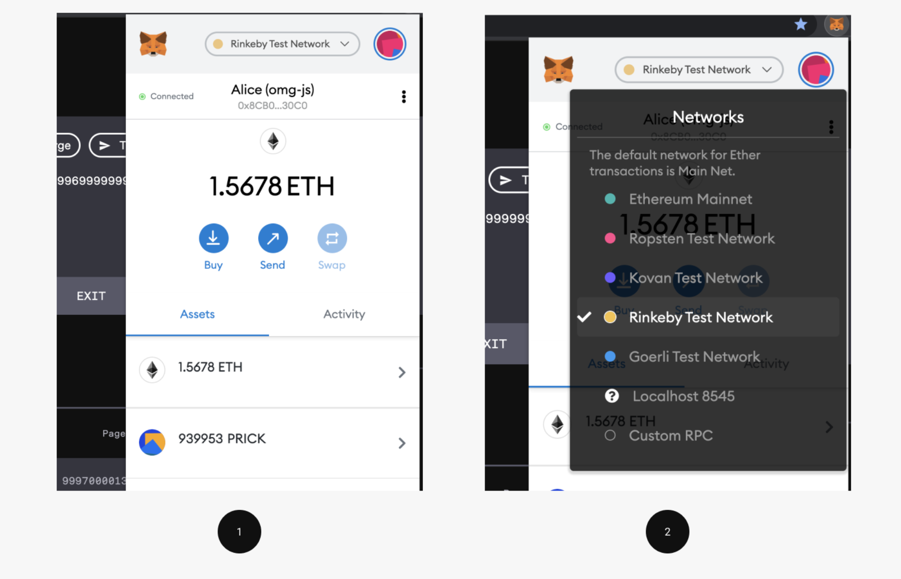

There are 3 methods to connect with the Web Wallet. Feel free to use the one you prefer the most:

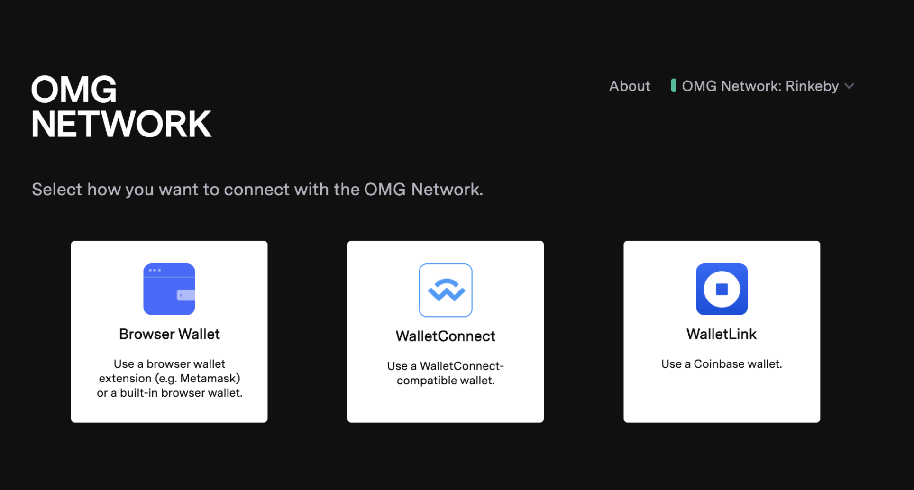

## Ledger

If you want to sign transactions with a Ledger hardware wallet, choose Browser Wallet as your connection option. This will prompt a popup to verify that you're connected to Ledger. Connect the device and follow the required steps, then click YES.

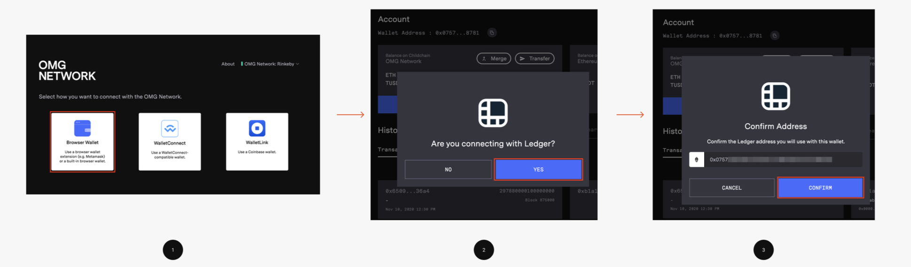

Make sure to allow contract data in transactions in your Ethereum application and keep that application opened as follows:

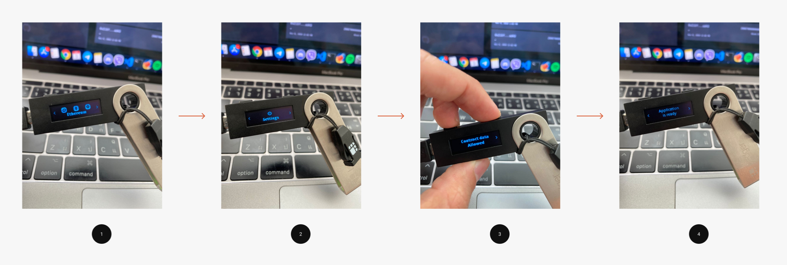

To confirm your actions or change values in the settings, press both of the buttons with your fingers as shown above.

Lastly, please check the following:

1. Your MetaMask is connected to Ledger. Otherwise, you will get an unauthorized spend.
2. Your Ledger firmware is v1.4.0+. The integration doesn't work with earlier versions.

## 1. Deposit Funds

### 1.1 Fund Ethereum Wallet

Before transacting on the OMG Network, you need to have ETH tokens on the rootchain.

> In Plasma implementation rootchain refers to the Ethereum network, childchain refers to the OMG Network.

There are several ways to fund your ETH wallet:
- Purchase ETH with your credit card or bank account on one of the exchanges
- Exchange ETH for cash with somebody who has it
- Ask your friends who work in the blockchain industry to send you some
- Use Ethereum faucets/games to win free ETH
- Use Rinkeby faucet if you're planning to work with Rinkeby

After you fund your Web3 wallet, your ETH rootchain balance in the Web Wallet should be the same, as your balance in MetaMask or another Web3 wallet you are using:

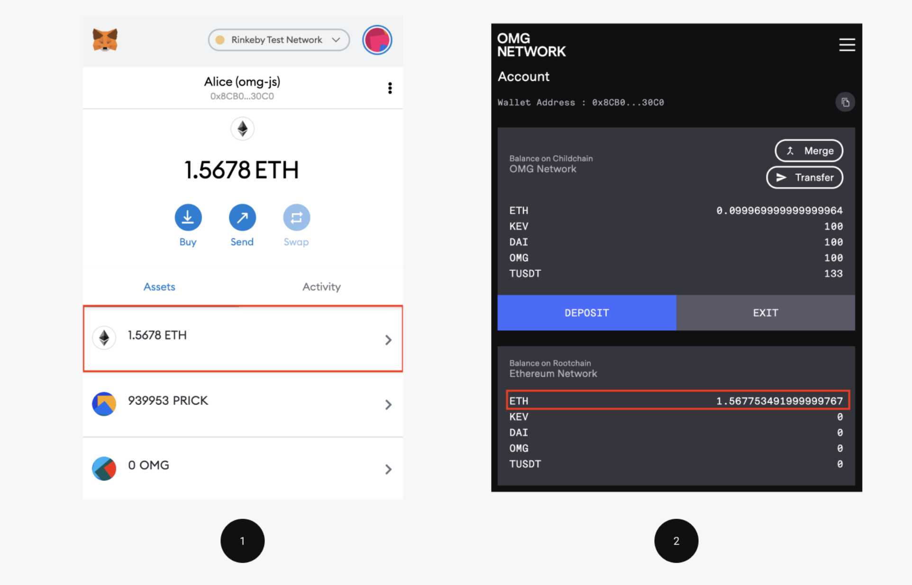

### 1.2 Make an ETH Deposit

To make an ETH deposit, click the DEPOSIT button and fill in the amount as follows:

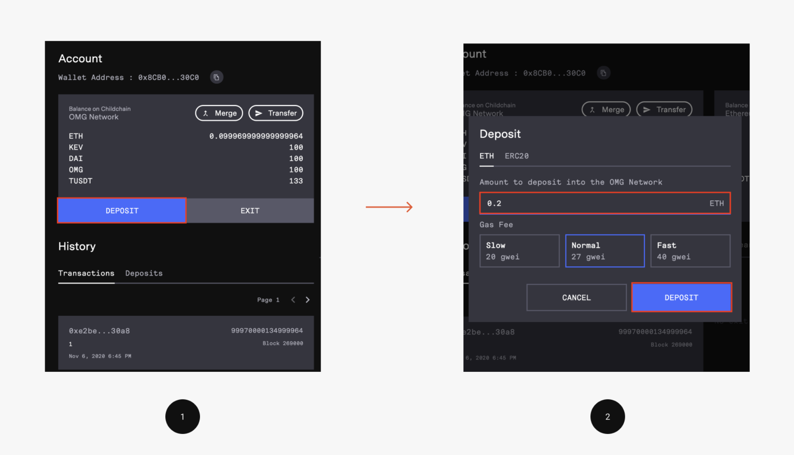

Next, press DEPOSIT and confirm the transaction in the opened popup. After it's confirmed you should see a pending deposit in your Deposits history as follows:

Deposits on the OMG Network require to pass a deposit finality period (currently 10 blocks) before the funds are accepted and can be used on the network safely. After a successful deposit, your childchain balance should be updated. This will also create a deposit UTXO validating that you have ETH on the OMG Network.

### 1.3 Make an ERC20 Deposit

The process for depositing ERC20 into the OMG Network is very similar to an ETH deposit. For this example, we will use TUSDT token. To make a deposit, click the DEPOSIT button and choose the ERC20 tab. Fill in the amount of tokens you want to deposit and a smart contract of a defined token as follows:

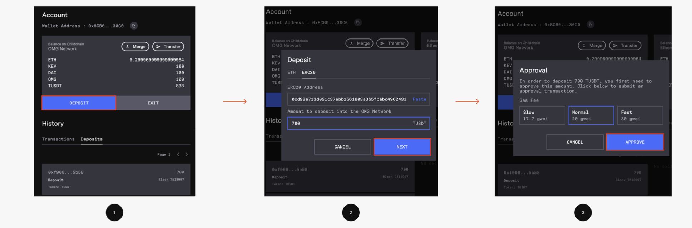

This step will differ from the ETH deposit, as your Web3 wallet will pop up twice. The first popup will ask you to approve the deposit, the second — to confirm the actual deposit transaction. After you confirm both of the popups, you should see a pending deposit in your Deposits history. If a deposit is successful, your childchain balance should be updated as follows:

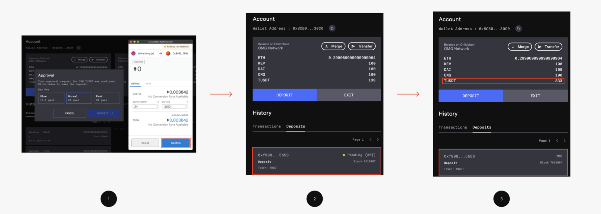

If you're doing a deposit via Ledger, you should follow the same steps as described above. However, you will also need to review and approve deposit approval and deposit transaction on your hardware device. Below you can see an example of deposit approval:

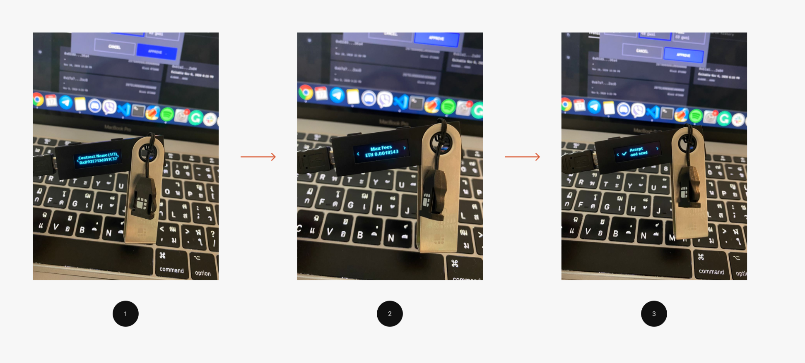

### 2. Make a Transaction

Now that you have funds on the OMG Network, you can make your first transaction. First, click on the Transfer button and fill in the recipient's address and the amount of ETH or ERC20 tokens you want to send as follows:

Second, press the TRANSFER button and confirm the transaction in the opened popup as follows:

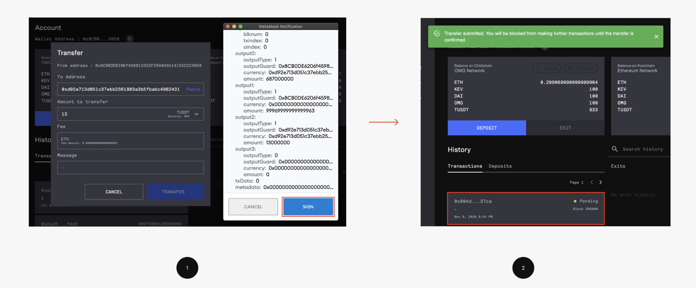

Once the transaction is confirmed, you can view its details in the block explorer. After a successful deposit, your childchain balance should be updated.

For sending a transaction via Ledger follow the steps above, then sign the transaction with your device as follows:

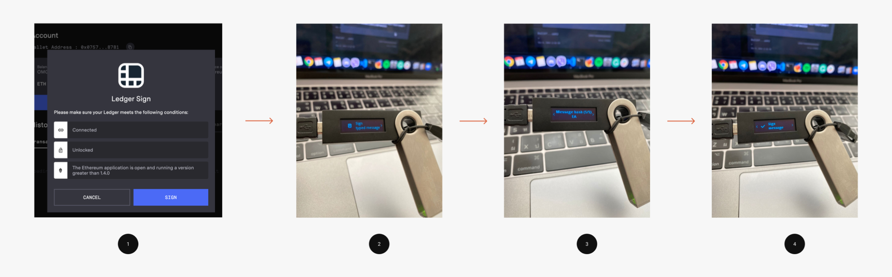

### 3. Withdraw Funds

### 3.1 Submit an Exit

You've successfully deposited and made a transfer to the OMG Network. If you want to move your funds from the OMG Network back to the Ethereum network, you should start a standard exit.

To start an exit, press the EXIT button and choose one of the UTXO you want to exit as follows:

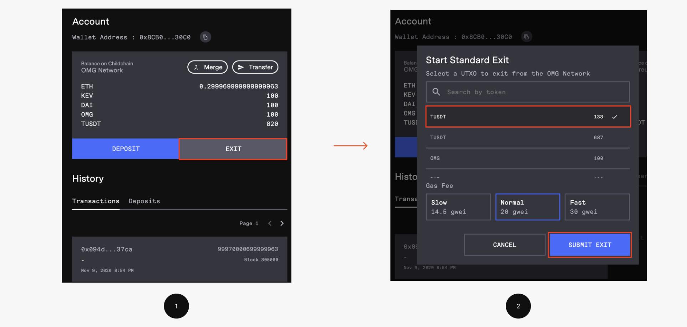

> Note, you can exit only 1 UTXO at a time. If you need to exit more funds than the value of a particular UTXO, you should merge them first.

If a defined token hasn't been exited before, you'll need to add it to the exit queue as follows:

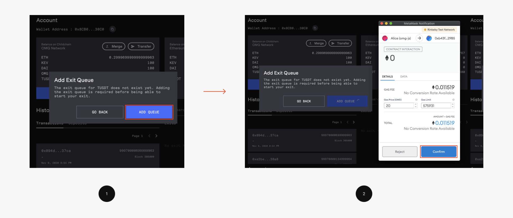

Next, press SUBMIT EXIT and confirm the transaction in the opened popup as follows:

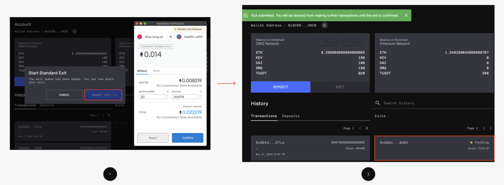

Below you can see an example of exit approval on Ledger:

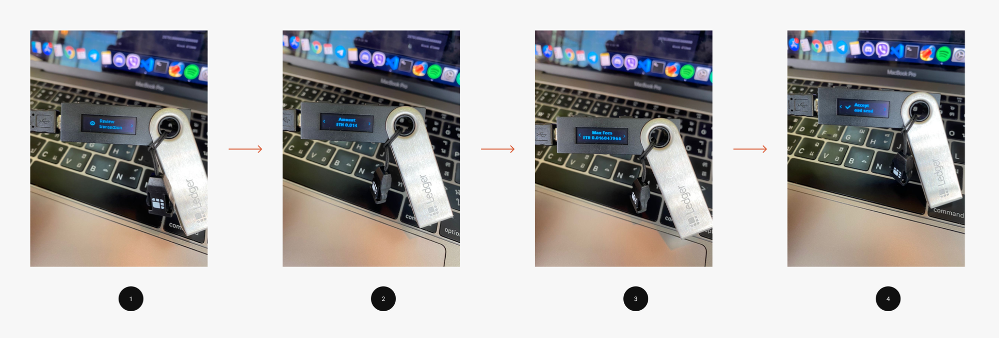

### 3.2 Process an Exit

To prevent any malicious activity on the network, each exit goes through the Challenge Period. This allows other users to challenge their exit on validity and trust. You can find also find a date when you can process your exit below the transaction id. After the challenge period has passed, you can process your exit to send your funds back to the Ethereum network.

To start an exit, press the Process Exit button near exit id as follows:

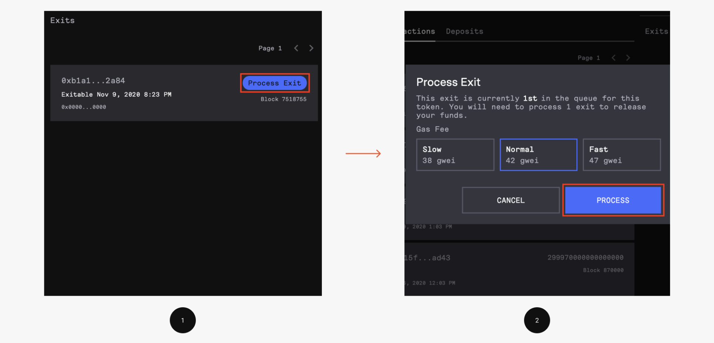

After, confirm the transaction in the opened popup as follows:

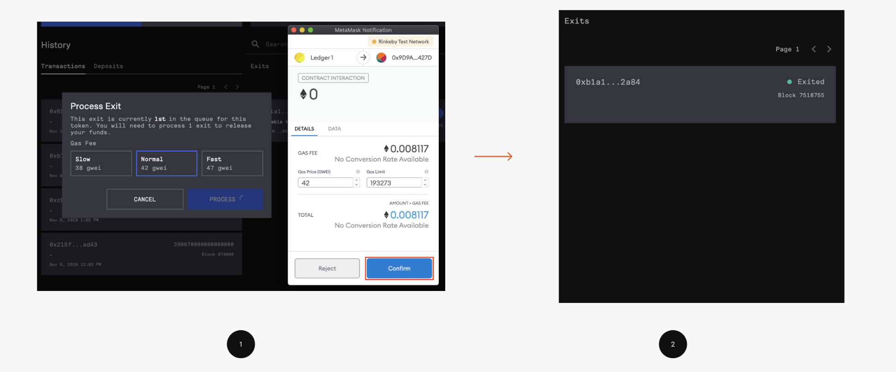

Most of the time, you're not the first to exit a defined token. That's why you may need to select the number of exits you want to process before you process your exit. As a general rule, use the maximum number that is offered to you. Otherwise, your exit may not be processed.

Congratulations! You've performed an end-to-end process of interacting with the OMG Network.