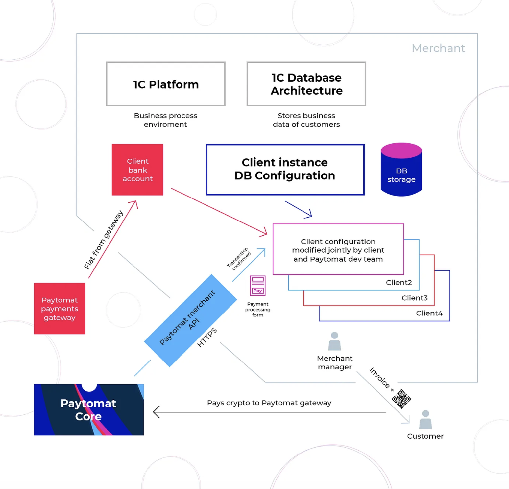
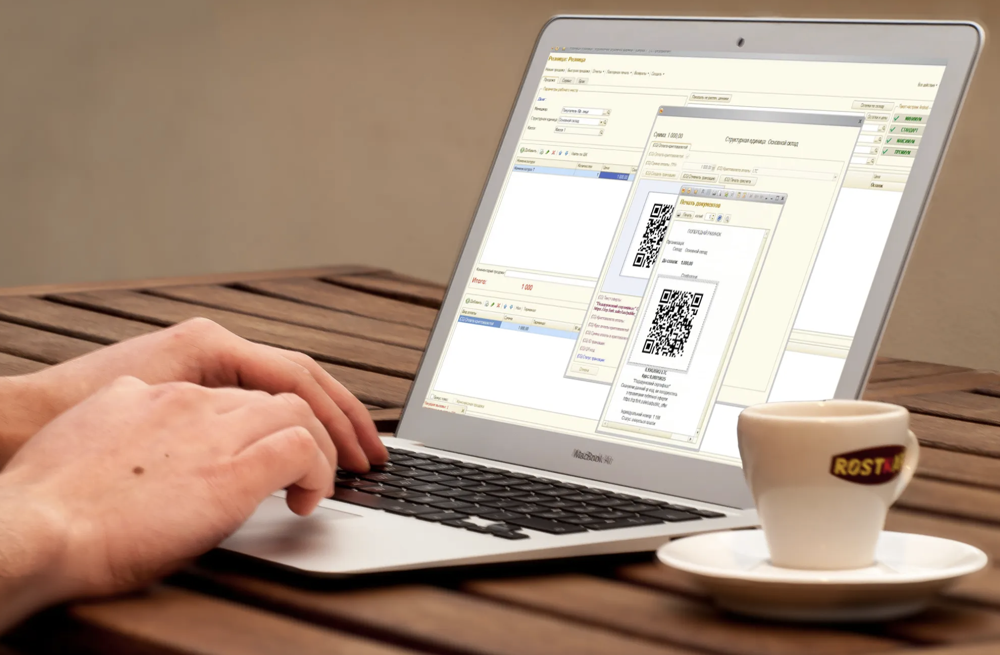

Any old-school businessman can tell you that your partners, as well as your employees, are one of the most valuable assets your business has. Because of this successful partnership strategy, you can discover new markets, receive valuable information, establish useful links, knock out business competitors, and much, much more. Although the crypto-world is a new phenomenon, the Partner rule applies here as well.

In today’s piece, we are going to introduce one of the companies we integrated with — the 1C Company — and tell you why this cooperation will help Paytomat achieve a qualitatively new level in our project evolution.

Let’s start with some theory. As we’ve said before, Paytomat relies on existing Point of Sale solutions, instead of separate merchants, and we believe such an approach has some undoubted advantages.

- It is convenient because you don’t need to sell extra hardware or offer extra applications to merchants.
- It is far-sighted because every POS has thousands of merchants, which makes their potential clients accept crypto. This means that every integration of these systems opens new markets to us.
- It affects the development of the project. POSs have a big influence on payment industries, which increases the level of trust to Paytomat.
- It is profitable: merchant doesn’t have to waste money and time to reorganize business processes or educate staff about implemented changes. For them, Crypto becomes just another type of payment.
- And finally — It is promising. In the future, every POS device can become a lightweight node of PTM blockchain, which means we will receive permanent supporters for our network operation.

Integration with 1C enables one to get all these benefits for Paytomat. However, there are some nuances in this case. Unlike R-keeper or Nobly, 1C is not exactly a POS solution. Officially, it positions itself as a company that specializes in the development, distribution, publishing, and support of mass-market software for automation of everyday enterprise activities.

In a nutshell, it sells a set of software for enterprises called 1C: Enterprise. It’s a platform that contains everything you need in order to develop, debug, and run applications based on it. Anybody can download the product, register and start developing new apps or customize existing ones for their business needs.

Thus, Integration means the automated data exchange between our solution and the 1C software merchant is using. It’s especially important for Paytomat that 1C has a built-in automated accounting and taxation solution that simplify the fiat gateways structure for the Paytomat software. The integrated solution looks like this.

### About 1C

Founded in 1991, 1C Company cooperates with 8,000 dealers from 600 cities today. To this date, according to official data, more than 1,000,000 companies use 1C: Enterprise programs. Among them, there is a number of small businesses, for example, a bakery near your house, as well as large international corporations with locations around the world. 1C is also known as a game developer with entertainment software being sold worldwide through distribution partners in North America, UK, European Union, Australia, China, Japan, etc. Therefore, the opportunity for integration with such a big player means the possibility of crypto being accepted wherever you want.

However, there’s more to come. About 7,500 teams represent the 1C: Franchising partner network, which is the main channel of value-adding for 1C products. In the future, these teams can become members of our decentralized franchise. In other words, they can become Paytomat distributors and receive an incentive for providing cryptocurrency services.

### About Paytomat

Paytomat is a decentralized system for cryptocurrency payments created to help merchants, consumers and crypto core teams to create real-life traction for cryptocurrencies as an emerging method of everyday payments. Its main features include loyalty program on a blockchain, direct integration with POS providers, DAO, decentralized franchise, standalone mobile POS, and AI chatbot payments.