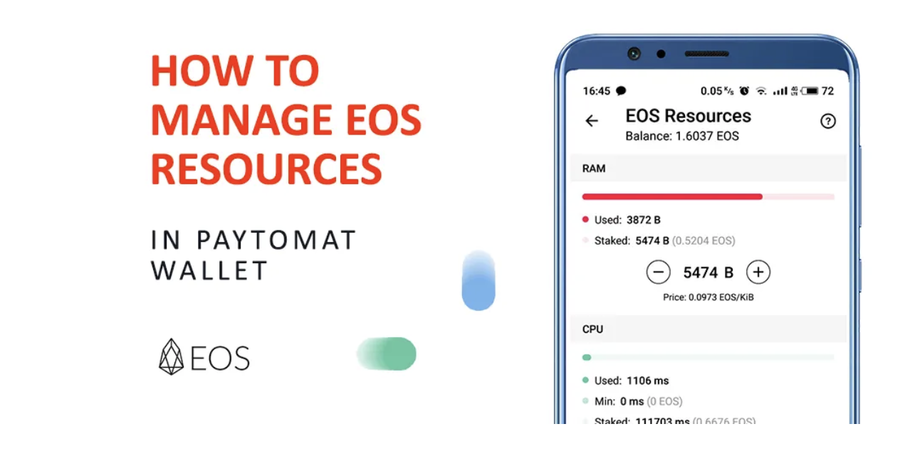

Even though EOS has been around for so long, there are many questions on how to use its resources properly, especially via Paytomat Wallet. We decided to make a special guide for you, so buckle up.

### No fees, more challenges

As you already know, EOS is one of those rare cryptocurrencies with instant speed and no transactional fees. This is a benefit most people underestimate. It allows to develop software which requires strong and robust real-time payments in shorter periods of time and demonstrates the advantages other payment systems don’t have.

Traditionally, processing companies (VISA, Mastercard, Paypal, Stripe, etc.) charge an extra fee (1%-5%) for providing services. It is a proven business model which works and people seem to get used to it because they don’t know the alternatives.

Bitcoin, as the first blockchain use case, also includes a small fee. However, this fee is not paid to a company, corporation, government, bank or any other institution, instead it’s awarded to thousands of miners who help to maintain the network and make sure your transactions are validated and secured.

There’s one important thing people don’t understand about fees on the blockchain networks — their purpose. In this case, people pay a few cents/dollars to ensure they are not sending spam, meaning you’re paying extra for sending a transaction which has a real value (transfer to a friend, purchase of a ticket, tip to a waitress, bet in a game). This is a protection mechanism which prevents people from generating unlimited number of useless operations that would clutter the network up and make it unstable.

EOS is the second blockchain which removed fees due to a new validation algorithm (delegated proof of stake). Apparently, it’s that simple to get rid of fees completely so they came up with a better approach. You need to possess a certain amount of resources each time you use your wallet. You can think of it as gasoline — the more you expect to drive, the larger the quality and quantity of fuel you are supposed to have.

### EOS resources 101

The way EOS works is similar to any other operating system, which is why there are 3 types of resources: CPU, RAM, NET. Each of them has a dedicated role. If your Mac or Windows does resource management and adjustments by itself, you need to put a little effort into operations with EOS. Before we go there, let’s figure out the distinctions between those resources.

CPU is the most important among all since it is used every time you attempt to do something with your EOS account. It is measured in µs (microseconds) and its role is to process your EOS transactions, so make sure to have plenty because you never know how much time you will spend playing different dapps. The good thing is that CPU is renewable so if, for some reason, you don’t have enough, you can simply wait a few minutes/hours until it comes back to its original state.

NET is the least valuable of all, however you still need it. It is measured in KB (kilobytes) and increases the network’s bandwidth, which means you can send more transactions from your EOS account. Most of the time you don’t need a lot of NET but it’s good to have some reserves.

The last one is RAM. It’s probably the most interesting of all. t is valuable because it stores the data of any dapp you’re using. Both games and decentralized exchanges fall into this category because they have loads of info in their state at any time.

### Staking/unstaking

With the very first introduction of EOS within Paytomat Wallet, our goal was to make resource management as easy as possible. Knowing how complex the technical part is, we had to create a simple UI.

This is why there are only two actions you need to know about when dealing with EOS: stake and unstake. Staking gives you an opportunity to assign a certain amount of resources (CPU and NET) to EOS network in exchange for your EOS. Unstaking simply refunds all of your assets back to your account.

In order to stake or unstake any EOS resource, all you need to do is to go to EOS Resources section in your EOS account and click on the plus or minus sign to adjust the amount of selected resource.

Keep in mind:

- You can only stake EOS for CPU and NET, RAM has to be purchased/sold separately in the open EOS RAM marketplace. Hopefully, in Paytomat Wallet you won’t find any differences, so don’t worry about that.
- Staking happens instantly.
- Unstaking takes 72 hours (3 days).
- RAM purchase/sell happens instantly.

EOS resources recommendations
The most common question we had over the last few months is what are the bare minimums and the average amounts of resources that have to be maintained. When you create an EOS account, you have the minimum of CPU, RAM and NET that can be used in a survival mode. Even though it is possible to leave it as it is, we recommend you to stake more, just in case of the random spikes in resource usage on the EOS network.

Basic set-up (5–10 operations daily):

- CPU — 1–2 EOS
- RAM — 3–4KiB
- NET — 1 EOS

Average set-up (10–100 operations daily):

- CPU — 3–4 EOS
- RAM — 4–5KiB
- NET — 1 EOS

Advanced set-up (over 100 operations daily):

- CPU — 5–10 EOS
- RAM — 5–7KiB
- NET — 2–3 EOS

Keep in mind:

- If you love playing games or dapps that require ongoing interactions with your EOS account, check your CPU levels more frequently. Sometimes it takes more time to renew its reserves. We also recommend you to have 4:2:1 proportion of CPU:RAM:NET accordingly if you tend to use such services or interact with smart contracts through Paytomat Wallet consistently.
- The more transactions you need to make in a short period of time, the more CPU you’ll need.
- The more data a particular dapp stores, the more RAM you’ll need.
- RAM can only be purchased in the marketplace which means you can buy more when it is cheap and sell when it is high. Gambling on resources can be fun after all.
- Sometimes EOS network can be busy during the times of massive and unpredictable usages by the dapps. This happens rarely but when it does, you may encounter a sudden lack of CPU, even if you don’t use your wallet. Don’t freak out, just wait. This is normal and it will end automatically.

Let us know whether this was a clear explanation in our telegram group.