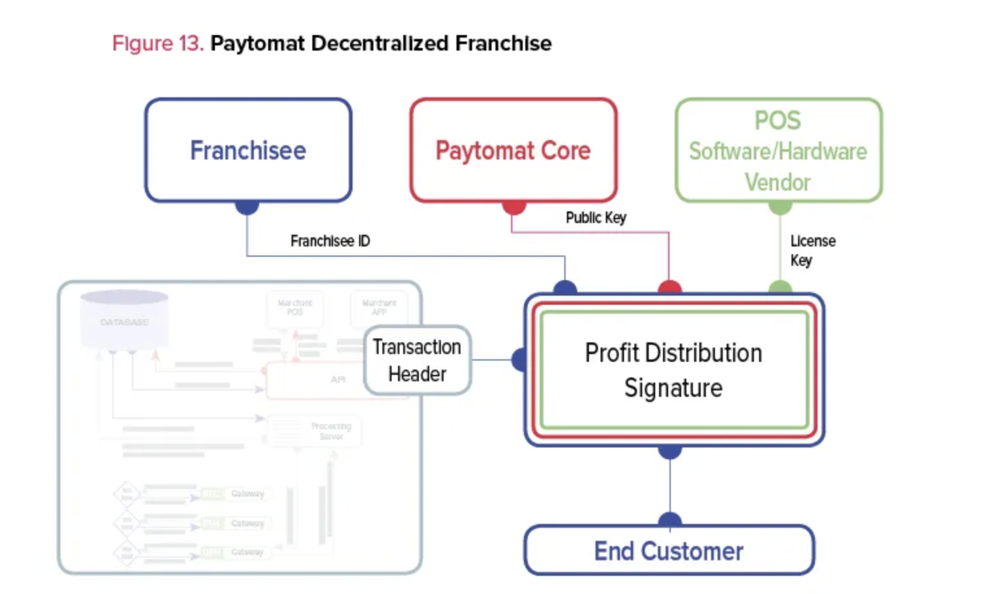

For the last decade, the internet has offered unlimited possibilities to individuals for creating any type of business they could possibly envision. We’ve seen a massive explosion in social media influencers, e-sport players, digital nomads, bloggers, e-commerce dropshippers, drone pilots, Uber drivers, Airbnb hosts, and online trainers. The number of similar opportunities are growing faster than we’ve ever seen before, which is why traditional businesses will just have to adjust.

We believe the emerging blockchain technology will create even more disruption in various industries and reshape numerous conventional ‘job’ types. People will redefine the way they view their careers in the upcoming years. Paytomat encountered this issue early on and is offering a long-term solution.

This spring we are introducing the first ever decentralized franchise where anybody can contribute to cryptocurrency payment system on their local market. There are lots of blockchain entrepreneurs and cryptocurrency enthusiasts across the globe, who can benefit from such a business model, by leveraging existing relationships they’ve developed over the years.

We are aiming to build a global Paytomat community of local representatives who will help to establish fiat-to-crypto gateways, direct relationships with POS vendors and help merchants start accepting cryptocurrency. As a result, they can become co-owners of the first franchise on a blockchain and participate in the Paytomat loyalty program.

## What Are The Benefits of the Decentralised Franchise?

### Blockchain significantly improves various franchising processes

Blockchain technology is here to stay. Billions of people will use it sooner than they anticipate. In fact, the biggest companies in the world are already working on different blockchain implementations for banking, payments, medicine, and international trade markets.

There are benefits that blockchain can give to the franchise industry as well. For instance, the entire process of creating a franchise agreement can be automated via smart contracts.

In this way, every distributor will have an immutable record of attribution to that particular franchise unit. Moreover, smart contracts can potentially allow transferring digital rights to another person eliminating all of the paperwork.

### The Paytomat franchise is augmented with a digital referral program

A common franchise model looks simple. Its revenue is split among franchisor, franchisee and franchisee’s employees. They receive royalty fees, sales profits, and salaries respectively.

The biggest concern we have with such a structure is that people should pay weekly or monthly dividends from their total profit, which may not be the most convenient operation to individual Franchisee.

To automate this and other financial issues in this industry, we decided to apply a referral system — a model, which has already delivered tremendous growth to companies like Dropbox, Airbnb, and Uber.

### Paytomat closely works with core teams of cryptocurrencies and blockchain projects

The main purpose of our project is to help cryptocurrencies to become accepted worldwide by thousands of merchants and e-commerce businesses. That involves various technical, legal, marketing and management challenges.

To accomplish our goal faster, we deliberately started to work with core teams of different blockchain projects and founders of top cryptocurrencies. Those are very intelligent people who are trying to reach a very specific niche due to their professional careers and relationships in that field. By working with them, together we can embrace different markets in a very unique way that wasn’t previously possible.

### How the Paytomat franchise is going to work?

Unfortunately, decentralized business models haven’t been tested at scale due to a fairly small age of blockchain technology and a lack of deeply engaged experts in this field. However, there are several working models in existing centralized services that we can use and improve by applying immutable and distributed ledger.

One of those services is a referral system we mentioned earlier. In this case, by using smart contracts, Paytomat Core will distribute a portion of rewards a particular franchisee earned at any given transaction. The type of clients one can refer to our network are point-of-sale vendors, merchants and payment gateways.

There are three key elements required to initiate a transaction on Paytomat blockchain: franchisee ID, cryptocurrency public key and a license key of a merchant. We will put those keys in Profit Distribution Signature that has the following usage structure:

- franchisee ID — a unique identifier for a franchise identity that we store on the Paytomat blockchain. Creating a new account triggers ID generation.
- public key — a blockchain address of a merchant to accept a particular cryptocurrency. This address changes during every transaction to enhance the privacy of our end customer. However, it can also be predefined in the account settings.
- license key — a key that POS software or hardware provider issues to every merchant. Paytomat generates this key once, and don’t change it unless the merchant decides to switch to another POS system.

We believe that by having an incentive model for each participant of the network, we can create a comprehensive ecosystem in which stakeholders are helping each other to grow faster and achieve the common cause: making crypto payments a convenient instrument for everyday transactions.