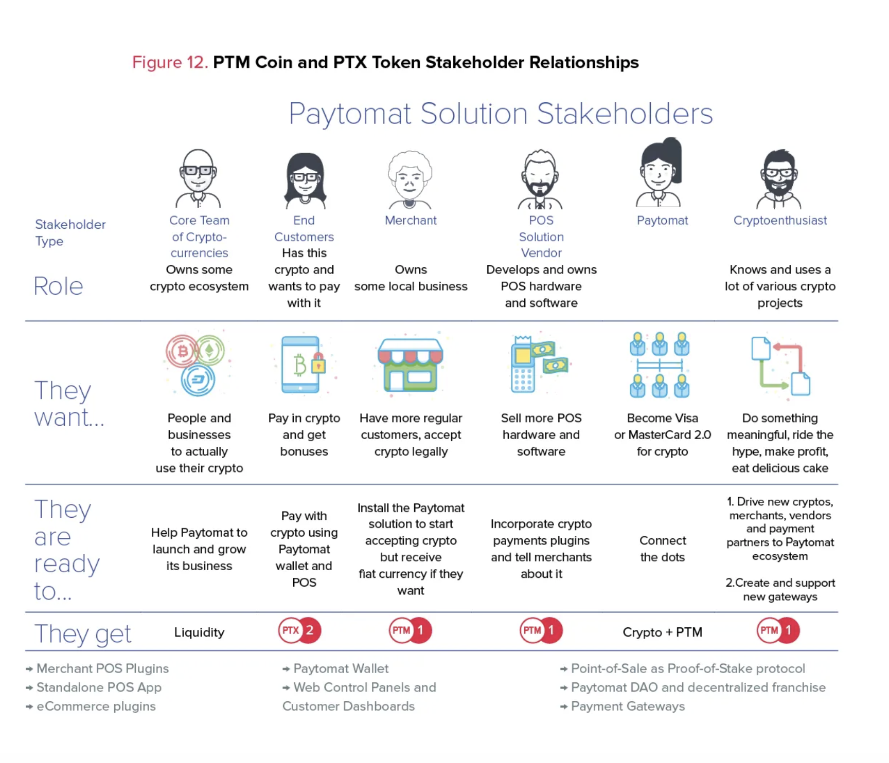

### Loyalty Programs Evolution

The very [first loyalty program](https://blog.smile.io/a-history-of-loyalty-programs) appeared in the XVII century when retailers were giving copper tokens that could be later redeemed for products on future purchases. It turned out to be an expensive approach but it definitely left a clear message for the industry — rewarding people with extra bonuses works.

Later a whole range of loyalty programs appeared in various industries. Hundreds of millions of people now use frequent flier miles, cashback, restaurant and hotel points, and gift cards on a daily basis.

The Internet has been the biggest driver of loyalty programs to date. We believe Blockchain can be even bigger. In fact, according to [recent research by Deloitte](https://www2.deloitte.com/us/en/pages/financial-services/articles/making-blockchain-real-customer-loyalty-rewards-programs.html), Blockchain is a perfect match for loyalty rewards programs by providing more transparent and fraud-proof loyalty points. Currently, this is a blue ocean. Over time, dozens of competitors will appear. However, we don’t think this competition will turn to bloodshed within the foreseeable future.

For instance, [Elements](https://theelements.io/) is one of the first projects that is trying to implement loyalty rewards by creating a single cryptocurrency, which merchants in the multiple industries will be able to use. It also allows merchants to mine ELM cryptocurrency. The approach is interesting. However, its scalability will be a true challenge.

Because the Elements ecosystem is proof-of-work based, the infrastructure costs of maintaining it will be high and will require a huge commitment on behalf of the participants of this ecosystem. On-chain scaling works only in a situation where full nodes are incentivized. Without a sufficient number of full nodes, the blockchain ecosystem they represent will be vulnerable.

### Paytomat Blockchain

To have a network that is capable of handling loyalty programs, processing hundreds of thousands of transactions per second, instant exchange between currencies and the DAO governance model, we decided to build up an entirely new blockchain. The main features of this system are:

- a new block is generated within 1–3 seconds;
- we issue tokens without turing complete smart contracts;
- our blockchain supports atomic swaps and sidechains;
- our system works with turing complete smart contracts.

Currently, there are several blockchains that are capable of handling most of the requirements mentioned above. We are still conducting our research on which one to use as our main technology.

The core concept of Paytomat Blockchain is to create a system where all of the merchants and software vendors can augment the network. In return, they will receive crypto to use or spend in other locations. In fact, we’re designing a new consensus algorithm exactly for that, it will be called Point-of-Sale as Proof-of-Stake.

### Paytomat Coin PTM and Paytomat Token PTX

The Paytomat loyalty program will consist of 2 major components: PTM Coin and PTX Token. PTM will be the main cryptocurrency of Paytomat Blockchain and will serve as a basis for a merchants rewards program. PTX will be a token on top of Paytomat Blockchain and will act as a single loyalty token on our network.

There are four fundamental reasons why to have a coin and a token separately on our network.

1. Distinguishing between rewards for merchants and for customers

In the pre-blockchain era, customers received points, bonuses or discounts, while merchants received cashback to their bank account. The same way in loyalty program on blockchain customers will receive PTX tokens, which they will use exclusively to receive a discount. However, merchants will receive PTM coins which is a cryptocurrency listed on the crypto exchange. It reminds a traditional fiat currency. Merchants will be able to keep it as savings, spend it in all Paytomat locations or trade it for Bitcoin (or other cryptos) on various exchanges.

2. Managing the volatility of our ecosystem by using different growth strategies for Paytomat coins and tokens

The PTM coin will be constantly increasing in price, fostered by the buybacks we will conduct each time we generate a new amount of coins. In contrast, PTX will be constantly decreasing in price, thus stimulating customers to spend it quickly and to make recurring crypto payments.

3. Reducing the number of tokens people have to use in loyalty programs from different industries

Previously people had to carry dozens of cards and keep multiple apps to have a discount. That’s very discouraging, distracting, and increases the number of unused bonus systems. It is especially relevant in the travel industry, where restaurants, hotels, and flights have different reward structures. By introducing a single loyalty token, people can finally get the most from such programs and have the best products at the most affordable price.

4. Instant redemption or exchange of tokens

Blockchain also allows for creating a shared distribution of tokens among numerous participants during a block generation. That is the perfect software solution for any loyalty program that projects like ours can use. It allows for redeeming tokens instantly and exchanging them if there’s a need.

PTM Coin and PTX Token Stakeholder Relationships
Early on we’ve defined that our ecosystem has a diverse audience.

There are core teams of cryptocurrencies that launch new cryptos. There are also crypto enthusiasts who use crypto from core teams to pay for various goods and services. There are merchants who want to have customers who pay with crypto. Lastly, there are POS vendors providing merchants with software solutions to simplify their business processes.

Despite the different needs and wants, they all deserve some rewards because they make valuable contributions to the network. Below we tried to describe how they interact with each other.

### Paytomat Loyalty Wallet

One of the [best practice](https://blog.smile.io/loyalty-best-practices-2018) for a successful loyalty program in 2018, is to have a mobile app. For this reason, we are building the Paytomat cryptocurrency wallet. Currently, this will be the first wallet to support both PTM and PTX, as well as other cryptos.

To protect our customers, the Paytomat wallet is using the best security standards, which are currently available on the market. Namely: cryptocurrency vault, multisignature, built-in hardware wallet support.

The biggest advantage our wallet will provide is direct integration with leading POS systems, e-commerce plugins, other payment solutions via Paytomat APIs and other key elements of our ecosystem.

Lastly, each person who has our wallet installed will be able to use various location-based services to look for the best deals and promotions, as well as places that currently accept crypto nearby. The first version of the Paytomat wallet is scheduled to be released in March. Stay tuned for more updates!