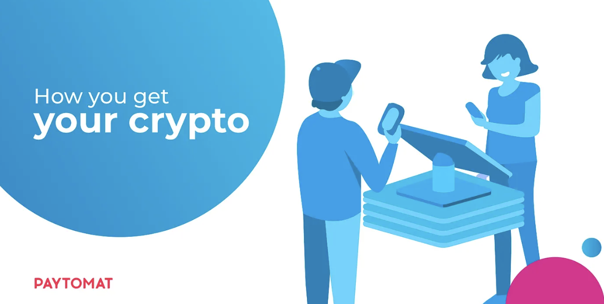
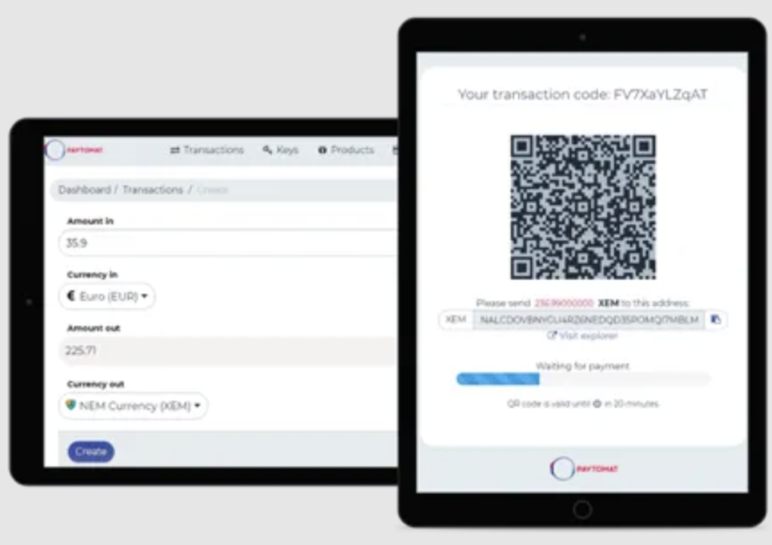

With the development of our ecosystem, Paytomat is gradually acquiring a number of products that allow to both pay and receive payments via cryptocurrency. In this material, we want to answer the most frequently asked questions about how different Paytomat tools can be useful for merchants work.

Before our detailed review, it is important to make one remark. The central element that works in conjunction with all the methods described below is Merchant Web Panel. It is a personal merchant’s account, where users can track sales, performance in various cryptocurrencies, manage payout methods and configure Paytomat settings. The second necessary element for every merchant is a crypto-wallet that supports crypto in which users are going to accept payments. Though it can be any program that meets the requirement above, we recommend using our own Paytomat wallet solution for correct and hassle-free work. Now let’s jump straight into the methods.

### 1. Merchant’s POS System (already integrated software)

The primary approach of Paytomat is to integrate existing software companies, that merchants have been working with for the last several years.

In this case, merchants don’t need to buy any additional hardware or software as well as educate their staff about a new form of payment. All the usual business processes don’t have to change at all. The only addition is the button “Crypto” that appears on the payment terminal, next to “Card” and “Cash” buttons. When a customer pays for the order or goods via crypto, a QR code is added on the check, which the client simply scans and transfers the necessary amount to the wallet.

At the moment we have integrations with the following software:

- Poster — https://joinposter.com/en/applications/paytomat
- 1C — https://1c-dn.com/1c_enterprise/what_is_1c_enterprise/
- Servio — http://servio.com.ua
- Profit Solutions — http://profit.com.ua
- Iiko — https://iiko.ru

This list is gradually growing, but if you want to integrate Paytomat into some specific POS system, do not hesitate to ask us about it.

### 2. Payments via Merchant Web Panel

Apart from the fact that your Merchant Web Panel is a link between the business and the crypto-world, it also suits merchants who don’t want to use any POS systems at all. Any invoice can be generated directly from it. To make a payment, the client simply needs to scan the QR code directly from the panel.

That’s how this invoicing feature looks:

### 3. MerchantApp and mQR

Another option for merchants without POS systems is a solution similar to WeChat Pay or Alipay, where merchant creates a universal QR code for all their business.

In this case, the merchant is working with our MerchantApp (that can be simply installed for Android or iOS devices). The unique QR code that is generated by our MerchantApp is called mQR.

To make a payment, a customer simply scans the mQR-code and chooses crypto they wish to pay with. After the payment, the merchant will receive a simple push notification or a text message.

The customer can either use the Paytomat wallet for iOS or Android or scan the barcode to pay a web-based invoice via their favorite wallet.

### 4. Crypto Gateway Plug-in

In case a merchant’s business is based online, they can use a Paytomat plug-in. It works in conjunction with two products — the popular WooCommerce plug-in and Paytomat’s Merchant Web Panel. Payments via crypto, in this case, are similar to any online purchase. The customer has to push the “Buy” button and choose the cryptocurrency they want to pay in. After that, a system generates a QR-code, which users have to scan with the crypto-wallet app.

At the moment, these are all payment methods available in our system. We hope you find the one that fits you the most. 

Stay tuned!