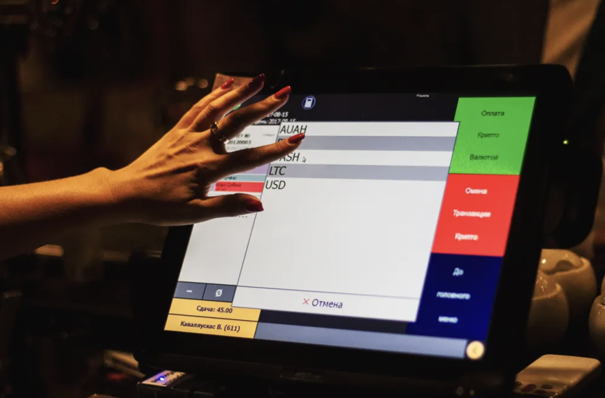
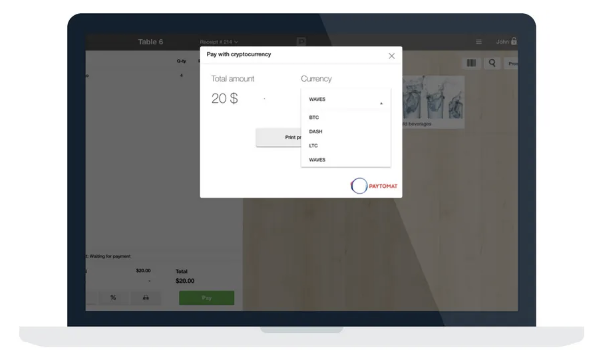

Over the last few years, cryptocurrency has become quite a mature and significant industry. It constantly introduces its participants to new challenges, hacks and new ways of implementing blockchain in the real world.

However, the original vision of Bitcoin has changed dramatically. Due to technical and social issues, it’s evolved into an asset, rather than a payment solution. That’s why existing cryptocurrency payment systems are putting merchants at risk — due to a high probability of double spending and long confirmation times.

After a recent rejection of Segwit2x, it became clear that Bitcoin will use off chain methods (i.e. LightningNetwork) to increase the number of transactions per second. Unfortunately, those technologies are very complex and it will take a year or two to develop and introduce a user-friendly form to regular customers. However, we all know that a lot can happen during that period of time so we simply cannot wait.

We also believe people deserve to have options to use their favorite cryptocurrency for payments, whether it’s a lunch, fuel, utility bill or college tuition.

That’s why we came up with a solid solution that will increase cryptocurrency adoption across the globe while eliminating all of the technical issues that the Bitcoin network stumbled upon.

### Proof of concept

The implementation process started in late July of 2017. Our major goal was to prove that the new system works. After a few weeks of hard and dedicated work, the first transaction was made. It happened in the fabulous restaurant Givi Rubenshteyn in Ukraine.

Based on the data from [coinmap](https://coinmap.org/), CIS and Europe is a good market to start with but we are still making our research to determine the best location for viral adoption of such type of payments.

Speaking about payments, Bitcoin showed the worst results across 3 cryptocurrencies that we integrated with. Dash, on the other hand, produced the best performance. It confirmed fast and was very convenient to use. It’s not an accident that people refer to it as digital cash.

### Legal framework

Another important aspect was to build the proper legal framework to make sure that a particular merchant does not violate tax policy or any other policy of a certain country. We considered multiple scenarios and chose the one where QR codes are represented as gift certificates. That allows merchants to give their clients an ability to scan printed QR codes on their bill which still remains the most official document for any service today.

Dependence on the current monetary system is inevitable so we provide bank clearing for every merchant. We believe that over time this process will change and all of the transactions will become p2p, eliminating banks as an intermediary completely.

### Technical solution

To make our solution scalable in terms of merchants’ acquisition, we decided to take an approach of strategic partnerships with existing Point of Sale systems. In this way, we can get thousands of potential businesses internationally with almost no cost. It doesn’t create any competition on the market which clears a path to make actual work.

The biggest advantage of such an approach, is that the only move that is required from a merchant is to make one update in his existing software which will activate the cryptocurrency module inappropriate POS terminals.

So far we’ve partnered with 2 Point of Sale providers: [Profit Solutions](https://www.profitsolutions.com/) (August 2017) and [Poster](https://joinposter.com/en) (November 2017) which cover thousands of clients globally. Our plan is to partner with hundreds of similar systems on every continent in order to provide a smooth crypto payments service with immediate settlements and excellent customer support.

Actually, our vision is a lot larger and we’ll make a few important announcements in the coming weeks. 

Stay tuned!