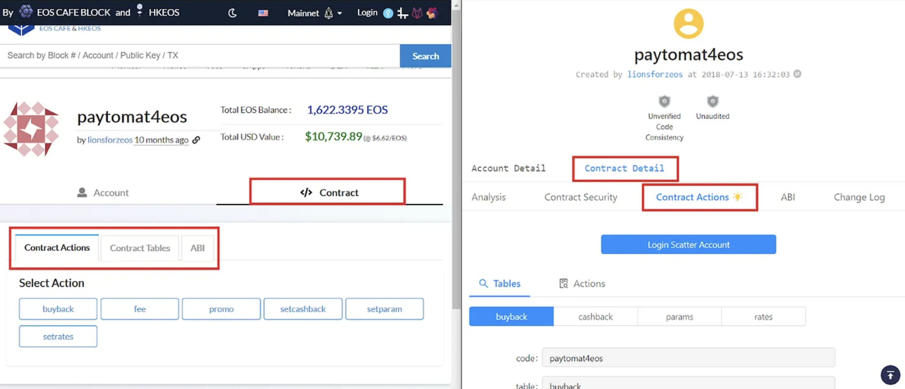
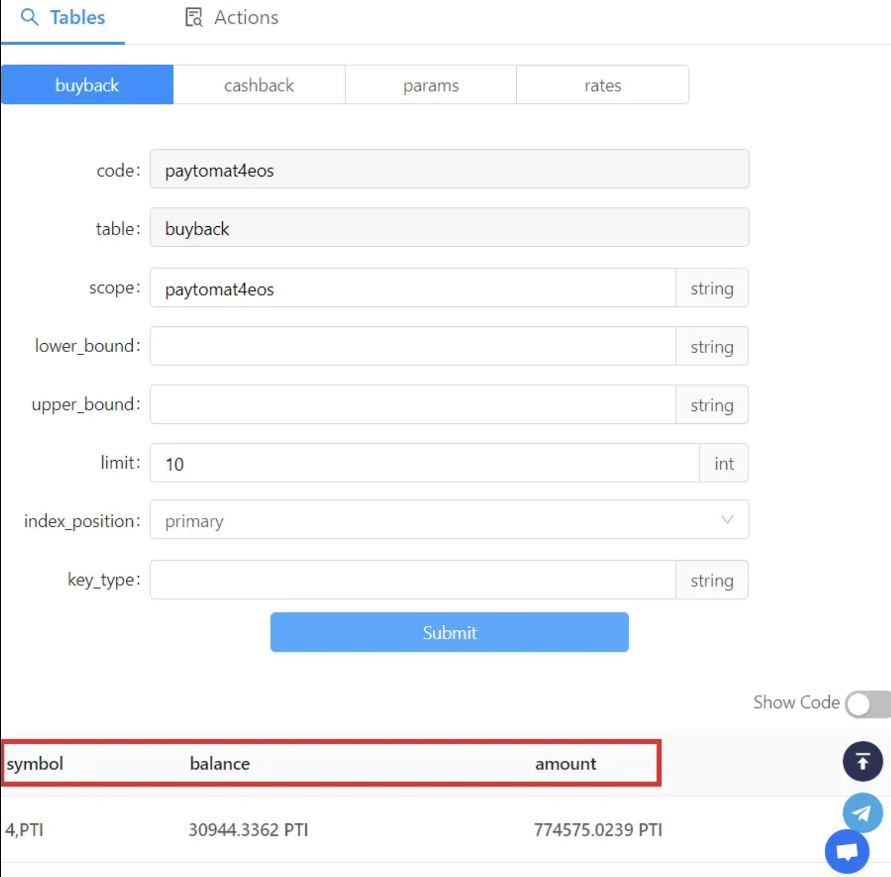
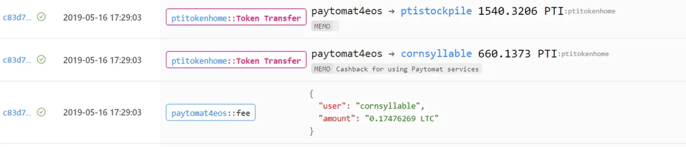
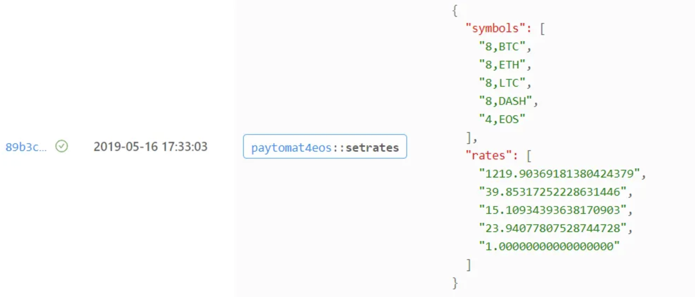
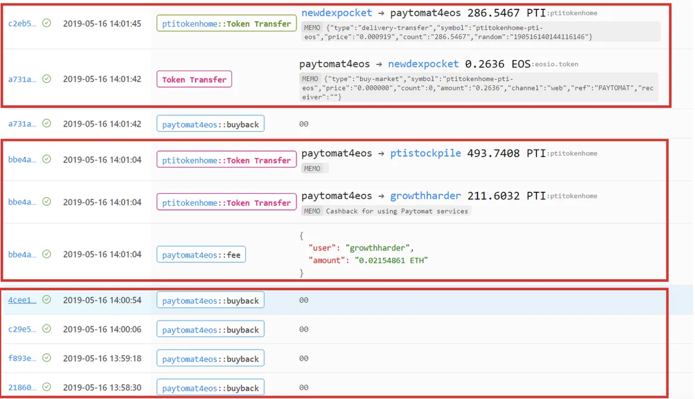
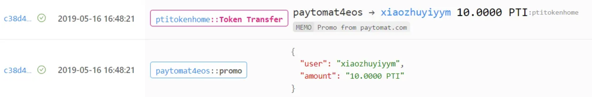

We know there are lots of tech people in our community. We appreciate your support and want to give you something curious to work with. In the last article, we described how to read Tables and Actions in RSC. As a follow-up, we want to show you how do those transactions look like on the blockchain.

Turns out, it’s not easy to create an interface for working with smart contracts but thanks to Bloks.io and EOSPark teams we can do it. First and foremost, make sure to open up a Contract (Bloks.io) or Contract Detail (EOSPark) tab and switch to Contract Actions. Typically this tab has subtabs with Tables and Actions. You may choose the one that is more interesting for you.

In order to receive the data of any contract table, you just choose the name of the table and hit Submit. It will show you the properties this particular table contains and their values. For instance, the table buyback displays 3 properties — symbol, balance and amount. You can do the same thing with all of the tables, it works pretty much the same.

You can’t use this method with the Actions though. You can try obviously but unless you have an Active key of paytomat4eos account, it’s not gonna work.

We assume this type of information can be valuable to people who want to know the changes in the cashback system, auto purchase, and rate settings. Other than that, it’s just a service data and may not be that useful for daily usage.

## Tracking transactions
For those who love digging deep, you can watch and monitor the transactions happening in RSC.

Let us walk you through the main ones.

### Revenue generating event

As you already know, at the moment the revenue through Paytomat Wallet is generated during cryptocurrency exchange and credit card withdrawals. As soon as this happens, a fee action executes and RSC initiates 660.1373 PTI transfer from paytomat4eos to EOS account that triggered this event. In our example that would be cornsyllable who successfully exchanged 0.174 LTC. You can also see that 1540.3206 PTI were sent to ptistockpile which means that those tokens were taken out of circulation.

### Setting rates event

Set rates is an action that is executed every 5 minutes to set EOS exchange rates for all of the supported cryptocurrency pairs in the smart contract (currently BTC, ETH, LTC, DASH, EOS).

### Revenue balance indicator check event

This indicator is really important to us since it shows whether we need to purchase extra tokens from an exchange after the cashback funds were sent to the wallet user.

This event is generated every 48 seconds (the value can be adjusted) and triggers the purchase of the tokens from an exchange when the balance property in the buyback table becomes negative.

As you can see in the sample below, the buyback action was executed every 48 seconds until the growthfather exchanged 0.2154 ETH. After that happened, a portion of revenue (211.6032 PTI) was transferred to the user in a form of cashback, the other part was sent to a burning account (ptistockpile). At this point the value of balance in the buyback table become negative and it triggered an action to create a market order of 0.2636 EOS worth of PTI on Newdex exchange (you can see that at the latest block of the image below).

### Promo event

There’s a separate method that is used to arrange different promotional campaigns. In this case, xiaazhuyiyym receives 10 PTI for creating an EOS account, a promo campaign that was recently started in Paytomat Wallet.

Despite the fact that this requires some time to learn, it’s a very amusing way of studying how to do EOS smart contracts work.