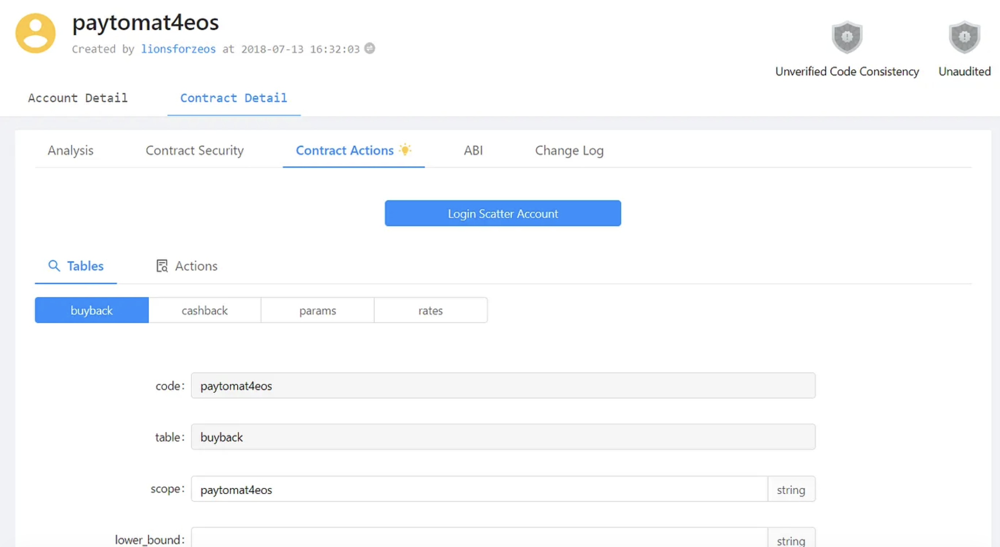
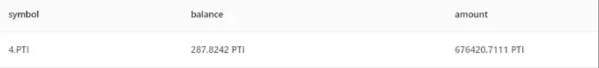
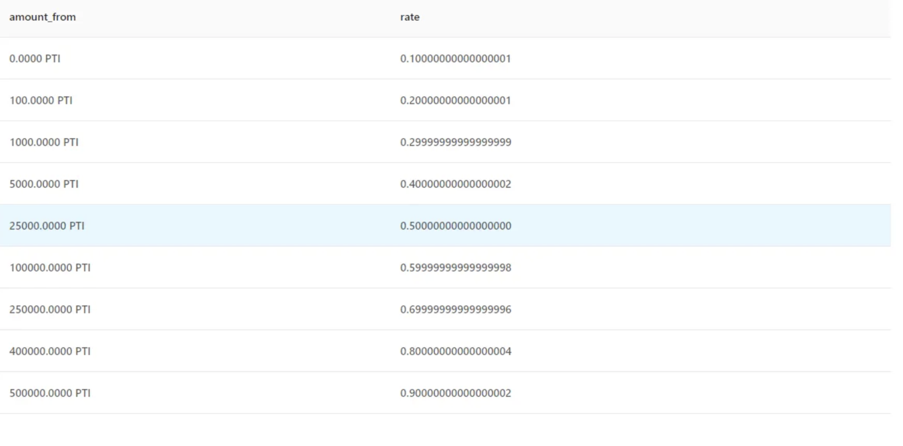
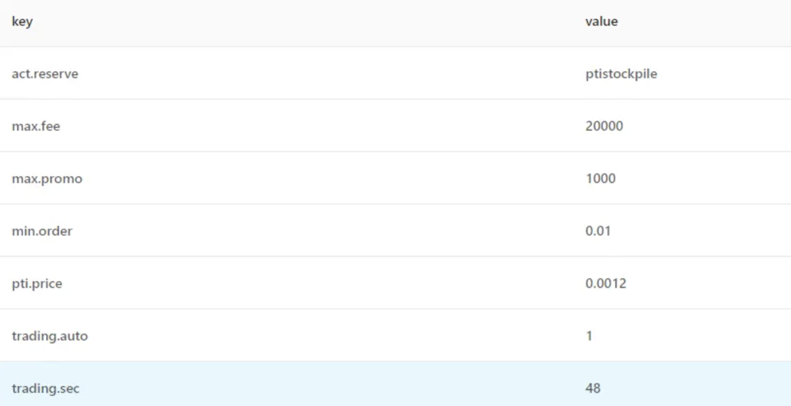
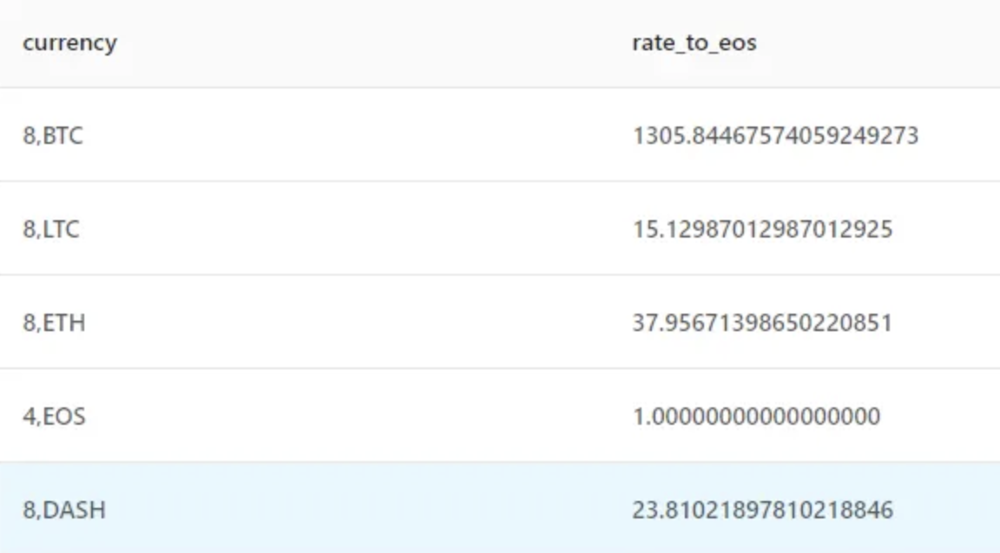
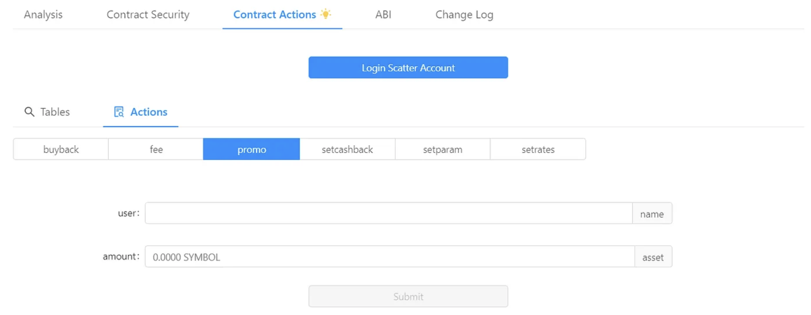

For the last few months, we’ve been working on lots of things that will dramatically increase our company’s transparency. Now we want to open up technical details and show how things work within our system and what is happening behind the scenes.

As you noticed, moving to EOS gave us an opportunity to develop things faster and make them more stable without compromising security. We believe that the biggest benefit, however, is that EOS allowed us to reconsider business models that simply weren’t possible with other blockchains due to speed and feature set limitations. Cashback, airdrops, and promo campaigns are only the beginning of what we have to offer to our users. It works and people love it. It’s a win-win.

Apparently, behind the interface, there’s a powerful system that monitors, calculates and executes certain actions based on user’s activities. This system is called a smart contract and this is exactly what we’re going to explore right now.

### Paytomat Revenue Smart Contract (RSC). Overview

Eventually, Paytomat will have multiple smart contracts but we want to start with the first one that is currently in the active test mode and has been working since the beginning of May 2019. It’s a smart contract that tracks incoming Paytomat Wallet revenue and distributes it to corresponding accounts.

At the moment the revenue is generated during credit card withdrawals and cryptocurrency exchange. However, we’re working on expanding this list to boost our income in the long term.

We suggest you go through a smart contract by yourself to become more familiar with how it works. To do that you can use one of the blockchain explorers that support smart contract operations: EOSPark, Bloks.io. Regardless of the interface, you’re using, you’ll need to find a paytomat4eos EOS account and switch to Contract/Contract Details tab. Meanwhile, you can read detailed explanatory info on how to read the data that you see in those explorers.

Here are the core functionalities of a Revenue Smart Contract:

- Receives notifications about incoming revenue of a specific cryptocurrency (BTC, ETH, LTC).

- Calculates the amount of PTI in this cryptocurrency according to an exchange rate of this crypto to EOS.

- Calculates the amount of user’s PTI to know how much cashback to send to the user (from 10% to 90% of a total 1% fee).

- Sends the remainder of the revenue to a special account (ptistockpile) with no access to it (a burning account which removes tokens from circulation).

- Records that the revenue balance (PTI) in a smart contract was decreased.

- When the revenue balance decreases, RSC buys a certain number of tokens from an exchange.

### Paytomat Revenue Smart Contract (RSC). Tables
Each EOS smart contract consists of a table that contains data, and actions that execute transactions. Each table and action can have multiple properties to set. There are 4 tables in RSC: buyback, cashback, params, rates.

1. Buyback Table — displays revenue balance relevant data:

- symbol — token symbol, PTI in our case.

- balance — the current revenue balance indicator (PTI). Its value has to be maintained near zero. It decreases when PTIs are sent to the user who participated in one of the actions that generate revenue in Paytomat Wallet, and increases when PTI are purchased from an exchange by RSC. This balance is not a balance of the main paytomat4eos account though, you can think of it as a balance sheet of PTI revenue showing the difference between users’ cashback and the number of tokens purchased from an exchange by RSC.

- amount — the total amount of PTI that were purchased from an exchange using this smart contract during the revenue distribution.

2. Cashback Table — shows cashback info:

- amount_from — the amount of PTI that a receiver (EOS account) holds.

- rate — the percentage of cashback given to the user, the value varies from 0.1 (10%) up to 0.9 (90%). In other words, the more PTI you have on your balance, the more cashback from your operation you’ll receive.

This one requires an example.

Imagine your EOS account holds 20,000 PTI and you made cryptocurrency exchange of $2000 worth of Ethereum (or 8.88 ETH, 1ETH = $225). Paytomat receives 1% fee for this operation which makes it $20 (or 0.0888 ETH, 1ETH = $225). Due to the rules of the smart contract, this amount is converted into EOS (3.2527 EOS, 1EOS = 0.0273 ETH) first and then into PTI (3614.11 PTI,1PTI = 0.0009 EOS).

Thus, the total 1% fee is now 3614.11 PTI. Those funds will be distributed in the following way:

- user cashback — 40% or 1445.644 PTI, 40% because a user had less than 25,000 tokens, otherwise he could receive 50% or 1807.055 PTI.

- burning account (ptistockpile) — the rest, which is 60% or 2168.466 PTI.

Notice, the exchange rates were taken from Binance during the time of the article’s creation but you can use the same conversion methods to calculate revenue distribution if there’s a need for that.

If the user doesn’t have an EOS account, the cashback will not be sent to him but he will be notified that he could receive it. In this case, all of the revenue will be sent to the burning account (ptistockpile).

3. Params Table — displays different service parameters for smart contracts:

- act.reserve — burning account EOS account name (ptistockpile).

- pti.price — the current PTI/EOS price.

- trading.auto — the status of revenue balance check (enabled — 1, disabled — 0).

- trading.sec — frequency of revenue balance check, currently set to 48 sec. This means that RSC will check every 48 seconds whether it needs to purchase PTI from an exchange.

4. Rates Table — shows the correspondent amount of PTI in particular cryptocurrency:

- currency — the cryptocurrency used during conversion;

- rate_to_eos — the correspondent amount of EOS in 1 unit of this particular cryptocurrency, the information is updated every 5 minutes.

### Paytomat Revenue Smart Contract (RSC). Actions

- buyback — executes on its schedule (currently every 48 sec) to check the value of the revenue balance. If the value is negative, PTI are purchased from an exchange by RSC.

- fee — executes when a new revenue-generating event occurs.

- promo — executes when we send PTI using different promo campaigns (new EOS account creation, airdrops, referrals).

- setcashback — allows setting cashback systems and rules.

- setparam — allows changing certain service parameters in RSC (automatic PTI purchase, PTI/EOS price, burning account).

- setrates — executes every 5 minutes to set up EOS exchange rates of all cryptocurrencies.

There’s a lot more to show here but it should be enough for you to get familiar with how Paytomat is implementing EOS smart contracts. Overall the development experience is very comforting and allows us to accept bigger challenges that can improve our product even faster. Let us know what you think about such posts, we believe they can bring lots of value to our audience.