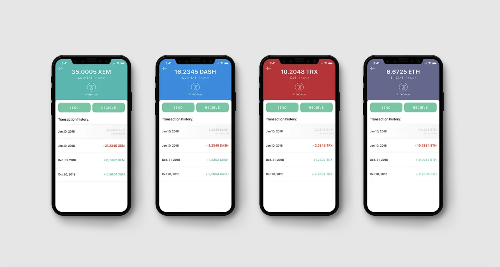
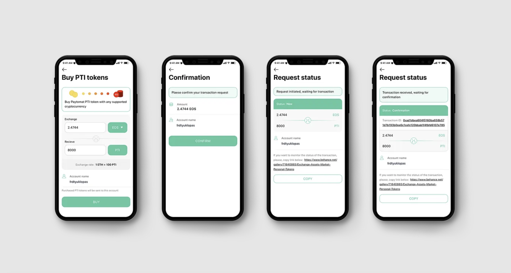
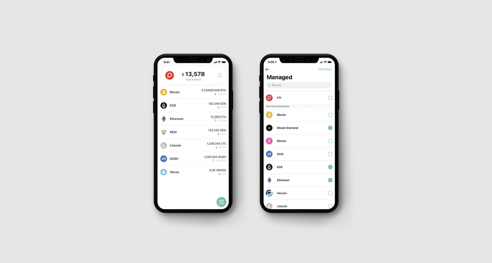

As you might remember, recently Paytomat has refreshed its visual style. As a followup to this big event, we started to update all of our products into the novel design. Paytomat Wallet is one of our main products and we glad to push this update as a top priority. Let’s see what has changed.

Firstly, the wallet obtained more solid and bold colors with a highly adjustable and customizable palette. You can find green a lot more in the fresh version. And it’s not because we’re trying to beat the bear market this way but because it makes a perfect balance between our main red color.

### Color sensitive headers

One of the coolest features that users will find appealing is personalized headers for each and every crypto. This is our way to say thank you to each developer team for being unique and adding extra value into the blockchain ecosystem.

### Buy PTI token for crypto

PTI token is the most important Paytomat asset, thus we’re doing our best to provide as much support for it as possible, especially simplifying the ways of purchasing PTIs. Exchange is a traditional way of possessing tokens but we want to go further and make the process even simpler.

Now you can buy PTIs directly in Paytomat Wallet by having Bitcoin or any other crypto within the app. This doesn’t require any KYC and has no limitations whatsoever. The exchange time depends on the blockchain so we do recommend to use assets with faster confirmations (EOS, ETH, NEM) if you want to buy tokens faster.

### Pin and manage tokens on the main screen

Even though there are hundreds of tokens across multiple blockchains, we can’t decide which of those the customer is using and paying the most attention for. That’s why we added a neat feature of adding tokens into your main screen. On top of that, you can change the order of both coins and tokens. At the moment we support ERC-20 and EOS based tokens but there’s more to come.

### Withdraw crypto to credit card

Credit card withdrawals were already available in our latest wallet release but it was limited to Ukrainian citizens who linked their mobile number. From this version, we start to support Russian cards as well. The list of available countries will expand gradually in proportion to our gateway partners, so be patient if you’re country is not there yet.

Anyways, we hope you’ll love our new wallet design and new features. Looking forward to your feedback in our community. If you still haven’t installed Paytomat Wallet, you are missing out on usability. You can still do that now: Android, iOS.