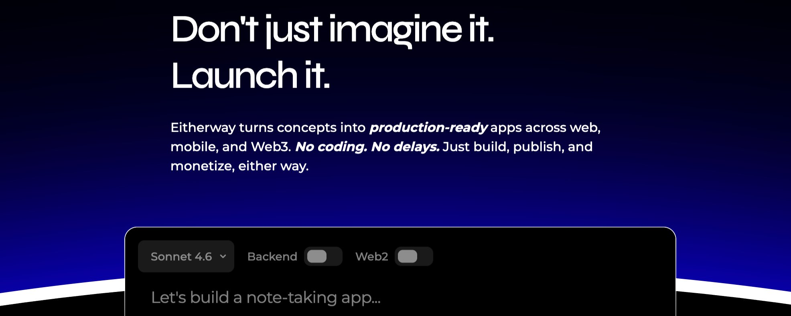
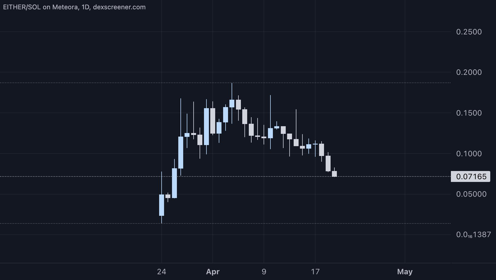

# Eitherway



## The AI Tools Are Lying to You

The promise was simple. AI would let anyone build software. You would describe what you want, and the machine would build it.

That promise is partially true. The tools got good at writing code. GitHub Copilot suggests functions. ChatGPT scaffolds a component. Claude explains architecture. Millions of developers are faster today than they were two years ago. The concept of vibecoding, coding with AI in a flow state, has moved from niche to mainstream.

But here is the gap nobody talks about. Suggesting code is not the same as shipping software. The moment you go beyond autocomplete, the moment you need a database provisioned, an environment configured, a deployment pipeline wired, dependencies installed, the AI stops. It hands the problem back to you. Here is the code. Good luck with the rest.

This is the structural limitation of every major AI coding tool. Cursor is a powerful editor. Copilot is a fast autocomplete. Both assume you already know how to run, deploy, plus operate software. They reduce the time spent writing code. They do nothing for the time it takes to go from code to live product. For non-technical founders, that gap is everything.

## The No-Code Trap

The no-code builders understood this and tried to close it. Webflow, Bubble, Glide gave non-developers a path to working software without writing a line. Real progress.

The ceiling arrived fast. These tools are sandboxes. They give you components to arrange, not systems to own. You cannot extend past what the tool allows. Custom backend logic, non-standard API integrations, and real execution. The tool says no. You hire a developer anyway. The savings disappear.

The honest version is that no-code tools are prototyping tools dressed up as production tools. They work until they do not. Anyone building with real complexity, payment rails, on-chain logic, mobile targets, custom infrastructure, hits the wall inside the first sprint.

Lovable and Bolt got closer. AI-assisted generation, code export. Better. But they stop at generation too. No runtime. No execution environment. No deployment layer. No infrastructure. You get files. Turning those files into a live product is still your problem.

## The Web3 Version Is Worse

For anyone building in crypto, the fragmentation goes deeper.

Web3 development requires expertise that does not overlap with Web2. Smart contract literacy. Wallet authentication patterns. On-chain interaction models. Token standards that differ by chain. A team trying to ship a Solana dApp needs: a frontend framework, a backend runtime, wallet integration, smart contract tooling, an RPC provider, a deployment workflow, a token mechanism, and liquidity infrastructure. Each of those is a separate tool, a separate integration, a separate failure mode.

Most well-funded teams can assemble this stack. They hire three or four specialists. They spend months. The bill runs $50,000 to $200,000 before the first user touches the product. For independent developers or early-stage teams, the barrier is close to prohibitive. The ideas exist. The execution pipeline does not.

This is the environment Eitherway is building into.

## What Eitherway Actually Does

Eitherway is a full-stack AI development environment that executes, not just generates, software from a single prompt. It builds the frontend, configures the backend, installs dependencies, provisions infrastructure, and deploys to production. All inside a browser. No local setup. No external tooling required.

The distinction matters. Eitherway is not an AI that writes code you then run. It is an AI that runs the code for you. A live, sandboxed Node.js environment executes terminal commands, manages databases, catches runtime errors, and deploys to Vercel, Netlify, or GitHub in one click. The user describes a product. Eitherway builds and ships it.

The 5-stage workflow, Understand, Plan, Build, Test, Deploy, runs as a continuous loop. For a scaffold template, that loop completes in minutes. A custom application built from scratch takes less than an hour. The same environment handles Web2 and Web3. Authentication, PostgreSQL, payment integrations on one side. Solana smart contracts, wallet connections, SPL tokens, and NFT minting on the other.

The value is tangible. One builder reported saving $20,000 and two weeks of development time by building a complete application in a single Eitherway session. This is not hypothetical. The cost reduction from traditional development pipelines is real and immediate.

Where Eitherway diverges from every alternative is the economic layer. Applications built here can evolve into token economies directly. Token creation, liquidity pool deployment, and buyback mechanics are native to the product. This is not a bolted-on feature. It is built at the protocol level, tied to [$EITHER](https://x.com/search?q=%24EITHER&src=cashtag_click). Every token released creates locked liquidity. Every transaction on the platform generates activity that feeds the buyback loop.

```text
Prompt → [Eitherway Runtime] → Build → Test → Deploy
                |                                |
         [Infrastructure]               [Live App + Token]
                |                                |
         [Web2 / Web3]              [Liquidity Pool Locked]
                └──────── $EITHER pressure ←────┘
                           Buybacks & Burns
```

The loop is closed. Usage generates pressure on [$EITHER](https://x.com/search?q=%24EITHER&src=cashtag_click). Token releases create locked liquidity. Buybacks and burns are triggered by platform activity. The flywheel has a mechanism and it runs on every transaction.

## The Execution Infrastructure Nobody Has

No competing tool checks all five boxes. Code generation, deployment, infrastructure, Web3 support, and a native token and liquidity layer. The comparison is unambiguous.

Cursor has no deployment, no infrastructure, no Web3 capability. Replit has partial deployment, no Web3. v0 by Vercel has deployment but stops there. Lovable and Bolt generate code but do not execute it. Google's Stitch generates code and nothing else. Eitherway is the only product with all five.

The deeper edge is execution versus suggestion. Every competitor listed generates code for a developer to run. Eitherway is an operating environment. That architectural difference is not easily replicated. It requires building an in-browser runtime capable of executing real Node.js, not simulating it. This is WebContainer technology unified with AI orchestration, deployment rails, and a Web3 execution layer in one product.

The Solana integration is an early lead that compounds. Eitherway has embedded DFlow for agentic trading infrastructure, Raydium for liquidity, Kamino, Jupiter, Meteora, Solflare, QuickNode, Wormhole, Chainlink, Birdeye, plus FOMO directly into the prompting layer. Any user building a Solana dApp now has access to the full DeFi stack through a single prompt. That is a distribution advantage new entrants cannot quickly replicate. Each integration is a separate agreement, a separate technical relationship, a separate trust-building process.

The hackathon validated the thesis works in practice. Over 1,100 deployments across more than 2,976 applications created by 946 builders show the system is not theoretical. That is a 3.1 app per user ratio and a 96% deployment rate from creation. These users are not experimenting. They are shipping.

The expansion to Telegram extends execution further. Users will soon be able to one-shot monetizable Web2 or Web3 products directly from Telegram. E-commerce stores, trading terminals, prediction markets, with full deployment in one click. This brings the platform to where 900 million users already spend their time.

## Market Opportunity

The sectors Eitherway sits across are growing and converging.

No-code tools reach $45B by 2027. AI developer tools reach $22B by 2030. Over 6 million active mobile and web applications exist globally. These are not adjacent categories for Eitherway. They are the same addressable user in a different phase of the build cycle.

The $20,000 to $50,000 cost to build a basic MVP today is a tax on founders without engineering backgrounds. At $45 per month on the Team plan, a non-technical founder can ship a full-stack application with Web3 integration and token economics in hours. The cost structure collapses. The question is how many priced-out founders convert.

Solana provides the tightest timing argument. The chain led all blockchains in Q1 2026 with 25.3 billion transactions. Monthly token holders hit a new all-time high of 167 million. The Colosseum Frontier Hackathon went live with a $2.5M venture pool. Alchemy established a $20M infrastructure fund for Solana builders, up to $25,000 in credits per team. Every one of those builders is a potential Eitherway user.

The multilingual model expansion tells a second story. Arabic, Spanish, plus Chinese have been added to the prompting interface. The non-English-speaking developer segment is the single largest underserved area in Web3 tooling, and it is now reachable. The output is identical regardless of the language the prompt was written in. That is global distribution without global localization cost.

A 5% share of the no-code and AI dev tools sectors combined by 2028 implies a revenue base that supports a valuation well above the current FDV. The token launchpad multiplies this further. Every application deployed through Eitherway that activates the token layer generates protocol fees, locked liquidity, and buyback pressure on [$EITHER](https://x.com/search?q=%24EITHER&src=cashtag_click). If the product captures a meaningful share of Solana token releases, as [Pump.fun](https://pump.fun/) did for meme tokens, the economic impact is asymmetric.

## Valuation & Growth Capture

Current FDV is . [$EITHER](https://x.com/search?q=%24EITHER&src=cashtag_click) is in one of the tightest early-accumulation entries in the Solana developer tooling vertical.

The closest structural comparable is Virtuals Protocol before its mainnet phase. Virtuals was the agent release tool for Base, a product that let anyone deploy AI agents with tokenized economies. It ran from a sub-$10M market cap to over $1.5B at peak. The parallel holds. Eitherway is the app and token release tool for Solana, with a broader scope and a faster settlement layer beneath it.

A more traditional comparison provides additional context. Shopify powers online commerce with tools that let anyone launch and operate a storefront. It is valued at $171 billion. Eitherway is building the on-chain version. The same value proposition, enabling anyone to launch and operate applications, but with native token economies, built-in DeFi integration, and zero infrastructure overhead. The difference is that Shopify captures value through SaaS fees while Eitherway captures it through protocol economics.

The upside scenario is that Eitherway becomes the default environment for full-stack application builds on Solana. Every app generates fees. Every token release creates locked liquidity and buyback pressure. The product reaches 10,000 to 50,000 active builders.

The key risk to this math is the activation rate. Getting users to the product is step one. Getting them to build token-integrated applications, not just Web2 deployments, is the mechanism that drives protocol economics. Watch the launchpad numbers, not just user count.

## Tokenomics

[$EITHER](https://x.com/search?q=%24EITHER&src=cashtag_click) is the economic token for the Eitherway product on Solana.

The value mechanism is direct and operational. Product usage drives token pressure. Token releases through the builder create locked liquidity in [$EITHER-paired](https://x.com/search?q=%24EITHER-paired&src=cashtag_click) pools. Buybacks and burns trigger automatically through protocol activity. Every application built, every token deployed, every deployment contributes to price-side pressure.

Deflationary mechanisms are built into the protocol. Ten to twenty percent burns apply to subscriptions, credits, and launchpad fees. The marketplace burns tokens on every transaction. Monthly buyback-and-lock events capture up to 35% of net income. These mechanisms create sustained buy pressure while removing supply from circulation.

At the current circulating supply and valuation, [$EITHER](https://x.com/search?q=%24EITHER&src=cashtag_click) is in an early accumulation range where 7,816 holders position ahead of catalysts. The holder base is growing but remains concentrated. Entry is accessible. Exits during drawdowns can gap significantly. Size for conviction.

## The Team

The founders are fully doxxed with backgrounds from Google, Amazon, Nvidia, Accenture, and 1inch. The most socially active members are Renato Garro (serves as a CTO) and Olivia Cai, who leads the onboarding and UX department. They operate publicly with verified credentials.

Execution patterns confirm their capability. Phase 1, core build and web deployment, and Phase 3, Web3 deployment, are completed milestones. Phase 2, mobile, is in active development. The partnership stack, DFlow, Raydium, Kamino, Jupiter, Meteora, Solflare, QuickNode, Chainlink, Wormhole, Birdeye, Superteam, was assembled in a compressed timeframe. Closing nine Tier-1 Solana integrations before mainstream adoption reflects their existing relationships and credibility.

The Telegram bot shipped within days of the hackathon start. The multilingual model expanded to four languages the same week. Execution speed is high, and the output is consistent.

## External Signals

[@Solana](https://x.com/@Solana) — The Solana blockchain

Officially endorsed Eitherway and featured the project in their weekly ecosystem update, highlighting the DFlow integration that enables one-prompt creation of agentic trading apps. This is direct validation from the foundation itself.

[@Chainlink](https://x.com/@Chainlink) — Oracle infrastructure

Officially listed Eitherway among 12 new integrations in their April 2026 adoption update, alongside GMX and MidasRWA.

[@solana\_daily](https://x.com/@solana_daily) — Solana tracker

Named [$EITHER](https://x.com/search?q=%24EITHER&src=cashtag_click) a top-performing token on Solana in Q1 2026, alongside Render and Nosana.

[@CryptoZachLA](https://x.com/@CryptoZachLA) and [@MoneyLord](https://x.com/@MoneyLord) — Crypto traders

Compared Eitherway's trajectory to Virtuals Protocol: the app product for Solana doing what Virtuals did for agents on Base.

[@SuperteamEarn](https://x.com/@SuperteamEarn) — Superteam bounty network

Running a $20,000 hackathon in partnership with Eitherway, citing its ability to go from prompt to live Solana dApp in minutes.

[@dflow](https://x.com/@dflow) — Leading Solana DEX aggregator

Confirmed Eitherway as an affiliate partner, enabling one-shot creation of agentic trading apps through the prompting layer.

## Trade Setup

[$EITHER](https://x.com/search?q=%24EITHER&src=cashtag_click) is at **$0.072** and **$7.2M** FDV as of April 20, 2026. The token is down approximately 60% from its early April top. This type of correction is normal. Sixty to eighty percent pullbacks are standard in crypto before the next leg up. The recent drawdown is the post-announcement distribution pattern. News drops, hackathon, Raydium integration, Chainlink listing, momentum buyers enter, then the token compresses back into range. This is not a breakdown. It is the quiet phase before the next leg if fundamentals hold.



At current valuation levels, this is in the early accumulation range where smart money positions ahead of major upside catalysts. The setup has something most early-stage tokens lack. Product activity that contradicts the price. Over 1,500 deployments across 2,900 plus applications created by 900 plus builders during a single hackathon. Token down. Builder numbers up. That divergence is the trade.

Near-Term, 0 to 12 months. Phase 4 Launchpad is the binary catalyst. When token creation and liquidity provisioning go live natively, the protocol flywheel activates. Daily token releases through the product is the confirmation signal. Mobile deployment completion, Phase 2, expands the builder base. Any Tier 2 or Tier 1 exchange listing at this market cap is a multiple-expansion event.

Medium-Term, 1 to 3 years. The marketplace, Phase 5, transitions Eitherway from product to network. Template and plugin sales through the native credit system create a second revenue layer independent of direct user growth. At 10,000 active monthly builders with a 3 to 5% share of Solana token releases, FDV of $150M to $500M is the target range.

Long-Term, 3 plus years. Enterprise features, Phase 6, expand into institutional builder segments. If Eitherway's execution approach becomes the default environment for cross-platform deployment, the standard tool for building anything on Solana, the network effect compounds with every additional integration.

## Key Risks

**Thin Liquidity Risk.** With Raydium as the primary venue and current FDV, liquidity is shallow. A coordinated sell or whale exit can gap price 20 to 30% in a single session. This is a feature for early entries and a real risk for anyone sizing without discipline.

**Launchpad Activation Risk.** The protocol flywheel depends on Phase 4 shipping and attracting meaningful token volume. If [Pump.fun](https://pump.fun/), Moonshot, or another established product already owns that user behavior, Eitherway's economic thesis weakens considerably. Token releases need to be a habit on Eitherway, not a novelty.

**Competitive Commoditization.** Cursor, Replit, plus v0 are well-funded and iterating fast. Google's Stitch has Google-scale distribution. If any of these extend into Web3 execution before Eitherway builds a defensible network position, the differentiation narrows. The Solana integration lead is real today and less certain in 12 months.

**Regulatory Exposure on Token Releases.** Any product that facilitates token creation and liquidity provisioning operates in a gray zone across most jurisdictions. As enforcement around token releases continues to develop, the launchpad layer carries material compliance exposure. No public disclosures on regulatory positioning are available.

**Retention Risk.** 900+ onboarded users is a starting point. How many build a second, third, plus tenth app is what drives subscription revenue and protocol economics. Hackathon users are incentivized builders, not necessarily sticky organic users. Retention data is not yet public.

## Conclusion

Three things are happening at once. AI coding tools have proven interest but hit a structural ceiling at execution, Solana is at its highest operational throughput in history, and the appetite for prompt-to-deployed-product pipelines has never been stronger. Eitherway is positioned at the exact intersection, with execution infrastructure incumbents do not have, Solana integrations that no new entrant can replicate quickly, and an economic layer baked into the protocol.

The timing is asymmetric because the product exists and the market cap does not reflect it. Hundreds of builders shipping thousands of applications during a single hackathon is not a mere footnote. It is a working proof of the interest thesis. The token is at a valuation where the product already carries Chainlink, Raydium, DFlow, Jupiter, Kamino, plus Superteam in the stack. That gap closes when the launchpad goes live.

Here is what happens if this thesis is correct. Eitherway becomes the default environment for building token-integrated applications on Solana. Every new app creates locked liquidity. Every token release drives token pressure. The product scales from hundreds to tens of thousands of active builders. FDV reaches $200M to $500M on an 18-month timeline, with further expansion as the marketplace and enterprise tiers come online. From current levels, that is a 27x to 67x return.

Watch the launchpad numbers. When daily token releases through Eitherway start appearing on-chain, the flywheel is running. That is the signal. Everything else follows from it.

- **X:** [https://x.com/EitherwayAI](https://x.com/EitherwayAI) 
- **Website:** [https://eitherway.ai/chat](https://eitherway.ai/chat)
- **CA:** HmBdm8vbisABUjkxms6ZUnoaXbfwFM6ymxShWfAENaoi

\*This document is for informational purposes only and does not constitute investment advice or an offer to sell or solicitation to buy any securities or investment products. All investments involve risk, including the possible loss of principal. Past performance is not indicative of future results. Any forward-looking statements or hypothetical examples are subject to risks and uncertainties and are not guarantees of future performance. No client-adviser relationship is established by this material. The author assumes no responsibility for the accuracy or completeness of third-party information referenced.\*