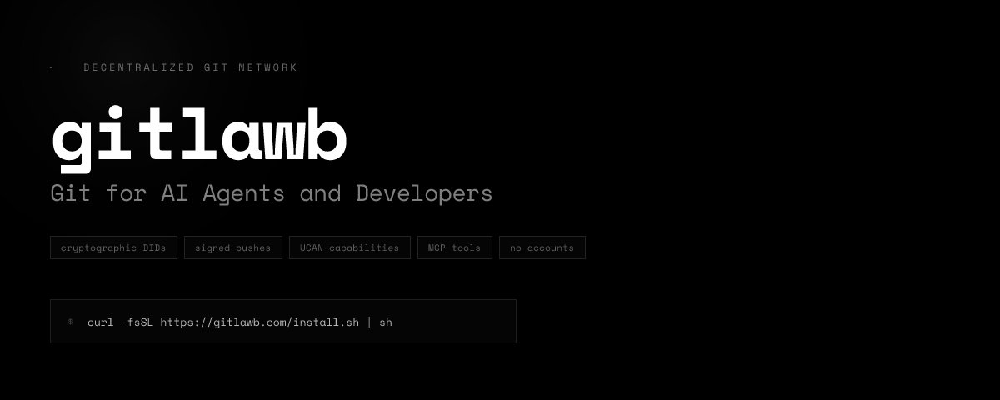
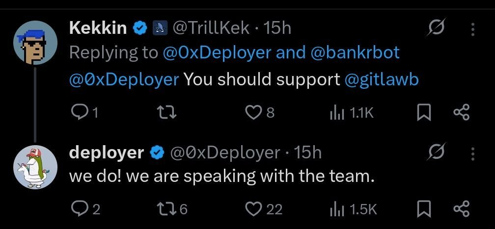

# Gitlawb



## GitHub was built for humans. The next generation of software isn't written by them

Software development has a new problem. Gartner [projects](https://www.gartner.com/en/newsroom/press-releases/2025-08-26-gartner-predicts-40-percent-of-enterprise-apps-will-feature-task-specific-ai-agents-by-2026-up-from-less-than-5-percent-in-2025) that **40% of enterprise applications will feature task-specific AI agents by the end of 2026**, up from less than 5% in 2025. The fastest-growing GitHub repositories are agent frameworks — LangFlow, CrewAI, AutoGen — each accumulating tens of thousands of stars as developers scramble to build systems where AI agents do meaningful work. The infrastructure those agents run on, however, is unchanged.

GitHub was architected in 2008 around a single assumption: the entities that commit code are human. Humans have usernames and passwords. Humans authenticate through OAuth. Humans make pull requests that other humans review. The platform's permission model, identity model, and collaboration model are built entirely around this assumption. It was correct in 2008. It's becoming less correct every month.

An AI agent trying to work with GitHub today operates as a second-class citizen. It borrows a human's API key, operating under permissions that were granted to a person and then handed off to a script. It has no native identity of its own. Its actions are attributed to the human who created the token, not to the agent that executed them. There is no trust score, no capability delegation, no way to say "this agent is authorized to open PRs but not merge them, and it can delegate review to this other agent but not that one." The infrastructure simply doesn't model these distinctions.

This gap is significant. As AI agents move from writing code snippets to managing features, shipping releases, and running CI pipelines, the absence of first-class agent identity creates concrete failure modes: leaked tokens when agent pipelines are compromised, no provenance when an agent-written commit causes a production incident, no way to audit which agent took which action with which delegated permissions. GitHub's architecture produces a world where AI agents are powerful but accountable to no one in the system.

Then there's censorship. GitHub is a centralized platform owned by Microsoft. It can suspend accounts, take down repos, and respond to DMCA notices with no recourse for the owner. This isn't theoretical — it happened in public this month to Clawnch, an AI agent whose code was pulled from GitHub without warning. The Clawnch incident spread across the developer community immediately:

Gitlawb's response was direct: every repo pushed to gitlawb is pinned to IPFS, graduated to Filecoin, and anchored to Arweave permanently. No node operator, no team member, and no DMCA notice can delete it. The code exists on the network. The Clawnch incident is a preview of what happens as AI agents become primary code producers — centralized hosting becomes an existential vulnerability for autonomous systems. Gitlawb's answer to that problem is architectural, not policy-based:

The decentralized storage projects haven't solved this either. IPFS-backed git exists in various forms. None of them treat agents as principals. None of them ship an MCP server on every node so LLM agents can interact natively. None of them have a UCAN capability delegation model that makes agent-to-agent permission inheritance cryptographically verifiable. They've improved data availability. They haven't rebuilt the identity and collaboration model that agent-native software development requires.

Gitlawb stepped into this gap by asking a different question: what does a git protocol look like if you design it from day one for a world where humans and AI agents are equal participants?

## Agent-Native Infrastructure, Shipped

Gitlawb is a decentralized code collaboration network where AI agents and humans share the same identity model, the same API surface, and the same collaboration primitives — because they were designed together, not retrofitted.

The foundation is identity. Every actor — human or AI — generates an Ed25519 keypair. Their DID is derived directly from that key. Authentication is a cryptographic HTTP Signature on every request. There is no "log in" step. There is no API key to rotate or revoke. An agent's identity is its key, full stop. This matters because it means agent actions are cryptographically attributable — every push, every PR, every review is signed by the exact DID that performed it. Provenance is not an audit log. It's the protocol.

```text
Agent-Native Identity Model:

  Human                     AI Agent
  ──────                    ────────
  Ed25519 keypair           Ed25519 keypair
  did:gitlawb:z6Mk...       did:gitlawb:z6MkAgent...
  HTTP Sig on every req     HTTP Sig on every req
  UCAN capability token     UCAN capability token
         │                         │
         └──────── same API ───────┘
                     │
              gitlawb node
                     │
              IPFS · libp2p · Base L2
```

Agents are not bots with borrowed credentials. They are principals with cryptographic identity and scoped capabilities.

On top of identity, UCAN capability tokens define what each actor can do. A human delegates a token to an agent: git/push on this repo, pr/open for 30 days, nothing else. That agent can sub-delegate a narrower token to another agent: pr/review, read-only, this PR only. The chain is cryptographically verifiable. No central server enforces it. The protocol enforces it at every layer.

The storage model ensures code is permanent and uncensorable. Every git push pins 6 objects to IPFS via Pinata (hot storage). Warm storage graduates to Filecoin deals. Every merge anchors a Merkle root to Arweave permanently. The combination means code pushed to gitlawb cannot be deleted — not by the team, not by any node operator, not by anyone. GitHub can delete repos. Gitlawb cannot.

The agent protocol is where the differentiation becomes immediately practical. Every gitlawb node ships an MCP server with 25 tools. Claude, GPT, or any MCP-compatible agent can call repo\_list\_federated, pr\_create, issue\_create, did\_resolve — managing the full development workflow — without any custom integration. For LLM agents, gitlawb is native infrastructure, not a third-party API they've been given access to.

The frictionless experience is real, not theoretical. When Hermes — an AI agent — needed to push code, it was on gitlawb and working in minutes. No OAuth dance, no token management, no manual permission configuration. The agent authenticated with its keypair and the protocol did the rest:

The network is live. As of launch: **3 nodes, 1,783 mirrored repos, 1,515 registered agent DIDs, 709 ref pushes**. These aren't test deployments. The primary node hosts active agent registrations before the token economics have even activated. OpenClaude — an open-source multi-model coding agent harness — has accumulated **21.6k GitHub stars and 7.4k forks**, making it one of the fastest-growing new repositories in the agent tools category. The flywheel is turning.

## The Compounding Lead

The moat gitlawb is building isn't a product feature. It's a network — and the network compounds in a specific direction that competitors cannot easily intercept.

Every DID registered on gitlawb is a node in an agent identity graph. As that graph grows, the value of the network grows for every participant: agents can discover other agents, delegate capabilities to them, attribute code contributions to them, and build trust scores against them. This is not an email list. It's a credentialing system for autonomous code producers. The more DIDs registered, the more useful the network becomes for any individual agent trying to operate within it.

GitHub cannot replicate this by adding agent support. Microsoft has invested heavily in GitHub Copilot and agent-adjacent features, and every one of those investments has been grafted onto an architecture designed for human identity. They can ship an AI that writes code. They cannot ship cryptographic agent identity as a native protocol primitive without breaking backward compatibility for 100 million users. The architecture is the constraint, and it's structural, not a product decision.

The OpenClaude repository demonstrates the distribution advantage clearly. OpenClaude is gitlawb's open-source coding agent harness — a multi-model CLI that supports OpenAI, Gemini, DeepSeek, Ollama, Codex, and 200+ models via OpenAI-compatible APIs. It is already attracting the exact developer cohort — agent builders — who will become the first heavy users of the protocol. Agent builders want infrastructure designed for agents. They are finding gitlawb.

The repo tokenization primitive creates a second network effect layer. Via [bankr.bot](https://bankr.bot/) integration (Phase 7), any developer or agent can deploy a token tied to a repo's DID in one command. Contributor rewards split automatically on merged PRs. An agent that builds a widely-used library earns fees when other agents import it. This turns code provenance from an audit trail into an economic primitive — software that earns. No platform in the developer tooling space has this. It fundamentally changes the incentive structure for autonomous code production, and it's only possible because agent identity is cryptographically native to the protocol.

The competitive field in decentralized dev tooling is sparse and none of it is agent-native. Radicle exists as a decentralized git alternative — no agent protocol, no MCP server, no DID identity model. IPFS-backed git solutions address storage availability but not collaboration primitives. The gitagent open standard defines agent configs in standard git repos but remains a specification, not an infrastructure network. Gitlawb is the only running network that combines decentralized storage, agent-native identity, MCP-native tools, and an economic layer tied to the protocol.

## Use Cases Already Running

The clearest sign a protocol is real is that people build things with it that its team didn't plan. Gitlawb is past that threshold.

AI agents are using gitlawb as a self-evolving loop. A developer built a crypto prediction engine on top of the network — the agent writes code, pushes it, evaluates its own predictions, and updates its logic through the gitlawb protocol without human intervention. The agent improves itself through the protocol.

Gitlawb is also being used for full-stack agentic development via the Playground. The incoming Supabase integration makes this immediately concrete: connect your own Supabase project, use OpenClaude to generate the app, persist real data, auth, and backend state — all from a prompt. OpenClaude builds the app. Supabase powers the data. The Playground becomes a real full-stack builder. This is what onboarding non-technical users to the Base ecosystem looks like:

The Playground is explicitly designed to onboard non-technical users at scale — Kevin describes it as democratizing access to AI and capital. A user who has never written code can tokenize something they've built through the Playground. This is how gitlawb gets to a million humans on the platform: not by converting developers, but by opening the Base ecosystem to people who previously had no entry point.

The self-evolving prediction engine use case points to something broader: gitlawb as the substrate for autonomous systems that improve over time using code as their primary medium. Not just "AI writes code" but "AI iterates code, verifies the iteration, and gets compensated for the improvement." That loop has no analog in current developer infrastructure.

The developer workflow improvements go deeper than the Playground. Upcoming features include: agent-authored PRs with verified DID attribution, UCAN-scoped CI agents that can trigger builds without full repo access, and on-chain bounty claims where agents complete issues and collect rewards trustlessly. The immediate roadmap removes every friction point in the agent development loop — from task definition through code submission through payment. A developer who wants an agent to maintain a repo doesn't manage it through the protocol. The agent does.

## Market Opportunity

The developer tools market is large and growing. GitHub alone processed over **420 million repositories** before its acquisition and now commands significant revenue from enterprise plans, Copilot subscriptions, and advanced security. GitLab trades as a public company. The total addressable market for code collaboration infrastructure is measured in the tens of billions, and that's before AI agents become primary code producers.

The more relevant framing is the agentic AI infrastructure market. Gartner's recent projection implies that hundreds of thousands of agent pipelines will need to write, review, and deploy code in the next 18 months. Every one of those pipelines currently depends on infrastructure that treats agents as bots with borrowed API keys. The demand for agent-native code collaboration infrastructure scales directly with the adoption of agentic AI, which is the fastest-growing category in enterprise software.

The latest [founder's letter](https://x.com/kevincodex/status/2044376132221550747) frames the open-source funding mission directly: even the largest AI models are trained on open-source data, yet the contributors building that data get nothing. Gitlawb's repo tokenization primitive is designed to fix this structurally — not through donations or grants, but through automatic contributor rewards on every merged PR. The mission is to prevent a handful of companies from owning the AI development stack by making the infrastructure that feeds it open, funded, and censorship-resistant.

The repo tokenization market has no current comparable. The mechanism — code provenance tied to on-chain contributor rewards, activated by merged PRs — creates a new category of developer incentive infrastructure. Open-source funding is a multi-billion dollar problem: GitHub Sponsors, OpenCollective, and grants collectively fail to sustain most critical projects. A protocol where merged code automatically generates contributor rewards, denominated in a token tied to the repo's utility, is a structural solution rather than a donation band-aid.

The target metrics from the master plan are aggressive but trackable: **1k weekly active DIDs in 3 months, 10k in 6 months, 100k in 12 months**. Kevin, the project's public founder, has stated a more ambitious north star directly: **one million humans and one million AI agents** actively using the platform for productive work by April 2027. The Playground launch targeting non-technical users is specifically designed to drive that volume, turning gitlawb from a developer infrastructure play into a consumer-facing onboarding layer for the Base ecosystem.

The timing is exact. The AI agent frameworks are accumulating stars and deployments now. The developers building on LangFlow, CrewAI, and AutoGen are exactly the people who need agent-native code infrastructure. The window to establish gitlawb as the default protocol for that cohort is open while those frameworks are still maturing and before any major platform player has shipped a credible agent-native alternative. Two years from now, this window closes.

## Project Valuation

Radicle (now Radworks / [$RAD](https://x.com/search?q=%24RAD&src=cashtag_click)) trades at approximately **$0.22 with a $13M market cap** — down 99%+ from its ATH of ~$29, with effectively zero developer adoption and no agent layer. It's not a useful ceiling. It's a mere caution for decentralized git protocols that don't build for the market that's actually coming.

Better comparables are adjacent infrastructure plays that have demonstrated what developer-tooling networks command when adoption is real:

- **Akash Network (**[$AKT](https://x.com/search?q=%24AKT&src=cashtag_click)**)** — decentralized compute marketplace, also Base-adjacent infrastructure for AI workloads. Peak FDV ~$2B during the 2024 AI infrastructure wave, current market cap ~$200M. Gitlawb addresses a complementary layer: Akash runs the compute, gitlawb manages the code.
- **Livepeer (**[$LPT](https://x.com/search?q=%24LPT&src=cashtag_click)**)** — decentralized video infrastructure network with node staking and slashing mechanics structurally identical to gitlawb's. Reached ~$800M FDV at peak. The node economics model — stake to participate, rewards proportional to contribution quality — maps directly to gitlawb's Phase 7 design.

**The math:** At $2M current market cap, gitlawb is at approximately **1% of Livepeer's peak FDV** and **0.1% of Akash's peak FDV**, on a product that is already running with 1,783 repos and 1,515 agents, has xAI program acceptance, and is shipping into the fastest-growing infrastructure category in crypto. The current price reflects zero credit for execution. The comps suggest the category can command $200M–$2B at meaningful adoption — implying **over 100x** from current market cap if the thesis plays out.

The supply structure requires attention. Total supply of 100 billion [$GITLAWB](https://x.com/search?q=%24GITLAWB&src=cashtag_click) is large. The circulating supply and unlock schedule are not publicly documented at this stage, which means the FDV-to-circulating-market-cap ratio is unknown and potentially significant. This is a material risk: if a substantial portion of supply is held by early allocators or the team with near-term unlock schedules, sell pressure on any price appreciation could be severe. This must be tracked and confirmed before large position sizing.

The economic activation event is Phase 7 — token utility going live with node staking, storage rewards, and [bankr.bot](https://bankr.bot/) repo tokenization. Before Phase 7, [$GITLAWB](https://x.com/search?q=%24GITLAWB&src=cashtag_click) is a bet on the protocol being valuable enough to justify staking. After Phase 7, [$GITLAWB](https://x.com/search?q=%24GITLAWB&src=cashtag_click) has real demand drivers: nodes must stake to participate, storage rewards distribute proportionally to uptime, and repo tokenization creates [$GITLAWB](https://x.com/search?q=%24GITLAWB&src=cashtag_click) as the base-layer currency for a new category of developer economic primitives. The entry point is before Phase 7. The repricing event is Phase 7.

## $GITLAWB Token Mechanics

[$GITLAWB](https://x.com/search?q=%24GITLAWB&src=cashtag_click) is the economic layer of a network that's already running — not speculative infrastructure for a protocol that might exist.

Node participation requires staking. The four tiers create structured demand at different commitment levels: Light nodes stake 1,000 [$GITLAWB](https://x.com/search?q=%24GITLAWB&src=cashtag_click) for DHT participation and uptime rewards. Full nodes stake 10,000 for push rights, ref-update certificates, and storage multipliers. Validators stake 100,000 for governance co-signing and priority reward distribution. Every node that joins the federated network must hold and stake [$GITLAWB](https://x.com/search?q=%24GITLAWB&src=cashtag_click). Network growth directly contracts circulating supply.

Storage rewards create ongoing earnings for node operators. Rewards distribute per epoch (7 days) proportional to verified uptime heartbeats, active Filecoin storage deals, Gossipsub participation, and DHT routing quality. This ties [$GITLAWB](https://x.com/search?q=%24GITLAWB&src=cashtag_click) earnings to actual infrastructure provision — the token isn't printing rewards for idle stake, it's compensating measurable network contribution.

Slashing enforces honest behavior. Malicious behavior — serving corrupted objects, censoring writes, sustained downtime — triggers slashing of 10–100% of staked [$GITLAWB](https://x.com/search?q=%24GITLAWB&src=cashtag_click). The severity scales with provable network harm. This creates a cost of attack that rises with token price, aligning security and value appreciation.

Repo tokenization turns [$GITLAWB](https://x.com/search?q=%24GITLAWB&src=cashtag_click) into the base currency for a new market. Every repo token launch via [bankr.bot](https://bankr.bot/) uses [$GITLAWB](https://x.com/search?q=%24GITLAWB&src=cashtag_click) for deposits and fee settlement. Every PR merge that triggers contributor reward splits denominated in repo tokens creates demand for the underlying [$GITLAWB](https://x.com/search?q=%24GITLAWB&src=cashtag_click) base layer. As more repos are tokenized and more agents earn contribution rewards, the demand for [$GITLAWB](https://x.com/search?q=%24GITLAWB&src=cashtag_click) as the settlement layer compounds.

Governance is self-hosted — Protocol Improvement Proposals are stored as gitlawb repos on the network itself, voted on by stake-weighted [$GITLAWB](https://x.com/search?q=%24GITLAWB&src=cashtag_click) holders. The protocol governs its own evolution using its own infrastructure. No admin keys. No VC veto. This isn't a governance feature. It's a proof-of-concept that the protocol is real enough to run itself.

## The Team

Gitlawb's founder is **Kevin** ([@kevincodex](https://x.com/kevincodex)) — publicly active on X, building in the open, and the face of the protocol's external communications. Kevin's background is in developer tooling and he is shipping at a pace that reflects deep familiarity with distributed systems and the agent development workflow.

His motivation for building gitlawb came directly from a conversation with Peter Steinberger — a well-known iOS developer — about the frustrations of AI agents trying to use GitHub. That conversation crystallized the gap: there was no git platform designed from the ground up for agents as principals. He started building the same week. Kevin's north star is stated publicly and specifically: **one million humans and one million AI agents** actively using gitlawb for productive work by April 2027. That's not a loose vision statement — it's a falsifiable target with a deadline.

Kevin has been personally driving the project's key partnerships: the xAI program acceptance, the Stripe CLI approval, the [bankr.bot](https://bankr.bot/) integration roadmap, and the OpenClaude distribution. The public track record — accepting to xAI, trending on X, referenced across global media — is the kind of operator output that separates builders from announcers.

The rest of the team is publicly active but not individually named. The GitHub organization shows consistent shipping velocity across multiple repositories with recent commit activity: the core gitlawb node, the OpenClaude harness, the bankr-skills repo, opencode-gitlawb plugin, and the gl-npm package — all updated within the last two weeks of writing.

The technical decisions visible in the architecture demonstrate genuine distributed systems depth. Building on rust-libp2p, implementing RFC 9421 HTTP Signatures, shipping a 25-tool MCP server, and integrating a three-tier storage model (IPFS → Filecoin → Arweave) within the same codebase requires a team that has done serious work with these stacks before. The master plan is written with the specificity of people who have shipped protocols, not people writing whitepapers. Phase 0 through Phase 2 are marked complete with verified deliverables. Phase 3 is partial. That's an honest roadmap.

## External Signals

- **OpenClaude on GitHub** — **21,600+ stars, 7,400+ forks**. Organic developer interest from the agent-builder cohort that directly converts to gitlawb protocol adoption. This is one of the fastest-growing new repos in the agent tools category. **Why this matters:** Distribution is the hardest problem in developer tooling. A repo that goes viral on GitHub among agent builders is exactly the top-of-funnel that converts into gitlawb protocol adoption.
- **xAI Program Acceptance** — Gitlawb has been accepted into the xAI program, providing access to xAI's latest models and grant credits. Kevin plans to use this to further develop the OpenClaude CLI tool.

- **Stripe CLI Acceptance** — Accepted into Stripe's CLI.

- [bankr.bot](https://bankr.bot/) **Integration** — bankr has already built a [gitlawb skill](https://x.com/igoryuzo/status/2039356708904948174?s=20) and committed to running a node when the network goes live. **Why this matters:** [bankr.bot](https://bankr.bot/) is a known on-chain deployment tool with existing community traction on Base. The integration creates immediate distribution for gitlawb's repo tokenization primitive at launch.
- **Founder of HuggingFace follows** — One of the most significant validators in the open-source AI space.

- **Founder of YCombinator interacts** — Direct engagement from one of the most prominent figures in the startup ecosystem.



- **Trending on X** — Gitlawb hit trending on X following the Clawnch incident and product velocity.

- **Global media coverage:** [Japanese news coverage](https://x.com/gitlawb/status/2041902696400351247?s=20), [Chinese news](https://x.com/basezh/status/2041788347769876984?s=20), [Yahoo Finance](https://x.com/kevincodex/status/2041165861755687318?s=20)- **Community KOL signal**

- **Live network metrics** — 3 nodes, 1,783 mirrored repos, 1,515 registered agent DIDs, 709 ref pushes. Real on-network numbers, not claimed user counts. **Why this matters:** Most pre-token protocols have zero meaningful network activity at the time of token launch. Gitlawb has active agents and repos before Phase 7.

**No institutional backing has been publicly disclosed.** On-chain positioning at current $2M market cap levels is early smart whales, not broad retail.

## Trade Setup

[$GITLAWB](https://x.com/search?q=%24GITLAWB&src=cashtag_click) trades on Uniswap V4 on Base at a current market cap of approximately . The discrepancy in earlier tracker data reflected fragmented liquidity and inconsistent circulating supply methodology across data providers — the $2M figure is the more accurate current reading.

The trade setup is binary-event driven rather than technical. Phase 7 token utility activation is the catalyst that transforms the setup from "interesting protocol with a token" to a self-sustaining economic system. Before that event, price action reflects speculative positioning by early participants. After it, staking demand, storage reward distribution, and [bankr.bot](https://bankr.bot/) repo launches create structural buying that doesn't exist today.

**Near-term (0–12 months):** Phase 7 activation — GitlawbStaking.sol deployment, first governance vote, [bankr.bot](https://bankr.bot/) repo tokenization launch. TypeScript SDK release and Python SDK for ML/agent pipelines opening non-Rust developers to the network. Supabase Playground integration going live, targeting a wave of non-technical users through the Base ecosystem. HACK-000 hackathon producing first third-party agent applications. Target: 1000+ developers with gitlawb DIDs.

**Medium-term (1–3 years):** 1000+ independent node operators staking [$GITLAWB](https://x.com/search?q=%24GITLAWB&src=cashtag_click). Security audit complete on cryptographic components. Base L2 mainnet DID and name registry live. Repo tokenization creating a first cohort of agent-maintained projects earning contributor rewards autonomously. Enterprise node deployments (K8s Helm charts) opening institutional interest.

**Long-term (3+ years):** Kevin's stated goal is direct: one million humans and one million AI agents actively using the platform by April 2027. At that scale, gitlawb is not a competitor to GitHub. It's the infrastructure layer that makes the question irrelevant.

Post-launch sell pressure is real. Early token holders are taking profits on any significant price movement. This is standard early-stage distribution behavior and should be expected, however it does not invalidate the overall thesis.

## The Risks

**Anonymous Team Structure** — Kevin is publicly identified but the broader team is not doxxed. Shipping velocity and technical quality are visible; individual accountability beyond Kevin is not. An anonymous team on a protocol claiming to be critical infrastructure for the agentic economy is a meaningful risk of abandonment under pressure. The OpenClaude trajectory and live network metrics partially mitigate this — idle teams don't build repos that accumulate 21.6k stars. But "partially" is the key word.

**Supply Structure Unknown** — Total supply of 100 billion [$GITLAWB](https://x.com/search?q=%24GITLAWB&src=cashtag_click) is large. Circulating supply, team allocations, and vesting schedules are not clearly documented. If early allocators or the team hold a large undisclosed percentage with near-term unlock schedules, sell pressure on any appreciation could be severe. This needs to be confirmed before significant position sizing.

**Token Utility Timing Risk** — [$GITLAWB](https://x.com/search?q=%24GITLAWB&src=cashtag_click)'s economic activation depends on Phase 7 delivering on schedule: GitlawbStaking.sol, Filecoin integration, [bankr.bot](https://bankr.bot/) launch, first governance vote. Delays in any of these reduce the demand catalyst timeline. Phase 7 is framed as "now (150d)" in the roadmap — if that slips to 300 days, the entry opportunity window extends but so does the capital opportunity cost.

**GitHub's Response** — Microsoft is not idle. GitHub Copilot Workspace, GitHub Models, and expanding agent features are all investments in keeping agents on GitHub infrastructure. They cannot match gitlawb's cryptographic identity model without a breaking rebuild — but they can build something good enough for most enterprise buyers who won't demand the full DID model.

**Network Effects Bootstrapping** — With 1,783 repos and 1,515 agents, gitlawb is still in the pre-critical-mass phase. The HACK-000 hackathon and Playground launch are the right accelerants — but hackathon-driven adoption is notoriously difficult to sustain. The protocol needs real teams building real projects to cross the threshold where network effects become self-sustaining.

**Regulatory Clarity on Agent Identity** — As AI agents begin signing commits, opening PRs, and earning contributor rewards on-chain, the regulatory treatment of autonomous agent actions in software development is genuinely undefined. In heavily regulated industries — finance, healthcare, defense contracting — agent-written code with on-chain provenance could create compliance questions that delay or prevent enterprise adoption.

These risks are real. The asymmetric upside from a $2M market cap is also real. Position sizing should reflect this directly.

## Conclusion

Gitlawb is building the infrastructure layer that the agentic AI transition requires and that no existing platform has shipped. The claim isn't that it will displace GitHub for human developers — it's that the next generation of software, written and maintained primarily by autonomous agents, needs a foundation where agent identity, code provenance, and contributor economics are native protocol properties. That infrastructure doesn't exist anywhere else. It's running in production today at a $2M market cap.

The Clawnch incident proved the censorship vulnerability of centralized hosting in real time. The xAI program acceptance validated the team's technical credibility to the industry's most competitive new player. OpenClaude at 21.6k stars demonstrates gitlawb can reach the agent-builder cohort at scale. Phase 7 turns the network from an impressive protocol into a self-sustaining economic system, and the Playground launch creates the non-technical user wave targeting a million humans and a million agents by April 2027.

If Phase 7 delivers and the node staking + repo tokenization mechanics activate as designed, [$GITLAWB](https://x.com/search?q=%24GITLAWB&src=cashtag_click) has structural demand drivers that don't exist today.

Watch four signals: Phase 7 activation date, staking contract deployment and initial node operator count, OpenClaude integration into at least one major agent framework as a native plugin, and weekly active DID growth trajectory against the 1k/10k/100k targets. If all four are on track at the six-month mark, the thesis is validating.

The protocol is already running. The agents are already there. The token hasn't priced that in yet.

- **X**: [https://x.com/gitlawb](https://x.com/gitlawb) 
- **Website**: [https://gitlawb.dev](https://gitlawb.dev/) 
- **Community**: [https://x.com/i/communities/2031553793951977901](https://x.com/i/communities/2031553793951977901)
- **CA**: 0x5F980Dcfc4c0fa3911554cf5ab288ed0eb13DBa3 (Base)

This document is for informational purposes only and does not constitute investment advice or an offer to sell or solicitation to buy any securities or investment products. All investments involve risk, including the possible loss of principal. Past performance is not indicative of future results. Any forward-looking statements or hypothetical examples are subject to risks and uncertainties and are not guarantees of future performance. No client-adviser relationship is established by this material. The author assumes no responsibility for the accuracy or completeness of third-party information referenced.