# Joe

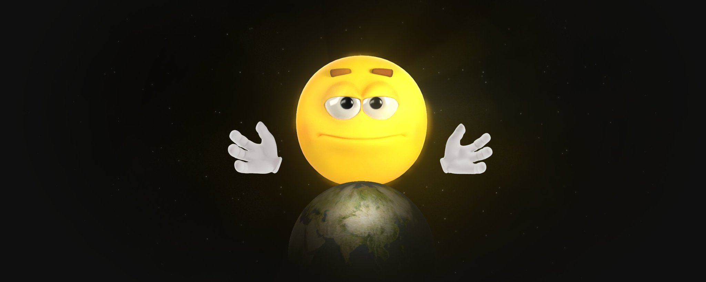

# The Communication Shift

The last ten years changed how we talk. We went from text to visual-first — emojis, GIFs, memes carry the emotional weight now. This wasn't gradual. It happened fast because of how platforms work.

A few things drove this. Platforms optimized for engagement, not nuance. Algorithms reward emotional reactions over thoughtful discourse. Digital communication got so fast that complex feelings needed instant expressions. People adapted with graphic shortcuts, frustration, excitement, skepticism, joy, all in one image.

Emojis became the new alphabet. They're embedded in every phone keyboard, used across all demographics, and transcend language barriers.

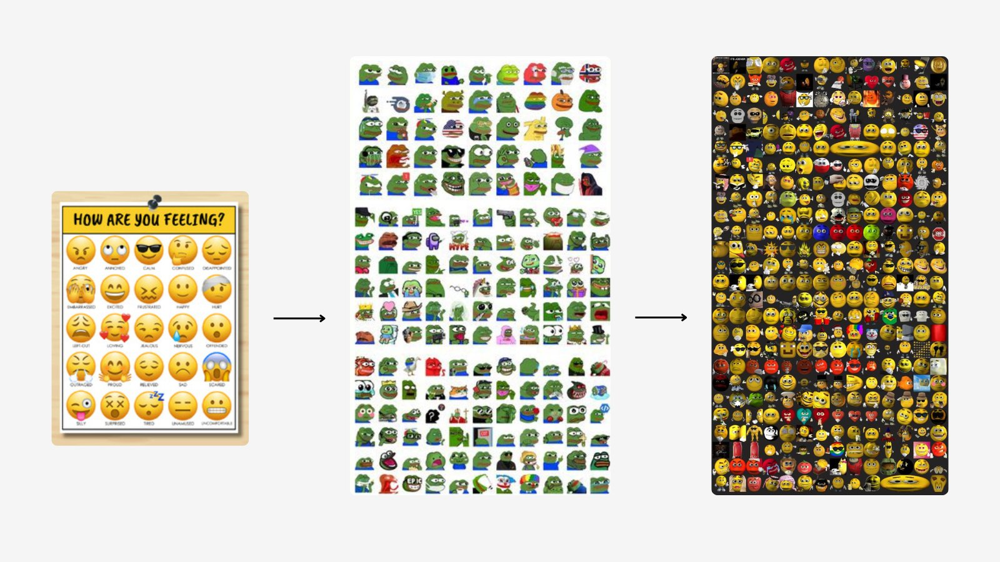

But static emojis have limitations — they're fixed expressions. This is where animated characters and GIFs filled the gap, offering movement and context that emojis alone couldn't provide.

Memes evolved with this shift. They can express political frustration, workplace absurdity, relationship drama, etc., better than paragraphs of text. When you send a meme, you're not just sharing content. You're signaling you get it.

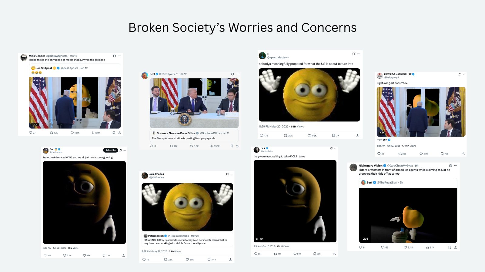

This communication format works because it is efficient and universally readable. Memes don't require reading comprehension. They bypass translation. They communicate mood and purpose in a split second. In certain scenarios, they can be used as statements to let users say what they can't or won't say with words.

# The Challenge of Identity and Genuineness

This didn't come out of nowhere. It happened during a period of massive societal stress and social confusion.

We're living through widespread identity, emotional, and spiritual crises. Traditional institutions that once provided significance have eroded. Economic uncertainty has created existential anxiety. The constant stream of global crises, wars, and pandemics leaves users feeling powerless and disconnected. The rise of AI technology threatens human creativity and raises questions about realness in an increasingly synthetic world.

Brands face their own authenticity struggle. Consumers can sense manufactured posts. The endless flood of AI-generated mediocrity has made everyone crave genuine connection and original expression. There's a growing hunger for things that sense real, handmade, and human.

It's weird: we're more connected than ever, yet more isolated. More ways to express ourselves, but voices seem like they matter less. Drowning in posts, starving for meaning.

Into this environment stepped a new form of social expression that addressed both needs: content that seems instantly familiar yet allows for endless personalization, characters that look simple but carry deep emotional resonance, material that can be shared universally but feels personally meaningful.

Identity crisis pushes people toward societal touchstones that help them belong. Authenticity crisis pushes them toward material that seems genuine and unpolished. So folks shifted into picture-based communication that hits both those notes.

# When the Frog Got Old, the Yellow Man Stepped In

Classic memes age out. Not in concept, in practice.

DOGE had its Elon era. PEPE had Matt Furie's involvement. SHIB had Vitalik's interest. What all of them share is that their cultural peak came months, sometimes years, before the coins launched, and that the meme itself stopped evolving once the token took over. Nobody creates new DOGE memes with creative ambition. Nobody ships AAA content for PEPE. The communities post, the prices move, and the characters sit frozen in time.

EmotiGuy, the 3D yellow man, has been doing the opposite.

Created by Daz3D in 2005 as a free 3D model, it has accumulated two decades of internet history without ever going stale. He was Picardía on Argentinian forums in 2014, the typing meme in 2021, Yellow Emoji In Darkness in 2023, and countless other variations that have resonated across different cultures and communities.

Each era of the internet found a new reason to use him. Each generation discovered him fresh.

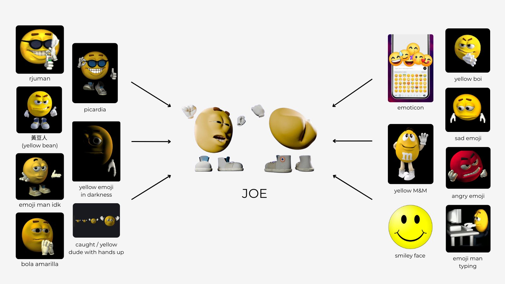

The Variations That Built a Global Following:

- Picardía, popular in Spanish-speaking communities
- Rjuman, featured on Steam Points Shop
- 黃豆人 (Yellow Bean), Popular in Chinese communities
- Emoji Man / Emoticon, On every keyboard, instantly recognizable
- Bola Amarilla, Popular in Hispanic communities
- Yellow Emoji in Darkness, Popular on X for ironic reactions
- Caught / Yellow Dude with Hands Up, Popular on Twitch
- Typing Meme / Yellow M&M Typing, Used for sarcastic or excited responses
- Smiley Face / Yellow M&M, Everyone eats M&M, everyone knows the smiley face
- Yellow Boi, Various modern iterations
- Sad Emoji / Angry Emoji, Full emotional vocabulary
- Booty Shake / Twisting, the 2024-2025 viral sensation that broke through

This character was nicknamed Joe in a Discord server called JOE HUB in 2020, where renders, animations and GIFs spread en masse. But new animated Joe content since 2023 can mainly be attributed to the 3D animator [@joes\_intern](https://x.com/@joes_intern). His most recent viral success, the GIF of Joe shaking his rear-end, was created in 2024, went particularly viral on X in late 2025, and inspired use across Instagram, TikTok, and countless other platforms.

And then in August 2025, something unprecedented happened: Daz Productions sold the full intellectual property of the EmotiGuy character to the JOE Coin community, marking the first time a crypto project has acquired complete rights to a meme of this vintage and scale.

That's what [$JOE](https://x.com/search?q=%24JOE&src=cashtag_click) became.

# The Content Machine That Nobody Else Has Built

Most crypto projects treat content as marketing. JOE treats it as the product.

Here's the difference. Marketing drives awareness of something else. Stop getting views, stop making it. Product-first compounds, each piece builds reach, embeds the character deeper, generates cultural artifacts that live past upload date.

JOE runs an in-house content studio that creates and uploads 3D animations continuously to Giphy, Tenor, IG, and across X. This isn't posting static images and hoping for attention. This is building a content catalog.

The team runs campaigns like a real brand, not a coin. Both Christmas and New Year mini-campaigns were extremely successful because they were fun and contextual to what was happening in the world. People were looking for fresh and cool videos to share during the holidays, and they received JOE right into their DMs or saw his yellow face in one of the stories. The official IG page gained over 30M views and over 70k subscribers during that short period.

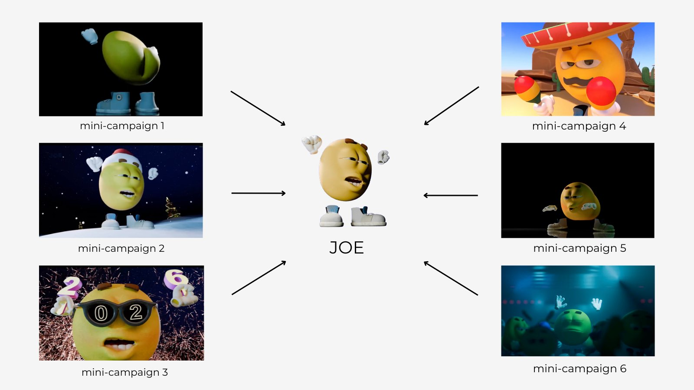

The most famous pieces, Joe shaking his rear end, the typing GIF, were created by [@joes\_intern](https://x.com/@joes_intern) and sat mostly dormant. Then they erupted: the original post by [@GiFShitposting](https://x.com/@GiFShitposting) pulled 14.6 million views and 50,000 likes in nine days.

The [@NoLiquidity77](https://x.com/@NoLiquidity77) typing GIF followed with 5 million views in 48 hours, used purely as an exploitable, no caption, just the character typing furiously, inviting thousands of users to write their own punchlines in the quote replies.

None of this needed marketing or celebrities. The content existed. People found it, felt it, and sent it to someone they loved.

That flywheel has not stopped. By January 2026, individual posts from secondary JOE accounts were clearing [1.8 million views](https://x.com/joeshitposts/status/2006150401091846455?s=20) in a single drop. A [3.5 million](https://x.com/joeshitposts/status/2010046804482789537?s=20) views post days later. A [6.9M](https://x.com/joeshitposts/status/2010421154964795702?s=20) views clip the day after that. Non-crypto accounts (meme aggregators, lifestyle creators, ordinary people) started picking them up without knowing or caring about the token.

```text
Content creation model comparison:

Classic meme (Pepe/Doge):
  Character → Coin launch → Community posts stagnant GIFs
  No studio. No iteration. Cultural peak: pre-coin.

JOE model:
  Character (2005) → IP acquisition (2025) → In-house studio →
  Weekly original 3D content → GIF platform seeding →
  Organic virality → Character grows → Loop repeats
```

[The official Joe Giphy account](https://giphy.com/thejoecoin) is about to pass 300 million views. Another [GIF](https://giphy.com/gifs/hi-emoji-xdd-NHglY9vAmvM2GEsblP) on that platform generated over 378M views. [Joe's Intern Tenor account](https://tenor.com/users/joes_intern) just crossed 200M views, and his [IG account](https://www.instagram.com/meza3d) casually gets 500k-20M views per post. [Joe's Tiktok account](https://www.tiktok.com/@joecoinofficial) pocketed around 9M views. The [Joe Instagram account](https://www.instagram.com/joecoineth) reached 189,000 followers and over 234 million views before a compliance review caused a temporary access disruption. The team has over 300,000 followers across all official accounts combined.

Not to mention, JOE is widely used across top Twitch channel chats and has multiple GIFs featured in TikToks 'trending' category for the last few months, which is something that even the biggest brands with unlimited budgets weren't able to achieve thus far.

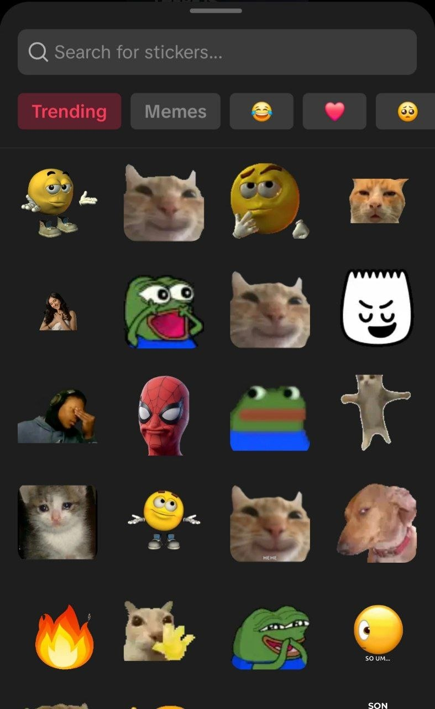

Nobody in this sector is doing this. Pengu has a working GIF system, that's the only other project with anything close to a proper animated content layer. Every other memecoin posts static images and hopes for attention. JOE builds a content catalog.

## The Flywheel of Free Cult Labor

The unstoppable part? Thousands of accounts, crypto and normie alike, share JOE memes for free. That's free cult labor, exactly what Murad talks about.

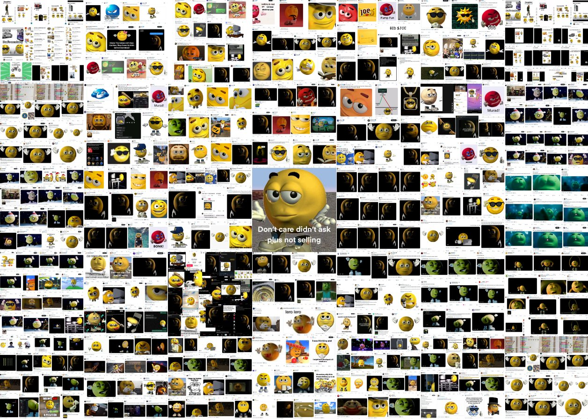

Even if the core team stopped creating content tomorrow, there are already thousands of accounts posting Joe memes as we speak. The team keeps momentum going and accelerates creative output, but the engine doesn't depend on them alone.

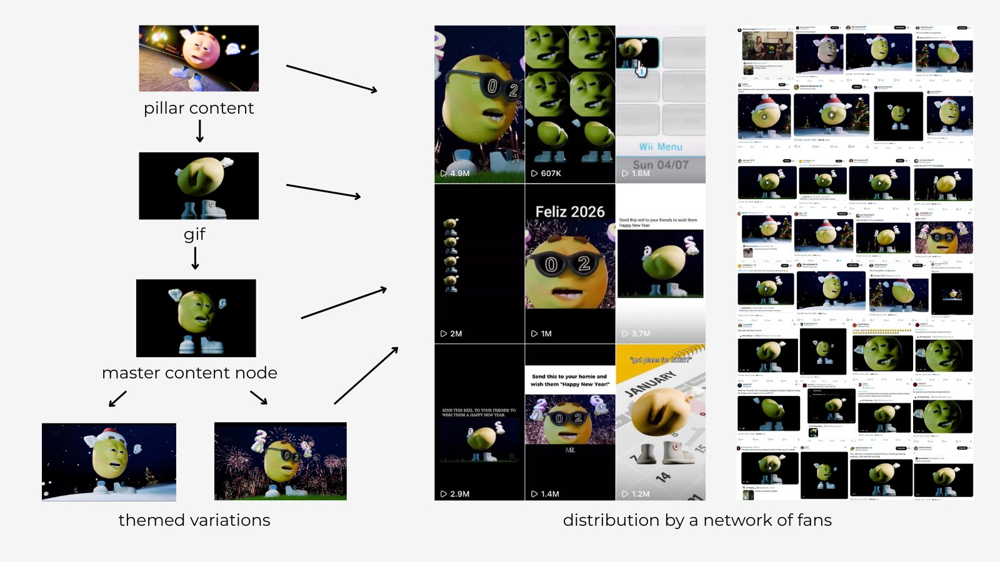

This is the flywheel: every breakthrough moment compounds and generates a new set of fans and strengthens the existing fanbase. 2023-2024 had a few moments a year. End of 2025-2026 has at least one breakthrough moment a month. The attention is going parabolic.

This strategy has produced outstanding results, leading to multiple Joe-related trending posts on X:

- [https://x.com/i/trending/2010140816266953135](https://x.com/i/trending/2010140816266953135)
- [https://x.com/i/trending/2010140816266953135](https://x.com/i/trending/2010140816266953135)

# A New Category That Has No Name Yet

Standard competitive analysis breaks down here.

JOE isn't a memecoin competing with PEPE for betting flows. It isn't a brand competing with Pudgy Penguins for collector loyalty. It sits between those categories and above them, a character brand built on top of a meme that already has two decades of organic reach.

That category doesn't exist in the current taxonomy.

Classic memes (Doge, Pepe, Shib) derive their value from cultural inertia and betting cycles. Their characters are static. Their communities generate content but have no central direction, no IP ownership, no studio. They can go up enormously on the right catalyst, but they cannot compound value through new creative output.

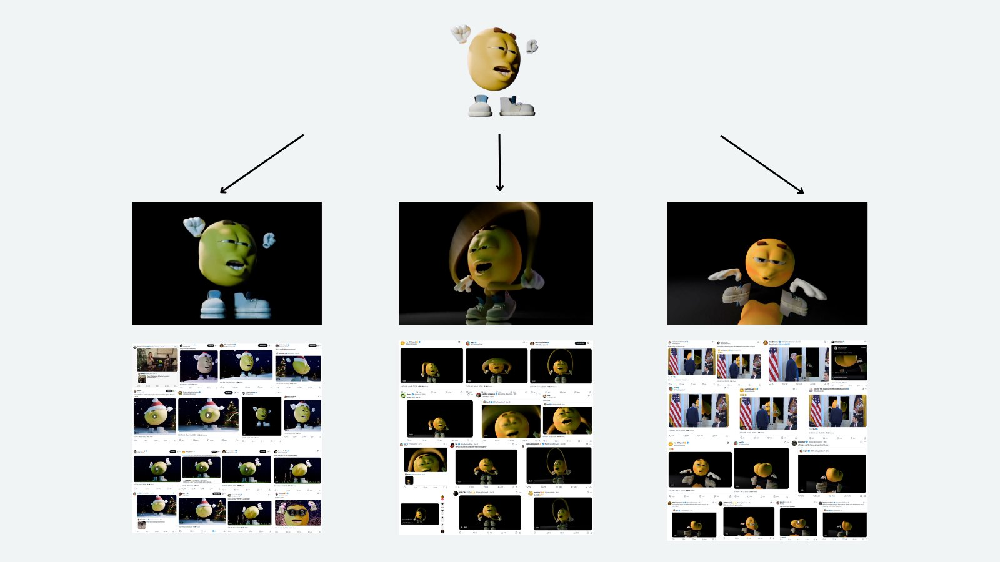

Brand-first crypto projects like Pengu derive their value from art direction, community building, and holder identity. They have strong aesthetics and coherent worlds. Pudgy Penguins had a massive Web2 fanbase from Instagram and their GIF empire before crypto, with families as their primary audience. Pengu owns their IP and will not affect JOE in any form.

JOE has both. 20 years of cultural penetration. Full IP control, creative team, and content system designed to deepen that reach. It functions like a media property more than a memecoin, with token liquidity access.

The comparison set outside crypto is more instructive: M&M's without the chocolate, SpongeBob without Nickelodeon, the smiley face without the Unicode Consortium telling you how to display it. JOE is the yellow man who already lives in your phone keyboard.

# Content Distribution Always Wins

Attention has become the most valuable resource online. Every company, creator, and project is competing for the same limited supply of human attention. Most fail because they focus on getting attention before having something worth paying attention to.

The winners do it backwards. Build something great first, then figure out distribution. This is harder than it sounds because distribution, getting content seen by the right people at the right time, is usually the most expensive part of growth.

Traditional brands solve this with dedicated distribution teams: users who create variations of content, manage multiple accounts across platforms, track what performs, and optimize constantly. It costs money, takes time, and requires sophisticated operations.

JOE built something different by combining centralized content creation with decentralized distribution.

The team runs an in-house studio producing original animations, GIFs, and videos consistently. This creates "pillar content", foundational pieces others can remix, adapt, share. When one resonates, it becomes a template spawning countless variations across the internet.

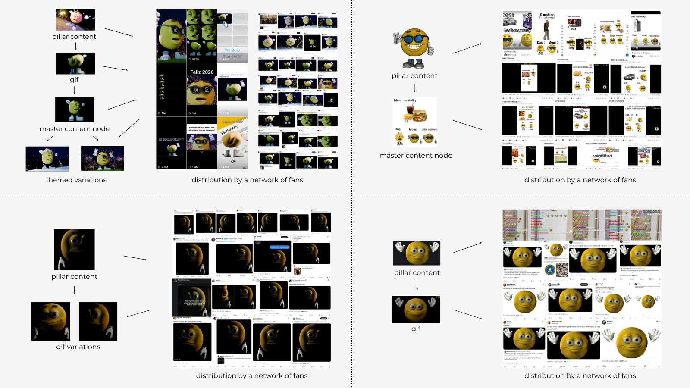

This happens because the character already has 20 years of cultural momentum. People were already creating and sharing EmotiGuy content long before the token existed. The project didn't have to build an audience from scratch or create distribution networks, they inherited both.

The distribution strategy works like this: the team ships AAA animations in high quantity. Their fans across multiple platforms decide which ones they like the most, pick them up, and adapt them to their audiences. Each successful piece reinforces the algorithm's preference for JOE content, and the cycle repeats with higher baseline attention each time.

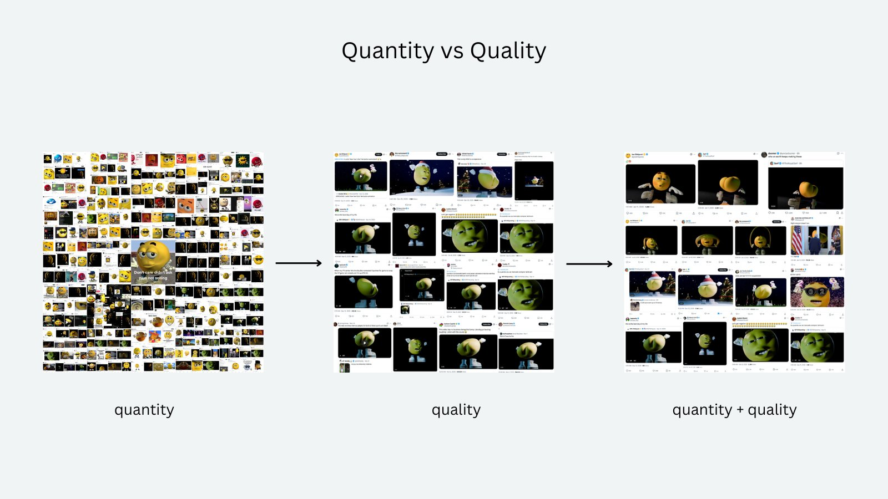

Why does this work? No constant paid promotion needed. The content drives itself. Folks want to share it. They create custom videos and trends because the character resonates and gets impressions, not because they got paid. This creates a self-reinforcing loop: better content → more organic sharing → more data on what works → even better content across any platform, any language, any social group, any subculture.

# What the Distribution Numbers Actually Show

The reach data is not marketing material. It is the thesis.

Between October 2025 and April 2026, accounts with no relationship to the project repeatedly used JOE content as the raw material for their own posts. A March 2026 video posted by [@\_Gottalovezik](https://x.com/@_Gottalovezik) [hit 10 million views](https://x.com/_Gottalovezik/status/2032473195765170659?s=20). A January 2026 post by [@miyarah](https://x.com/@miyarah) [cleared 6.86 million](https://x.com/miyarah_/status/2015898536806597080?s=20). A post by [@kirawontmiss](https://x.com/@kirawontmiss) [drew 3.13 million](https://x.com/kirawontmiss/status/2016182379514040567?s=20). [@rareblurs](https://x.com/@rareblurs) account [crossed 3.1 million](https://x.com/rareblurs/status/2030034334858502220?s=20) with a JOE post.

These aren't crypto accounts discovering the token. These are mainstream internet users who found the GIF or video, used it to express something, and drove tens of millions of impressions without a dollar of marketing spend behind them.

The JOE Instagram page, during its active window, demonstrated that 1M+ views had become a floor on new posts. Not a ceiling, a minimum. A single post [hit 24 million](https://x.com/wellconnctd/status/2021395625108176922?s=20). Another [hit 10.2 million](https://x.com/Vitamul/status/2038547842193637383?s=20). A documented [12 consecutive weeks](https://x.com/CryptoKvon/status/2029579086700663211?s=20) of weekly viral content. Twelve consecutive weeks.

The content is working in markets where JOE has no crypto presence at all. Chinese accounts, Brazilian meme pages, Filipino viral threads. The character is culturally borderless in a way that Doge, Pepe, and Pengu simply are not.

# Market Position

Market cap: $11.11M FDV: $11.11M FDV/market cap ratio: 1.0, fully diluted, no overhang CMC rank: #949 | CoinGecko rank: #1,166 24h volume: $118k Exchanges: Uniswap, Ourbit Chain: Ethereum Supply: 1,000,000,000, total and circulating are identical

The fully diluted valuation = the market cap. There are no locked tokens, no cliff unlocks, no team vesting overhang waiting to compress the price. What you see is what exists.

For a character with over 900 million GIF views, 234 million Instagram views, and full IP ownership of the most widely recognized emoji-adjacent meme on the internet, $11.11M is a disconnection that requires explanation.

The explanation is that the ETH space has been dormant. Altcoin volume on Ethereum has been thin for months. But April 2026 is showing early signs of reversal, BTC dominance at 60%, ETH dominance recovering, and high-quality ETH launches beginning to draw capital back to the chain. JOE launched on Ethereum in October 2023 and has never had a proper ETH bull cycle to trade in.

That window is opening.

# Tokenomics

Supply is fixed at 1 billion with no additional issuance, no minting, no emissions. The FDV/market cap ratio is 1:1. There are no unlock events, no institutional allocations vesting, no treasury cliffs on the horizon. This removes the most common source of structural sell pressure in early-stage tokens.

For accumulation purposes, this is clean. You are buying the float, and the float is the whole supply. No hidden sellers waiting for their lockup to expire.

**Liquidity Advantage**

Despite the small market cap, JOE has a very thick liquidity pool to market cap ratio ($1.6M liquidity / $11.11M mcap). This means whales can size in with substantial positions without material slippage.

# The Community and the Team

[@Vitamul](https://x.com/@Vitamul) is the founder. The core creative contributors include [@joesintern](https://x.com/@joesintern) (primary animator), [@Adoniverse](https://x.com/@Adoniverse) (animator), [@joehub](https://x.com/@joehub), [@ninaartxx](https://x.com/@ninaartxx), [@Titiusmaximus](https://x.com/@Titiusmaximus), [@Dipbandit](https://x.com/@Dipbandit), [@dzech\_](https://x.com/@dzech_), neso, [@jcglza](https://x.com/@jcglza), and others. The team has been shipping continuously since the 2023 launch without a public funding round, without VC backing, and without any institutional support.

What they built instead: a [Giphy catalog](https://giphy.com/thejoecoin) with hundreds of GIFs, a community [PFP generator](https://pfp.thejoecoin.com/), a [3D maker tool](https://joecoin.meme/joe.html), an [AR filter for TikTok](https://x.com/OGChia/status/1978177782103282083), a meme hub at [joecoin.meme](https://joecoin.meme/), and a content operation that produced weekly viral posts. The upcoming [merch drop](https://x.com/Vitamul/status/2037676586095255819?s=20) is the first step toward monetization outside the token.

# External Signals

**Moonshot Listing.** JOE added to Moonshot, MoonPay's retail-facing token discovery surface, expanding access beyond DEX-native buyers.

**Brand Engagements.** Multiple traditional brands have used JOE content organically, representing major consumer companies publicly engaging with the character: Chipotle, TeamSpeak, Opera GX, Expefutbol, Levelsio, San Mario Fan Account, etc.

**Notable Figures and Influencers.** High-profile individuals have used JOE content without coordination. Some of the accounts are followed by Elon Musk, which is significant because Elon is the main driver behind all memes:

- David Sacks
- Patrick Casey
- Traderpow
- Autism Capital
- Serf
- Whotfismick

**Platform Recognition.**

- CoinMarketCap featured JOE indirectly.
- Binance's intern account used JOE content
- Know Your Meme, the canonical archive of internet culture, now has a full EmotiGuy entry following the virality expansion.

**Media Coverage.**

- AP News mentioned JOE. \[[source](https://apnews.com/press-release/marketersmedia/joe-coin-joe-makes-meme-coin-history-with-acquisition-of-iconic-20-year-old-emotiguy-ip-b26037657a132474d3bacad47b4b4575)\]

# Trade Setup

```text
Current Phase:   Reaccumulation, holders positioned since 2023
Price:           $0.0508
Market Cap:      $11.11M
ATH:             Not available in source data
24h:             +2.1% | 7d: +11.5%
Volume:          $118k (-28.2% 24h)
Sentiment:       31 (Fear) | 7d avg: 33.9
BTC Dominance:   60.02%
ETH Dominance:   10.77%
USDT Dominance:  7.30%
Exchanges:       Uniswap, Ourbit
Holders:         9,479
```

At a $11.11M market cap, JOE sits in the reaccumulation band where smart money typically positions ahead of any public narrative, well before the character's reach translates into on-chain price discovery. Some holders have been holding JOE since 2023. The Fear index at 39 reflects the broader macro environment, not any JOE-particular weakness. Markets that look grim in fear conditions historically produce the most durable entries for high-quality assets with strong fundamentals.

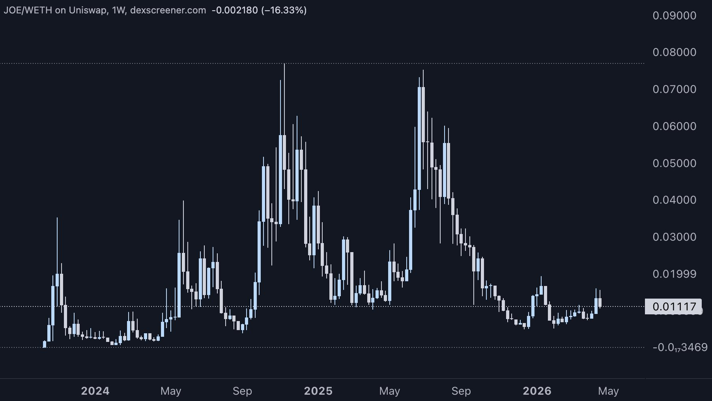

The 7-day return of +11.5% against a 24-hour decline suggests consolidation rather than deterioration. Volume has pulled back, which in this setup is a quiet signal — size when it's quiet, take profits when it's loud.

## Macroeconomic / Meme Context

JOE is a pure ETH-meme token. In strong meme seasons, coins like PEPE/DOGE blow through [$1B+](https://x.com/search?q=%241B%2B&src=cashtag_click) caps from tiny bases, so [$1B+](https://x.com/search?q=%241B%2B&src=cashtag_click) is possible for JOE — but it would require substantial liquidity inflows to the ETH chain, which are slowly coming.

## Historical Narrative Regimes

JOE has experienced several distinct narrative cycles since launching in October 2023:

**Late 2023 Run.** The first wave of the Memecoin Supercycle Driven by strong liquidity inflows into crypto, ETH strength, and a high demand for new narratives. Pullback occurred due to abandonment by the original creator, and capital movement into Bonk coin and Solana chain.

**April 2024 Run.** General ETH-meme momentum Driven by the broad ETH-meme rotation and meme-season flows. Topped when rotation cooled and capital rotated elsewhere.

**September 2024.** SPX6900 spillover SPX6900 (SPX) grabbed attention on Ethereum, creating a meme-sector rally. Traders who rode SPX naturally rotated into other ETH memes, including JOE. Pullback came as the meme-sector narrative faded and flows rotated again.

**July 2025.** IMF-driven rally IMF ([@IMFCrypto](https://x.com/@IMFCrypto)) was one of the key drivers for that particular rally. At some point, the IMF was the top holder of JOE, giving the price a perceived structural floor. This time JOE topped when the IMF announced diversification into other verticals and coins besides PEPE, MOG, JOE. Eventually, IMF became the primary reason for JOE to experience a cascade of liquidations on its platform, which occurred later in Sep 2025.

## Scenario Analysis

```text
| Scenario | Assumptions                                                                            | Target FDV  | Multiple from Current |
| -------- | -------------------------------------------------------------------------------------- | ----------- | --------------------- |
| Bear     | ETH cycle delays, Instagram never reinstated, content slows                            | $5M–$8M     | ~0.5x–0.7x            |
| Base     | ETH altcoin season develops, Instagram restored, 1–2 major brand collabs               | $50M–$150M  | ~4x–13x               |
| Bull     | Cycle peak, major KOL or celebrity uses JOE, mainstream brand licensing deal(s) closed | $300M–$700M | ~27x–62x              |
```

## Catalysts

**Instagram Restoration.** The account at 189,000 followers with a documented floor of 1M+ views per post is a traffic channel currently closed due to a compliance review that has not yet been resolved. When it reopens, the content machine resumes at full capacity with an existing audience.

**Merch Launch.** Establishes JOE as a physical brand — the first monetization layer outside the token.

**ETH Altcoin and Memecoin Rotation.** Macro-driven but already showing early signals. Fresh ETH-native launches are drawing attention back to the chain. JOE, as one of the few Ethereum memecoins with real off-chain traction, is positioned to benefit disproportionately when rotation begins.

**Traditional Brand Collaboration**. Multiple brands have already engaged with JOE content organically. A formal deal with any major consumer brand(s) would be the clearest signal that the IP acquisition is being monetized as intended.

**Tier-1 Exchange Listing.** Currently trading only on Uniswap and Ourbit. Any major exchange listing opens the token to significantly wider buyer pools.

## Sentiment and Market Position

The Fear index at 33–39 on a 7-day average is almost perfectly calibrated as an entry condition. Retail is not paying attention. The accounts driving JOE's views ([@\_Gottalovezik](https://x.com/@_Gottalovezik), [@miyarah](https://x.com/@miyarah), meme aggregators across multiple languages, have no idea a token exists. That gap between cultural reach and market cap is where positions are built.

JOE's current price action is consistent with the accumulation pattern: low volume, quiet sentiment, no narrative momentum on CT. These are the conditions that precede the largest moves. The thesis does not require believing something new will happen. It requires believing the market will eventually notice what has already happened.

# Key Risks

**Instagram Suspension.** The account is currently inaccessible due to an unresolved policy violation. With 189,000 followers and over 234 million historical views, Instagram was a significant distribution engine. If the account is permanently banned rather than temporarily suspended, that is the loss of a high-reach surface in JOE's content stack. Probability: moderate. The team has not indicated that the issue is terminal, but timelines are unclear.

**ETH Cycle Timing.** JOE is an Ethereum-native token. If ETH keeps underperforming relative to SOL or BTC, altcoin and memecoin rotation may not materialize or may arrive later than expected. The base case scenario requires an ETH cycle to fully play out.

**Content Velocity Risk.** While there are thousands of accounts sharing JOE content, the team's involvement will keep the momentum and accelerate creative output. If key contributors step back or output slows, the viral velocity that drives organic reach from new AAA content could decline. The community distribution network provides resilience, but the in-house studio is the catalyst for breakthrough moments.

**Memecoin Sector Risk.** Macro sentiment shifts can drain liquidity from the entire category regardless of project quality. Fear conditions at the sector level compress all valuations, including fundamentally strong projects.

**Regulatory and Platform Risk.** Platform-level decisions (Instagram, X algorithm changes) can suppress distribution without warning. The Instagram suspension is a live example of how quickly a channel can go dark.

Despite these risks, the core thesis is not dependent on any single catalyst executing perfectly. The IP is owned. The content catalog exists. The GIFs are already embedded in iMessage keyboards, Tenor queries, and messengers that millions of users use daily without any awareness of the token. That footprint is durable regardless of short-term platform disruptions.

# Conclusion

JOE is a 20-year-old character who became the most-used emotional communication format on the internet, then became a crypto token, and then became the first crypto project to own full IP rights to a meme of that vintage and reach. That sequence doesn't happen twice.

The timing case is clear: ETH dominance is recovering from a multi-month low, fresh ETH-native projects are drawing capital back to the chain, and JOE sits at $11M market cap with a GIF catalog above 900 million views and an Instagram audience of 189,000, waiting for the account to come back online. The market has not connected those two things yet.

If the base case plays out (Instagram restoration, ETH rotation, one real brand deal) JOE trades into $50M–$150M territory on the strength of fundamentals that already exist, not promises of future development. If a major KOL or celebrity uses the character at peak liquidity conditions, the bull case range of $300M–$700M FDV becomes the floor conversation.

Watch three things: Instagram account status, ETH altcoin dominance recovery, and the first major brand announcing a formal JOE collaboration. Any one of those confirms the thesis. All three confirm it loudly.

The yellow man has been on your phone keyboard since before crypto existed. The market is just figuring that out. One thing is clear: it is his world, and you're living in it.

- **X**: [@joecoin\_](https://x.com/joecoin_)\_ 
- **Website**: [https://www.thejoecoin.com/](https://www.thejoecoin.com/) 
- **Community**: [https://x.com/i/communities/1897643644644909410](https://x.com/i/communities/1897643644644909410)
- **CA**: 0x76e222b07C53D28b89b0bAc18602810Fc22B49A8

This document is for informational purposes only and does not constitute investment advice or an offer to sell or solicitation to buy any securities or investment products. All investments involve risk, including the possible loss of principal. Past performance is not indicative of future results. Any forward-looking statements or hypothetical examples are subject to risks and uncertainties and are not guarantees of future performance. No client-adviser relationship is established by this material. The author assumes no responsibility for the accuracy or completeness of information referenced.