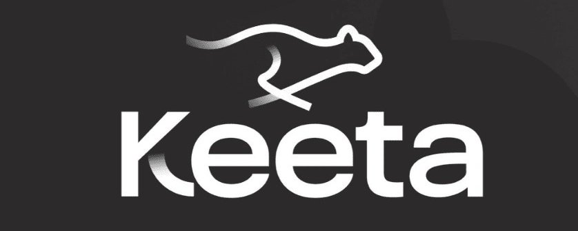
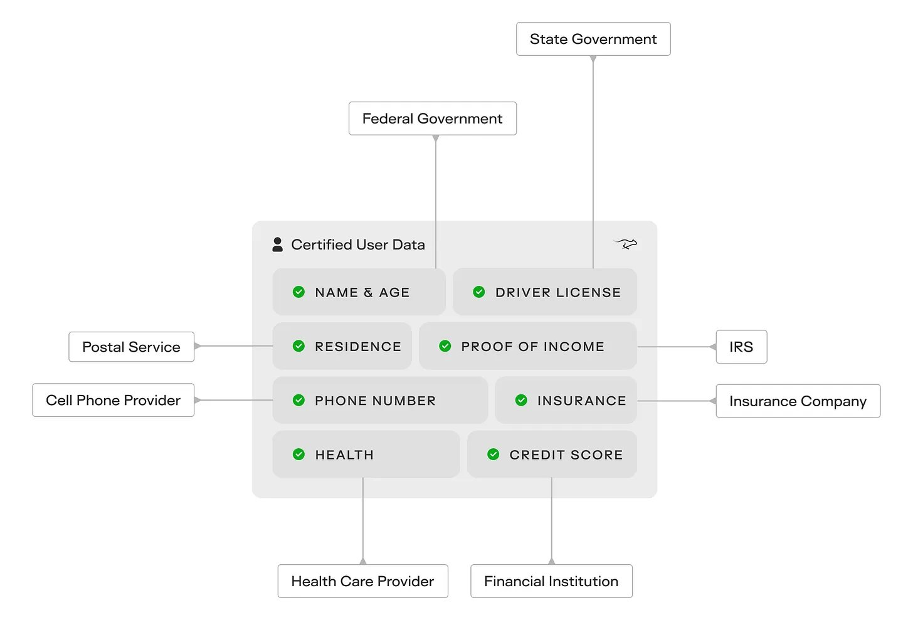

# KeetaNetwork



# The $5 Trillion Opportunity

The global financial system is running on software that was written before the personal computer existed.

When SWIFT launched, moving money internationally meant telex machines, physical paper, and hand-carried documents. A payment from New York to Tokyo took weeks. That was acceptable five decades ago. Today, that same payment still takes five days.

Think about that for a moment. In an era where you can send a message to Tokyo in 12 milliseconds, where you can video call someone in Singapore for free, where AI can generate code almost instantly — moving $1,000 across a border takes longer than it took to send a physical letter in the past.

This is not a technology problem. The technology to move money immediately has existed for many years. Japan built a system that processes domestic transfers rapidly. The Federal Reserve created one as well. Sixty countries have real-time payment systems today.

The problem is architectural. Every country developed its own payment rail. None of them connect to each other. To move money between them, you have to go through a chain of intermediary banks, each taking a fee, each adding a delay, each creating risk.

The result is $5 trillion in capital trapped in bank accounts around the world, earning nothing, waiting for payments that should have arrived instantly. That's more than Japan's entire GDP. That's more than Apple's entire market cap.

This is the single biggest inefficiency in the global economy. It's been hiding in plain sight for fifty years. And almost nobody is talking about it.

Every international bank maintains reserves in foreign jurisdictions, waiting for settlement events. These are accounts holding funds that sit stagnant, earning nothing. Industry estimates put the total capital locked in this system at over $5 trillion.

The problem: every domestic rail is a closed network. Moving money between them requires the correspondent banking chain. This system generates [$200B+](https://x.com/search?q=%24200B%2B&src=cashtag_click) in annual fees, costs businesses hundreds of billions in working capital, and locks massive amounts of capital in dormant buffers.

Wise built a network of local accounts in each jurisdiction. They net transactions internally to avoid correspondent banking. This works for their corridors. It doesn't scale globally, doesn't handle complex enterprise workflows, and doesn't address the institutional verification problem.

Ripple spent a decade pitching XRP as a bridge currency. They got embroiled in an SEC lawsuit for five years. They still haven't displaced SWIFT for a single major bank's primary settlement flows.

Every fintech that tried to fix cross-border payments faced the same choice. Operate outside the regulated system (fast to build, permanently limited). Or integrate with the regulated system (slow to build, potentially unlimited). Most chose the former. A few tried the latter and got stuck in regulatory quicksand.

The answer was never another payment app. It was never another blockchain. The answer was a financial operating system.

# The Three-Layer Bottleneck

**Layer 1: The Correspondent Banking Tax**

The current cross-border payment model requires every bank with international clients to hold reserves in foreign jurisdictions. A London bank needs USD reserves in New York. A Singapore bank needs EUR reserves in Frankfurt. A Nairobi bank needs GBP reserves in London.

This is the correspondent banking system. It works. The cost is high.

The massive amount of trapped capital represents a huge opportunity cost. That capital could be deployed in loans, investments, or productive economic activity. Instead, it sits in accounts around the world, waiting for settlement events that never come on the timeline businesses need.

Enterprise cross-border payments are worse in aggregate. Businesses lose hundreds of billions annually. Not just to FX spreads and wire fees. To the working capital locked in 2–5 day settlement windows. A company managing payables across twelve countries maintains funds in each jurisdiction to account for settlement timing. That idle capital has a real cost.

The manual reconciliation required to audit cross-border transactions consumes the majority of payments operations headcount at most financial institutions. This isn't a technology problem. It's a structural design problem.

**Layer 2: The Identity Dead End**

Every institution in the current financial system maintains its own identity verification stack. Every new partnership requires independent vetting. Every new counterparty relationship starts from scratch. This happens regardless of how many prior relationships exist or how much has already been spent verifying the same people.

The average global bank spends $115M per institution annually on KYC. Financial institutions collectively spend roughly $214 billion per year on financial crime controls. None of this spending creates a shared identity layer. It creates isolated silos that cannot talk to each other. These are proprietary systems built to satisfy regulators, not to interoperate.

This creates an impossible structural constraint for blockchain-based payment infrastructure. The permissionless chains — Ethereum, Solana — cannot serve institutions with legal obligations to know their counterparties. The permissioned chains — Hyperledger Fabric — are closed by design. They cannot serve a retail user in Brazil and a central bank in Singapore on the same network.

Every attempt to solve this treated identity verification as an application-layer problem. Each project builds its own KYC module. None of them interoperate. None of them travel with the user across counterparty relationships. The per-relationship onboarding cost stays high regardless of how many times the same user has already been verified elsewhere.

**Layer 3: The Fragmentation Problem**

The financial industry has spent two decades building blockchain systems that recreate the exact dysfunction they were supposed to solve. Closed networks. Incompatible rails. Liquidity that doesn't travel. JPMorgan's Onyx cannot settle with HSBC's blockchain system. Ripple's network doesn't interface natively with Stellar. The result is a new version of the same problem. Fragmented infrastructure benefits every intermediary, maintaining the connections between isolated systems.

The RWA space has the same structural failure developing in real time. BlackRock's BUIDL runs on Ethereum. Franklin Templeton runs on Avalanche. WisdomTree on Stellar. When institutions want cross-system settlement — when a bank running on one system needs to settle with a counterparty running on another — they're back to the correspondent model. Now with added smart contract risk.

The answer was never more fragmentation. It was always a shared layer that everyone builds on top of.

# The Missing Layer

What was missing was a network that could operate at both ends simultaneously. Fast enough for individual remittances. Regulated enough for institutional settlement. Open enough for developers to build on. Structured enough for AI agents to transact autonomously. No such network existed.

The candidates: Ripple, built in 2012 with fewer than 35 validators and no native identity layer. Ethereum, permissionless by design, is structurally unable to add institutional verification without breaking what it is. And a graveyard of permissioned enterprise blockchains that solved the problem for one institution at a time, then stopped.

One project has spent four years building for all three requirements simultaneously. That project is Keeta.

The claim: 11,122,116 TPS, verified by Google Cloud and confirmed by Chainspect. Sub-400ms finality. Native identity certificates use the same X.509 cryptographic standard that secures every HTTPS connection on earth. Native tokenization without smart contracts. A Visa Direct integration reaching 190+ countries across 90+ rails. Multi-currency accounts in 25+ currencies connected to SWIFT, ACH, SEPA, Fedwire. Access to US Treasury bills and stocks directly on-chain. A pending bank acquisition to close the fiat loop entirely.

Here is how it works.

## A Financial Stack, Not Another Blockchain

The most common mistake in evaluating Keeta is benchmarking it against other blockchains. Wrong category. The right comparison is the entire fragmented stack of payment infrastructure. SWIFT, ACH, SEPA, correspondent banking, card networks, FX desks. The question is whether Keeta can serve as the unified layer beneath all of it.

The architecture makes four decisions that together are genuinely unusual.

**The DAG: no queues, no mempools, no auctions**

Traditional blockchains process transactions sequentially. A block fills, gets validated, gets added to the chain, and the next block starts filling. At peak demand, users bid up fees to skip the queue. The mempool becomes a fee auction. This is tolerable for speculative applications. For financial infrastructure — where a London bank needs to confirm settlement with a Singapore counterparty before market close — it's unacceptable.

Keeta uses a Directed Acyclic Graph architecture. Each account maintains its own ordered chain within the broader network structure. Transactions are linked across multiple account chains simultaneously, enabling parallel processing across millions of accounts at once. There is no mempool. No queue.

```text
Traditional blockchain:              Keeta's DAG:

[Block 1] → [Block 2] → [Block 3]   [AcctA chain] ─┐
    ↑ queue, fees, bidding           [AcctB chain] ─┤→ Parallel validation
    ↑ mempool congestion             [AcctC chain] ─┘   <400ms finality
    ↑ 12s+ finality (ETH)           [AcctD chain] ─┘   No gas auction
```

The verified result: 11,122,116 TPS in a public stress test co-published by Google Cloud, confirmed by Chainspect. For context, Visa peaks at roughly 24,000 TPS. The entire global financial system — fragmented across dozens of incompatible rails — collectively processes around 11 million TPS. Keeta demonstrated that same throughput on a single, unified network.

**The X.509 identity system: regulatory trust baked into the protocol**

This is the architectural decision that separates Keeta from every other high-throughput L1.

Keeta's certificate system uses X.509. This is the same cryptographic standard underlying TLS/SSL, the protocol securing every HTTPS connection on earth. Certificate Authorities (banks, KYC providers, government agencies) issue digitally signed credentials tied to a user's public key. These certificates can represent KYC status, AML clearance, jurisdictional permissions, or any regulated attribute.

The breakthrough is selective disclosure. A user's certificate profile can prove defined attributes to designated counterparties without exposing the underlying data to the public ledger. A London bank can confirm a counterparty wallet is KYC-verified and jurisdictionally cleared without ever seeing the account holder's name. The commitment scheme uses cryptographic hash functions and salts that make this mathematically verifiable. Not a trust assertion. A checkable proof.

It works like this in practice. The issuer encrypts the attribute (say, a full name) with a random salt using the subject's public key, then creates a cryptographic commitment. This is a hash tied to the account, the attribute value, and the salt. The hash goes into the certificate. The actual value stays private. When a third party needs to verify, the user generates a proof from the decrypted value and salt. The third party recomputes the hash, compares it to the certificate, and verifies independently. No intermediary required. No raw data exposed.

For institutions, this is fundamental. They can operate on Keeta without violating their own regulatory obligations. They can enforce identity verification at the protocol level rather than building it as a custom application layer. They can transact with counterparties whose certificates have been issued by trusted authorities without repeating verification for every new relationship.

Every competing L1 either requires institutions to build identity verification as an application layer or cannot serve regulated financial institutions at all. Keeta is the only network that has native certificate infrastructure at the protocol level.

**The rules engine: regulatory rules travel with the asset**

Every token created on Keeta carries programmable rules enforced automatically by the network. Geographic transfer restrictions. Time locks. Spending category limits. Multi-party approval requirements above threshold. And critically — as announced in the March 17 Discord call — the ability to restrict send and receive to accounts holding designated certificate types, not just standard KYC status.

This means an asset with unique policy requirements can enforce those rules on both sides of every transaction, automatically, at the network level. No custom contract code. No audit surface. The rules travel with the asset.

These are native network primitives. There is no gas cost for rule execution, no exploit surface in custom contract code, no need to maintain separate enforcement applications. A tokenized US Treasury bill that cannot be sold to retail investors in non-accredited jurisdictions enforces that restriction at the token level. Permanently, without human intervention.

**Post-quantum architecture**

Quantum computers threaten the cryptographic foundations of every blockchain in existence today. Shor's algorithm, when implemented on sufficiently powerful quantum hardware, can break the elliptic curve cryptography that secures Bitcoin, Ethereum, and essentially all existing cryptocurrencies. This isn't a distant theoretical concern. Major financial institutions are already planning ten-year infrastructure horizons, and quantum computing development is progressing faster than expected.

Most blockchains have a hard problem. They built their security assumptions directly into the protocol level. Ethereum's addresses are derived from ECDSA public keys. Bitcoin's entire security model depends on elliptic curve signatures. When quantum computers become capable of breaking these algorithms, these networks face a binary choice: hard fork with massive disruption, or become vulnerable to attack.

Keeta's architecture solves this differently. The network is cryptographically agnostic at the protocol level. Currently, Keeta supports ECDSA and ED25519 for key generation and signing. But the architecture allows for post-quantum algorithms to be introduced at the key-pair level without any protocol changes.

This means an institution could generate quantum-resistant keys using algorithms like CRYSTALS-Kyber or Falcon. Those keys would work on the network immediately. Existing accounts could migrate gradually. New accounts could use quantum-resistant algorithms from day one. The network doesn't need to know or care what cryptographic algorithm secures each key pair.

For institutional adoption, this matters enormously. A central bank considering CBDC deployment on blockchain cannot choose a network that might require a disruptive hard fork in five years. They need infrastructure that can evolve as cryptographic standards evolve without breaking the system. Keeta's design makes this possible.

**The financial stack taking shape**

What makes April 2026 different from a year ago is that Keeta has stopped being a blockchain with payments ambitions and started becoming a financial stack.

```text
The financial stack:

[Individuals] ─────────┐
[Institutions] ─────────┤→ [Keeta Network] → [SWIFT / ACH / SEPA / Fedwire]
[AI Agents] ────────────┤       ↓                       ↓
                        │  [Multi-currency]         [Visa Direct]
                        │  [T-bills / Stocks]       [200+ countries]
                        │  [FX conversion]          [Card rails]
                        └→ [Named USD accounts] → [US banking system]
```

**Full ACH and wire functionality with named USD accounts.** Most blockchain accounts require memo codes or reference numbers to route transfers correctly. Keeta's named USD accounts remove that entirely. Transfers route directly to a user or entity based solely on account details. Standard banking behavior. The addition of ACH debit (pull payments) enables authorized third parties to initiate transactions from a user's account, supporting bill payments, subscriptions, recurring charges, and merchant-initiated transactions. Without this, accounts can only push money out. This addition means an account on Keeta can function exactly like a US bank account. For both individuals and institutions.

**Multi-currency global accounts.** A single wallet holding balances in 25+ currencies simultaneously, fully backed 1:1 with reserves held at regulated banking partners. Starting with USD, CAD, AED, GBP, EUR, HKD, JPY, MXN, and CNY — with rapid expansion to 26+ major currencies. SWIFT inbound and outbound transfers, FX conversion between supported currencies, local rail deposits for USD (with CAD, EUR, AED, AUD, BRL, and GBP following). No need to maintain separate accounts across jurisdictions. No human is required to open a bank account in every country. These accounts are designed to support both humans and AI agents as first-class participants. Across all non-sanctioned jurisdictions on earth.

**Visa Direct integration.** Keeta is the first and only blockchain on Visa's Global Registry of Service Providers. This designation required a full on-site QSA audit and PCI DSS Level 1 certification, the highest payment security standard in existence. The practical result: payment delivery to 200+ countries, nearly instant card-based payouts, and the ability to send from a Keeta account directly to a recipient's debit card without requiring bank account and routing details. Deposits and withdrawals are available immediately when funding a wallet or sending money back to a card. The integration covers payroll payouts, remittances, P2P payments, commerce payments, and crypto on/off ramp. All through a single integration pathway pre-certified at the protocol level.

**Access to US Treasury bills and stocks on-chain.** This one is underpriced in every analysis. Direct access to T-bills and equities. Fully owned in named accounts, not derivatives, not wrapped tokens, not ETF exposure. Via Keeta infrastructure. The idle capital problem is enormous. Banks, institutions, and individuals holding fiat balances on a payment network currently earn nothing on those balances. T-bill yields represent the risk-free rate. The ability to put dormant liquidity to work inside the same network where payments settle — without switching platforms — is a structural advantage no other payment-focused blockchain offers. The only comparable project is Ondo Finance, trading above $1B market cap and focused solely on this. Keeta treats it as one feature in a much larger financial stack.

One integration. Every rail. Every currency. Every counterparty. As Keeta put it in their launch announcement: this is not something you assemble by stitching together six vendors.

# Production Evidence

Before the public blockchain pivot, Keeta operated as a permissioned network with KeetaPay, a Venmo-like payment application in closed beta. The sales team approached banks and financial institutions individually. According to the team, banks piloted their technology in 50 regions. Their PCI-DSS Level 1 production system served as the authoritative record-keeping system for account balances at partner banks in 50 regions.

This is not hypothetical. Keeta replaced not only the settlement layer but also the banks' internal ledger.

[Company records from Zawya](https://www.zawya.com/company/5083146362/keeta) (London Stock Exchange Group's MENA Company Data database) reveal a partnership with Bank of America for something called the "Money Transfer Service" or BOTS. The business summary states:

> "Keeta Inc is a United States-based company, which is engaged in providing financial services. The Company provides banking services and payment services to individuals and small businesses. It offers its services through two channels which includes the Keeta Pay with Debit Card and the Bank of America (USA) Money Transfer Service (BOTS). The BOTS is an electronic money transfer service that allows consumers to transfer funds from one bank account to another."

The product was in an advanced stage, having established fiat partners in multiple regions. Community Financial Services Bank in the US. Currency Cloud in Europe and the UK. Banco Dondé in Mexico. These financial institutions provided the account balances and the integration to the local bank transfers.

The debit card program is particularly notable. Keeta collaborated with Visa to create cards directly integrated with Keeta's technology, allowing funds to move straight from Keeta accounts to merchants. A physical Visa debit card powered by Keeta has been [demonstrated publicly](https://www.youtube.com/shorts/ShsNgCPXrEI). Ty Schenk's communications have hinted at Keeta's technology potentially serving as a ledger for Visa itself. This would be an integration far deeper than typical crypto card offerings.

The company records show Keeta subsidiaries for local payment integrations. These partnerships aren't active anymore because of Keeta's shift towards network-wide stablecoins. A new stablecoin provider is expected to be revealed in the coming months and KeetaPay will likely make a comeback in Q4. This time without the in-house regulatory burden.

This is the production evidence that separates Keeta from every other L1 thesis. They've already done the hard work of institutional integration. The public blockchain is a scale play on top of proven technology.

# The Competitive Advantage

The most common objection: Ripple has a decade of bank relationships. Ethereum has the most developer activity. Solana has the throughput narrative. What does Keeta have that these don't?

Three things.

**The only blockchain on Visa's Global Registry of Service Providers**

This detail has been buried in community posts and hasn't reached mainstream research coverage. Keeta is the first and only blockchain ever listed on Visa's Global Registry of Service Providers. This required a full on-site QSA audit and PCI DSS Level 1 certification. The same standard Visa requires of every major payment processor globally.

The implication: any Visa-connected bank or merchant on earth can integrate with Keeta without running their own independent security assessment. The integration pathway that normally requires months of custom vetting has been cleared at the protocol level. Keeta already checks every major box from Visa's own stablecoin whitepaper. Native KYC/AML, Travel Rule support, ISO 20022 messaging, Visa Direct rails.

Every other blockchain attempting to serve as payment infrastructure would need to undergo this same rigorous process. Keeta has already completed it.

**Identity as a network effect, not a feature**

Keeta's X.509 certificate system makes identity portable. A certificate issued by a regulated KYC provider on Keeta follows the user across every interaction on the network. Once verified, the user is verified. For every counterparty, every transaction, every jurisdiction where the certificate grants clearance. No repeat KYC. No new account application.

This creates a compounding dynamic. The more users and institutions hold Keeta certificates, the more useful the certificate system becomes for every new participant. An institution joining the network inherits identity relationships with everyone already on it. The per-interaction onboarding cost approaches zero as the network grows. This is the opposite of the current correspondent banking model, where every new relationship requires an independent setup.



The March 2026 certificate update adds another layer. Individual tokens can now be restricted to accounts holding particular certificate types. An institution issuing a regulated asset can define exactly which certificate profiles are permitted to hold, send, or receive that asset. This makes Keeta's identity machinery directly relevant to every tokenized security, regulated fund, and jurisdictionally restricted instrument that comes on-chain.

**The zero-liquidity model for bank settlement**

Keeta's architecture enables something called the Zero-Liquidity Model for institutional settlement. Banks that tokenize their currencies on Keeta can settle with each other in real time without pre-positioning cash reserves in foreign accounts.

The current model requires every bank with international clients to maintain cash buffers in foreign jurisdictions. Idle capital sits in accounts around the world, waiting for settlement events.

Keeta's model eliminates this. Citibank transfers tokenized USD to CFSB. CFSB nets the position. Physical settlement happens via local rails only when banks mutually agree. This minimizes the frequency and cost of actual settlement. The more banks on the network, the more netting opportunities, the lower the real-world settlement cost for everyone.

**What competitors cannot replicate**

XRP launched in 2012. At the time, modern cryptographic identity didn't exist as a product primitive, tokenization wasn't an institutional demand, and Google Cloud-grade infrastructure wasn't available as a substrate. The result: fewer than 35 validators, many operated by Ripple Labs itself. No sophisticated programmable contract capabilities. Delphi Digital noted in October 2025 that Keeta "leapfrogged a decade's worth of efforts on many technical fronts" versus Ripple. This happened because Keeta wasn't constrained by 2012 architectural decisions.

Ethereum cannot add native KYC without abandoning its core identity as a permissionless network. This is a tradeoff its community would not accept. Its identity logic lives outside the protocol, incompatible across implementations, exploitable at the application layer.

Solana has no certificate system. Adding one requires significant architectural work. It would require backward compatibility with an existing network built on the assumption of permissionless access.

Hyperledger Fabric is permissioned by design. It can serve a single institution or a closed consortium. It cannot serve a retail user in Brazil and a central bank in Singapore on the same network simultaneously.

Keeta was built from scratch for both. Open access, institutional-grade verification, global scale. That combination has no direct competitor in production today.

# Market Opportunity

Keeta's opportunity has three distinct segments that don't require each other to be correct.

**Cross-border payments: the core**

Global cross-border payment volume reached approximately $1 quadrillion in 2024. The [McKinsey Global Payments Report](https://www.mckinsey.com/industries/financial-services/our-insights/global-payments-report) sizes the cross-border payments revenue pool at [$200B+](https://x.com/search?q=%24200B%2B&src=cashtag_click) annually, growing at roughly 8% per year. Remittances alone — $905B in 2024 — generate roughly $59B in fees at current average rates. A network that compresses those costs from 6.5% to 0.5% at scale generates real economics from pure fee displacement.

For context: Wise processes roughly $14B monthly in cross-border volume and trades above $10B market cap. Keeta's architecture is categorically superior on throughput, settlement speed, and regulatory coverage. If it executes at similar volumes, the current $94M market cap is a rounding error.

**RWA tokenization: the institutional tailwind**

RWA tokenization (excluding stablecoins) reached $15.2B by end of 2024. With stablecoins included, . BlackRock's BUIDL fund, Franklin Templeton on Avalanche, DAMAC tokenizing $1B in UAE real estate. These are production deployments by institutions with multi-trillion dollar balance sheets.

The 10-year projection across research houses converges around [$30T+](https://x.com/search?q=%2430T%2B&src=cashtag_click). Keeta's compliance architecture — native KYC, programmable token rules, certificate-based identity — is directly required for regulated asset tokenization. Tokenized securities need issuer-level controls. Tokenized real estate needs jurisdictional restrictions. Tokenized credit needs a verified identity for lending. These are native primitives on Keeta, not add-ons.

The on-chain T-bill and stock access creates an additional wedge into this market. Direct ownership of US Treasury instruments. Not synthetic exposure, not fund tokens, actual named-account ownership. On the same network where settlement happens. Ondo Finance, the closest comparable project in the on-chain T-bill space, trades above $1B market cap with a narrower product scope than Keeta's full financial stack.

**Agentic payments: what most are missing**

AI agents are becoming first-class financial participants. Not a 2030 forecast. An April 2026 reality. Visa just announced "Intelligent Commerce Connect," enabling AI agents to make purchases across card networks. Keeta's Visa Direct integration and the bio update to "The most advanced way to move money. For humans and AI" are not coincidental.

An agent managing procurement, running FX arbitrage, coordinating supply chain disbursements across twelve countries cannot operate through existing payment rails that require human authorization, impose daily limits, and close on weekends. Multi-currency accounts on Keeta require no human to open a bank account per jurisdiction. Identity certificates can be programmatically issued and verified. The network operates continuously, API-first. As stated explicitly in the product announcement: these accounts support both humans and AI agents as first-class participants.

Keeta's founder is already building this in production:

Industry forecasts put agentic commerce at trillions of dollars in transaction volume by 2030. The infrastructure layer that handles this is not built yet. Keeta is the closest thing to it currently running on mainnet.

# Project Valuation

Keeta is pre-revenue in the traditional sense. No disclosed protocol revenue as of April 2026. The valuation case rests on comparable market position, the institutional access infrastructure already in place, and scenario analysis.

**Token structure**

```text
| Metric                 | Value                |
| ---------------------- | -------------------- |
| Price (April 16, 2026) | $0.1808              |
| Market cap             | $94.1M               |
| FDV                    | $180.8M              |
| Circulating / Total    | 520.7M / 1B (52%)    |
| FDV/MC ratio           | 1.92x                |
| ATH                    | $1.68 (June 9, 2025) |
| Drawdown from ATH      | -89.2%               |
| CMC Rank               | #200                 |
```

The FDV/MC ratio of 1.92x is low relative to most crypto infrastructure projects. 52% of the total supply is already circulating. Unlock overhang is manageable.

**Comparable project analysis**

Ripple (XRP) trades at [$130B+](https://x.com/search?q=%24130B%2B&src=cashtag_click) market cap. Its core proposition is cross-border bank settlement. This is a narrower scope than Keeta's full financial stack, with inferior throughput, no native compliance layer, and no institutional certification equivalent to PCI DSS Level 1. Delphi Digital noted in October 2025 that Keeta "leapfrogged a decade's worth of efforts on many technical fronts" versus Ripple.

Ondo Finance — the leading on-chain T-bill project — trades above $1B market cap with a product scope Keeta subsumes as a single feature.

Wise — the most direct payments comparable — trades above $10B market cap on $14B monthly cross-border volume. Keeta's infrastructure can process that volume in seconds.

At $94M market cap, Keeta is priced as though none of the institutional infrastructure it has already built has value. That's the dislocation.

**Market share scenario**

If Keeta captures 0.1% of the $200B annual cross-border payment revenue pool at a 20x multiple: $4B market cap. That's 42x from the current price.

If Keeta captures 0.5% of the RWA tokenization market at $15.2B with a 2% fee take at 20x: $3B market cap. That's 32x from the current price.

Neither scenario requires market leadership. They require being a real participant in markets that are already enormous and growing.

# Token Economics

KTA is the governance token for a Delegated Proof of Stake network. Token holders vote for representatives who validate the network.

The direct value accrual mechanism is the KUSD/AUSD yield → KTA buyback loop. KUSD, Keeta's KYC-compliant stablecoin built with Agora, generates yield from Treasury and money market positions. That yield is directed into KTA buybacks. As KUSD supply grows with institutional adoption, buyback flow scales linearly with it. The mechanism is live and grows with stablecoin supply.

Agora's AUSD — which participates in the same yield mechanism — is managed by State Street and VanEck. State Street manages $4 trillion in assets. Their involvement in the underlying reserve management indicates institutional comfort with the Keeta infrastructure.

The 400M KTA Strategic Reserves fund — formed by merging early investor and team allocations — was explicitly committed as a long-term strategic asset, not available for sale. The bank acquisition announced in January 2026 was funded by 35M KTA from strategic reserves. If regulatory approval is granted, Keeta would operate a licensed bank. This enables true 24/7/365 instant fiat movement worldwide, direct liquidity placement, and institutional onboarding without anchor dependencies. As explained in the March Discord call, acquiring a bank is the most expensive and tedious part of the build. It's necessary to remove third-party compliance overhead entirely. Target window: summer 2026, though the team was clear that the timeline could move in either direction.

Both Keeta Token Genesis (KTG) and Keeta Inc. have explicitly committed to increasing, not decreasing, their token holdings. As of March 17, no further OTC deals will be entertained despite $5–10M in current interest.

## The Team

**Ty Schenk — Founder and CEO**

Schenk founded Keeta in 2022. His approach has been to build regulatory compliance directly into the protocol rather than as an application-layer add-on. This focus on protocol-level identity and compliance infrastructure — native X.509 certificates, programmable token rules, and selective disclosure — makes Keeta the only L1 designed to serve both institutions and individuals on the same network. Earlier in his career, he built a payment application on Nano, an experience that informed his understanding of what institutional adoption requires from blockchain infrastructure.

**Roy Keene — Core Engineer**

Formerly at Amazon and Nano's lead developer during its peak. The node was initially developed on AWS before moving to Google Cloud. This was a deliberate architectural decision driven by Google Cloud Spanner's unmatched scalability and consistency. Earlier 2023 tests reached 50 million TPS on a stripped-down version. The permission framework and compliance layers were added afterward.

**Eric Schmidt — Former CEO and Executive Chairman of Google, early backer**

Schmidt ran the company that built Google Spanner. This is the infrastructure powering Keeta's verified 11M TPS result. His involvement indicates both technical credibility and the institutional access that early-stage infrastructure companies need. This isn't just another investment for him. It's his first official blockchain investment and only his second involvement in the space after serving as an advisor to Chainlink (currently a top 15 crypto project). When his investment firm Steel Perlot encountered difficulties, Schmidt transferred his investment to his family office Hillspire LLC rather than abandoning the project. The ex-CEO of Google reportedly claimed this could be the largest project he's ever been involved in.

# External Signals

**Google Cloud — Technical Co-publisher**

Google co-published the [11M TPS stress test result](https://cloud.google.com/blog/topics/financial-services/how-blockchain-network-keeta-processes-11-million-financial-transactions-per-second-with-spanner) on their official financial services blog. This is not a marketing mention. Google does not co-publish technical case studies for projects they don't want its name associated with.

**Agora — Institutional Stablecoin Partnership**

State Street custody, VanEck reserves management, Paradigm-led Series A. KUSD/AUSD yield → KTA buyback mechanism live.

**Kraken — Whale-Level On-Chain Positioning**

Kraken's wallet is the #3 largest on-chain holder of KTA, with approximately 3.23% of supply. This is not a disclosed partnership. It's on-chain data. Kraken just received a Federal Reserve master account and has been actively building tokenized equity products. The positioning is notable.

**Coinbase — Retail Distribution**

KTA is tradeable directly within the Coinbase app via the Base DEX integration for US users. Native app integration for Coinbase's entire US retail user base.

**Delphi Digital — Research Coverage**

The October 2025 Delphi Digital report noted that Keeta "leapfrogged a decade's worth of efforts on many technical fronts" versus Ripple. Delphi rarely covers projects under $100M market cap.

**Velocity — LATAM Neobank on Keeta**

Velocity is live on Keeta mainnet, shipping a LATAM-focused neobank with native Base bridge integration, FX aggregation, and staking infrastructure.

## Trade Setup

KTA launched in March 2025 via Base at $0.0068 (ATL), currently sitting at **$0.1808**. It ran to a $1.68 ATH on June 9, 2025. This was driven by the 11M TPS announcement and Eric Schmidt coverage. Textbook pre-mainnet premium. The narrative was fully priced before the product existed.

Mainnet launched September 22, 2025. Token was at ~$1.11 at launch, dropped ~40% in the following three days. A classic sell-the-news event after months of buy-the-rumor momentum. By mid-October 2025, KTA had reached ~$0.27. From the $1.68 ATH to the October low: an 84% decline.

```text
KTA Price History (Approximate)
────────────────────────────────────────────────────────
Mar 2025   Launch on Base at $0.0068 (ATL)
May 2025   Breakout begins — $0.10 → $0.80 on TPS narrative
Jun 2025   ATH: $1.68 — post 11M TPS announcement
Jul–Sep    Correction: $1.68 → $0.50 ahead of mainnet
Sep 22     Mainnet launch at ~$1.11 → -40% in 3 days
Oct 2025   $0.27 lows — post-mainnet distribution bottom
Nov–Jan    Sideways: $0.14–$0.21 range
Apr 16     $0.1808 current
────────────────────────────────────────────────────────
```

The pattern is clean. The pre-mainnet run priced the narrative entirely. The post-mainnet event distributed to early buyers. The current period is an accumulation coinciding with the product actually shipping. The 30-day decline in a product-positive period reflects macro pressure across crypto broadly and position cleanup from early buyers. Not fundamental deterioration.

**Near-term catalysts (0–12 months)**

- Bank acquisition regulatory approval. This is binary. Timeline targets summer 2026. Fundamentally changes institutional onboarding economics if approved.
- SWIFT anchor integration. Enables direct bank-to-bank settlement without local rail dependencies.
- BRL and GBP local rail deposit support. Expands remittance corridors significantly.
- Card issuing product launch. Closes the last gap in the consumer payments flow.
- First publicly named institutional settlement client.
- The "big partner" announcement. Referenced in the March Discord call as the cornerstone enabling multiple other major announcements. Explicitly not Visa or Google.

**Medium-term (1–3 years)**

KUSD supply reaches . Meaningful KTA buyback flow begins. First CBDC pilot contract with a sovereign institution. Total settlement volume crossing [$10B+](https://x.com/search?q=%2410B%2B&src=cashtag_click) annually. Named institutional clients building on top of the financial stack publicly.

**Long-term (3+ years)**

Keeta as the default settlement layer for mid-tier banks lacking full SWIFT relationships. Agent-native payment infrastructure for enterprise AI systems at scale. Top-3 L1 by protocol revenue.

## The Risks

**Production scale vs. stress test**

The 11M TPS was demonstrated on a synthetic test with 30M accounts and Google Cloud infrastructure. Real-world adversarial conditions, varied transaction complexity, and decentralized node operators are a different test. Chainspect's live TPS readings have varied significantly from the stress test peak. Mainnet is live. Sustained high-throughput production performance under real load remains to be proven.

**Bank acquisition execution risk**

Acquiring a bank requires regulatory approval from multiple authorities. Timelines are measured in months to years. The process involves a large set of regulatory documents, compliance monitoring teams, and direct liquidity partner engagements. Approval is not guaranteed. The 35M KTA allocated from strategic reserves is a meaningful commitment. If the deal doesn't go through, the institutional onboarding narrative takes a credibility hit and the timeline for true 24/7 fiat movement extends significantly.

**Partner and announcement timing**

The March Discord call described a "blitz release" of 10–15 major items being held back for a coordinated launch. Several early-March deliverables were delayed by external events. The team is working against interdependencies. One smaller partner is the cornerstone, enabling multiple larger announcements. If that partner is delayed further, the entire announcement sequence pushes out.

**Competitive response**

Ripple has a decade of bank relationships and a completed SEC settlement. If Ripple accelerates programmability and native compliance features, it competes directly. This would be backed by significantly more institutional relationships and brand recognition. The technical gap is wide today. The question is how quickly it narrows with capital behind it.

**Cross-chain bridge security**

Keeta's cross-chain functionality introduces additional security surface area. Bridge exploits have been the single largest source of losses in crypto history. A significant exploit at this stage would be catastrophic for institutional trust.

**Regulatory environment**

The GENIUS Act provides US stablecoin clarity. The broader regulatory picture for blockchain-based payment infrastructure remains uncertain across key jurisdictions. A hostile regulatory action in a major market could constrain the institutional adoption timeline significantly.

**Token concentration and OTC overhang**

One recent OTC counterparty resold tokens and caused a market dump. The team has since closed the OTC channel entirely. This demonstrates that third-party holders of large positions can create selling pressure independent of the project's own stated intention to hold. The March incident was absorbed via a $100K buyback. It was small. A larger version of the same dynamic would be harder to absorb.

The thesis survives these risks if production throughput scales to real-world demand over the next 12–18 months, at least one major financial institution goes live as a named settlement client, and the bank acquisition either closes or is replaced by an equivalent regulatory milestone.

## Conclusion

The right frame for Keeta isn't "which L1 will win." That's the wrong question.

The right question: what is the infrastructure layer for global money movement? For the $1 quadrillion in annual cross-border flows, the [$30T+](https://x.com/search?q=%2430T%2B&src=cashtag_click) in projected tokenized assets, and the trillions in agentic commerce that doesn't yet exist but is being built right now? That layer requires throughput at a global scale, compliance baked into the protocol, identity that travels with the user, rails that connect to every existing payment system simultaneously, and T-bill yields on idle capital. No current network was designed to meet all five requirements simultaneously. Keeta was.

The institutional demand is no longer theoretical. The GENIUS Act provides US stablecoin clarity. Circle's IPO was 25x oversubscribed. BlackRock, State Street, and VanEck are operating production-grade tokenized products. Visa just launched an AI agent payment infrastructure and Keeta became the first blockchain on their Global Registry of Service Providers. Kraken — freshly holding a Federal Reserve master account — has taken the third-largest on-chain KTA position. These are not endorsements. They are signals from institutions allocating serious capital to this infrastructure category right now.

At $94M market cap with a PCI DSS Level 1 certification, Visa Direct integration, full ACH/wire functionality, multi-currency accounts in 25+ currencies, on-chain T-bill access, and a bank acquisition in progress — the market is pricing Keeta like a speculative early-stage chain. The product is shipping. The institutional access points are live. If three to five institutional settlement clients are announced by the end of 2026 and the bank acquisition closes, the revenue base that follows supports a [$2B+](https://x.com/search?q=%242B%2B&src=cashtag_click) market cap at sector multiples. More than 20x from current levels.

Watch for these specifically. The first publicly named institutional settlement client, KUSD total supply trajectory, the bank acquisition regulatory update, the unnamed cornerstone partner announcement from the March call, and whether the blitz release delivers in Q2. If the infrastructure does what it claims, the settlement architecture isn't a roadmap item anymore.

It's already running.

- **X:** [@KeetaNetwork](https://x.com/KeetaNetwork) 
- **Website:** [https://keeta.com](https://keeta.com/) 
- **Community:** [https://discord.gg/keeta](https://discord.gg/keeta)
- **CA:** 0xc0634090F2Fe6c6d75e61Be2b949464aBB498973 (Base)

This document is for informational purposes only and does not constitute investment advice or an offer to sell or solicitation to buy any securities or investment products. All investments involve risk, including the possible loss of principal. Past performance is not indicative of future results. Any forward-looking statements or hypothetical examples are subject to risks and uncertainties and are not guarantees of future performance. No client-adviser relationship is established by this material. The author assumes no responsibility for the accuracy or completeness of third-party information referenced.