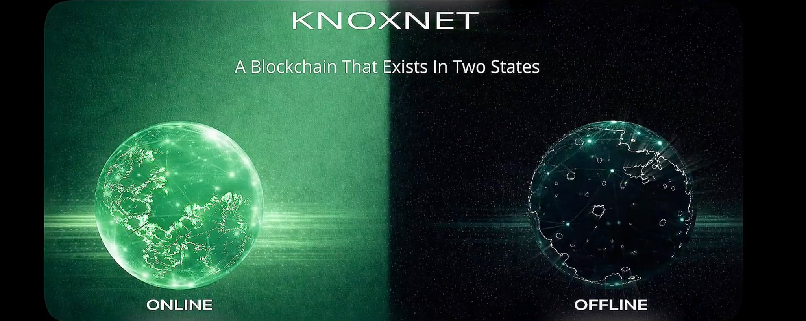
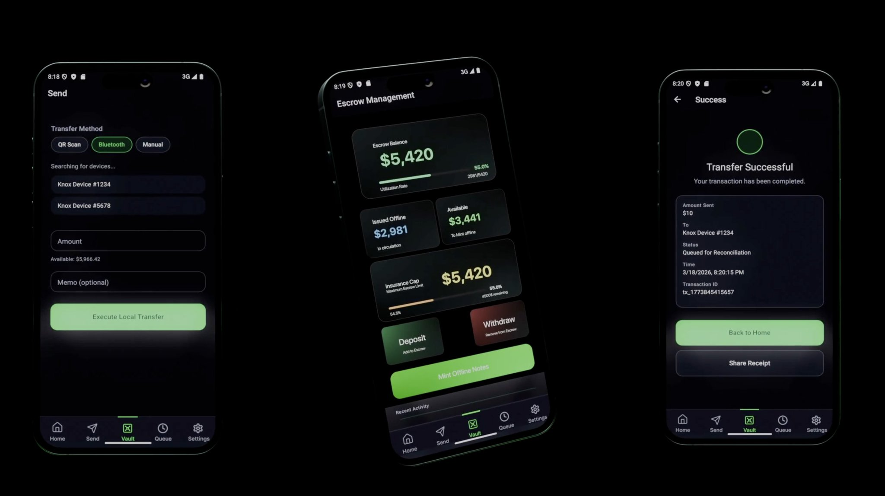

# KnoxNet



## The Quiet War Against Your Money

You don't see it happening. But every time you swipe a card, send a crypto transaction, or pay through an app, something else is recorded too. Not just the transaction contents. The transaction metadata. The time. The location. The network path. The routing information.

Modern financial systems assume one thing: **you're always connected.**

Banks, cards, even crypto — everything routes through a network, gets externally validated, and settles on a shared global state. No internet, no transaction. That assumption is so deeply embedded that we stopped questioning it.

But assumptions get you killed.

## The Problem Nobody Is Talking About

Physical cash was perfect. When you hand someone a bill, no network logs the transaction, no timestamp is created, no infrastructure routes the transfer. Privacy is a default property of the system — not a feature bolted on afterward.

Digital payments inverted this model. Every transaction now requires a network, a broadcast, a record. The internet became a mandatory infrastructure for value transfer, and with it came a permanent ledger of every payment ever made. Banks know. Blockchains know. Infrastructure providers know. The assumption was so deeply embedded in how financial systems were designed that nobody stopped to ask whether it was necessary.

Privacy-focused blockchains tried to solve this — and partially succeeded. Monero conceals amounts and participants. Zcash applies zero-knowledge proofs to hide transaction content. These are genuine cryptographic achievements. But they share the same architectural foundation as every chain they improved upon: global broadcast, immediate consensus, constant connectivity. The encryption hides what happened. The network still knows something happened.

This is the ceiling they've all hit. Cryptography protects data confidentiality within environments that are inherently observable. Every Monero transaction still requires internet access. Every Zcash transfer still touches globally visible network infrastructure. Every zero-knowledge proof still propagates across a public broadcast channel. You can hide the contents of a message. You cannot hide that you sent one.

```
PRIVACY LEVELS:
Cash:           100% private (no record)
Privacy Coins:  50% private (content hidden, transfer visible)
KnoxNet:        100% private (no transfer, no record)
```

The failure of alternatives runs deeper than just metadata leakage. Every always-online privacy protocol is fundamentally vulnerable to the same class of attack: network-level surveillance. Transaction timing, frequency, and routing behavior are observable regardless of what's encrypted inside the transaction itself. In high-stakes environments — censorship resistance, enterprise privacy, infrastructure-light economies — this is not a theoretical limitation. It's an operational failure.

The gap is structural, not incremental. No existing blockchain was designed to execute value transfers without connectivity as a core architectural primitive. Not as a fallback mode, not as an edge case — as the default. The first system to solve this doesn't improve on existing privacy coins. It creates a new category.

## The Context That Makes This Urgent

Internet outages during conflicts are weaponized — cutting off entire populations from their money. Developing regions with unreliable or expensive connectivity are locked out of digital commerce entirely. Enterprise supply chains need privacy guarantees that don't depend on always-on surveillance infrastructure.

Meanwhile, new AMLA frameworks and the regulatory architecture being built right now will make financial privacy opt-out by design, not the default. The window to establish offline-native infrastructure before that demand becomes acute is measured in months.

Every existing solution assumes connectivity, even the private ones.

**No blockchain natively supports offline execution as a core design principle.** That is the gap KnoxNet steps into.

## Offline-Native by Design

KnoxNet is the first Layer 1 blockchain built for offline execution and encrypted online settlement — a dual-domain architecture that fundamentally separates where value transfers happen from where they're recorded.

Here's how the mechanism works. A user escrows $KNX on the Layer 1 ledger and receives cryptographic notes — portable, self-contained value units that carry their own lineage, ownership history, and transfer record. These notes exist entirely on the device. They move over Bluetooth, QR codes, Wi-Fi Direct, or local mesh networks. When two devices are in proximity, a full cryptographic handshake occurs: the receiver validates the note's complete history, checks for contradictions locally, and accepts or rejects before the transfer completes. No internet required. No global state consulted.

```text
Dual-Domain Architecture:

  [OFFLINE DOMAIN]                    [ONLINE DOMAIN]
  
  Device A ──── local handshake ────► Device B     ──► Encrypted Settlement
  [escrow]      (BT/QR/mesh)         [receives note]    (HE reconciliation)
      │                                   │                    │
  No network                          No network         Global correctness
  No broadcast                        No broadcast       enforced on-chain
  No timestamp                        No timestamp       without revealing
  No surveillance                     No surveillance    amounts or parties
```

Execution privacy lives in the offline domain. Settlement correctness lives in the online domain. Neither domain compromises the other.

Settlement happens later. When a device reconnects, encrypted deltas are submitted to the Layer 1 for reconciliation. This is where homomorphic encryption becomes critical. The ledger validates supply invariants — value conservation, issuance limits, settlement correctness — by performing arithmetic directly on ciphertexts. It confirms the math is right without learning what the numbers are. No transaction amounts. No participant balances. No detailed accounting structures. Correctness is enforced through encryption that the verifier cannot read.

This is a genuine 0→1 architectural breakthrough. Not a better zero-knowledge proof. Not a more efficient ring signature. A fundamentally different model where the internet is an optional infrastructure rather than a prerequisite. No existing Layer 1 treats disconnected execution as a core primitive — the design space simply doesn't exist in always-online systems because connectivity was never questioned as a requirement.

The double-spend problem in offline systems is bounded, not eliminated. KnoxNet accepts this honestly and handles it directly: the maximum value that can be misused offline equals the [$KNX](https://x.com/search?q=%24KNX&src=cashtag_click) escrowed on the ledger. Double-spends are detectable during reconciliation, with escrow slashed as a penalty. This transforms the worst-case outcome from catastrophic system failure into a bounded, punishable event — an economic enforcement layer replacing the impossibility of offline global uniqueness.

The result: a complete privacy model across three layers simultaneously. Execution privacy from offline operation. Settlement privacy from homomorphic encryption. Network privacy from the absence of broadcast. No existing privacy coin addresses all three. Most address one.

## The Moat Built Into the Architecture

KnoxNet doesn't have a first-mover advantage because it moved first. It has a first-mover advantage because what it built cannot be replicated by layering improvements onto existing architectures.

Monero and Zcash are always-online systems at their core. To add offline-native execution, they would need to redesign their consensus models, their settlement layers, their note structures, and their network assumptions from scratch. That's not a protocol upgrade — that's a rebuild. Privacy coins that have spent years optimizing their broadcast-based architectures are structurally incapable of the architectural separation KnoxNet was designed around from day one. The moat is the architecture itself.

What makes the competitive position more defensible is where the moat compounds. Offline payment networks build local value through physical proximity — the more devices running KnoxNet in a region, the more useful the network becomes for that region, independent of global chain activity. This creates network effects that don't require internet connectivity to reinforce. Local mesh density drives local utility. Local utility drives local adoption. Local adoption drives more devices. This loop has no analogue in always-online privacy coins.

Enterprise demand adds a second reinforcing vector. Supply chain payments, cross-border institutional transfers, and sensitive financial transactions all share a common requirement: reduced network-level visibility. Current blockchain solutions force enterprises into surveillance models — every transaction visible to infrastructure, intermediaries, and network operators. KnoxNet's encrypted settlement layer offers correctness guarantees without reintroducing transparency. That's a meaningfully different product than anything Monero or Zcash currently offers enterprise buyers.

The working demo is evidence that the moat is operational, not theoretical. KnoxNet has executed offline note transfers between fully air-gapped devices — both in airplane mode, no internet, no fallback — with complete lineage verification, handshake validation, and local double-spend detection. Working code in a pre-mainnet project with novel cryptographic claims is a significant signal. It means the architecture isn't whitepaper speculation. It's implemented.

## Market Opportunity

The privacy category has grown steadily as surveillance awareness has increased globally — and it's about to get a significant legislative catalyst.

Europe's Anti-Money Laundering Authority framework kicks in late 2026 as the most aggressive financial surveillance regime in years. The Digital Euro — **€1.3B already in development** — follows in 2029. The combined regulatory architecture introduces €3,000 cash holding limits, fully traceable transaction records, real-time behavioral monitoring, and programmable money with the capacity to expire, restrict purchases, or freeze accounts programmatically. Financial privacy, under this framework, becomes opt-out-by-design rather than default.

This isn't a theoretical threat to financial autonomy. It's a legislative timeline. And it directly expands the addressable market for structural privacy solutions. KnoxNet's offline architecture addresses this threat at the layer that regulators cannot reach. Transactions that happen device-to-device over Bluetooth or mesh don't pass through monitored infrastructure. Cryptographic notes that carry their own state don't touch the real-time logging systems the Digital Euro framework is built to enable.

Even always-online privacy coins remain vulnerable to network-level control: connectivity can be throttled, routing can be filtered, and broadcast can be monitored at the infrastructure layer. KnoxNet's internet-optional design removes that attack surface entirely.



The addressable market expands further when offline-commerce economies are included. **4.1 billion people** live in regions with unreliable or unaffordable internet connectivity. Rural areas, developing countries, and infrastructure-light economies need payment systems that function without continuous access. Digital commerce is severely constrained where connectivity cannot be assumed, which describes most of the world by population. KnoxNet's mesh-native architecture is the only blockchain primitive that addresses this at the protocol level.

Enterprise privacy rounds out the TAM. Supply chain payments, cross-border institutional transfers, and sensitive financial transactions require visibility controls that existing blockchains cannot offer. Current enterprise blockchain solutions force a trade-off between connectivity and privacy — KnoxNet's dual-domain model eliminates that trade-off. If even a small fraction of the **$115M average annual compliance spend per major financial institution** shifts toward privacy infrastructure, the revenue potential is significant.

Taken together — privacy coin market, mesh-economy use cases, regulatory-driven demand, and enterprise adoption — the total addressable market spans hundreds of billions over the next decade. The timing is exact: Europe's regulatory clock is running, mainnet is approaching, and the architecture is differentiated. Two years from now, the window to enter before network effects establish will be closed.

## Project Valuation

The nearest comparable for valuation purposes is Monero at the equivalent stage of development: functional architecture, working demos, pre-broad-adoption, category-defining technical differentiation. Monero's current $6.3B market cap was reached after years of network development and ecosystem growth. KnoxNet at **~$28.4M FDV** represents approximately **0.45% of Monero's valuation**, with an architectural advantage Monero structurally cannot replicate.

Applying a conservative 5% market share scenario against the privacy coin market alone ($14.8B) implies a [$500M-](https://x.com/search?q=%24500M-&src=cashtag_click)**$1B market cap range** at comparable penetration. This scenario requires no enterprise adoption, no mesh-economy penetration, and no regulatory-driven demand growth. It requires only that KnoxNet captures a small fraction of the market it technically supersedes.

The liquidity picture warrants attention. At ~$28.4M FDV with thin Uniswap depth, small clips can move price significantly — this amplifies upside during accumulation phases but creates severe downside risk during corrections. The token has traded as high as **$0.047 on April 11**, **2026** and had two 40-45% corrections. This is the standard post-launch distribution pattern for pre-mainnet assets at this stage. The architecture survives the price action.

Current price implies the market is treating KnoxNet as speculative infrastructure at an early stage — which it is. The repricing event occurs at mainnet with functional offline execution, security audit results, and initial transaction volume. At that point, the project crosses from "whitepaper architecture with working demos" to "deployed Layer 1 with live network." The valuation gap between those two states in the privacy category has historically been substantial.

## How $KNX Captures Value

[$KNX](https://x.com/search?q=%24KNX&src=cashtag_click) is the economic foundation of the offline network, not a governance token or speculative vehicle. Value accrual is structural and tied directly to network utilization.

Every user who wants to generate offline spendable notes must first escrow [$KNX](https://x.com/search?q=%24KNX&src=cashtag_click) on the Layer 1 ledger. The total value of outstanding offline notes is strictly bounded by the amount of [$KNX](https://x.com/search?q=%24KNX&src=cashtag_click) escrowed. This creates baseline demand that scales linearly with network adoption — more users generating offline notes means more [$KNX](https://x.com/search?q=%24KNX&src=cashtag_click) locked in escrow. There is no workaround. The escrow requirement is the mechanism that bounds double-spend risk, which means it cannot be removed without breaking the security model.

Double-spend penalties are also denominated in [$KNX](https://x.com/search?q=%24KNX&src=cashtag_click). When a contradiction is detected during reconciliation, the associated escrowed [$KNX](https://x.com/search?q=%24KNX&src=cashtag_click) is slashed. As [$KNX](https://x.com/search?q=%24KNX&src=cashtag_click) price increases, the economic cost of misbehavior increases proportionally. Security and price appreciation are aligned rather than in tension.

The supply dynamic creates a natural accumulation floor tied to network growth. As offline commerce scales, escrow demand scales. As escrow demand scales, the circulating supply contracts. This isn't a buyback mechanism or artificial supply restriction — it's the direct economic consequence of the architecture working as designed. KnoxNet's current architecture supports [$KNX](https://x.com/search?q=%24KNX&src=cashtag_click) as the sole native asset for escrow, settlement, and economic enforcement.

## The Team

KnoxNet operates as an undoxxed project. No confirmed team identities have been publicly disclosed.

This is simultaneously the project's privacy-consistent narrative and its primary risk. The "No Doxx with Knox" framing aligns with the product's ethos — a privacy chain run by an anonymous team is coherent in a way that a privacy chain run by a publicly known team with LinkedIn profiles is not.

What exists as evidence of real engineering capability: a detailed whitepaper with complete cryptographic architecture, functional offline transfer demos between air-gapped devices, active development updates on X and Telegram, and SDK documentation that reflects real implementation depth. These are not whitepaper promises. They are shipped artifacts.

The absence of institutional backing or public team disclosure remains the single largest risk in this thesis, addressed directly in the risk section below.

## External Signals

- [@TheCryptoChefX](https://x.com/@TheCryptoChefX) — "KnoxNet is building a Layer 1 blockchain that works offline. Offline is the actual default state of the network. KnoxNet's whole thesis is that real privacy starts by removing the internet from the transaction path entirely. If this tech delivers, the current mcap does not reflect it." — [Source](https://x.com/TheCryptoChefX/status/2039874922848067984). **Why this matters:** Correctly identifies the architectural thesis — not as a privacy improvement but as a category creation. Analyst accuracy on the mechanism suggests informed, not narrative-driven, positioning.
- [@cryptoskullx](https://x.com/@cryptoskullx) — Described KnoxNet as "cash 2.0 — digital, private, borderless, and far harder to shut down" and called it "quietly one of the more interesting ideas being built right now on Ethereum from a privacy project POV." — [Source](https://x.com/cryptoskullx/status/2036142269829456215). **Why this matters:** Framing from an analyst with prior accurate early calls on privacy infrastructure adds signal weight to the architecture thesis.
- [@Dvcryptzz](https://x.com/@Dvcryptzz) — Cited the working offline demo directly: "Successful offline transfers now occur between airplane-mode devices." — [Source](https://x.com/Dvcryptzz/status/2041959655459713532). **Why this matters:** Independently verified working code in pre-mainnet is a meaningful signal. On-chain activity converging with functional demo evidence.
- [@DogeSpaceXX](https://x.com/@DogeSpaceXX) — "The team behind Knox is seriously strong. They've been building a privacy-focused chain designed to work without internet connectivity — something very few are even attempting." — [Source](https://x.com/DogeSpaceXX/status/2041262907070230618). **Why this matters:** Consistent with other KOL assessments on team capability, though team identity remains unconfirmed.

**Community:** The project remains in an extremely early accumulation phase. The Telegram channel and X account ([@KnoxnetOfficial](https://x.com/@KnoxnetOfficial)) are active with regular development updates but follower numbers remain relatively small. Daily active addresses on-chain are not yet meaningfully tracked at this stage of deployment. These numbers are a signal, not a concern — at this market cap and development stage, the community is still composed of early researchers and private groups, not retail. These are most likely insiders and smart whales building positions ahead of the mainnet.

**No institutional backing has been announced.** This is stated once here and once in the risk section.

## Trade Setup

[$KNX](https://x.com/search?q=%24KNX&src=cashtag_click) launched March 18, 2026. Current price is **~$0.0284** with an **FDV of ~$28.4M** and approximately **$563.87K in 24-hour trading volume** as of April 14, 2026. The recovery from post-launch lows to the April 11 ATH of $0.046, followed by the current 40% retracement, is consistent with early-participant distribution. The consolidation at current levels with ongoing volume suggests continued upside pressure from a small but thesis-driven cohort.

**Catalysts — near term (0–12 months):**

- **Team disclosure or credible institutional backing** — binary signal. Changes the risk profile of the entire thesis.
- **Security audit from a recognized firm** — validates cryptographic implementation. Without this, the architecture claim cannot be independently verified.
- **Mainnet launch with functional offline execution** — the thesis-confirming event. Working demos are evidence; mainnet is proof.
- **Exchange listings beyond Uniswap** — increases liquidity depth and reduces volatility.
- **SDK adoption by initial developer cohort** — first signal of network effects beyond the core protocol.
- **Community growth above 10,000 holders** — indicates thesis reaching beyond the initial insider cohort.

**Medium-term (1–3 years):** Operational offline payment activity in target regions. Enterprise pilots in supply chain or cross-border use cases. A developer ecosystem with diverse applications beyond native [$KNX](https://x.com/search?q=%24KNX&src=cashtag_click) transfers. Daily active address growth as a measurable adoption signal.

**Long-term (3+ years):** Mesh-native payment standard for infrastructure-light economies. Enterprise-grade privacy solution across institutional verticals. Market cap re-rating to reflect the actual protocol utility against the privacy market TAM.

A sharp post-launch selloff following any major price spike prior to mainnet remains the most predictable near-term risk. It is the standard distribution pattern for pre-mainnet assets and should be treated as an entry opportunity, not a thesis invalidation.

## The Risks

**Anonymous Team on Complex L1 Claim** — The single largest risk in this thesis. Building a functional Layer 1 blockchain with novel homomorphic encryption and offline execution is a serious engineering challenge. An anonymous team cannot be held accountable in any conventional sense. If development stalls, the team disappears, or execution fails, there is no institutional backstop. Community bulls circulate "OG ETH team" claims without providing any verifiable evidence — treat this as narrative, not fact. The working demos provide partial mitigation, but partial is the operative word. Mainnet launch is the only real answer to this risk.

**Homomorphic Encryption at Production Scale** — Theoretically sound. Unproven in production blockchain environments at meaningful transaction throughput. HE operations are computationally expensive compared to standard cryptographic primitives. Real-world performance under adversarial conditions, at scale, with high transaction volume, remains entirely unknown until mainnet. A vulnerability in the settlement logic or HE implementation would be catastrophic for a privacy protocol — this is precisely the use case where cryptographic failures are irreversible.

**Post-Launch Sell Pressure** — Less than 30 days of trading history. The 40% pullback from the April 11 ATH of $0.046 to the current ~$0.028.4 reflects ongoing price discovery, not established fundamentals. The $28.4M FDV was achieved in a compressed timeframe with thin liquidity — this makes current price levels more fragile than comparable market caps in higher-liquidity environments. Additional distribution waves should be expected before the mainnet.

**Community and Adoption Threshold Risk** — 3472 holders, 245 Telegram subscribers, and 1757 X followers as of April 14, 2026. Offline execution requires local device density to be practically useful. Network effects don't materialize unless adoption crosses a threshold — and the threshold is higher for local physical networks than for global digital ones.

**Competitive Response from Incumbents** — Monero and Zcash cannot replicate offline-native execution without architectural rebuilds. But they don't need to. If KnoxNet's adoption is slow enough, incumbents can invest in adjacent improvements — better UX, exchange integration, regulatory positioning — that retain their user base without matching the technical innovation. The architecture is defensible; mindshare is not automatically so.

**Regulatory Targeting** — A blockchain explicitly designed to enable untraceable, offline, censorship-resistant value transfer is precisely the kind of infrastructure regulators in Europe and the U.S. will scrutinize aggressively. The AMLA framework that creates demand for KnoxNet also creates the enforcement apparatus that could target it. This is a structural tension in the thesis that has no clean resolution — it's the same tension that has constrained Monero adoption in regulated markets.

The asymmetric upside is real. So is the risk of total loss on a pre-mainnet anonymous project with unproven production cryptography and a nascent community. Position accordingly.

## Conclusion

Three things converge in KnoxNet that don't converge elsewhere in the privacy category: a genuine architectural breakthrough that existing protocols cannot replicate, a regulatory tailwind that's converting theoretical demand into urgent demand, and a market cap that prices it as a speculative position rather than a structural one.

The timing is specific. New AMLA frameworks are launching late this year. The regulatory architecture that makes offline-native privacy a structural necessity rather than a preference is being built right now. The window to establish a network before that demand materializes is measured in months, not years. KnoxNet is the only blockchain positioned inside that window with working offline execution code.

If mainnet delivers — functional offline transfers, security-audited homomorphic settlement, and initial network adoption — the repricing is straightforward. A 5% share of the existing privacy coin market implies $500M–$1B market cap range. Against the full TAM of privacy infrastructure, regulatory-driven demand, and mesh-economy penetration, the addressable ceiling is higher by an order of magnitude. Either scenario represents a significant multiple from ~$28.4M FDV.

Watch for four signals that confirm or invalidate this thesis in sequence: team disclosure or credible institutional backing, security audit results from a recognized firm, mainnet launch with verifiable offline transaction volume, and developer adoption of the SDK beyond the core team. Each one reduces the risk profile materially. All four together mean the architecture is real, the team can execute, and the network is forming.

The architecture doesn't need permission to work. It just needs to be live.

- **X**: [@knoxnetofficial](https://x.com/knoxnetofficial) 
- **Website**: [https://knoxnet.io](https://t.co/845Zz5MdU9) 
- **Community**: [https://t.me/KnoxnetOfficial](https://t.co/G47g1SnBrM)
- **CA**: 0xf19304e6bFE0A18D2a0171758aA433921F192897

This document is for informational purposes only and does not constitute investment advice or an offer to sell or solicitation to buy any securities or investment products. All investments involve risk, including the possible loss of principal. Past performance is not indicative of future results. Any forward-looking statements or hypothetical examples are subject to risks and uncertainties and are not guarantees of future performance. No client-adviser relationship is established by this material. The author assumes no responsibility for the accuracy or completeness of third-party information referenced.