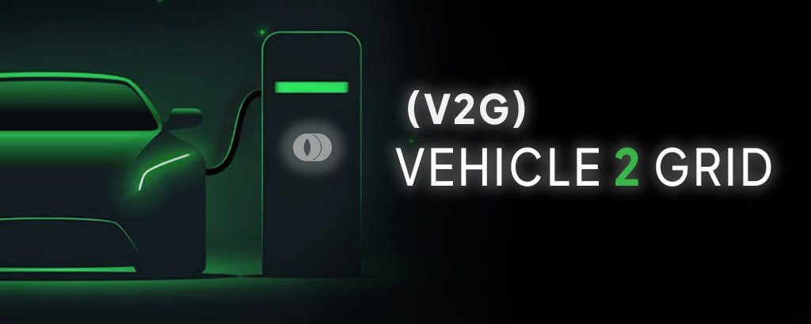
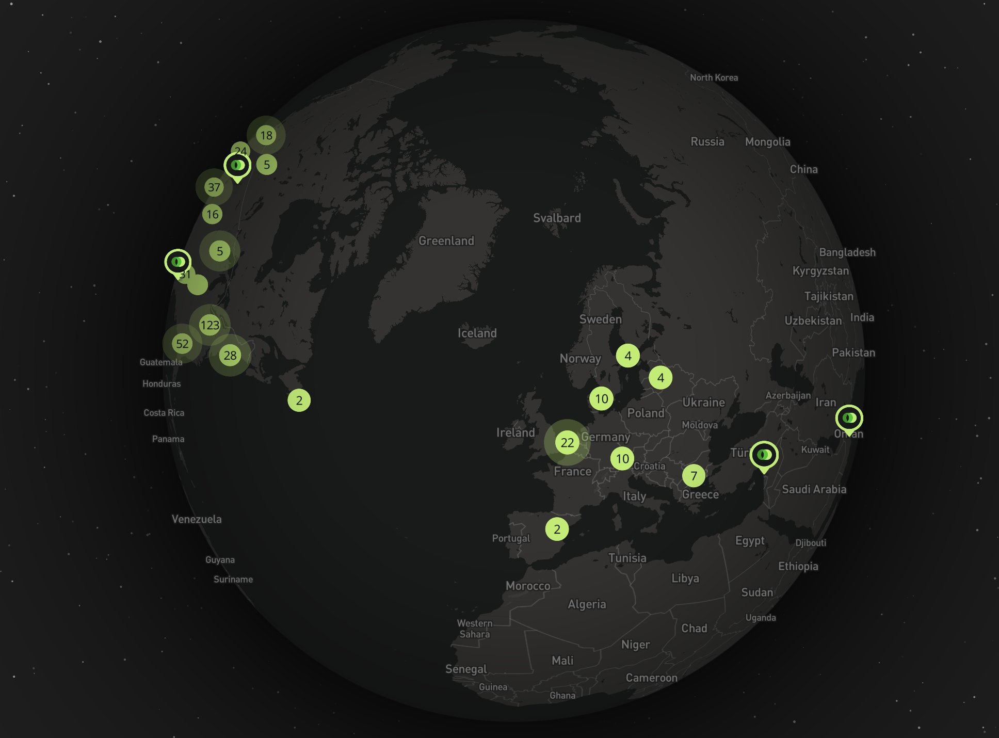
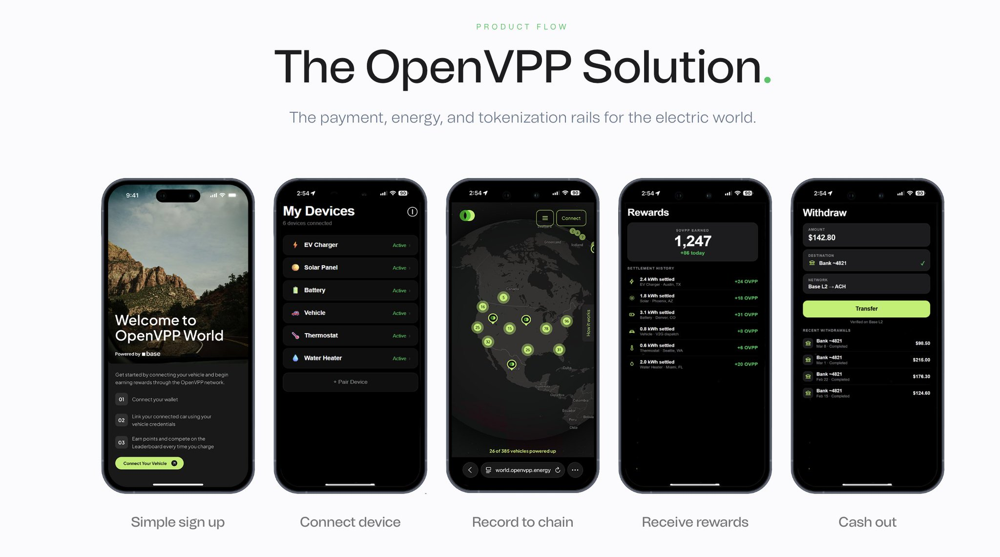

# Ovpp



# The Coming Grid Collapse They Don't Talk About

Energy infrastructure built decades ago cannot handle the current demand. Data center needs are exploding with AI training requiring gigawatts of capacity. EV sales hit 17 million units in 2024 and are projected to exceed 30 million annually by 2030. Rooftop solar installations are growing at double-digit rates every year. Home batteries, smart thermostats, and controllable HVAC systems are adding millions of distributed energy resources to a grid designed for centralized, one-way power flow.

Elon Musk has been signaling the energy crisis for years. Tesla's entire business model shifted from pure EVs to an integrated energy network — vehicles, solar, storage, and grid services all working together. The Cybertruck was marketed with energy capabilities baked in. Tesla Energy expanded rapidly to build out battery storage capacity. The reason is simple: Musk understands that energy, not capital, is the real constraint on technological advancement.

The grid operators see this coming. US electricity demand is projected to grow 15-20% by 2030 after decades of stagnation. Peak demand events are becoming more frequent and more severe. The existing transmission and distribution infrastructure cannot handle this load without massive investment. Traditional solutions — building new power plants and transmission lines — take 10-15 years and face enormous regulatory and environmental hurdles. The only path forward is to make the grid smarter, more flexible, and more distributed.

The regulatory environment is pulling in the same direction. California, New York, Texas, and Massachusetts all have active virtual power plant procurement targets. The GENIUS Act is moving regulatory clarity on stablecoins forward in the US. Europe's ENTSO-E framework is pushing similar requirements across EU grid operators. State-level mandates for VPPs and demand response are creating utility procurement pressure that didn't exist two years ago. The timing is asymmetric — the need is urgent, the solutions are emerging, and the regulatory window is opening.

# The Multi-Trillion Economy Running on Fax Machines

The physical infrastructure is transforming. The payment infrastructure is not.

Your electric vehicle finishes charging at 2 AM. It drew power during an off-peak window, helped stabilize the grid, and maybe exported stored energy back during a demand spike. The grid operator benefited in real time. Your reward? A line item adjustment on next month's bill — if the program even tracks it correctly.

That's not a software bug. That's the architecture. The global electric utility industry settles transactions on payment rails designed for once-a-month, human-initiated billing cycles. The meter reader has been replaced by a smart device. The settlement system has not.

When a utility tries to integrate an EV charger or a home battery into a demand-response program, they build a custom "one-off" integration with that device vendor. Then another one for the next vendor. Each integration breaks when software updates. Each has its own counterparty agreements. Each settlement cycle takes 30–90 days to clear. At the powerplant level, reconciliation can take six months. None of it was designed for micropayments denominated in kilowatt-hours at machine speed.

The gap is structural. Legacy meter-data management systems are proprietary. They speak only to their own hardware and have no standard API for external devices. Over 40 brands of EVs are on the road. Rooftop solar installations, home batteries, smart thermostats — every year adds millions more distributed energy resources to a grid that wasn't built to interact with them at the device level. The existing utility back-end can only speak to its own meters. It has no payment layer for third-party devices at all.

> "In the last week the amount of EV's connected has gone up approximately 60% from 250 to 415. Metcalfe's law is taking place here, still at the early stages. This is why crypto was created, for real world use where web2 falls short." — [@Saltwater\_Alpha](https://x.com/@Saltwater_Alpha)

# The DNS for Energy Devices

OpenVPP is the first purpose-built, on-chain payment and settlement layer for the electric utility industry — a universal routing protocol that lets utilities, device vendors, and consumers transact at machine speed, denominated in any unit that energy programs require.

The core architecture rests on two layers working in parallel. The first is a stablecoin payments engine that lets utilities settle in USDC directly or wrap it into energy-native tokens via on-chain oracles. One token can represent one dollar, one kilowatt-hour, one kilogram of avoided CO₂, or a time-of-use rate window. Settlement happens in under 10 seconds. Cost per transaction is under one cent.

The second is what OpenVPP calls a "DNS for DERs" — a decentralized routing and registry service that works like the internet's domain name system but for energy devices. A device manufacturer integrates once. A utility integrates once. After that, any device can connect to any utility automatically, with no custom bilateral integration required. The registry stores device identity, capability, protocol, and program enrollment on-chain. Every new device that joins expands the network value for everyone already on it.

```text
OpenVPP Architecture:

[EV / Solar / Battery / Charger]
         │  single integration
         ▼
[Integration Service] ←→ [Registry Service (on-chain)]
         │                        ↑
         ▼                        │
[Routing Service] ──────────────────
         │
         ▼
[Utility / Grid Operator / DERMS]
         │
         ▼
[Stablecoin Settlement Layer]
   Direct: USDC
   Oracle: $kWh / $NEM / $DR / $VPP
```

The flywheel is straightforward. Each new device that registers makes the network more useful to utilities: more dispatchable capacity, more grid visibility, more program candidates. Each new utility that integrates makes the network more useful to device vendors: more distribution, more programs, more revenue per device. Neither side needs the other to move first once a critical mass exists on either side.

The network is already in motion. 448 devices are live. 528 MWh of energy has settled on-chain. 31,128 energy transactions have cleared. OpenVPP supports over 40 EV brands — Tesla, Rivian, Porsche, BMW — and any OCPP-compliant charger. The expected value to a device owner is $100–$1,000 per year in program participation rewards, settled in [$OVPP](https://x.com/search?q=%24OVPP&src=cashtag_click) and USDC.



This is a 0→1 infrastructure play. The analog isn't a better demand-response platform. It's the payment layer that makes demand-response programmable at all.

# Why Nothing Else Closes This Gap

The natural question: why hasn't this been built? The answer isn't that electric power companies haven't tried. They have. The answer is that the problem isn't solvable from inside their existing architecture.

Utilities operate on proprietary back-end systems — meter data management platforms built by a handful of incumbents. These systems can speak to their own hardware. They cannot speak to a Tesla or a Rivian or an Enphase battery by design, because each of those devices speaks different protocols, and the utility would need to build and maintain a certified integration for each one. That's exactly the fragmentation OpenVPP eliminates with a single integration from each side.

Existing blockchain DePIN protocols aren't built for this either. Protocols like Helium or Hivemapper solve device coordination for wireless or mapping networks. Energy utility settlement has requirements that are genuinely different: sub-cent micropayments at high frequency, kWh-denominated accounting, time-of-use pricing windows, compliance with state-regulated tariff structures, and metering-grade audit trails for regulatory reporting. None of the existing DePIN infrastructure handles those constraints natively.

OpenVPP is building on Arc (Circle's Ethereum L1) for enterprise utility settlement and on Base for consumer-facing transactions. The choice of Arc matters — it was purpose-built for mission-critical financial settlement with sub-second finality, USDC-denominated gas, and built-in privacy. Revenue-grade settlement is native to Arc's architecture. A utility running a demand-response program tied to power market economics needs deterministic performance, not probabilistic finality. This is not a protocol that could run on any general-purpose chain.



The team's competitive advantage is not just the technology. The CEO, Parth Kapadia, was Director of Technical Product Management at AutoGrid, Schneider Electric's grid intelligence platform and the software layer sitting between utilities and DER fleets across the industry. He knows the existing infrastructure from the inside. Craig Cremean ran VP of Transmission Operations at Exelon, one of the largest US utilities. Vish Vankadari came from Tesla Energy's programs and product team. These are not crypto founders learning the energy industry. They are energy industry leaders building on crypto rails.

That background created a partnership pipeline that would take years to replicate. OpenVPP has already announced a Day 1 Architect relationship with Circle's Arc blockchain. A world-leading stablecoin issuer and a multi-billion dollar utility infrastructure vendor — both to be named post-launch — have committed as partners. Blackstart Infrastructure Partners (one of the largest US data center developers) signed an MOU to bring data centers on-chain as flexible VPP resources.

Noon Energy joined the OpenVPP alliance to develop on-chain energy receipts for ultra-long-duration storage targeting AI infrastructure. These are not logo partnerships. They are the distribution channel into the regulated utility infrastructure.

This edge compounds with data. Every device registered, every settlement cleared, every dispatch event executed builds a proprietary dataset of real-time grid behavior at the device level. That data has commercial value. Utilities and grid operators pay for "grid-level device awareness" via API, priced in [$OVPP](https://x.com/search?q=%24OVPP&src=cashtag_click). No new entrant can replicate years of on-chain device telemetry.

# The Market That's Being Created

The global electric utility industry processes trillions in payments annually. That number is the baseline of transactions currently flowing through legacy billing systems. OpenVPP's immediate target is not all of it. The near-term wedge is the DER segment, which is growing faster than any other part of the grid.

The global distributed energy resources market was valued at $282 billion in 2022 and is projected to reach $745 billion by 2030, a CAGR of 11.4%. EV adoption is accelerating: global EV sales hit 17.1 million units in 2024 and are projected to exceed 39 million annually by 2030. Each EV is a mobile battery capable of two-way grid interaction. Each rooftop solar installation is a micro-generator. Each smart thermostat and home battery is a controllable load. The addressable device count is in the billions by the end of the decade.

Grid flexibility programs — which pay consumers to reduce power usage during peak times — are projected to grow from $4.5 billion in 2023 to $30 billion by 2032. These programs require exactly the settlement capabilities that don't exist today and that OpenVPP is building: instant verification of device behavior, real-time reward issuance, and device-level audit trails. The market is being created by the infrastructure gap, and OpenVPP is closing the gap.

Timing is not coincidental. The GENIUS Act is moving regulatory clarity on stablecoins forward in the US. Circle's Arc launch opens a settlement layer with revenue-grade finality that didn't exist 18 months ago. State-level mandates for virtual power plants are expanding — California, New York, Texas, and Massachusetts all have active VPP procurement targets. Europe's ENTSO-E framework is pushing similar requirements across EU grid operators. The regulatory environment is pulling utilities toward exactly the kind of programmable, auditable settlement infrastructure that OpenVPP provides.

OpenVPP's distribution model is not direct-to-consumer. It is a regulated utility vendor partnership model — plugging into the existing software platforms that utilities already use for meter data management. That gives them access to utility customer bases of millions of devices without building a direct sales channel to each one.

# Project Valuation

Grid flexibility programs hit $30B by 2032. If OpenVPP captures 2% market share in settlement infrastructure, that generates approximately $600M in annual protocol fees and API revenue. At a 20x revenue multiple — conservative relative to Helium Network's historic peak multiples or comparable early-stage DePIN infrastructure — that implies a $12B market cap.

More near-term: if OpenVPP captures just 0.1% of annual global DER transactions, protocol fees at sub-cent per transaction still generate [$50M+](https://x.com/search?q=%2450M%2B&src=cashtag_click) annually at scale. At 15x (discount for early stage), that implies $750M market cap from current $13.8M — roughly 50x from here.

The realistic 12-month case is more modest. If the undisclosed utility vendor partnership gets announced and brings 10,000 devices onto the network, that's a 20x increase in network scale from the current 448 devices. Protocol revenue begins to be measurable. The token re-rates toward comparable early-stage DePIN projects that have achieved $100–$300M market caps on similar device counts and weaker foundations. That implies 7–20x from the current price.

Today's price implies almost nothing has to work. At $13.8 market cap, the market is pricing in a near-zero probability of utility-scale adoption. The asymmetry is real.

# Token Mechanics

[$OVPP](https://x.com/search?q=%24OVPP&src=cashtag_click) has three economic functions. Every new device registration requires a discrete amount of [$OVPP](https://x.com/search?q=%24OVPP&src=cashtag_click). Every commercial API call, specifically utilities paying for grid-level device awareness data, is denominated in [$OVPP](https://x.com/search?q=%24OVPP&src=cashtag_click). As device count scales, fee volume scales. Total supply is fixed at 1 billion tokens. There is no inflationary emission schedule. The tokenomics are deflationary by design as utility demand for registry access grows.

Governance gives [$OVPP](https://x.com/search?q=%24OVPP&src=cashtag_click) holders' voting rights on protocol direction, including decisions on future device support. This matters because device support decisions directly affect the addressable network. Each new supported EV model or charger protocol expands the TAM.

Staking launched on April 8, 2026. Device owners earn rewards for demand-response participation, paid in [$OVPP](https://x.com/search?q=%24OVPP&src=cashtag_click) and USDC. Token holders without EVs can stake for network security rewards. The early-staker premium is explicit in the design: highest rewards for the earliest participants. 1% of the total supply has been allocated to the Fomo trading platform for liquidity distribution.

With ~80% of supply circulating, dilution risk is low compared to most early-stage DePIN tokens, where 70–80% of supply is still locked. The unlock overhang that kills token price post-TGE for most protocols is largely absent here.

# The Team

**Parth Kapadia (CEO/Founder)** — Former Director of Technical Product Management at AutoGrid (Schneider Electric's grid intelligence platform). Prior roles at Exelon Corp. He spent years inside the infrastructure he's now replacing.

**Craig Cremean** — VP, Transmission Operations at Exelon Corp. Brings direct utility operations experience and the credibility needed for regulated utility partnerships.

**Kumara Aditya** — Digital Innovation at Schneider Electric. Technical depth on the utility software stack.

**Vish Vankadari** — Programs & Product at Tesla Energy. Understands DER fleet management from the largest EV manufacturer's perspective.

**Michael Grasso (Strategic Advisor)** — Former CRO at Sunnova Energy (NYSE: NOVA), CMO at Sunrun (NASDAQ: RUN), and TXU Energy (Vistra Corp, NYSE: VST). Brings utility commercialization and GTM experience at scale.

**Matt King** — Founder & Managing Partner, Vanquish Ventures.

The team is ex-Schneider Electric, ex-Exelon, ex-Tesla Energy. These are the people who ran the software and operations at the platforms OpenVPP is integrating with. The network effects of their prior relationships are not replicable.

# External Signals

[@tryfomo](https://x.com/@tryfomo) — 45,943 followers — Consumer trading platform

[@Saltwater\_Alpha](https://x.com/@Saltwater_Alpha) — Independent analyst — On-chain observer

**Blackstart Infrastructure Partners** — MOU signed — One of the largest US data center developers/operators

**Circle Arc (Day 1 Architect)** — Partnership — World-leading stablecoin issuer

**1M miles driven on-chain** — Network milestone — April 4, 2026

# Trade Setup

Current market cap: . Fully diluted valuation: . Circulating supply is approximately 80% of total supply — minimal unlock overhang relative to most early-stage DePIN protocols.

The FDV/market cap ratio is 1.24x — one of the tightest ratios in DePIN, meaning unlocks are not the risk here. Volume over the past 24 hours was $1.48M against a $13.8M market cap — a 10% daily volume/market cap ratio indicating active trading at this price level.

The token is in a prolonged accumulation phase at $5M–$30M market cap — the precise window where whales, private groups, and smart money historically position before protocol metrics become undeniable. 60% EV growth in one week, staking launch on April 8, and the upcoming utility partner announcement are all catalysts that haven't been priced in yet.

Market sentiment reinforces this setup. The crypto fear and greed index sits at 27 (Fear) with a 7-day average of 21.9 — deep in fear territory. BTC dominance at 59.4% with USDT dominance rising signals the broader market remains risk-off. This creates the ideal environment for asymmetric entries.

Near-term catalysts are stacked: the undisclosed utility vendor partner announcement (described as "multi-billion dollar" in docs), the Circle stablecoin partner announcement, and continued device network growth as staking rewards pull more EV owners onto the platform. The Blackstart data center MOU is the first institutional-scale VPP asset in the network — watch for more enterprise announcements in Q2.

The near-term accumulation range is $0.012–$0.022. Position before the utility partner announcements. $0.03–$0.05 is the first technical resistance range if device count accelerates toward 2,000–5,000 in Q3. The 12-month thesis target is $100–$300M market cap on utility partnership confirmation and 5,000+ devices live.

The 12-month path is clear. Utility partner announcements drive re-rating toward $100–$300M market cap. At 12–24 months, full MDM 2.0 deployment through the utility vendor's distribution channel pushes device count toward 50,000+ and makes commercial API revenue material. At 3+ years, the DNS for DERs becomes the standard settlement layer across multiple regulated utility territories — capturing a meaningful share of the world's 1B+ connected energy devices coming on-chain.

# The Risks

**Regulatory fragmentation** — Utility regulation is state-by-state in the US and jurisdiction-by-jurisdiction globally. Each territory has its own tariff structures, program approval processes, and data privacy requirements. OpenVPP's compliance architecture needs to work across all of them. A single regulator blocking a key market could delay revenue timelines significantly.

**Partnership dependency** — The undisclosed utility vendor and stablecoin partner are central to the go-to-market thesis. If these partnerships are delayed, restructured, or fall through entirely, the distribution model changes. The "multi-billion dollar" utility vendor claim is unverifiable until announced.

**Device network adoption rate** — 448 devices is proof of concept, not proof of scale. Crossing from early adopters (EV enthusiasts willing to connect their cars to a crypto protocol) to mainstream utility program participants requires a different distribution motion. The regulated vendor partnership model addresses this, but execution timelines are uncertain.

**Competitive response from incumbents** — AutoGrid, Oracle Utilities, Itron, and other utility software vendors have existing relationships with every major US utility. If any of them build a comparable DER settlement layer, OpenVPP's early lead erodes. None has done so yet, but the gap creates an incentive.

**Token liquidity at current market cap** — $13.8M market cap means small position sizes can create significant price swings in both directions. Sizing accordingly is not optional.

**Smart contract and technical risk** — OpenVPP settles real energy transactions tied to physical grid events. A smart contract failure or oracle manipulation during a demand-response event has operational consequences beyond token price. The security requirements are higher than a typical DeFi protocol.

**BTC/macro correlation** — At $13.8M market cap, [$OVPP](https://x.com/search?q=%24OVPP&src=cashtag_click) trades like a micro-cap token, not a utility infrastructure protocol. A broad BTC correction will take it down regardless of fundamentals. The fear index at 21.9 seven-day average, signals that risk is present now.

The thesis holds through most of these risks because the structural gap is real and the team has credible, non-replicable access to the distribution channel. The utility industry needs this infrastructure — the risk is execution timing, not whether the need exists.

# Conclusion

The energy grid has become a distributed, real-time network of machines that generate, store, and consume power dynamically. The payment layer has not kept up. That gap represents transactions running on infrastructure that can't denominate value in kilowatt-hours, can't settle in under 30 days, and can't speak to a Tesla or a Rivian without a custom integration built from scratch. OpenVPP is the first protocol designed to close it — not by building another DePIN experiment, but by building the settlement standard the utility industry actually needs.

The timing aligns. Circle's Arc is live. Stablecoin regulation is advancing. State VPP mandates are creating utility procurement pressure that didn't exist two years ago. The team has spent their careers inside the infrastructure they're replacing, with direct relationships at the platforms that serve the utility industry. A world-leading stablecoin issuer and a multi-billion dollar utility vendor are both in the pipeline, both unannounced. The window between "announced partnership" and "priced in" is closing.

If the thesis is correct: 10,000+ devices by the end of the year, utility partner distribution enabling 100,000+ devices within 24 months, and commercial API revenue beginning to accrue — [$OVPP](https://x.com/search?q=%24OVPP&src=cashtag_click) should trade at $100–$300M market cap within 12 months, and [$1B+](https://x.com/search?q=%241B%2B&src=cashtag_click) is a reasonable 2–3 year target if even 0.5% of DER settlement volume routes through the protocol. The current $13.8M market cap prices in nearly zero probability of any of that happening.

Watch for the utility vendor announcement. Watch for device count crossing 1,000, then 5,000. Watch for the first major utility territory signing an MDM 2.0 program through OpenVPP. Those are the signals that convert the thesis from an infrastructure play to a protocol revenue story. The architecture is built to last.

- **X:** [@OpenVPP](https://x.com/OpenVPP) 
- **Website:** [https://openvpp.energy](https://openvpp.energy/) 
- **Community:** [https://t.me/OpenVPP](https://t.me/OpenVPP) 
- **CA:** 0x8C0d3ADCF8Ce094E1aE437557Ec90A6374dC9BDD

This document is for informational purposes only and does not constitute investment advice or an offer to sell or solicitation to buy any securities or investment products. All investments involve risk, including the possible loss of principal. Past performance is not indicative of future results. Any forward-looking statements or hypothetical examples are subject to risks and uncertainties and are not guarantees of future performance. No client-adviser relationship is established by this material. The author assumes no responsibility for the accuracy or completeness of third-party information referenced.