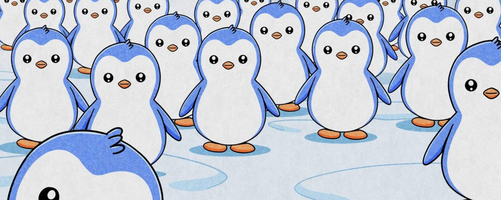
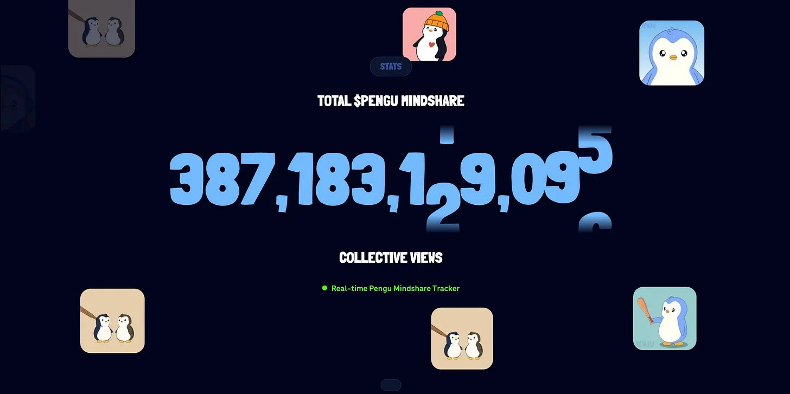
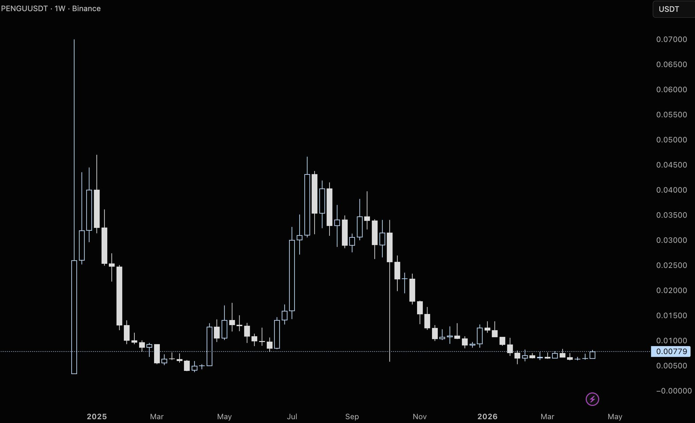

# Pengu



## Why The Old IP Model Died, And Nobody Noticed

Every major consumer brand of the last century was built the same way. You spend years, sometimes decades, manufacturing cultural relevance. You pay celebrities. You run Super Bowl spots. You plant your IP in the hands of children through toys, cartoons, and coloring books, betting that the impressions compound into loyalty before the next challenger gets there first.

It works, slowly. Sanrio built Hello Kitty over fifty years. Pokémon took two decades to go from a Game Boy cartridge to a $150 billion franchise. Disney has been compounding Mickey Mouse since 1928. The model works well — but only if you get there first, and only if your community never gets the chance to own a piece of what they're building.

That last condition is where the entire model breaks. Fans pour billions into licensing revenue for IP they will never share in. A die-hard Pokémon collector who has spent $30,000 on cards over twenty years captures exactly zero of the value he helped create. No royalty. No equity. No upside beyond the cards themselves. The relationship is transactional by design: you consume, they capture.

What nobody in the traditional IP world has yet reconciled is that this model is now structurally replicable — and for the first time in history, a challenger can build community ownership from day one. Not later. Not as a reward for long tenure. From the moment someone buys the first toy off a Walmart shelf, scans the QR code on the package, and lands on-chain for the first time.

It works, slowly. Sanrio built Hello Kitty over fifty years. Pokémon took two decades to go from a Game Boy cartridge to a $150 billion franchise. Disney has been compounding Mickey Mouse since 1928. The model works well — but only if you get there first, and only if your community never gets the chance to own a piece of what they're building.

That last condition is where the entire model breaks. Fans pour billions into licensing revenue for IP they will never share in. A die-hard Pokémon collector who has spent $30,000 on cards over twenty years captures exactly zero of the value he helped create. No royalty. No equity. No upside beyond the cards themselves. The relationship is transactional by design: you consume, they capture.

What nobody in the traditional IP world has yet reconciled is that this model is now structurally replicable — and for the first time in history, a challenger can build community ownership from day one. Not later. Not as a reward for long tenure. From the moment someone buys the first toy off a Walmart shelf, scans the QR code on the package, and lands on-chain for the first time.

The window to build the next great global IP using the old rules is closing. The window to build using the new rules has been open for exactly four years. One team saw it early, executed without pause, and is now sitting on an asset that cannot be replicated on a compressed timeline. The moat isn't the penguin. The moat is four years of compounding decisions that would take any competitor a decade to retrace.

What makes this IP different is that it was born in crypto, not in a corporate boardroom. Four college students launched Pudgy Penguins on July 22, 2021 — 8,888 uniquely generated penguin NFTs with over 150 traits on Ethereum. The collection sold out in 19 minutes at 0.03 ETH. Floor prices rocketed to 100x mint value, with the rarest Pudgy (#6873) selling for 225 ETH ($775,000) in August 2021. By year's end, the project had generated over $100M in secondary market volume.

The acquisition story matters here. By January 2022, community revolt reached its peak. Holders voted to remove founding team members amid rumors of fund misuse and failed roadmap delivery. The project in crisis was acquired for 750 ETH ($2.5M) in April 2022 by Igloo Inc., founded by Luca Netz (CEO), Lorenzo Melendez (President), Peter Lobanov (CCO), and Vedant Mangaldas (Head of Strategy). They completely restructured the vision with a refreshed mission statement: "Pudgy Penguins exists to create a home where everyone can be somebody." Floor prices recovered from sub-1 ETH to above 5 ETH by year's end as the turnaround began.

Here's the evolution that most miss: culture tokens and memecoins follow a simple lifecycle — idea, launch, narrative dies, community dies. Social currencies take a different path — idea, launch, narrative becomes brand, brand proliferates, ecosystem forms, globally adopted currency. PENGU has already crossed from the first path to the second. That transition is the structural edge.

## The Gif Empire Nobody Saw Coming

The internet's relationship with culture is measured in GIFs.

This sounds trivial until you look at the data. GIPHY processes over 10 billion API requests per day — embedded in every major messaging app, social platform, and keyboard in the Western hemisphere. When you send a reaction in iMessage, Slack, or Instagram, you are almost certainly sending a GIF sourced from GIPHY. The brand that controls the most-viewed GIF library controls the emotional vocabulary of internet communication.

Pudgy Penguins has 28,500 GIFs on GIPHY with 278 billion GIF views and 387+ billion total views across all platforms. Disney, with a century of IP and the most recognizable characters on earth, has 587 uploads and 23 billion views. Pokémon — a $150 billion franchise — has 10.8 billion. Hello Kitty, 7.4 billion. The brand reaches 5 million global followers across social platforms.



The gap is not a rounding error. Pudgy Penguins has more than 12x the GIF views of Disney. They did not get there through a hundred-year legacy. They got there by treating impression volume as a primary business metric when every other brand, crypto or otherwise, was optimizing for revenue.

This is the key insight most analysts miss when they model the business. Luca Netz said it plainly at KBW in April 2026: "I am in the business of proliferating the penguin. Impressions and eyeballs trump all. I am a little less concerned about how much money that Pudgy Penguin brand and business makes and more concerned about how popular the penguin is in Web3 and Web2 culture."

That is not a cope. That is a deliberate sequencing decision made by someone who watched how Disney built Mickey and decided to compress the timeline from a century to a decade. The infrastructure to deliver that impression volume, a brand character versatile enough to be funny, warm, sad, and celebratory, is now built. 300 million people interacted with the brand daily by January 2025. That number does not appear from nowhere. It is the compounding result of a specific decision made in 2022 to treat GIF distribution as a distribution channel, not a marketing tactic.

The awareness matters here. Culture tokens lack awareness — they monetize viral moments until those moments disappear. Social currencies are aware — they create trends and catch them, remaining relevant as culture shifts. PENGU has demonstrated this awareness for four straight years across bull and bear markets. Awareness equals relevance, relevance equals attention, attention equals momentum. Unless you are at the top of crypto legacy, anything that lacks awareness will die.

## What The Market Is Getting Wrong About Pengu

Most analysts look at PENGU and see a meme coin with toy sales. That framing is wrong in ways that matter to the price.

PENGU is not a memecoin. It is what Luca Netz calls a "social currency" — a token that has graduated into something with fundamentals. Social currencies are strategic. They create trends rather than monetize them. They are built as Player vs Everyone — bringing new people into crypto — not Player vs Player, the musical chairs game most projects play.

The correct frame is this: Igloo Inc. is a brand-building machine that has figured out how to wire community ownership into every layer of the funnel — and is now building the financial rails to make that ownership liquid, institutionalized, and globally accessible.

**The physical products aren't toys. They are onboarding infrastructure.**

Every Pudgy toy sold at Walmart, GameStop, and Target — 3 million units across 10,000+ retail locations globally — comes with a QR code. Scan it, go through a wallet creation flow, and within 60 seconds you are an on-chain Abstract Chain user. No prior crypto knowledge required. The toy is not a revenue line. It is a distribution mechanism for a Layer 2 blockchain, dressed as a $15 plush.

The retail expansion followed a specific playbook. The launch of Pudgy Toys in May 2023 generated over $500,000 in first-weekend sales, with 20,000+ units sold and #1 rankings on Amazon.

Success expanded beyond the initial 2,000 Walmart locations worldwide to include Target, GameStop, Smyths, Five Below, Big W, and Walgreens, ultimately reaching upwards of 10,000 retailers worldwide and selling over 2 million toys globally. Notably, penguin designs were licensed directly from NFT holders who received royalties for toys sold worldwide. Meanwhile, Pudgy Penguins Instagram amassed hundreds of millions of views and reached 1 million followers in under a year, establishing true mainstream cultural relevance.

**The royalty structure isn't a gimmick. It's a reinvention of the IP licensing model.**

Every toy sold pays a royalty in perpetuity to the NFT holder whose penguin was used to design it. These are not large individual checks. But the structural implication is enormous: for the first time, early believers in an IP brand capture a share of every physical unit that brand sells, forever, at every retailer in the world. Luca's framing at KBW is useful here. Imagine owning a first-edition Charizard that earns you a royalty every time a new Pokémon toy ships. That ship never came for Pokémon fans. It is already sailing for Pudgy holders.

**The community isn't a Discord. It is a distribution network embedded into every major institution in crypto.**

Luca describes what he calls the "Pengu Pal Mafia" — the observation that in virtually every major organization in the crypto space, someone in leadership holds a Pudgy Penguin NFT or PENGU tokens. Market makers, liquid funds, media companies, exchanges, institutional investors. This isn't correlation. It is a compounding network effect that turns every new institution entering crypto into a potential distribution partner, investor, or ally.


The cafeteria table analogy he uses lands because it's accurate. Being Pudgy Penguin aligned is a social signal in crypto. That kind of network effect doesn't appear on a balance sheet, but it shows up in institutional filings, ETF launches, and the speed at which partnerships get done.

```text
Traditional IP Model:              Pudgy IP Model:
[Brand] → [Products] → [Fans]     [Brand] → [Products] → [Consumers]
                                              ↓
                                        [QR Code / Scan]
                                              ↓
                                    [On-chain / Token Holder]
                                              ↓
                                    [Royalties + Community]
                                              ↑
                                    [Builders / NFT Holders]
                                              ↑
                                   [Reinvests in Brand Growth]
```

The core difference: fans of traditional IP consume and leave. Pudgy participants are aligned with the brand's upside from first contact.

## Why No One Catches Up

It is easy to say "Pudgy has a strong brand." It is harder to quantify why the lead is structurally insurmountable for anyone trying to enter in 2026 or later. But the answer becomes clear when you map the sequence of decisions since April 2022.

The brand was acquired for $2.5 million — 750 ETH — in April 2022. Bear market. NFT sentiment is at a low. The team's first move was not a token launch or a floor-price campaign. It was a Bloomberg feature, a "Quest Map" for IP development, and a partnership with PMI Toys — the manufacturer behind Fortnite and Nickelodeon branded products.

By September 2023, Pudgy toys were in 2,000 Walmart stores. By February 2024, Walmart placed a re-order expanding to 3,100 stores.

Consider what that re-order represents. Walmart does not extend shelf space for products that don't move. A re-order from Walmart is one of the most credible external validations a consumer brand can receive — more meaningful, operationally, than any endorsement deal.

By June 2024, the team announced Abstract Chain and Igloo Inc., turning the brand into a full technology company with its own Layer 2 blockchain. The toys now onboard users into a proprietary chain. The GIF library drives traffic to branded experiences. The token captures value across all layers.

No competitor can replicate four years of Walmart re-orders, 387 billion total views, a $9M seed from 1kx, WME representation for film and TV, a Random House book deal, a DreamWorks Kung Fu Panda collaboration, a Manchester City uniform deal, a GameStop partnership, and now a PlayMonster Games collaboration — and compress it into 12 months.

The compound interest on four years of delivery is not catchable. A new entrant would need to start from GIF zero, toy shelf zero, and community zero simultaneously, during a market cycle where attention is finite and Pudgy already occupies the "crypto mascot" position in the public mind.

The brand Luca is building toward is not "crypto's best NFT project." It is crypto's face to the mainstream world — and beyond that, the face of finance itself. When Pengu appeared in the Bitwise ETF commercial and the VanEck ETF commercial in 2024, it was not a sponsorship. It was validation that institutional products were choosing this brand, not the other way around.

## Market Opportunity

The consumer IP business is a $300+ billion annual licensing market. The plush toy segment alone is $20 billion. Pokémon, the most successful entertainment IP ever built, generates approximately $15 billion annually across all verticals.

The business Pudgy is building is not trying to capture a percentage of these markets — it is trying to own a new category that none of them occupy: community-owned global IP with on-chain equity rails.

Social currencies combine the best of both worlds. They have the retail appeal and viral mechanics of culture tokens, but they are interesting enough for institutions to participate. This is why VanEck and Bitwise chose Pudgy for their institutional ETF commercials. This is why the Canary Capital ETF filing exists. You get upside potential with fundamentals that justify institutional allocation. That combination is rare.

The near-term addressable market is concrete. At $50 million in annual revenue from toys and apparel across 10,000 retail locations — a milestone already reached — Pudgy is generating more real-world revenue than almost any other Web3 native project that exists today. The pathway from $50M to $500M is a product of two things: retail expansion into Asia (where Line Friends and Lotte are live partnerships) and monetization of digital products.

The Pengu Card launched globally across 170+ countries in early 2026 with Visa and KAST. Usable at 150 million merchants. This product does not generate immaterial transaction fees — it wires the Pengu brand into daily financial behavior for users who may have no prior crypto exposure. The Pengu Card is Pudgy's entry into consumer finance. Luca has said plainly that Pengu will be the face of finance. The card is the first instrument that makes that statement operational.

The Canary Capital spot PENGU ETF filing with the SEC is the institutional layer. If approved, this becomes the first ETF structure built around a community-born token — combining NFT exposure with token exposure in a single regulated product. The filing was picked up by the CBOE. This is not uncertain. It is the formalization of an asset class that institutions have been informally participating in since 2022.

Citi projects a 45% CAGR for the stablecoin market. The gaming market for collectible card games — which Pudgy enters through Vibes TCG — is projected at $12 billion by 2030. Pudgy World launched with 50,000 sign-ups in its first month. Pudgy Party surpassed 500,000 downloads in two weeks. A new Lil Pudgys brand features its own YouTube series targeting children and tweens, with a standalone product line planned for retail launch in 2026-2027. Pudgy Party, a highly anticipated iOS game developed with Mythical Games, is set for global launch, alongside a refreshed Pudgy Penguins product line hitting retail in late 2026.

Most significantly, Igloo Inc. is establishing APAC operations to aggressively position Pudgy Penguins across major Asian markets, with dedicated APAC-specific creative, marketing, and product teams being assembled to meet rapidly growing regional demand. This multi-pronged approach positions Pudgy Penguins not just as a crypto success story but as a global entertainment franchise spanning digital experiences, physical products, and cultural markets worldwide.

PenguBot extends the ecosystem into agentic AI trading as the ultimate agentic trading companion on Telegram. Trade smarter, faster, and safer with a self-custodial wallet across Solana, Ethereum, and Abstract. This brings PENGU into the agentic AI category, a major growth area in crypto, and provides more practical utility.

This multi-pronged approach positions Pudgy Penguins not just as a crypto success story, but as a global entertainment franchise spanning digital experiences, physical products, and cultural markets worldwide.

The total market Pudgy competes in is not crypto. It is a global consumer culture: toys, games, GIFs, fashion, finance, and entertainment. The crypto-native equity structure is the unfair advantage inside that competition.

## Valuation

At $50M annual revenue and a $709M FDV, PENGU trades at roughly 14x revenue. Compare that to Funko at 1x, Hasbro at 2x, and Disney at 2.5x. The premium appears steep on a traditional comp basis — but those companies are not growing at Pudgy's rate, do not have their community structure, and are not simultaneously building a Layer 2 blockchain, launching a Visa card, filing for an ETF, and pursuing a 2027 IPO.

The correct comparable is not a toy company. It is a hybrid consumer-tech brand with a defensible community moat and institutional distribution entering its first proper growth phase. On that basis, the 14x multiple is not a stretch — it is closer to fair value assuming the $50M revenue trajectory compounds at 40–50% annually toward the IPO.

The upside scenario: **$50M revenue × 30x growth multiple = $1.5B market cap** — approximately 3x from the current price — as a base case before the IPO narrative fully prices in. A mainnet Abstract Chain success story, sustained gaming DAUs, and ETF approval represent incremental catalysts that do not require extrapolating beyond the current trajectory.

The FDV at $709M versus a $501M market cap is a 1.4x ratio, with most unlocks tied to community claims and already behind us after the burn. Minimal unlock overhang relative to most tokens at this stage.

## Tokenomics

PENGU launched in December 2024 with a max supply of 88,888,888,888. The [$PENGU](https://x.com/search?q=%24PENGU&src=cashtag_click) launch took the crypto space by storm, achieving a $2+ billion market cap on day one and trending across all major exchanges. The token explosively expanded brand participation from 4,000 NFT holders to nearly 1 million [$PENGU](https://x.com/search?q=%24PENGU&src=cashtag_click) holders worldwide. The project airdropped over $1.5 billion to early believers and community members, with individual Pudgy holders receiving approximately $75,000 per penguin.

After the claim period closed in February 2025, 13.69% of the supply — 12.16 billion tokens worth approximately $98.2 million — was permanently burned. The token now has 737,046 holders. Combined with the current circulating supply, this positions PENGU as one of the most credible deflationary narratives in consumer-facing crypto.

The token also powers a Solana validator with 7-11% EST APY, 130,000 SOL staked by 393 unique stakers. This creates additional demand and staking mechanics beyond traditional token utility.

The token serves three distinct functions. First, as a cultural asset: integrated into 7,000+ Shopify stores globally, accepted on Lufthansa flights, and embedded as the native currency of the Pengu Card. Second, as a gaming primitive, PENGU operates as in-game currency across Pudgy Party, Pudgy World, and Vibes TCG — with Abstract Chain providing the settlement layer. Third, as an institutional-grade asset, the Canary Capital ETF filing combines NFT and token exposure in a single regulated structure, something no other consumer-born token has achieved.

The supply dynamic is structurally favorable. Post-burn, the deflationary story is real — not projected. Each toy sold that triggers a QR-code wallet creation adds a net new holder to the circulating base, without adding supply. Each new game user who acquires PENGU for in-game utility adds demand without inflationary pressure.

## The Team

**Luca Netz** acquired Pudgy Penguins and turned it into crypto's most recognized consumer brand within three years. Prior to Pudgy, he ran a D2C brand doing eight-figure revenue — experience that directly informed the retail-first, impressions-first strategy. His KBW keynote in April 2026 is the clearest articulation of the thesis: three verticals, one flywheel, one destination — the face of global finance.

The Igloo Inc. team shipped five distinct products in the last 24 months: the PENGU token, Abstract Chain mainnet, Pudgy Party, Pudgy World, and the Pengu Card. Teams that can ship across gaming, token economics, retail, and infrastructure simultaneously are rare. That execution velocity is the most credible signal available.

## External Signals

- **Canary Capital.** Spot PENGU ETF S-1 filing with the SEC, first-of-its-kind for a community-born token — An ETF filing from a credible issuer signals institutional conviction in the asset. Approval would create a regulated on-ramp for capital that currently cannot touch crypto-native tokens.

- **VanEck + Bitwise.** Both chose Pudgy Penguins as the brand for their Ethereum ETF commercials — Institutional asset managers chose Pudgy as the face of their regulated products. That brand judgment does not happen by accident.

- **Nasdaq Opening Bell.** The team rang the opening bell in 2025 alongside VanEck — Access to Nasdaq symbolics is earned, not bought. This positions the brand directly inside institutional financial infrastructure.

- **Congressman Tim Moore.** Changed his House floor profile picture to a Pudgy Penguin — Political mindshare is a leading indicator for regulatory favorability. Having sitting congressmen publicly aligned with the brand is without precedent in crypto.

- **SEC Commissioner Hester Peirce** — Direct meeting with the Pudgy team to discuss Web3 and consumer protection. **Why this matters**: Regulatory engagement at this level signals the brand is being treated as a mainstream stakeholder, not a crypto curiosity.
- **Technical Government Advisors** — Pudgy Penguins now holds the unique distinction of being technical government advisors. **Why this matters**: This cements their evolution from internet meme to serious institutional player shaping the future of financial culture. Few crypto projects have this level of government recognition.
- **Manchester City** — Premium collectible deal targeting 300 million global fans — Manchester City has 300 million global followers. This partnership directly addresses the brand's stated priority of Asia and Europe expansion.

- **Mediacom Toy BE@RBRICK** — Limited-edition high-end art collectible available in Japan — BE@RBRICK crosses Pengu's playful design with signature silhouette, available in Mediacom Toy stores across Japan from November 24, positioning Pudgy in the high-end collectible market alongside traditional art brands.

- **The Hundreds Collaboration**. Pudgy Penguins x The Hundreds collectible collection — Both brands started with stories shared through images. This collaboration expands Pudgy's presence into the streetwear culture, another avenue for mainstream crossover.

- **VANDYTHEPINK® Collaboration**. Streetwear drop combining two beloved characters — This limited drop brings together VANDYTHEPINK® and Pudgy Penguins in a playful fusion of cuteness and culture. It's as bold as it is adorable, expanding Pudgy's reach into the iconic streetwear space.

- **PlayMonster Games Partnership**. Bringing Pengu to life in IRL viral games — PlayMonster creates some of the most viral IRL games on the internet. This partnership extends Pengu's presence into physical gaming culture beyond digital experiences.

- **Sotheby's Auction** — "Snowed In: A Rare Pudgy Penguins Sale" — Sotheby's auctions position Pudgy Penguins in the fine art collectible market, validating the brand as art-worthy beyond toy pricing. This signals institutional art market acceptance.

## Trade Setup

[$PENGU](https://x.com/search?q=%24PENGU&src=cashtag_click) is currently trading at $0.00779, with a market cap of $501M and an FDV of . The token is down approximately 83% since the 2025 high and has been in a very tight re-accumulation range for the last few months. The recent daily volume spike could create a larger upside move and a potential breakout. However, if the crypto bear market continues, we might see an extended accumulation period.



The 90-day drawdown tracks the altcoin market's overall weakness rather than any project-specific decline. If anything, the brand has become structurally stronger over that period: the Pengu Card launched, the ETF filing went live, Pudgy World crossed 50,000 sign-ups, and $50M annual revenue was confirmed. Price went down while fundamentals went up. That divergence is the setup.

Key near-term catalysts are specific and trackable: ETF approval or SEC response to the Canary Capital S-1, the 2027 IPO roadmap becoming public, any movie or TV announcement (Luca referenced a potential movie at KBW), continued Asia expansion through the Line Friends and Lotte pipelines, and Pudgy World DAU milestones through mid-2026.

**Near-term (0–12 months):** ETF ruling, IPO announcement framing, movie/TV confirmation, Pudgy World to 500K users, Abstract Chain TVL crossing . Target: $1.5B–$2B market cap on sustained delivery.

**Medium-term (1–3 years):** IPO in 2027 if revenue trajectory holds. Asia retail rollout through Lotte, Line Friends, and new Korean/Japanese partnerships following the KBW focus. PENGU as default cultural currency in Western digital communication. The brand has participated in the largest TikTok livestream event, collaborated with major social influencers, and partnered with established brands like Penguin Random House, cementing Pudgy Penguins as not just an NFT success story but a legitimate cultural and financial phenomenon. Target: $2B–$5B FDV range if IPO valuation signals land in the $5B–$10B range for Igloo Inc.

**Long-term (3+ years):** The face of finance thesis plays out or it doesn't. If it does, you are looking at a Pokémon-scale IP with on-chain equity — and a token that is woven into the financial infrastructure of the brand from the beginning.

## The Risks

**Memecoin Risk** The market still prices PENGU partially as a memecoin. If broader speculative markets collapse or sentiment shifts, PENGU could face sell pressure unrelated to fundamentals. The challenge is continuing to build fundamentals that separate it from pure volatility.

**Execution Risk on Multiple Fronts** The team is running five distinct product lines simultaneously: retail toys, gaming (two titles), a Visa card, an L2 blockchain, and an ETF process. Dropping any one of these below the quality threshold damages the others. The most credible risk is Pudgy World user retention — DAUs that inflate at launch and collapse within 60 days would undermine the digital world thesis.

**ETF Denial or Delay** The Canary Capital S-1 is with the SEC. A denial on policy grounds — the commission ruling that a community-born token with NFT components is not suitable for an ETF structure — removes one of the strongest institutional catalysts. Not a thesis-killer, but a few month price headwind if it happens.

**Token Supply Overhang** Circulating supply is 62.8B of 88.8B max — approximately 70.7% circulating post-burn. The remaining 26B tokens represent potential future sell pressure depending on vesting schedules and team allocations. This is manageable but should be tracked against unlock dates.

**Asia Execution** Luca named Asia as the number one growth focus. The partnerships are in place — Lotte, Line Friends, Suplay in China, and the KBW keynote itself signals intent. But Asia retail delivery requires local partners, supply chains, and marketing that is culturally different from the US market. Stumbling on localization would delay the most important growth vector.

**NFT Floor Dependency** The royalty model — where NFT holders earn on every toy sold — creates alignment but also creates a price feedback loop. If the Pudgy Penguin NFT floor collapses significantly, the most engaged community members (NFT holders) are financially demotivated. A sustained NFT bear market would slow community-driven brand amplification. Pudgy Penguins reached unprecedented heights in late 2024 and early 2025, achieving all-time high NFT floor prices above 36 ETH while maintaining its position as the third most valuable collection globally. This floor strength validates the brand's premium position in the market.

**Competitive Response from Web2** Disney, Sanrio, or Pokémon Company could launch token-based community programs. They have not, and the structural barriers to doing so through legacy corporate governance are significant — but the risk is nonzero over a five-year horizon. Any major Web2 IP brand that successfully wires token ownership into its community would challenge the "first mover" narrative.

**Concentration Risk on Leadership** The brand's narrative is closely tied to Luca Netz personally. His presence at Nasdaq, KBW, congressional meetings, and ETF roadshows is part of the signal. A leadership transition would create uncertainty disproportionate to what it would at a more decentralized protocol.

## Conclusion

Four years ago, somebody bought a dying NFT project for $2.5 million and decided that the most important variable in building a generational IP was not storytelling, not product design, not even community — it was community ownership. Fans of every major IP brand on earth spend billions they will never see again. Pudgy Penguins changed that by wiring ownership into every layer of the brand: from the toy shelf to the blockchain, from the GIF library to the stock exchange.

PENGU is the execution bet. Everything else is hoping for luck.

The result is a brand that has 12x the GIF views of Disney, over 387 billion total views, 5 million global followers, $50M in annual physical product revenue, a Visa card in 170 countries, a spot ETF on the SEC's desk, a Solana validator with 393 stakers, a Mediacom Toy high-end collectible launch, and a congressman who changed his profile picture to a penguin on the House floor. None of that was accidental. Every data point traces back to a sequencing decision made early that most teams would not have made — optimize for reach before revenue, build community ownership before product market fit, wire the token into the physical product before the token was even launched.

But here's what most analysts miss about what Luca is actually betting on. Impressions are the engine, but they're not the destination. The thesis has three pillars: cultural dominance as the distribution layer, community ownership as the economic layer, and financial infrastructure as the monetization layer. Each pillar reinforces the other. Billions must huddle, but they also get paid.

The proliferation of the penguin across GIFs, toys, games, and now financial infrastructure creates a feedback loop that traditional IP cannot replicate. When a child scans a QR code on a Walmart toy and becomes a token holder, they are not just joining a community — they are buying equity in the brand they just helped build. When an ETF filer uses Pudgy Penguins in institutional commercials, they are not choosing a mascot — they are choosing the face of the asset class they are about to sell. When PENGU becomes spendable on Lufthansa flights, the token has crossed from crypto curiosity to payment infrastructure.

The timing is now asymmetric. The ETF filing has no historical precedent for a community-born token. The 2027 IPO would create the first crypto-native brand to go public on the strength of physical licensing revenue, not protocol fees. The Pengu Card wires the brand into daily financial behavior for users who have never touched crypto. The Abstract Chain turns every toy sale into a blockchain onboarding event.

If the thesis is correct — and the data to support it is not hypothetical, it is already printed — PENGU at $501M market cap is trading at a significant discount to its 12-month destination. The base case scenario of $1.5B market cap requires no new assumptions, only that current revenue compounds at the same rate it has for four years and that one of the five major catalysts (ETF, IPO roadmap, movie/TV, Asia scale, Pudgy World DAU) lands.

Watch the Canary Capital ETF ruling, the IPO timeline announcement, and Abstract Chain TVL as the three confirmation signals for this thesis. The penguin was always going to win the GIF war. The question is whether the market prices in that this is the first IP brand where the fans hold the equity before or after the IPO papers hit.

- **X:** [@pudgypenguins](https://x.com/pudgypenguins) 
- **Website:** [https://www.igloo.inc](https://www.igloo.inc/) 
- **Community:** [https://discord.gg/pudgypenguins](https://discord.gg/pudgypenguins)
- **CA:** 2zMMhcVQEXDtdE6vsFS7S7D5oUodfJHE8vd1gnBouauv

This document is for informational purposes only and does not constitute investment advice or an offer to sell or solicitation to buy any securities or investment products. All investments involve risk, including the possible loss of principal. Past performance is not indicative of future results. Any forward-looking statements or hypothetical examples are subject to risks and uncertainties and are not guarantees of future performance. No client-adviser relationship is established by this material. The author assumes no responsibility for the accuracy or completeness of third-party information referenced.