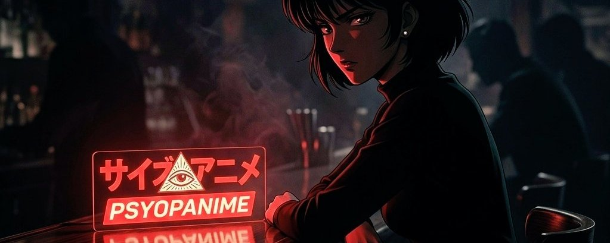

# PsyopAnime



## The Architecture That's Holding Legacy Media Back

The way most people under 30 consume news is broken — but not for the obvious reasons.

It's not that journalism is dying. It's that the format is no longer captivating. Text articles scroll past. Cable news runs in the background. The aesthetic language of institutional media — talking heads, lower-thirds, B-roll — was designed for a world where you had no other option. Today, attention is the scarcest resource on the internet, and legacy formats were never built to compete for it.

The deeper problem is structural. Traditional news production is slow by design. A story breaks, gets verified, gets edited, gets approved, gets published. The news cycle has compressed from days to hours. But production cycles haven't followed. The gap between "this just happened" and "here's a polished, shareable explainer" is still measured in hours at best — and the output that fills it is almost always either dry text or low-quality clips optimized for speed over impact.

At the same time, anime has quietly become the aesthetic language of the internet. Not just as entertainment — as a communication format. The visual vocabulary of dramatic reaction cuts, expressive characters, and cinematic pacing is fluent to anyone who has spent time on X, Reddit, or YouTube. It crosses linguistic barriers in a way a Western news anchor never will. A PsyopAnime clip got dubbed into Japanese and circulated with 43K views — that's not a curiosity, that's distribution no traditional news outlet has access to.

The gap this creates is precise: there's an enormous audience that processes the world through the lens of narrative drama, fluent in anime aesthetics, that gets its information from X in real time. Nobody was producing content specifically for that audience at broadcast quality. Nobody with production credibility, at least — until Aiden Guo started shipping.

## The Studio Model Nobody Saw Coming

PsyopAnime is a decentralized AI-native anime studio that converts real-time world events into cinematic short-form content — funded entirely by token fees, accountable entirely to its community.

The distribution strategy runs on multiple tracks simultaneously. The most visible is the quote-reply — a major news event breaks, PsyopAnime replies directly to the highest-engagement thread with a cinematic anime short, tapping existing audience momentum and riding the algorithm. When [Iran protests coverage](https://x.com/PsyopAnime/status/2010006573364748497) hit 244K views, and the [Chinese cargo anime](https://x.com/PsyopAnime/status/2043535169559130432?s=20) reached 135K views, that was the quote-reply engine at work. But that's only one lane.

The second track is the standalone drop — original narrative content that frames PsyopAnime's own cultural worldview and becomes the story itself. ["I get my news from psyopanime"](https://x.com/PsyopAnime/status/2013369656539574729?s=20) hit 892K views and became a self-reinforcing meme. ["The gaslighting is crazy"](https://x.com/PsyopAnime/status/2029267645707796640?s=20) landed 626K views without anchoring to any third-party thread. These aren't reactions — they're original cultural artifacts.

The third track is platform-native discoverability. X's trending algorithm has already featured PsyopAnime content in the ["What's Happening"](https://x.com/PsyopAnime/status/2013405252867744248?s=20) section [multiple times](https://x.com/PsyopAnime/status/2020152982986199048) — organic placement is typically reserved for major verified media outlets. That's the algorithm confirming what the engagement numbers already show: this content performs at the platform level, not within a crypto niche.

The fourth track is long-form episodic. YouTube at 62.3K subscribers runs as a parallel narrative universe — the [WW3 Venezuela episode](https://www.youtube.com/watch?v=QtVXX2bpGjA) hit 611K views, the [Iran Revolution episode](https://www.youtube.com/watch?v=XMOG-5TTiCg) 241K, Episode 3 hit 225K. These aren't short viral clips. These are cinematic episodes building a serialized narrative around geopolitical events, creating returning audiences who come back for the next drop.

All four tracks compound into each other. A viral clip drives YouTube subscribers. A trending placement drives X followers. A news outlet embed drives both. The studio is running a media network, not an X account.

The genuine breakthrough is what [@aidenguoai](https://x.com/@aidenguoai) brings to the production pipeline. He's credited on One Piece #1024 and Dandakan #4 — that's not a hobbyist with Midjourney. That's a professional anime director who understands shot composition, character consistency, and emotional pacing, applying that expertise to AI tools in a way that solves the hardest problem in AI video: style drift. The PsyopQueen character appears across dozens of clips with consistent design, expression range, and cinematic identity. That consistency is a moat. The tools are available to anyone. The directing eye is not.

```text
Breaking Event / Original Narrative
           ↓
  ┌────────┴──────────────┬─────────────────┐
  ↓                       ↓                 ↓
Quote-reply           Standalone         Episodic
to trending           cultural           YouTube
thread                drop               series
  ↓                       ↓                 ↓
  └──────────── Viral pickup ───────────────┘
                           ↓
          News outlets embed as explainer
                           ↓
          X Trending placement (organic)
                           ↓
      Token fees → studio headcount → scale
                           ↓
       Next event reaches compounding base
                  ↑___________________↓
```

The studio started with one person and zero budget in early 2026. By April, it had multiple full-time employees, professional director talent contracted in, a live broadcast platform at [psyopanime.xyz](https://psyopanime.xyz/), and a YouTube channel with individual videos clearing 600K views. That's roughly 90 days of operating history.

## The Tool Iteration Strategy

Here's what most analysts miss about AI-native studios: the tools are not everything. The iteration speed is.

PsyopAnime runs a live competitive testing process across every major AI video platform as each drops. Not as a side experiment — as a core production strategy.

- WonderCanvas [was tested and shipped](https://x.com/PsyopAnime/status/2025991934297481721) publicly.
- Seedance was [put through its paces](https://x.com/PsyopAnime/status/2021449395938762769) on actual content.
- Grok Imagine was [integrated and stress-tested](https://x.com/PsyopAnime/status/2017842852428980282?s=20), then [pushed further as the model improved](https://x.com/PsyopAnime/status/2038602864784732468?s=20).
- [The Grok Imagine community contest](https://x.com/PsyopAnime/status/2026732558806081811) in February 2026 — [$1,700 USDC prize pool](https://x.com/PsyopAnime/status/2032348791093776736?s=20), community-submitted 30s–2min animations — was simultaneously a quality stress-test and a community engagement play, generating free content and organic reach in a single move.

This matters because AI video generation is improving every 60–90 days in ways that completely reshape what's possible. A studio passively using one tool will be perpetually behind a studio actively evaluating every tool as it ships. PsyopAnime's production process is a public documentation of this advantage: iterative testing across platforms, post-production compositing across outputs, and deliberate aesthetic choices about which tool handles which kind of scene. The result is output that looks like it came from one coherent pipeline — because the director's eye is the constant, not the underlying model.

Any competitor entering this space starts from zero on tool optimization. PsyopAnime has 150+ days of live production data across every major AI video platform on the market. That gap widens every month.

## Why News Outlets Are Already Using Their Content

The most under-discussed signal in this thesis is not Elon's follow. It's the organic newsroom behavior.

- Breaking911 [posted a PsyopAnime clip](https://x.com/Breaking911/status/2027032625387343904) that reached 2.1M views.
- The Middle East Observer [embedded a clip](https://x.com/ME_Observer_/status/2013415711079633137) as a primary news source.
- ME24 [chose the video](https://x.com/MiddleEast_24/status/2010755211162161514) for breaking coverage.
- RTSG [embedded independently](https://x.com/RTSG_Main/status/2014051190904902053).
- BitcoinNews [picked it up](https://x.com/BitcoinNewsCom/status/2022430343106908638) without prompting.
- TBC [used it](https://x.com/TBC_on_X/status/2020544409281200548) as an explainer format.

None of this was coordinated. All of it was rational.

News outlets face the same engagement problem as everyone else — their audiences are migrating to formats that hold attention. A PsyopAnime clip on Iran protests outperforms a text headline by orders of magnitude in shares, replies, and time-on-content. Embedding it isn't an editorial compromise; it's an algorithm optimization. The outlets get engagement they couldn't produce themselves. PsyopAnime gets distribution it didn't have to pay for.

The scaling implication is direct: this pattern has no ceiling based on outlet size. A 500-follower account embeds a clip the same way Breaking911 does. A 50M-follower account does the same. The content earns placement through performance, not deals or ad spend. As geopolitical events accelerate and PsyopAnime's library deepens, more outlets covering more events will find existing content that fits the story they're covering. The embedded flywheel doesn't require PsyopAnime to do anything except keep producing. The internet does the distribution.

[@MarioNawfal](https://x.com/@MarioNawfal) has embedded their content twice — [Trump SOTU coverage](https://x.com/MarioNawfal/status/2026844690968985792) reaching 167K views and [Iran rescue coverage](https://x.com/MarioNawfal/status/2040933502317650050) reaching 152K. [@dom\_lucre](https://x.com/@dom_lucre) framed PsyopAnime as "[the US turned into anime](https://x.com/dom_lucre/status/2027032376572858853)" with 201K views. [@beffjezos](https://x.com/@beffjezos) [embedded a news cycle clip](https://x.com/beffjezos/status/2027652139087212560) with 55K views. [Infowars ran the content](https://x.com/infowars/status/2030083508794704020?s=20). None of these required outreach. All of them reinforced the same conclusion: this is what breaking news looks like when it's formatted for the people who actually run the internet.

## The Edge That Compounds With Every News Cycle

Every major media operation has a distribution advantage. PsyopAnime's is unusual because it gets stronger every time the world produces a story worth covering.

The core structural advantage is timing. Traditional studios cannot produce high-quality content in real time. The barrier isn't just technical — it's organizational. A traditional studio has approvals, legal review, compliance processes. PsyopAnime has a founding director, AI tools, and a community that amplifies on sight. When something breaks at 6am, PsyopAnime can post a cinematic anime short by 8am or even earlier.

The distribution network is the second edge. [@HotForMoot](https://x.com/@HotForMoot)'s quote tweet — "[he did in fact, send it all](https://x.com/beffjezos/status/2027652139087212560)" — reached 1.52M views and 17.8K likes. [@Babygravy9](https://x.com/@Babygravy9) independently [quoted](https://x.com/beffjezos/status/2027652139087212560) the same clip for 459K views and 10.2K likes. These are organic pickups from credible accounts with no financial incentive to share. The content earns placement.

The Elon dynamic is its own category. His follow in January 2026 created the first major upside movement. A PsyopAnime-adjacent clip subsequently [reached 35M views on his account](https://x.com/elonmusk/status/2031228289998795237) — that's not a follow-related bounce, that's the platform's owner implicitly endorsing the format. His smart followers list for [@PsyopAnime](https://x.com/@PsyopAnime) includes toly, Balaji, [@pmarca](https://x.com/@pmarca), and Nic Carter. When the people who built Solana, invested in crypto at its foundational layer, and defined web3 culture, are paying attention to the same account, that's a signal about where smart money's attention is pointing.

Aiden's director credentials matter more over time, not less. As AI video tools proliferate and more accounts attempt the same format, style consistency becomes the differentiator. Anyone can prompt WonderCanvas. Only a director with One Piece credits can maintain character continuity, emotional depth, and cinematographic consistency across 50+ clips at production speed. The AI tools are a commodity. The directing eye is not replicable.

## The Raise and What It Signals

In February 2026, PsyopAnime [publicly detailed their studio expansion plans and funding model](https://x.com/PsyopAnime/status/2028941532946968951?s=20) — token fees combined with community support fuel the scaling from solo operation to full studio.

This is not a VC round. There's no cap table, no preferred shares, no liquidation preference sitting above token holders. The funding mechanism is the community itself, which means incentives run in one direction: output quality drives token value, which drives studio capacity, which drives output quality. A traditional media company would raise a Series A at this stage and spend the next 18 months in board meetings justifying headcount. PsyopAnime hires when the product demands it, using capital that flows directly from community conviction.

The scaling trajectory confirms execution: zero-budget solo operation in early 2026, multiple full-time employees by April, professional director talent contracted in, and live broadcast infrastructure operational. That's not a studio raising money and building toward something. That's a studio that built something and is now raising to accelerate it. The distinction matters for timing.

## Market Opportunity

The market PsyopAnime is building into is not "crypto meme coins." That framing undersells it by several orders of magnitude.

The actual market is digital news media — roughly $27B in annual global revenue and structurally losing the attention of everyone under 35. Short-form video has already demonstrated the format shift: TikTok's news-related content reaches more 18–24 year olds in the US than any traditional outlet. YouTube news channels generate billions of views monthly. The question isn't whether there's a market for video-native news. It's those who capture the segment that want cinematic, narratively rich content rather than talking-head clips.

PsyopAnime's addressable segment sits at the intersection of geopolitics-engaged audiences and anime-native culture — young, global, internet-first. Conservative estimates put anime viewership above 500M globally. That demographic is politically engaged, underserved by current media formats, and demonstrably responsive to PsyopAnime's output. The channel built its audience in 90 days on a relatively small budget. That's product-market fit, not luck.

The growth drivers are structural. AI video generation improves at a pace that makes real-time production more viable every month — the studio's live tool testing process ensures it captures each wave of improvement before competitors know the tool exists. Geopolitical instability is producing an accelerating stream of content-worthy events. Every conflict, every hearing, every policy shift is a production opportunity. The WW3 series — Venezuela, Iran, Episode 3 — generated over 1M views on YouTube without promotional spend.

The expansion path is a live broadcast network. The [psyopanime.xyz](https://psyopanime.xyz/) infrastructure with live trackers and broadcast framing is already operational. That's not a content account — that's a media platform. Adjacent verticals are wide open: sports, finance, entertainment, political commentary beyond geopolitics. Each new vertical multiplies content surface area without requiring a new audience.

A studio with this distribution density, this production velocity, and this level of cultural resonance is not a $2.9M asset. The market cap reflects the current narrative discount on an early-stage culture play. It does not reflect what this becomes when a generation that grew up on anime is the primary news-consuming demographic on the planet.

## Project Valuation

Valuation for cultural tokens and content studios requires comparables, not revenue multiples. No direct comp exists, but the proxy landscape is instructive.

[@joecoin\_](https://x.com/@joecoin_), at a comparable stage — sub-$15M market cap, confirmed KOL follows, consistent virality — reached a $50M–$70M market cap as the cultural narrative solidified. That was the conservative outcome for a brand with a clear aesthetic identity and holders who came back after every correction. PsyopAnime has a similar polished content strategy, a professional director, a live studio, ongoing creative output that major news accounts are using without being asked, and a raise underway to accelerate it.

The current market cap is approximately . The ATH was $27M — driven by a single catalyst, before the studio had employees, before YouTube had 62K subscribers, before Breaking911 and Middle East Observer were embedding clips, before the live broadcast platform existed. All of that now exists. The token hasn't re-rated to reflect any of it.

FDV vs. circulating supply: clean. Fair launch via [pump.fun](https://pump.fun/), no VC allocation, no team cliff, no private round overhang. What capital flows into the operation comes from token fees and community — transparent, verifiable, and aligned.

Conservative scenario: cultural narrative solidifies, studio scales, PsyopAnime becomes the recognizable default for AI-native anime news. That's a $200M–$500M market cap outcome — a category-defining media brand that built its distribution through pure performance. Upside scenario: a sustained viral run, a platform partnership, or an Elon repost reprices the token ahead of narrative, and the market starts pricing the terminal media company case. At that point, the conversation isn't about hundreds of millions — it's about billions. The risk/reward at $2.9M reflects neither outcome.

## Tokenomics

[$PSYOPANIME](https://x.com/search?q=%24PSYOPANIME&src=cashtag_click) is a pure utility-alignment token. Its economic function is direct: transaction fees from trading volume flow back to fund studio operations. The founder's wallet is publicly disclosed — a transparency signal that distinguishes this from anonymous team launches.

The supply structure is clean. Fair launch via [pump.fun](https://pump.fun/) — no pre-mine, no VC allocation, no cliff unlocks, no private round overhang. Circulating supply reflects actual market participants. This is the correct model for a token that functions as a cultural alignment mechanism: holder interests are structurally aligned with studio success because the studio's output is what drives the token's cultural relevance.

Demand for the token is narrative and attention-driven. As studio output reaches new audiences — new embeds, new viral clips, new KOL exposure — new participants enter the ecosystem. Volume drives fees. Fees fund production. Production generates virality. The loop is self-funding and auditable.

## The Team

**Aiden Guo (**[@aidenguoai](https://x.com/@aidenguoai) **)** — Professional anime director. Credits include One Piece #1024 and Dandakan #4. Founded PsyopAnime and serves as creative director across all production. Publicly doxxed, wallet disclosed in [community bio](https://x.com/i/communities/2010866445803012309).

By April 2026, the studio had multiple full-time employees and contracted professional director talent. Hires were announced publicly on X. The creative direction, aesthetic identity, and production standard originate from Aiden — and he has publicly committed to this as a long-term cultural movement, not a short-term token play.

The solo-to-team trajectory in 90 days is the most underappreciated signal in this thesis. It demonstrates execution velocity and a founder who treats the token as infrastructure, not exit liquidity.

## External Signals

- [@PsyopAnime](https://x.com/@PsyopAnime) — This is crazy. Didn't expect to blow up like this from 400 followers. — **1.4M views** [View Tweet](https://x.com/PsyopAnime/status/1996640003745894407)
- [@PsyopAnime](https://x.com/@PsyopAnime) — The internet made this possible. Thanks to that we're only going to get bigger from here. — **984K views** [View Tweet](https://x.com/PsyopAnime/status/2011122540148584950)
- [@PsyopAnime](https://x.com/@PsyopAnime) — "I get my news from psyopanime" — **892K views** [View Tweet](https://x.com/PsyopAnime/status/2013369656539574729)
- [@PsyopAnime](https://x.com/@PsyopAnime) — "no kings" — **746K views** [View Tweet](https://x.com/PsyopAnime/status/2038113738205577371?s=20)
- [@PsyopAnime](https://x.com/@PsyopAnime) — "The gaslighting is crazy" — **626K views** [View Tweet](https://x.com/PsyopAnime/status/2029267645707796640)
- [@PsyopAnime](https://x.com/@PsyopAnime) — Still waiting for the mainstream press to finally acknowledge what's been happening in Iran the last month — **351K views** [View Tweet](https://x.com/PsyopAnime/status/2028154224668704773)
- [@PsyopAnime](https://x.com/@PsyopAnime) — Bitcoin crash anime — **319K views** [View Tweet](https://x.com/PsyopAnime/status/2019548484001755446)
- [@PsyopAnime](https://x.com/@PsyopAnime) — A new challenger appears! — **183K views** [View Tweet](https://x.com/PsyopAnime/status/2009846589896945974)
- [@PsyopAnime](https://x.com/@PsyopAnime) — Iran protests quote-reply — **244K views** [View Tweet](https://x.com/PsyopAnime/status/2010006573364748497)

**News Outlets & Major Accounts**

- [@MarioNawfal](https://x.com/@MarioNawfal) — Trump SOTU anime embed — **167K views** [View Tweet](https://x.com/MarioNawfal/status/2026844690968985792)
- [@MarioNawfal](https://x.com/@MarioNawfal) — Iran rescue anime embed — **152K views** [View Tweet](https://x.com/MarioNawfal/status/2040933502317650050)
- [@Middle](https://x.com/@Middle) **East Observer** — Clip as primary news source — **165K views** [View Tweet](https://x.com/ME_Observer_/status/2013415711079633137)
- [@infowars](https://x.com/@infowars) — Organic content embed — **29.7K views** [View Tweet](https://x.com/infowars/status/2030083508794704020)

**Other Notable Quotes**

- [@OwenShroyer1776](https://x.com/@OwenShroyer1776) — "The kids are anime mogging Pam Bondi" — **1.9M views** [View Tweet](https://x.com/OwenShroyer1776/status/2021806207862751427?s=20)
- **@**[MyLordBebo](https://x.com/MyLordBebo) — "lmao" — **309K views** [View Tweet](https://x.com/MyLordBebo/status/2022195200895123598?s=20)
- [@Babygravy9](https://x.com/@Babygravy9) — "Send it all" — **459K views** [View Tweet](https://x.com/Babygravy9/status/2028060429688176784)
- [@BoLoudon](https://x.com/BoLoudon/status/2028999600321777867?s=20) — "🚨BREAKING: President Trump's Iran operation has been turned into an Anime animation and is going viral." — **371K views** [View Tweet](https://x.com/BoLoudon/status/2028999600321777867?s=20)
- [@Rothmus](https://x.com/@Rothmus) — "10/10 accou" **— 327K views** [View Tweet](https://x.com/Rothmus/status/2022175913417576862?s=20)
- **@**[Grummz](https://x.com/Grummz) — "You have to see this…it’s ai but not slop. It’s so good. Anime is gonna change forever." — **665K views** [View Tweet](https://x.com/Grummz/status/1996775505081913846?s=20)
- [@DonutOperator](https://x.com/DonutOperator) — "literally what happened" — **288K views** [View Tweet](https://x.com/DonutOperator/status/2031093022071332891?s=20)
- [@dom\_lucre](https://x.com/@dom_lucre) — "US turned into anime" SOTU coverage — **201K views** [View Tweet](https://x.com/dom_lucre/status/2027032376572858853)
- **@**[JackPosobiec](https://x.com/JackPosobiec) — "Magnificent" — **119K views** [View Tweet](https://x.com/JackPosobiec/status/2026627017358110746?s=20)
- [@NiohBerg](https://x.com/@NiohBerg) — "You should unironically get your news from [@PsyopAnime](https://x.com/@PsyopAnime), it's more factual and entertaining than legacy media." — **68K views** [View Tweet](https://x.com/NiohBerg/status/2031064746976268744)
- [@8teAPi](https://x.com/@8teAPi) — “Somali Scam King” — **72K views** [View Tweet](https://x.com/8teAPi/status/2007219210804703414)
- [@SarahisCensored](https://x.com/SarahisCensored) — "If you’re not following [@PsyopAnime](https://x.com/PsyopAnime) you’re missing out." — **59K views** [View Tweet](https://x.com/SarahisCensored/status/2038689080645464183?s=20)
- [@beffjezos](https://x.com/@beffjezos) — News cycle anime embed — **55K views** [View Tweet](https://x.com/beffjezos/status/2027652139087212560)
- [@Excellion](https://x.com/@Excellion) **(Samson Mow)** — Saylor anime retweet — **43K views** [View Tweet](https://x.com/Excellion/status/2026468909482914181)
- [@tkatsumi06j](https://x.com/@tkatsumi06j) — Japanese dub ("sick of these people") — **43K views** [View Tweet](https://x.com/tkatsumi06j/status/2021815729805570550)
- [@AutismCapital](https://x.com/@AutismCapital) — Epstein Files embed — **48K views** [View Tweet](https://x.com/AutismCapital/status/2019295698618114276)
- [@NRv\_gg](https://x.com/@NRv_gg) — Core bull thesis — most-quoted external take — **53K views** [View Tweet](https://x.com/NRv_gg/status/2016260672238031043)

## Trade Setup

[$PSYOPANIME](https://x.com/search?q=%24PSYOPANIME&src=cashtag_click) launched on [pump.fun](https://pump.fun/) around January 11, 2026. The Elon follow catalyst hit mid-January, producing a move to . Standard distribution followed as early participants took profit. As of April 2026, the token trades around $2.9M — an 89% drawdown from the ATH. What that number doesn't capture: the token has weathered multiple significant pullbacks across 3+ months and recovered each time. This is not a token that died after its first correction. That pattern of survival and return is a tell about holder conviction.

The chart is 90+ days old. The post-launch distribution phase is almost complete. What remains is a market cap pricing in the median outcome — retraced pump, no further narrative — while the studio has done nothing but grow since the ATH. More employees, more content, confirmed news outlet embeds, live broadcast infrastructure, 62K YouTube subscribers with videos clearing 50K-600K views. None of that is in the price. This is a smart accumulation range. Given the lower market cap, a measured scaling strategy outperforms aggressive entries — build a position deliberately across the range rather than chasing catalysts.

**Near-Term (0–6 months):** Continued major geopolitical events generating viral clips, further high-profile KOL embeds, live broadcast platform traction at [psyopanime.xyz](https://psyopanime.xyz/), and studio raise execution. Any Elon repost — distinct from his existing follow — is a binary catalyst with no warning.

**Medium-Term (6–24 months):** Studio scales to multiple verticals — sports, finance, entertainment. Embed flywheel matures across larger media organizations. Token reprices to reflect media company fundamentals rather than meme token framing. Target range: $200M–$500M.

**Long-Term (2+ years):** If PsyopAnime becomes the default anime news network for a generation that runs the internet, the valuation case crosses into billion-dollar territory. The terminal vision is a live global broadcast network — [psyopanime.xyz](https://psyopanime.xyz/) as the destination, not just the X account. Watch studio headcount, news outlet embed frequency at scale, and whether the format gets adopted by any major media company as a content partnership.

## The Risks

**Early-stage volatility.** The token has survived multiple pullbacks, but at $2.9M market cap, a single coordinated exit can cause a rapid and significant downside movement. This is the structural reality of small-cap tokens and the reason a scaled entry strategy outperforms aggressive positioning. Size accordingly.

**AI content commoditization.** WonderCanvas, Seedance, and Grok Imagine are available to any creator. As quality improves across the board, the production quality moat narrows for the average account. PsyopAnime's counter is Aiden's directing eye — not replicable — and an established distribution network that took years of relationship-building to assemble. The risk is real, the offset is structural.

**Founder dependency.** Aiden Guo is the creative director and the primary quality guarantor. The studio is scaling, but the aesthetic vision and production standard flow from his involvement. A departure or reduced capacity would materially affect output quality. No indication that this risk is imminent, but key-man risk is always present in a founder-led early-stage operation.

**Platform moderation risk.** The explicit counter-media, psyop-exposing ethos that makes the content compelling also creates deplatforming risk. A major action on X or YouTube would break the distribution flywheel. The decentralized token model provides resilience at the financial layer, but the content lives on centralized platforms.

**Market structure risk.** [$PSYOPANIME](https://x.com/search?q=%24PSYOPANIME&src=cashtag_click) is a Solana-native token at a low market cap. In a broad risk-off environment — macro downturn, crypto bear market, Solana-specific contagion — correlation to the broader market dominates any fundamental thesis. Cultural moats don't hold during liquidity crises.

**No recurring revenue floor.** Token value is entirely narrative and attention-driven. If virality plateaus for a sustained period, there's no fee revenue or TVL providing a fundamental floor. The risk is real but mitigated by the accelerating pace of global events and the studio's expanding production capacity.

The resilience case: PsyopAnime has demonstrated viral production independent of any crypto-native catalyst, across multiple pullback cycles, without any sustained promotional push. The distribution network is real. The founder's credentials are verifiable. A team that shipped consistent 50K-3M+ views content in 90 days on a low budget has already proved the hardest part of the thesis. The format works.

## Conclusion

Three things are converging that rarely converge at this stage: a format the internet was always going to build, a founder technically credentialed enough to build it properly, and a community that has proved the distribution model works — repeatedly, across multiple corrections, without needing to be told to come back.

AI video tools are in a quality inflection window — good enough to produce cinematic output at speed, not yet commoditized enough for every account to replicate the PsyopAnime aesthetic identity. The studio is building its distribution network and cultural vocabulary while the first-mover advantage in AI-native anime news is still available. The tool iteration process PsyopAnime runs — live testing WonderCanvas, Seedance, Grok Imagine as each ships — means every improvement in the AI video landscape extends their lead rather than closing it.

If the thesis is right — if PsyopAnime becomes the default anime news network for the generation that runs internet culture — a $500M market cap is the conservative scenario. That's a substantial multiple from current levels on a token with no VC overhang, a doxxed founder, and a studio already operating at viral scale. The path to a billion-dollar valuation runs through what [psyopanime.xyz](https://psyopanime.xyz/) becomes: not a link in a bio, but the live broadcast destination for a global audience that stopped trusting legacy media and started trusting cinematic anime shorts made by a professional director with AI tools.

Watch studio headcount, news outlet embed frequency, and live broadcast platform traction. Those are the three signals that separate a persistent media brand from a one-cycle meme. The token has already survived enough pullbacks to put the second scenario to rest. The architecture of this thing — AI tooling, director credentials, token-funded studio, no VC overhang, community-driven raise — was built to last.

- **X**: [https://x.com/PsyopAnime](https://x.com/PsyopAnime) 
- **Website**: [https://psyopanime.xyz/](https://psyopanime.xyz/) 
- **Community**: [https://x.com/i/communities/2009788573893943463](https://x.com/i/communities/2009788573893943463) 
- **CA**: 2nP9yKQNSGQy851iyawDvBkzkK2R2aqKArQCKc2gpump

This document is for informational purposes only and does not constitute investment advice or an offer to sell or solicitation to buy any securities or investment products. All investments involve risk, including the possible loss of principal. Past performance is not indicative of future results. Any forward-looking statements or hypothetical examples are subject to risks and uncertainties and are not guarantees of future performance. No client-adviser relationship is established by this material. The author assumes no responsibility for the accuracy or completeness of third-party information referenced.