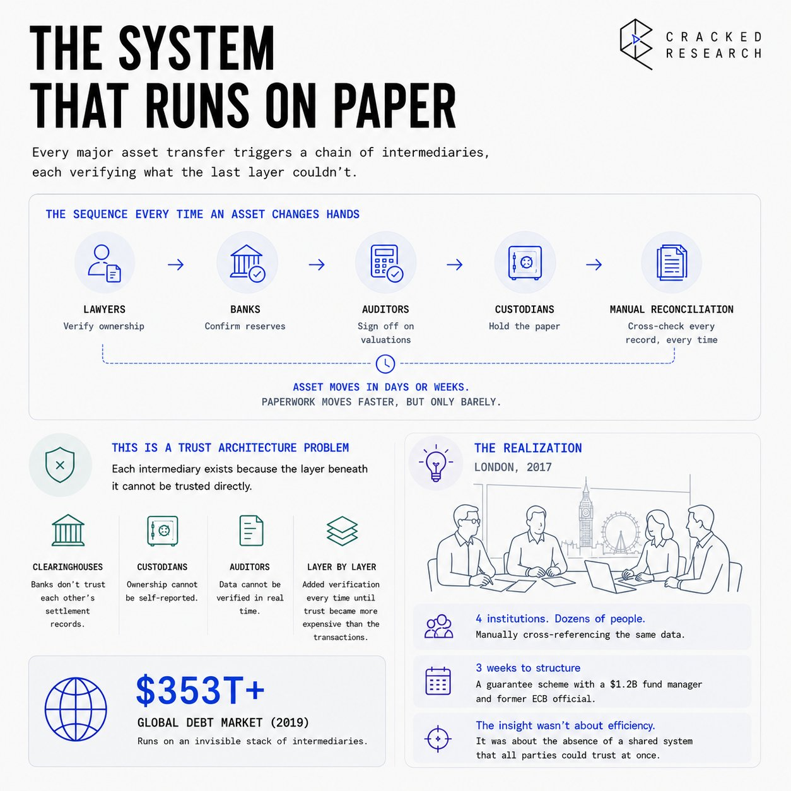
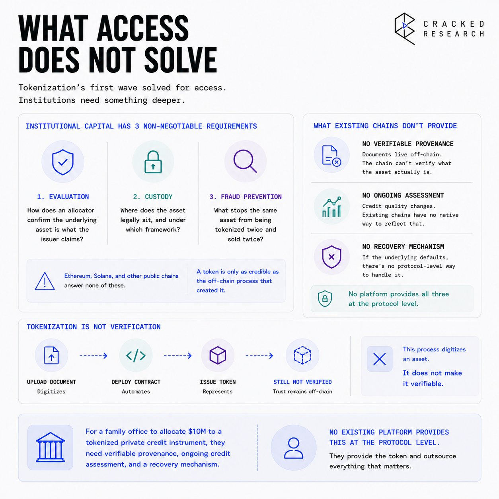
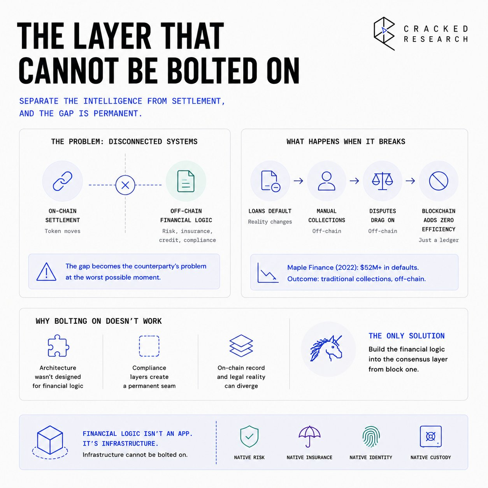
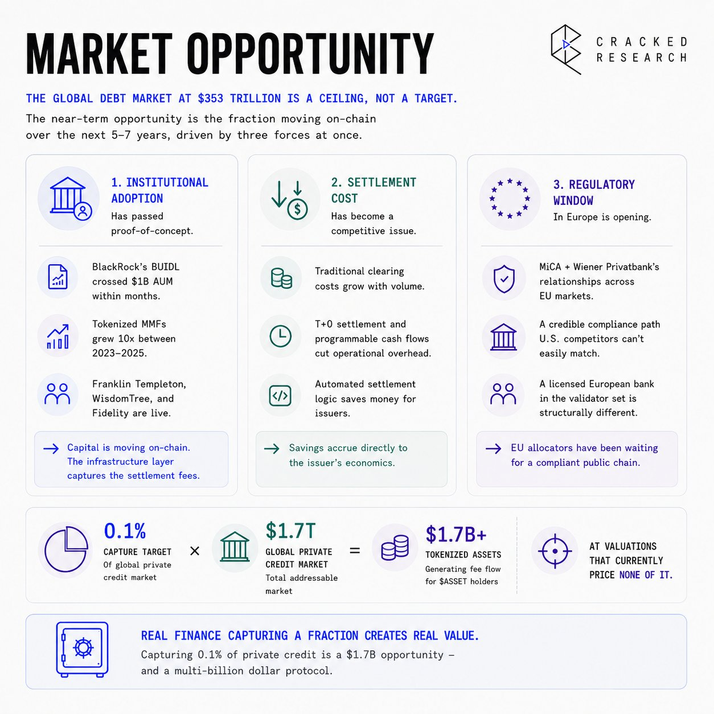

# Real Finance


## The System That Runs on Paper

Every time a large asset changes hands — a bond, a real estate portfolio, a private credit instrument — the same sequence plays out. Lawyers verify ownership. Banks confirm reserves. Auditors sign off on valuations. Custodians hold the paper. Each party runs its own records, cross-checks them against every other party's records, and charges for the privilege. The asset moves in days or weeks. The paperwork moves faster, but only barely.

This is not a technology problem. It is a trust architecture problem. Every intermediary in that chain exists because the layer beneath it cannot be trusted directly. Clearinghouses exist because banks do not trust each other's settlement records. Custodians exist because ownership cannot be self-reported. Auditors exist because financial data cannot be verified in real time by the counterparties relying on it. The system did not evolve badly — it evolved logically, adding one verification layer at a time, until the cost of maintaining trust exceeded the cost of the underlying transactions in many cases.

The global debt market surpassed $353 trillion by 2026. That market runs on a stack of intermediaries that would be unrecognizable to any technologist but is invisible to everyone who has worked inside it long enough. You do not notice the friction until you step outside the system and look back at it.



That is exactly what happened in a London meeting room in 2017, where a former ECB official and $1.2 billion fund manager spent three weeks structuring a guarantee scheme that involved four institutions, dozens of people manually cross-referencing the same data, and a timeline that had nothing to do with the underlying asset and everything to do with the paperwork surrounding it. The realization that followed was not that the process was inefficient. It was that the entire structure existed only because there was no shared system that all parties could trust simultaneously.

## What Access Does Not Solve

The first wave of blockchain-based tokenization made a good bet: that access was the problem. Fractional ownership, 24/7 trading, T+0 settlement. The bet was not wrong — those properties matter. But access is not why institutional capital has stayed on the sidelines.

Large allocators have three requirements that no access-layer product resolves.

- First: evaluation. How does an allocator confirm the underlying asset is what the issuer claims?
- Second: custody. Where does the asset legally sit, and under which framework?
- Third: fraud prevention. What stops the same asset from being tokenized on two chains and sold twice to separate buyers?

Ethereum and Solana answer none of these. A token on a public chain is only as credible as the off-chain process that created it — and that process is invisible to the chain itself.



The platforms that have built RWA products on existing chains have largely treated tokenization as a minting exercise. Upload a document, deploy a contract, issue a token. That process digitizes an asset. It does not make the asset verifiable. For a family office to allocate $10 million to a tokenized private credit instrument, they need verifiable provenance, ongoing credit assessment, and a recovery mechanism if the underlying defaults. None of the existing platforms provides that at the protocol level. They provide the token and outsource everything that matters.

## The Layer That Cannot Be Bolted On

The problem is not that existing platforms lack features. It is that their architecture makes the missing features structurally impossible to add.

When you separate the financial intelligence layer from the settlement layer, the gap is permanent. The token moves on-chain. The risk assessment lives in a PDF. The insurance policy sits in a legal agreement. The credit score gets updated quarterly by a third party with no stake in whether the chain reflects reality. For a retail DeFi user making directional bets, that gap is tolerable. For an asset manager running a fixed-income mandate, it is disqualifying. The liability exposure is too large. The audit requirements are too strict. No compliance officer signs off on a system where the most important financial data lives outside the instrument itself.



Centrifuge, Maple Finance, and Goldfinch all ran into this ceiling at scale. When loans went bad on Maple in 2022 — over $52 million in defaults from Orthogonal Trading — the recovery looked like traditional collections. Credit assessment lived off-chain. Collections lived off-chain. Dispute resolution lived off-chain. The chain was a ledger, not a financial system. The blockchain added zero efficiency at the point where it mattered most.

You cannot add financial logic onto a general-purpose chain after the fact. Ethereum was not designed to hold insurance policy records. Cosmos-based chains were not built to enforce probability-of-default scoring. Compliance infrastructure built on top of a neutral settlement layer creates a permanent gap — a place where the on-chain record and the legal reality diverge, becoming the counterparty's problem at exactly the wrong moment. The only solution is a chain where the financial logic is native to the consensus layer from the first block. That infrastructure did not exist until it was built from scratch.

## The Financial System as Protocol

Real Finance is a sovereign, EVM-compatible Layer 1 blockchain built for the tokenization, risk assessment, and lifecycle management of real-world assets — with insurance, credit scoring, and institutional custody embedded at the protocol layer.

The network runs two classes of validators. Normal validators maintain consensus using Proof-of-Stake. Business Function Validators — licensed tokenization companies, risk scoring entities, and insurance providers — must stake [$ASSET](https://x.com/search?q=%24ASSET&src=cashtag_click) proportional to their activity on the chain. If a tokenizer misrepresents an asset or an insurer fails to honor a claim, their stake is slashed. That is not a policy rule. It is a protocol-level enforcement mechanism. Every piece of financial data these entities submit carries real capital behind it.

```text
Standard RWA Model:                    Real Finance Model:
Token Contract (on-chain)              Token Contract (on-chain)
         |                                      |
PDF Document (off-chain)               Embedded Metadata:
         |                               - PD Score (on-chain, staked)
Legal Agreement (off-chain)             - Insurance Policy (on-chain, staked)
         |                               - Risk Grade A–F (on-chain, staked)
Audit Firm (quarterly, off-chain)              |
                                       Business Validator stakes → consensus
                                       = one source of truth, one chain
```

Every onboarded asset carries an embedded risk grade from A to F and an insurance status queryable directly through the chain via CLI, REST, or gRPC. Grade A assets carry 100% principal and cash flow coverage. Grade B assets have at least 75% of cash flows insured. That coverage is a protocol-level record, underwritten by an insurance entity that has posted capital it stands to lose if the claim is disputed.

The Disaster Recovery Fund closes the final gap. If an insurer defaults, asset holders receive Network Debt Tokens matching their realized losses, redeemable monthly against the DRF at 1:1. The fund is financed by redirecting a portion of inflation rewards from business validators — no net new issuance, no separate bailout mechanism. The recovery logic is built into the economic design before the first asset goes live. Serious capital does not move on opportunity alone. It moves when the downside is defined.

## The Edge That Does Not Transfer

Real Finance's position is architectural, not executional — and that distinction is what makes it durable.

A competitor building on Ethereum cannot replicate this without constructing its own sovereign chain. If they build their own chain, they face the same cold-start problem Real Finance has already cleared: sourcing validators, attracting licensed financial institutions, structuring legal frameworks across jurisdictions, and doing all of it before a single asset goes live. That process took years. The lead cannot be bought or forked.

The inclusion of Wiener Privatbank SE as a Business Function Validator is where the architecture becomes a distributional advantage. A bank that validates and settles directly on the chain has rebuilt its operational workflow around the network. That transition does not reverse. Its presence signals to every other European allocator evaluating the space that the legal and custody framework is already in place — not aspirational.

Phase 1 of the Wiener Privatbank integration targets approximately $50 million in on-chain assets. The mainnet-year goal is $500 million in tokenized assets across the network. Real Finance launched the mainnet with 20 million euros in assets already prepared for migration. The infrastructure is live, the pipeline is sourced, and the counterparty structure is confirmed before most of the sector has a working mainnet.

Nimbus Capital, managing $1.4 billion in real estate assets, anchored the $29 million raise alongside Magnus Fund and Frekaz Group. These are asset managers who need a destination for institutional-grade tokenized assets — not financial sponsors looking for a multiple. The capital and the pipeline arrived together.

## Market Opportunity

The global debt market at $353 trillion is a ceiling, not a target. The near-term opportunity is the fraction moving on-chain over the next five to seven years, driven by three forces operating at the same time.

Institutional adoption has passed proof-of-concept. BlackRock's tokenized money market fund, BUIDL, crossed $1 billion in assets under management within months of launch. Tokenized money market funds grew 10x between 2023 and 2025. Franklin Templeton, WisdomTree, and Fidelity are all running live products. The direction of institutional capital is not ambiguous. The question is which infrastructure layer captures the settlement fees.

Settlement cost has become a competitive issue at scale. Traditional clearing infrastructure carries expenses that grow with volume. T+0 settlement and programmable cash flows are not features for institutional allocators — they reduce operational overhead on products running at thin margins. Tokenized private credit and structured products with automated settlement logic save money in ways that accrue directly to the issuer's economics.



The regulatory window in Europe is opening. The EU's MiCA framework, combined with Wiener Privatbank's existing relationships across European markets, gives Real Finance a credible compliance path that U.S.-domiciled competitors cannot easily match. A chain with a licensed European bank in its validator set is structurally different from a chain seeking regulatory approval after the fact. European allocators have been waiting for a public blockchain that satisfies their legal requirements.

Furthermore, if Real Finance captures 0.1% of the global private credit market — estimated at $1.7 trillion — that is $1.7 billion in tokenized assets generating fee flow for [$ASSET](https://x.com/search?q=%24ASSET&src=cashtag_click) holders at valuations that currently price none of it.

## Valuation

Real Finance completed its TGE in late April 2026. Market cap sits at $5.77 million. The token has $3.63 million in 24-hour volume across Uniswap, KuCoin, MEXC, and Kraken.

At $115.55 million FDV, Real Finance is priced as if the institutional pipeline it has already confirmed will produce nothing. The Wiener Privatbank relationship targets $500 million in tokenized assets within the first operating year. If that pipeline generates annualized fee revenue at a conservative 0.5% rate — well below typical institutional structuring fees — that implies $2.5 million in annualized protocol revenue. At a 20x revenue multiple, standard for infrastructure in early adoption, that supports a $50 million market cap on the circulating float alone. The current FDV is pricing pipeline failure, not any version of execution.

The closest comparable is Centrifuge, which reached a $400 million FDV during its growth phase with simpler architecture, less institutional traction, and no embedded insurance or bank-validator model. Real Finance's design argues for a premium to that baseline — conditional on the pipeline executing.

## Tokenomics

**Supply**

Total supply is 1,000,000,000 [$ASSET](https://x.com/search?q=%24ASSET&src=cashtag_click). Circulating supply at launch is 43,376,451 tokens, representing 4.34% of total. The FDV-to-market cap ratio of approximately 20x is the single most important number for position sizing. The vast majority of the supply has not entered the market. Buyers entering now do so before the team and investor vesting creates consistent sell pressure. That window is real. So is the dilution risk on the other side of it.

**Allocation**

Treasury and Community hold 52% of the total supply. Seed Investors hold 16.5%. Team holds 15%. Liquidity receives 10%. The remaining 6.5% covers other categories. Team and investor allocations carry 6-to-12-month cliffs followed by linear monthly vesting over 24 to 36 months. First significant seed investor unlocks arrive in Q4 2026 at the earliest.

**Economic Design**

[$ASSET](https://x.com/search?q=%24ASSET&src=cashtag_click) operates across three functions:

- Transaction fuel: every tokenization event, asset transfer, and contract execution requires [$ASSET](https://x.com/search?q=%24ASSET&src=cashtag_click) for gas.
- Validator skin-in-the-game: Business Function Validators stake [$ASSET](https://x.com/search?q=%24ASSET&src=cashtag_click) proportional to their activity, with slashing as the enforcement mechanism.
- Governance: staked [$ASSET](https://x.com/search?q=%24ASSET&src=cashtag_click) provides voting power over protocol upgrades and parameter changes.

Inflation starts at 5% in year one and decreases by 0.5% annually until reaching a 1% floor. Block rewards of approximately 10 [$ASSET](https://x.com/search?q=%24ASSET&src=cashtag_click) per block produces roughly 52.5 million tokens annually, split 50/50 between normal validators and business function validators. The economic interest of insurers, tokenizers, and risk assessors is tied directly to network activity. Remaining inflation is distributed to stakers (70%), the Ecosystem Fund (20%), and community incentives (10%).

## The Team

**Ivo Grigorov (Co-founder & CEO).** Holds an honors degree in Banking and Finance from a London institution, worked at the European Central Bank, and managed a $1.2 billion Fund of Funds before founding Real Finance. The 2017 guarantee scheme structuring moment that started the project came from someone who had spent years inside the institutions he set out to replace.

**Valentin Dimitrov (Co-founder & COO).** Former fund manager with €600 million AUM and a background in European financial policy and capital markets. Structuring a licensed bank as a network validator required legal, regulatory, and financial fluency that most blockchain teams do not carry.

**Hristo Piyankov (Lead Economist).** Led tokenomics design for over 200 projects raising more than $1 billion combined. The [$ASSET](https://x.com/search?q=%24ASSET&src=cashtag_click) economic model — inflation decay schedule, dual-validator reward split, DRF funding through redirected rewards — reflects design depth unusual at this stage.

## External Signals

**Armors Security Audit.** First external audit of REAL's on-chain infrastructure returned 0 critical, 0 high, 0 medium, and 0 low findings. Marked Technically Verified.
**Start In Block Top 100.** Selected from 1,000+ startups at Paris Block Week 2026. Nominated in the Top 10 for the RWA category. Finalists pitched at the Louvre on April 16.
**RedStone Oracle Integration.** Partnership with RedStone for real-time price feeds on tokenized assets. RedStone is one of the primary oracle providers across institutional DeFi.
**RWA Inc. Partnership.** Strategic collaboration covering tokenized asset issuance on REAL, investor onboarding, post-issuance lifecycle support, and AI-powered governance automation.
**Token Narratives Podcast (Ep. 99).** REAL's strategic advisor Pauli Speaks joined hosts Graham Stone and Alex Richardson to discuss RWA infrastructure, institutional adoption, and the [$ASSET](https://x.com/search?q=%24ASSET&src=cashtag_click) TGE. May 4, 2026.
**When Shift Happens Podcast.** CEO Ivo Grigorov joined host Kevin for an in-depth discussion on the founding thesis, institutional trust architecture, and the 2030 vision for clearing house displacement. \[[source](https://www.youtube.com/watch?v=c1432pMNViU)\]

## Trade Setup

**Market Snapshot**

```text
Current Phase:    Post-TGE early price discovery
Price:            $0.1156 (May 13, 2026)
ATH:              $0.1345 (May 12, 2026)
All-Time Low:     $0.04307 (Apr 30, 2026)
24h Range:        $0.09957 – $0.1345
7d Range:         $0.0744 – $0.1345
24h Volume:       $3.63M
Exchanges:        Uniswap, KuCoin, MEXC, Kraken
```

[$ASSET](https://x.com/search?q=%24ASSET&src=cashtag_click) launched April 30 and ran 169% in 48 hours — from an all-time low of $0.04307 on listing day to an all-time high of $0.1158 on May 1. Simultaneous listings across OKX, KuCoin, Kraken, and MEXC created bid-side momentum that outpaced natural sell pressure from early holders. Volume expansion over the past 24 hours, with price hitting new ATH, puts this in a pure post-TGE price discovery.

**Scenario Analysis**

```text
| Scenario | Assumptions                                                                               | Target FDV | Multiple from Current |
| -------- | ----------------------------------------------------------------------------------------- | ---------- | --------------------- |
| Bear     | Pipeline fails, no institutional asset volume, unlock pressure dominates                  | $30–50M    | ~0.26–0.43x           |
| Base     | $100–200M in tokenized assets within 12 months, KuCoin/Kraken liquidity deepens           | $200–400M  | ~1.73–3.46x           |
| Bull     | $500M+ tokenized assets, second bank validator confirmed, $ASSET listed on top-3 exchange | $800M–1.5B | ~6.92–12.9x           |
```

**Catalysts**

The highest-priority event is Wiener Privatbank Phase 1 close — on-chain confirmation of the first $50 million tranche. That is the proof-of-pipeline moment. A single on-chain transaction record confirming Phase 1 moves the institutional pipeline from stated intent to verifiable fact, and changes the FDV conversation entirely.

Second is the REUR stablecoin launch. Without a native euro-pegged unit of account, institutional interbank deals and structured products cannot settle natively on REAL. The REUR is the monetary layer that makes the chain self-contained for European institutional finance. It is described as a "stage two" development in the source materials — the logical next milestone after mainnet stability is proven.

Third is any additional licensed institution joining as a Business Function Validator. One bank establishes that the model works. Two establishes that it scales. That transition from proof-of-concept to repeatable pattern is where the FDV multiple expands.

**Future Outlook**

**Near-term (0–12 months).** Wiener Privatbank Phase 1 close ($50M on-chain), REUR stablecoin launch, first meaningful protocol fee data. The gap between the $5.77M market cap and the $29M raised makes this one of the more asymmetric early-stage setups in the current cycle. That gap closes in one direction or the other within 12 months. Simultaneous exchange listings and the Wiener Privatbank announcement, all arriving in the same calendar week was deliberate narrative stacking — the question is whether on-chain volume follows.

**Medium-term (1–3 years).** [$500M+](https://x.com/search?q=%24500M%2B&src=cashtag_click) in tokenized assets, a second institutional validator, liquidity across Cosmos IBC-connected chains via the Kima Network partnership. The RWA Foundation membership alongside the Byzanlink, Stobox, and Toto Finance collaborations create an asset sourcing network that most Layer 1s lack entirely.

**Long-term (3+ years).** By 2030, the stated vision is that traditional clearing houses become obsolete for European mid-market credit instruments because on-chain settlement is faster, cheaper, and verifiably compliant. If that directional claim is even partially correct, the network holding the institutional relationships and the compliant infrastructure captures the fee flow that currently goes to clearinghouses. Price holds above the launch-day low of $0.04307 as long as the pipeline narrative remains intact. A break below that level on meaningful volume is the invalidation signal — it would mean the post-listing bid exhausted without natural demand forming beneath it.

## Key Risks

**Supply Overhang.** Only 4.34% of the total [$ASSET](https://x.com/search?q=%24ASSET&src=cashtag_click) supply is circulating. Seed investor cliff periods of 6 months and team vesting over 24–36 months means unlock events will recur through 2027–2028. If network activity does not scale ahead of those events, sell pressure will compress price regardless of fundamental progress. Q4 2026 is the first significant risk window.

**Pipeline Execution.** The $500M tokenized asset target within year one is ambitious. Institutional asset migration routinely requires 12–24 months longer than projected due to legal preparation, regulatory coordination, and counterparty sign-off. Real Finance has sourced the pipeline. It has not confirmed delivery.

**Single Validator Concentration.** Wiener Privatbank is the only confirmed institutional validator. If that relationship deteriorates, the trust architecture loses its anchor.

**Competitive Displacement.** BlackRock, Franklin Templeton, and Fidelity are all building within the tokenized asset category. A permissioned chain backed by a major custodian with established institutional distribution could capture the pipeline Real Finance is targeting without requiring a public L1.

**Regulatory Reclassification.** The [$ASSET](https://x.com/search?q=%24ASSET&src=cashtag_click) token's utility functions — staking, governance, gas — do not by themselves constitute a security under current EU frameworks. MiCA provides clarity. A reclassification event or enforcement action in a key jurisdiction would create immediate legal overhang, particularly if U.S. operations expand.

The architecture cannot be replicated on an existing chain without starting from zero. The institutional relationships are not theoretical. The European regulatory environment is moving toward clarity rather than restriction. These factors do not eliminate the risks above, but they set a floor under the downside that purely speculative projects at this market cap do not have.

## Conclusion

The London meeting room in 2017 produced something specific: a founder who understood every layer of the system he was replacing, because he had operated inside each one. Grigorov spent years at the ECB and managing institutional capital before deciding to rebuild the infrastructure from the protocol layer up. That context shows in the architecture. Insurance is not an add-on. Credit scoring is not outsourced. Bank custody is not a partnership announcement. They are network primitives, enforced by the same consensus mechanism that validates every block.

Right now, both viable alternatives have proven inadequate at scale. Permissioned chains run by major banks offer institutional trust but no secondary market and no composability. Public chains offer liquidity but cannot satisfy the legal and custody requirements that institutional allocators require. A sovereign, EVM-compatible L1 with a licensed European bank in the validator set — and an on-chain audit trail for every piece of financial data — is the only architecture that answers both objections. The question is whether Real Finance executes the pipeline it has already sourced before a well-capitalized competitor clears the same regulatory and institutional hurdles.

At $110 million FDV with $29 million raised, a licensed bank as a validator, 20 million euros in assets prepared for migration, and a $500 million mainnet-year pipeline, the token is priced for failure. Centrifuge reached $400 million FDV with less infrastructure, fewer institutional partners, and no embedded insurance model. The baseline upside on execution is not speculative — it is a re-rating to what comparable infrastructure traded at with comparable traction.

Watch three things. First: on-chain confirmation of the Wiener Privatbank Phase 1 tranche — the proof-of-pipeline event that moves the FDV conversation from narrative to data. Second: REUR stablecoin launch, the moment the chain becomes self-contained for European institutional finance. Third: a second institution joins the validator set. One bank is a bet on a model. Two is a market forming.

- **X:** [https://x.com/RealFinOfficial](https://x.com/RealFinOfficial) 
- **Website:** [https://www.real.finance/](https://www.real.finance/) 
- **Community:** [https://t.me/RealFinanceRWA](https://t.me/RealFinanceRWA)
- **CA:** 0x99e980265bf36516c442be982df1772a6ccb3233 [#UCCC](https://x.com/hashtag/UCCC?src=hashtag_click)

This document is for informational purposes only and does not constitute investment advice or an offer to sell or solicitation to buy any securities or investment products. All investments involve risk, including the possible loss of principal. Past performance is not indicative of future results. Any forward-looking statements or hypothetical examples are subject to risks and uncertainties and are not guarantees of future performance. No client-adviser relationship is established by this material. The author assumes no responsibility for the accuracy or completeness of third-party information referenced.