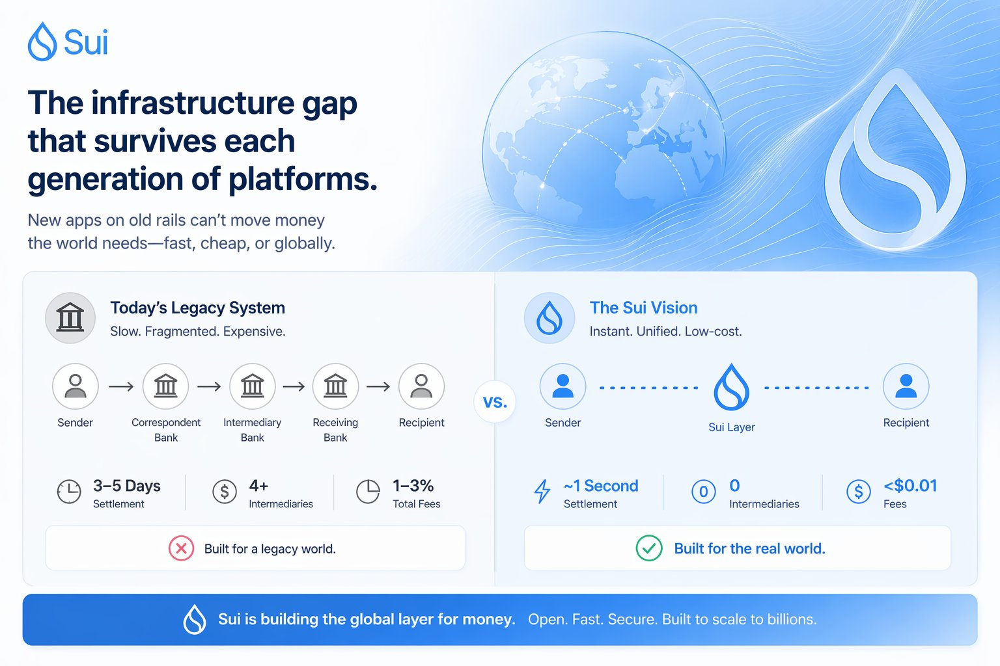
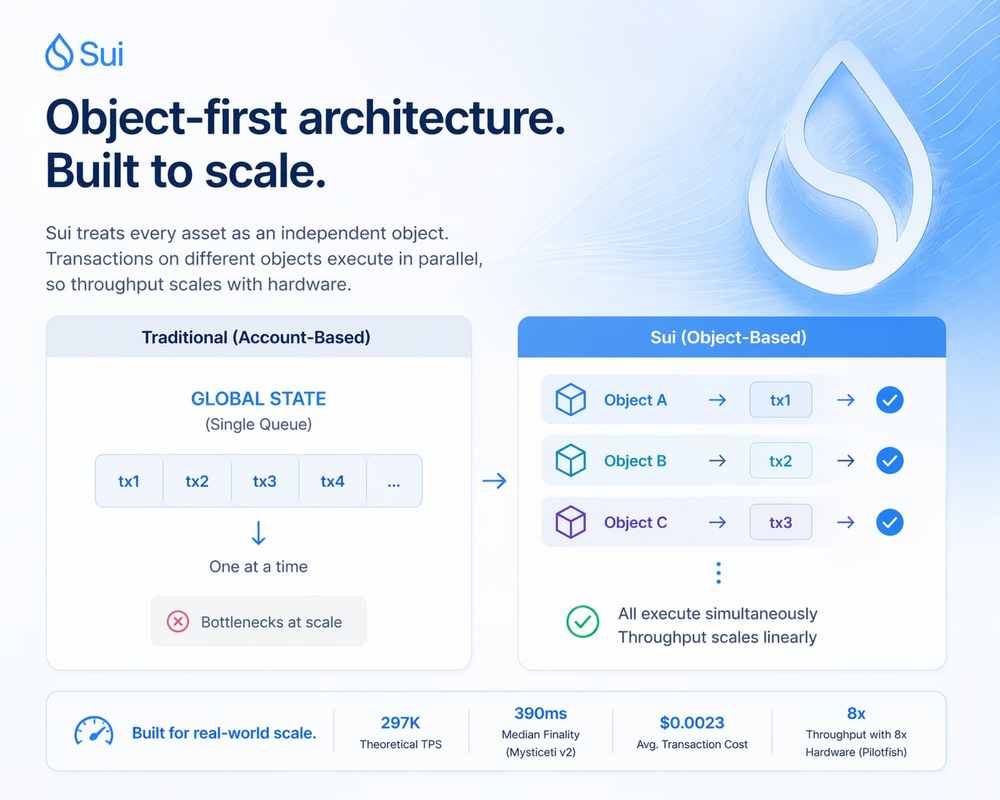
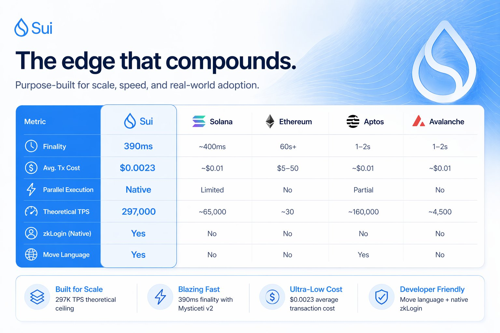
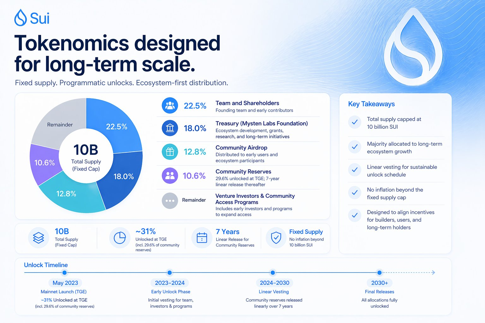
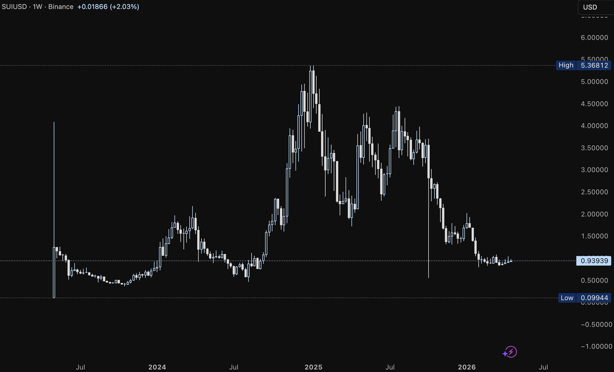

# Sui


# The man who built Facebook's payment system and watched Congress kill it

In 2019, Adeniyi Abiodun was part of a small team inside Meta trying to do something no company had ever pulled off: construct a single payment rail for three billion people. Not an application. The layer underneath all applications, the foundation that would let a person in Lagos send funds to São Paulo the way they'd send a text message.

They got close. The technology worked. The architecture held up under load. Then Congress called the executives in for hearings, governments threatened to revoke banking licenses, and Facebook shut the whole thing down.

Abiodun left Meta. He didn't abandon the challenge. He took all the team had learned, each hard lesson about what it actually takes to develop at that magnitude, and decided to construct it again. This time without a corporation in the middle. This time on a foundation that no single regulator could kill.

The fundamental insight he carried out of that experience was something most builders never get the chance to learn: designing for a billion users forces different decisions than designing for ten thousand. You cannot add parallelism later. You won't retrofit a better user experience atop a network engineered for engineers. It's wrong to assume your median user has ever heard of a private key. When size is the starting assumption, the entire mental model changes, from "how do we process transactions" to "how do we make it structurally impossible for the framework to fail under real-world load."

## The infrastructure deficit that survives each generation of platforms

Each generation of fintech has tried to solve the same issue with a new interface. Faster applications on the same backend. Slicker UX over the same correspondent banking chain. The settlement still happens at end of day. The funds still travel through four intermediaries before they arrive.

The problem isn't cosmetic. It's architectural. The payment systems that underpin worldwide finance were designed for a world where end-of-day batch processing was the technological frontier. Layering modern tools above that doesn't change what's happening underneath, it just hides the latency behind better design.



This is the obstacle Abiodun kept running into at Meta. Each country had its own payment rail. None of them connected. To send value across borders, you had to route through correspondent banks, each taking a fee, each adding a delay, each creating a reconciliation event that might fail. The technology to move funds instantly had existed for years. The framework to do it worldwide, at volume, without trusting any single intermediary, did not.

That's the challenge. And that's what he left to build.

## Object-first: The architecture that doesn't break under load

The network built from that brief is a Layer-1 network where each asset is an independent object owned by a defined address, not a field in a shared ledger that all nodes must update sequentially.

On Ethereum or Solana, your USDC balance is a field inside Circle's smart contract. When you send it, the network must register that transaction in the shared sequence before processing anything else touching the same contract. On this platform, your USDC is its own object. Transactions involving different objects have no causal relationship, they run simultaneously across different cores, without queuing.

The Mysticeti v2 consensus engine, launched in November 2025, delivers 390ms median finality, which is 80% lower latency than the original consensus design. For simple peer-to-peer transfers, a "fast path" bypasses consensus entirely, requiring only two round-trips to a quorum of validators. At $0.0023 per transaction with fees that stay stable under congestion, the cost structure is different from any major chain operating today.



The theoretical ceiling is 297,000 TPS. The more instructive number is what Pilotfish autoscaling demonstrated in practice: scale the hardware eightfold and throughput scales eightfold with zero latency cost. Double the hardware, double the throughput. That's the claim Abiodun made publicly, and the architecture is built to deliver it.

The Move programming language closes the loop. Created by Mysten Labs CTO Sam Blackshear at Meta, Move treats digital assets as first-class citizens with ownership enforced at the type level. An item cannot be accidentally duplicated or destroyed, the language eliminates entire categories of smart contract exploits that have drained billions from Solidity contracts. For institutions building compliant financial infrastructure on-chain, language-level safety is as important as raw throughput.

## The edge that compounds

Solana's Firedancer client launched on mainnet in late 2025, targeting sustained throughput above one million TPS. Genuine engineering. But the underlying account-based model stays, as sequential state access for shared contracts doesn't change when you add a faster validator client. What Firedancer also introduced is a second validator client running alongside the original, adding operational complexity to a network with a history of stability issues.

Aptos is the closest architectural peer. Both networks use Move, both trace origins to Meta's Diem. The divergence: Sui chose the object model; Aptos retained account-based design with parallel execution bolted on top. The outcomes to date show Sui's TVL peaked 5-6x higher than Aptos' peak, with search interest running 9x Aptos.



What neither Solana nor Aptos has built is the full vertical stack sitting above the chain: Walrus for decentralized storage (467TB stored, now the second-largest decentralized storage network by volume), DeepBook as a native central limit order book (60% lower gas than alternatives, shared liquidity infrastructure across DeFi), SuiNS for human-readable wallet addresses, and Slush Wallet, the unified experience combining zkLogin, passkeys, and token-sending via links that could be handed to a person who has never used a crypto product.

Grayscale's research team noted in July 2025 that no other chain has assembled a fully integrated application suite from the base layer up the way this network has. Developer momentum backs it: Sui Overflow 2025 drew 599 project submissions from 85 countries, with $600K in prizes. Sui Overflow 2026 is already building. OpenZeppelin's smart contract library launched on Sui in March 2026, bringing Ethereum's most widely used security infrastructure to the Move environment.

## Three converging markets

**DeFi.** TVL grew from $250 million at the start of 2024, reaching a $2.6 billion peak by October 2025, a 10x move in under two years. It has since pulled back to approximately $570 million as macro conditions compressed the broader market. The underlying activity did not disappear. Daily active addresses are up 83% year-over-year, network fees rose 268% and protocol revenue climbed 572% over the same period. Suilend, NAVI, Bluefin, and Cetus are still running. The TVL will recover before the chain gets credit for it.

**Payments.** Cumulative stablecoin transfer volume crossed $1 trillion by March 2026. The network processed $111 billion in stablecoin transfers in January 2026 alone. Stablecoin market cap on-chain sits near $517 million. USDsui (Sui Dollar, issued by Bridge, a Stripe company) launched in March 2026 and is already live across Cetus, Bluefin, NAVI, Turbos, and Ferra. Erebor Bank, a U.S. national bank with an OCC charter built from the ground up without legacy systems, integrated Sui as one of the few blockchains it formally supports, enabling stablecoin deposits and withdrawals as direct banking primitives. SUI and USDC-Sui went live on RedotPay on April 21, 2026, reaching 7 million customers, 130 million merchants, and 100+ countries.

SUI staking became available inside the Revolut app in March 2026, providing a fintech with 50+ million users a direct onramp to the network.

**BTCFi.** Bitcoin is a $1.4 trillion asset. Less than 0.5% of it currently works in DeFi, because existing synthetic products lack the transparency institutions require. Hashi changes that. Launched on devnet in March 2026 with commitments from BitGo, Bullish, Erebor Bank, and Ledger, Hashi is a trustless, smart contract-based foundation that lets native BTC be used directly in on-chain services like institutional credit markets, BTC-backed stablecoins, and automated yield vaults, all without bridges or synthetic proxies. Wave Digital is already using it to issue secured bonds collateralized by Bitcoin, with instantaneous settlement. CF Benchmarks provides pricing. Cubist handles BTC custody movement. Soter Insure is building native BTC-denominated insurance on top.

If even 1% of idle Bitcoin enters productive yield on Sui through Hashi, that's $14 billion in TVL. No other L1 has the institutional counterparty stack to make that credible.

**AI agents.** The next phase of AI is not better chat. It's agents that execute, book, transact, and manage resources autonomously at machine speed. The current internet wasn't built for this. Human-centric checkout flows don't scale to millions of automated micropayments. Sui addresses this through the Agent Payments Protocol (AP2), co-developed with Google, and the x402 programmatic signaling standard. Every agentic transaction on Sui groups data, permissions, and history together, so it's always clear what an agent is authorized to touch. WaterX, a 24/7 AI-native trading engine, is building directly on the network for this reason. Visa tops out at 50,000 TPS. Agentic payments will need more.

The investment case sits at the intersection of all four: a chain purpose-built for scale, with BTCFi infrastructure coming online, stablecoin payment rails that processed $1T in volume, and the first serious agentic payment architecture in crypto.

## Current Valuation

**April 23, 2026:**

- Price: $0.9370
- Market cap: $3.70B
- FDV: ~$9.37B (10B total supply)
- Circulating supply: 3,953,388,932 SUI (~39.5% of total)
- 24h trading volume: $380.7M across 84 exchanges
- FDV/market cap ratio: ~2.53x
- CMC rank: #26 | CoinGecko rank: #29

At a $3.70B market cap, this trades at roughly 13% of Solana's market cap and ~4% of Ethereum's circulating cap, which is notable for a chain that processed more daily transactions than Ethereum's base layer, with faster developer growth than Solana, and three regulated spot ETFs already trading.

**Revenue multiple:** Grayscale Research (July 2025) reported approximately $15M in annualized network fees. Solana generated $603M in on-chain fees in 2025 (Nansen). The difference is structural, not incidental, as the $0.0023 average transaction cost is the product differentiator. At 30x P/S (sector median for high-growth early-stage L1s), the current fee run-rate implies ~$450M fair value on fees alone. That's already exceeded, meaning the market is pricing forward growth rather than current monetization.

**Comparable approach:** At $3.70B market cap against $570M current TVL, Sui trades at a P/TVL ratio of ~6.5x, which is higher than Solana's current multiple but consistent with early-cycle positioning for a chain whose TVL peaked 5x higher just six months ago. If TVL recovers to its October 2025 peak of $2.6B, the same market cap implies a P/TVL of ~1.4x, below Solana's historical range during its comparable growth phase.

**If the BTCFi thesis holds:** [$14B+](https://x.com/search?q=%2414B%2B&src=cashtag_click) in potential TVL from 1% BTC activation through Hashi would re-rate the chain entirely on TVL multiples alone.

## Tokenomics



**Next unlock:** 52,030,000 SUI (~0.52% of total supply) on May 1, 2026. At the current price, approximately $49.7M entering circulation, which is modest relative to the [$380M+](https://x.com/search?q=%24380M%2B&src=cashtag_click) in daily trading volume. The April 1, 2026 unlock of comparable size produced a 4% drawdown from local highs. Whether the May 1 event absorbs cleanly is the nearest binary test for the accumulation thesis. If the price holds above $0.87 into the CME futures launch on May 4, the base is confirmed.

**Supply Unlock Timeline (simplified):**

```text
Supply Unlock Timeline (simplified):

May 1, 2026 ────── 52M SUI (~$49.7M at current price)
2026 ──────────── Ongoing monthly vesting clips
2027 ──────────── Team/investor tranches accelerate
2028-2030 ──────── Community reserve linear releases
2030+ ─────────── Final long-tail from 7-year community schedule
```

The IEO price was $0.03. Early backers are at roughly 30x at current levels. Structured selling from that cohort is largely behind us, as remaining unlocks skew toward community reserves and foundation grants deployed back into the network. Each staking-embedded ETF (GSUI, TSUI) reduces effective float by locking SUI with embedded yield. The storage fund mechanic adds a second layer: as on-chain data grows, more SUI is locked in the reserve fund and removed from the liquid supply without a burn event.

Fundraising history: Mysten Labs raised $36M in its first round, then a $300M Series B in September 2022 at a [$2B+](https://x.com/search?q=%242B%2B&src=cashtag_click) valuation. SUI Group Holdings added $20M via OTC purchase in August 2025, which was a secondary market transaction at prices above where the token trades today. Mill City Ventures, a Nasdaq-listed company, holds over 76 million SUI in treasury, acquired at an average of ~$3.64 with backing from Galaxy Digital, Pantera Capital, and Electric Capital.

## The Team

**Evan Cheng (CEO).** Former Director of Engineering at Meta's Diem project. Built the compiler infrastructure underlying Swift's runtime before joining Meta. Made the decision to architect this chain around horizontal scaling as a first principle, not an afterthought.

**Sam Blackshear (CTO).** Wrote the Move programming language at Meta. Move is now live on two L1 blockchains (Sui and Aptos) and is the first language purpose-built for on-chain asset ownership with formal verification built in. Not a language port, but built for the problem from scratch.

**Adeniyi Abiodun (CPO).** Led product for Meta's crypto division. Built Facebook's payment infrastructure before Congress shut Libra down. Now building the outward-facing layer of the network, including Hashi for Bitcoin finance and the institutional custody stack that brought BitGo, FalconX, and Ledger into the network.

**George Danezis (Chief Scientist).** PhD computer scientist, one of the original architects of the Narwhal/Tusk DAG consensus that became Mysticeti. Published the academic foundation that the chain's consensus runs on.

**Kostas Chalkias (Chief Cryptographer).** 2012 ACM Software System Award recipient, one of the architects of zkLogin. Responsible for the cryptographic layer that makes seedless wallets and passkey authentication practical at the protocol level.

Mysten Labs raised $336M across Series A (led by a16z) and Series B. After FTX's collapse, the team bought back FTX's entire stake for $96M, deploying treasury capital to protect governance independence rather than accepting dilution from a distressed seller.

## External Signals

**Institutional Access (ETFs):**

- Grayscale Sui Staking ETF (GSUI) launched on the NYSE Arca on February 18, 2026 — first staking-embedded ETF for a non-BTC/ETH L1 in the US. \[[source](https://blog.sui.io/grayscale-sui-staking-etf-gsui-launches-nyse-arca/)\]
- 21Shares Spot SUI ETF (TSUI) was approved by the SEC and has been trading on Nasdaq since February 24, 2026. \[[source](https://blog.sui.io/21shares-spot-sui-etf-nasdaq-tsui/)\]
- Canary Capital Spot SUI ETF (SUIS) with staking live on Nasdaq. \[[source](https://blog.sui.io/grayscale-sui-staking-etf-gsui-launches-nyse-arca/)\]
- CME SUI Futures launching May 4, 2026 — cash-settled contracts, the same institutional access pathway that preceded ETH ETF approval.

**Partnerships:**

- Google Cloud — Sui data integrated into BigQuery; Vertex AI for Move code; AP2 agent payments protocol integration. \[[source](https://www.googlecloudpresscorner.com/2024-04-30-Sui-Teams-Up-with-Google-Cloud)\]
- Erebor Bank, N.A. — U.S. national bank with an OCC charter integrated Sui for stablecoin banking, enabling regulated on/off-ramps directly on-chain. \[[source](https://blog.sui.io/erebor-bank-global-payments/)\]
- Franklin Templeton Digital Assets — exploring tokenized fund use cases on Sui; $1.5T AUM manager signaling chain-level conviction.
- [@RealVision](https://x.com/@RealVision) has partnered with Sui to integrate high-performance blockchain functionality into its financial media and membership platform. This collaboration enables secure attribution of member contributions and establishes a foundation for future crypto-powered rewards. \[[source](https://blog.sui.io/real-vision-integrates-sui/)\]
- Hashi protocol — backed by BitGo, FalconX, Bullish, and Ledger for BTC-native institutional finance on Sui. \[[source](https://blog.sui.io/new-era-of-bitcoin-based-finance-begins-meet-hashi/)\]

**Network Signals:**

- Grayscale Research (July 2025): Sui holds 6.68-8.55% allocation in Grayscale Smart Contract Platforms Fund. \[[source](https://research.grayscale.com/reports/built-for-scale-why-sui-stands-out)\]
- Mill City Ventures holds 76M+ SUI in treasury at ~$3.64 average cost, backed by Galaxy Digital, Pantera Capital, and Electric Capital. \[[source](https://blog.sui.io/mill-city-ventures-sui-treasury/)\]
- SUI attracted $2.2M in weekly ETF inflows in the week of April 20, 2026 — institutional capital continuing to flow despite broader altcoin lag. \[[source](https://coinmarketcap.com/cmc-ai/sui/latest-updates/)\]

## Trade Setup

**Market Snapshot**

```text
Current Phase:   Post-unlock consolidation / accumulation
Price:           $0.9370 (April 23, 2026)
Market Cap:      $3.70B
ATH:             $5.35 (January 2025) | Drawdown from ATH: ~82%
Recent High:     $3.47 (early 2026)
Recent Low:      $0.87 (post-April 1, 2026 unlock)
RSI:             ~50 (neutral)
Support:         $0.87
Resistance:      $1.20
Volume:          $380.7M/day (84 exchanges)
Sentiment:       46 (Fear) | 7d avg: 30.6
BTC Dominance:   60.05%
```

SUI runs on narrative catalysts, then distributes into actual launch events and unlock dates. The current range, with RSI neutral and volume recovering, reads as post-distribution consolidation. The 200-day moving average maintains a bullish slope. Whales and private groups have been positioning into this range ahead of Q2 catalysts while sentiment ran negative. This is the same setup that preceded each major move since the 2024 bull run.

**Quarterly Price History**

```text
| Year | Q1        | Q2                  | Q3       | Q4      |
|------|-----------|---------------------|----------|---------|
| 2023 | N/A       | -57.8%              | -32%     | +66.4%  |
| 2024 | +145.4%   | -57.3%              | +116.8%  | +132%   |
| 2025 | -44.9%    | +22.5%              | +17.4%   | -57%    |
| 2026 | -37.4%    | +8.88% (so far)     | N/A      | N/A     |
```

The pattern is readable: violent distribution after each major run, re-accumulation into the next catalyst cluster. Q2 2026 is already positive with Q1's drawdown behind us.



**Scenario Analysis**

```text
| Scenario | Assumptions                                                            | Target FDV  | Multiple from Current  |
|----------|------------------------------------------------------------------------|-------------|------------------------|
| Bear     | Competition intensifies, unlocks weigh, macro weakness                 | $6B         | ~0.6x (~$0.60)         |
| Base     | TVL recovers to $3-5B, stablecoin layer scales, Mysticeti v2 sustains  | $15-20B     | ~1.6-2.1x ($1.50-$2.00)|
| Bull     | BTCFi captures 1%+ of BTC float, AI/payments volume compounds          | $40-60B     | ~4-6x ($4-$6)          |
```

**Catalysts**

The May 1, 2026 unlock of 52M SUI (~$49.7M) arrives right before the CME futures launch on May 4. Clean absorption equals base confirmed. CME futures create the institutional hedging infrastructure that preceded meaningful price discovery for both BTC and ETH.

The Miami conference (May 5-7) brings a16z, Fidelity, Mysten Labs, and Real Vision onto the same stage. EVE Frontier hackathon results on April 24, with an $80K prize and gaming narrative are the nearest near-term catalysts. Sui Overflow 2026 is building, with 2025's 599-submission benchmark to beat. Pending Bitwise/VanEck ETF approvals add a further institutional access catalyst when they arrive.

Hashi moving from devnet to mainnet is the largest medium-term catalyst. The BTCFi thesis doesn't price in until it's live and processing volume. Watch the first Hashi TVL number as a signal for how institutional Bitcoin allocation actually responds.

**Market Position**

Break above $1.20 clears post-unlock resistance and historically signals re-entry of momentum buyers. The next level sits around $1.50, coinciding with the base case FDV scenario. Near-term target if Q2 catalysts land: $1.50-$2.00. Medium-term target on TVL recovery to [$3-5B](https://x.com/search?q=%243-5B&src=cashtag_click): [$15-20B](https://x.com/search?q=%2415-20B&src=cashtag_click) FDV.

## Key Risks

**Token Unlock Pressure:** 60.5% of the total supply remains unlocked. The May 1, 2026 event (52M SUI, ~$49.7M) is the immediate test. Risk window is persistent through 2030. Severity is high on individual events, manageable if ETF inflows and staking absorption scale with supply.

**Competitive Pressure:** Solana's Firedancer client, live on mainnet since late 2025, targets above 1 million TPS and commands the largest developer base among high-throughput L1s. Monad's EVM-compatible parallelism targets the same market. Neither resolves the object-model advantage, but both represent credible alternatives with stronger network effects today.

**Network Reliability:** On January 14, 2026, the mainnet experienced a 6-hour halt caused by an edge-case consensus bug. User funds were never at risk. The network halted rather than risking a state fork. Mysten Labs has since implemented faster detection, automated recovery tooling, and expanded consensus-related testing. The event is a known data point. Institutions evaluating Sui as a payment rail will price it in.

**Centralization Risk:** 117-122 validators and high hardware requirements place Sui below Ethereum on decentralization metrics. Mysten Labs' dominant role as both core developer and application builder creates a single point of influence that could limit censorship-resistance claims at the institutional level.

**Move Language Adoption Ceiling:** Move is not Solidity. EVM-compatible chains carry Ethereum's developer toolchain forward without retooling. OpenZeppelin's library landing on Sui helps, but the absolute base of active developers remains small relative to Solana's 2,000+ and Ethereum's 3,300+.

**Revenue Scale Gap:** Solana generated $603M in on-chain fees in 2025 (Nansen). Sui's $0.0023 average transaction cost is the product differentiator, but it means orders of magnitude more transaction volume is needed to close the monetization gap. This is measured in years.

**Macro Sensitivity:** At 39.5% circulating supply and BTC dominance near 60%, SUI is a high-beta alt. BTC breaking below $70K puts SUI at risk of testing $0.60 or lower.

**Regulatory Overhang:** Pending Bitwise/VanEck ETF approvals are not guaranteed. A negative SEC ruling on staking-embedded structures removes that institutional catalyst. The GENIUS Act's stablecoin framework, if it restricts non-bank issuers, could affect USDsui's growth trajectory.

The thesis holds as long as: TVL begins recovering toward [$1B+](https://x.com/search?q=%241B%2B&src=cashtag_click), the May 1 unlock absorbs cleanly, and BTC holds above $80K into Q3 2026.

## Conclusion

Right now, three elements align on this asset that rarely appear together. The technology is genuinely differentiated at the architectural level. The object model enables parallelism that account-based chains cannot achieve without rebuilding their foundation. Institutional access infrastructure just arrived, with three regulated spot ETFs trading, CME futures launching May 4, a U.S. national bank integrated on-chain, and Fidelity and Grayscale on the same Miami stage next week. And the token is sitting 82% below its all-time high with neutral RSI, while the product ships faster than ever.

Why now? The CME futures launch is the structural catalyst. Regulated derivatives preceded meaningful institutional price discovery for both BTC and ETH. The mechanism is the same. Create the hedging infrastructure that makes it easier for large allocators to hold spot exposure. Hashi is in devnet with BitGo and Ledger, already committed. The Sui Dollar is live. Revolut staking is live. Erebor Bank is integrated. The Miami conference is one announcement away from resetting the narrative on this whole cycle. This is the pre-event window.

If the base case plays out — TVL recovering to [$3-5B](https://x.com/search?q=%243-5B&src=cashtag_click), stablecoin volumes compounding, BTCFi going live on Hashi — the FDV target is [$15-20B](https://x.com/search?q=%2415-20B&src=cashtag_click). The bull case, where Hashi captures a meaningful slice of idle Bitcoin and AI agents settle on Sui's rails at scale, puts FDV at [$40-60B](https://x.com/search?q=%2440-60B&src=cashtag_click).

Watch for TVL breaking back above $1B as the signal that recovery is real. Hashi's first reported TVL number is the BTCFi proof of concept. Price clearing $1.20 confirms the post-unlock range has resolved. The infrastructure was built by the team that had already built products that scale for billions of users. The next twelve months will prove whether the demand was waiting for it.

- **X:** [@SuiNetwork](https://x.com/SuiNetwork) 
- **Website:** [https://sui.io](https://sui.io/) 
- **Community:** [https://discord.gg/sui](https://discord.gg/sui)

This document is for informational purposes only and does not constitute investment advice or an offer to sell or solicitation to buy any securities or investment products. All investments involve risk, including the possible loss of principal. Past performance is not indicative of future results. Any forward-looking statements or hypothetical examples are subject to risks and uncertainties and are not guarantees of future performance. No client-adviser relationship is established by this material. The author assumes no responsibility for the accuracy or completeness of third-party information referenced.