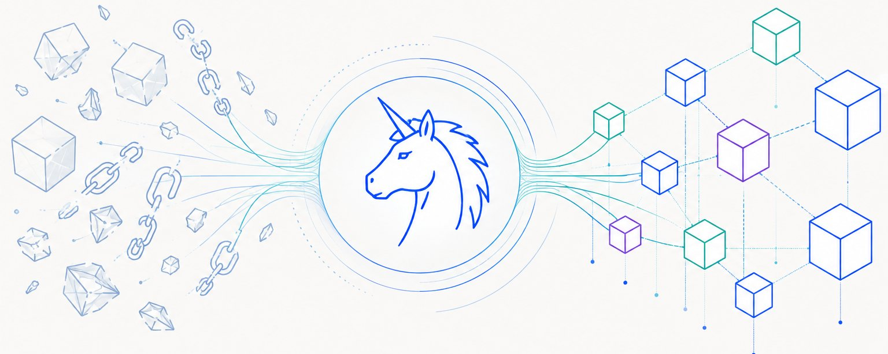
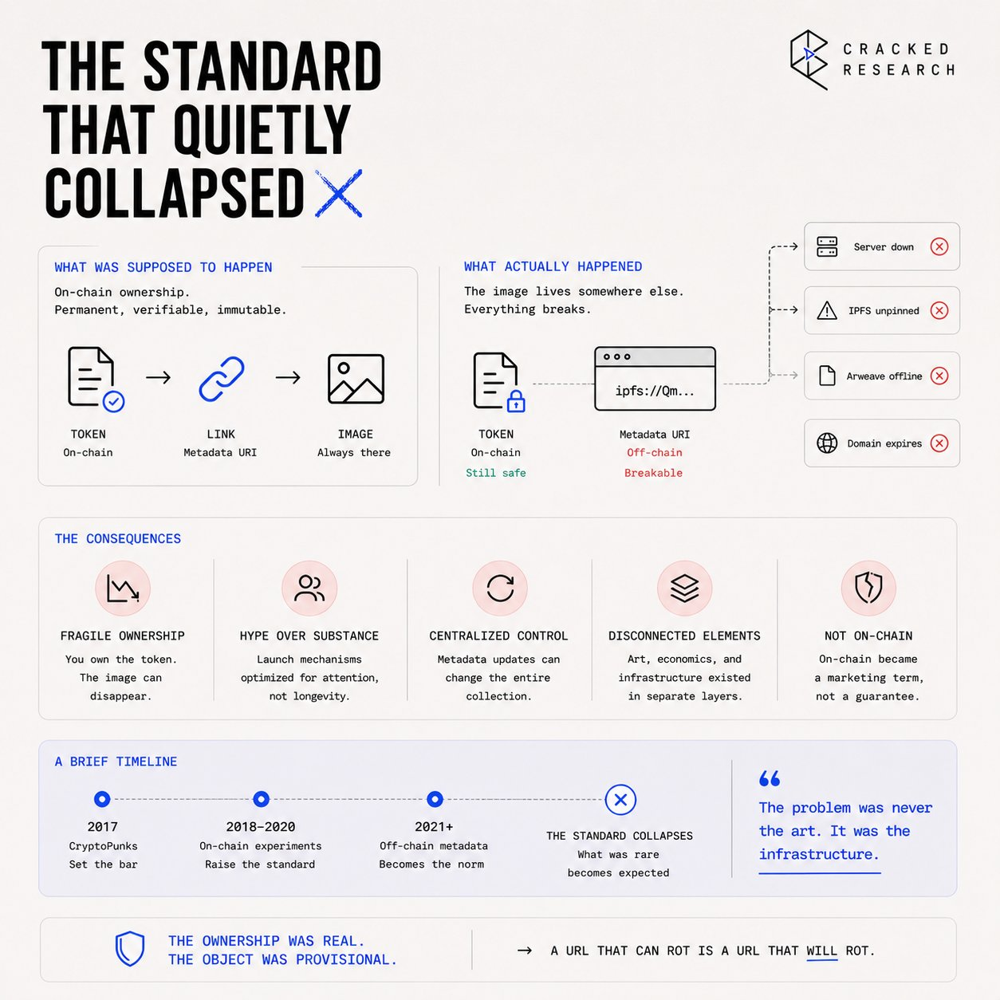
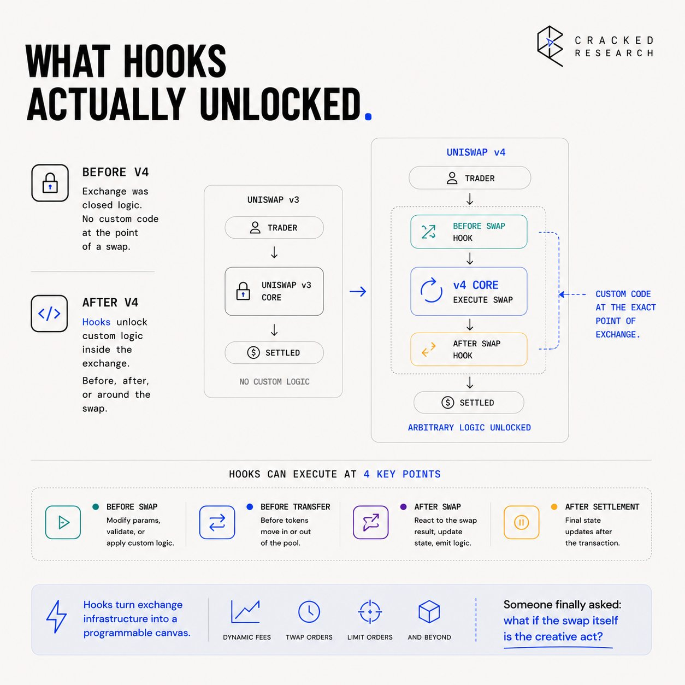
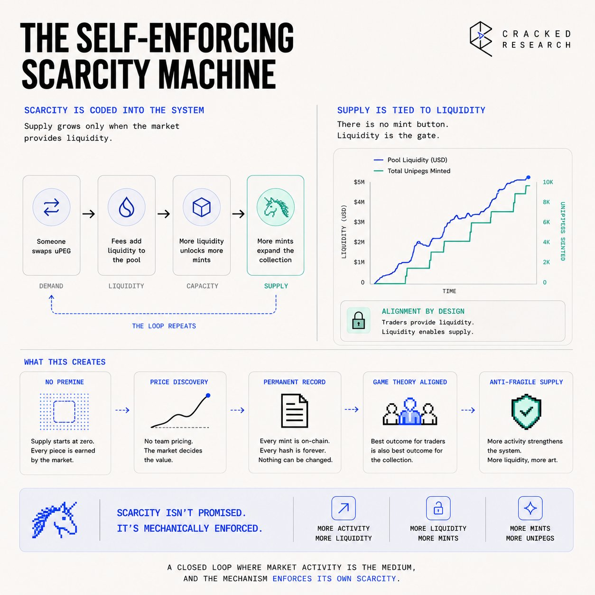
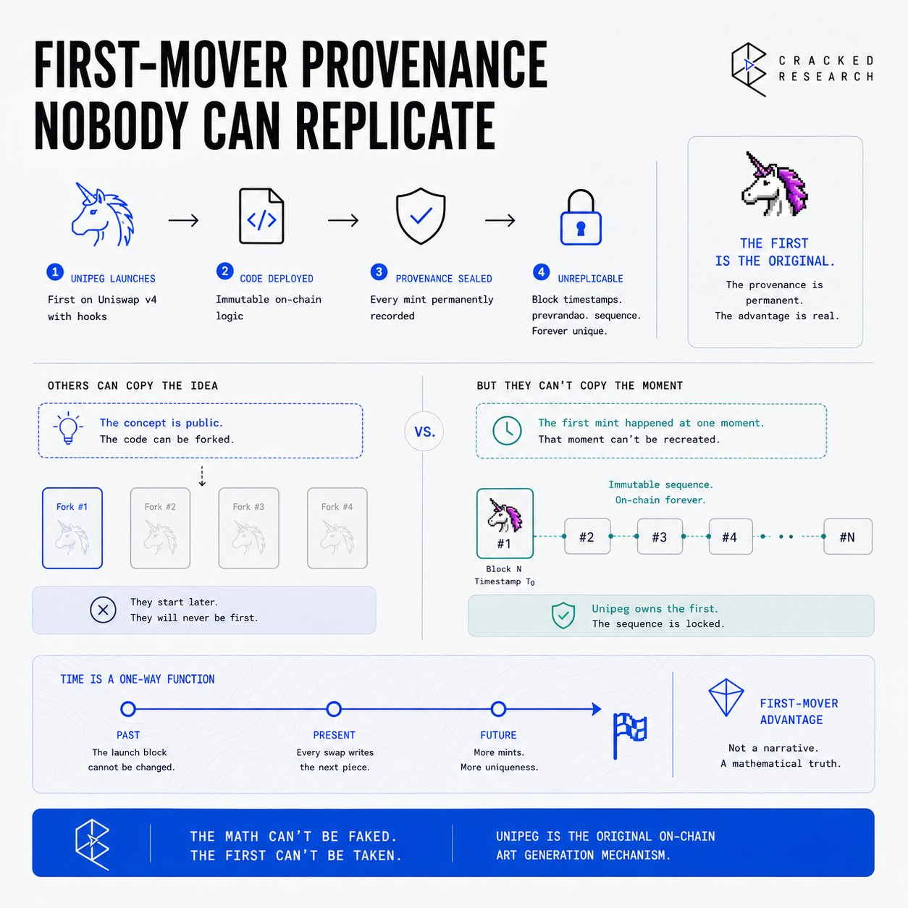
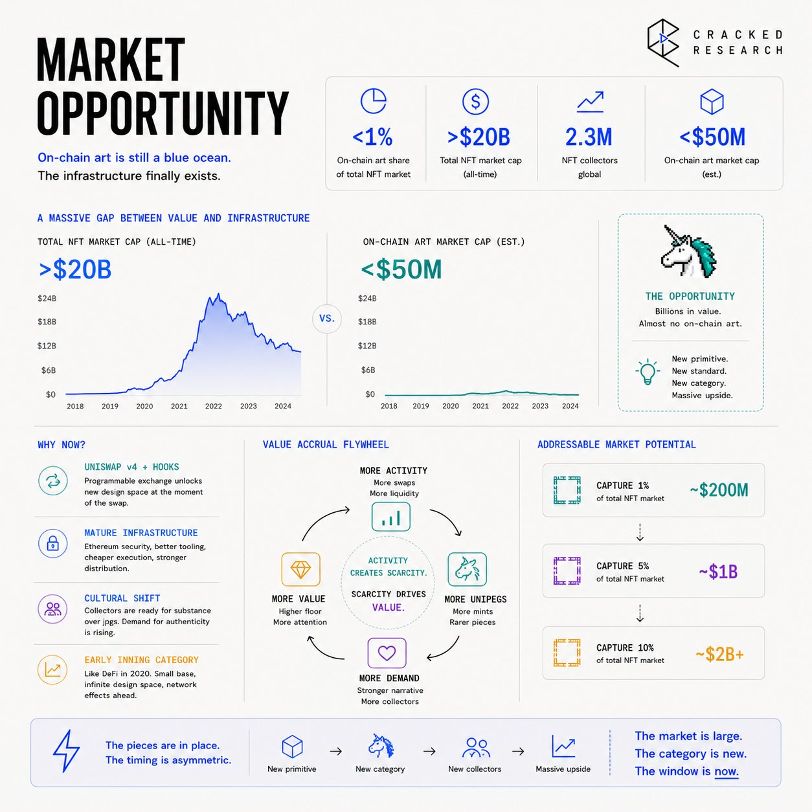

# Unipeg



## The Standard That Quietly Collapsed

There's a version of on-chain digital culture that never fully arrived.

CryptoPunks were radical in 2017, not because they were images. They were the first objects that genuinely lived on a blockchain without external dependencies. Autoglyphs did it properly. Early Art Blocks got close. Then the market scaled, corners were cut, and the standard everyone celebrated quietly collapsed. By 2021, most NFTs were jpegs hosted on IPFS with metadata pointing somewhere that might not exist in five years. The "on-chain" part became aesthetic, not literal. The format became the problem.

The distribution mechanism was always the failure point. Building on-chain art is not technically difficult — producers have been creating genuinely interesting generative work for years. The gap was always between the art and the infrastructure that delivered it: vanilla mints, IPFS links, metadata pointing off-chain, external storage, Arweave dependencies. The art itself could be brilliant, but the moment you linked it to a server or a pinning service, it became fragile. A URL that can rot is a URL that will rot. The ownership was real; the object was provisional.

The problem ran deeper than storage. Every NFT collection with external metadata has a single point of failure that no contract can protect: the image is separate from the token. You can own the token permanently. The image disappears whenever the hosting does. No amount of on-chain verification changes what is fundamentally an off-chain dependency. And because the distribution mechanism was always separate from the art itself, it shaped the culture in ways nobody wanted. Launch-day hype machines, coordinated reveals, collection-wide metadata refreshes. The art and the economics were structurally disconnected.



What nobody had built was a system where the delivery mechanism and the art were the same thing. Where every trade is part of how the work gets made. Where the object cannot be separated from the chain because it is the chain.

## The Layer That Was Missing

The conversation became circular. On-chain art developers knew the problem. The community knew the problem. The solution seemed to require either building a new chain or accepting the compromise. Some teams tried calldata-based approaches: 0xmons, Blitnauts, Ethscriptions. Interesting experiments. None of them solved the mechanism question at the point of exchange itself.

Meanwhile, Uniswap v3 had become the defining liquidity infrastructure of DeFi with no capacity for custom logic at the point of a swap. If you wanted to extend what happened when someone traded, you had to build outside the protocol, bolt your logic on top, and accept the resulting complexity and attack surface. The AMM and any creative application of it were fundamentally separate layers. Exchange was exchange. Everything else was something else.

The tooling gap was not abstract. The builders working on on-chain art for months said they were desperately looking for an "anti-cringe distribution mechanism." Not a better image format. Not a new hosting solution. A mechanism where the way the work reached collectors was as considered as the work itself.

This encapsulates what was missing from on-chain culture for eight years. The art existed. The infrastructure wasn't.

## What Hooks Actually Unlocked

When Uniswap v4 shipped, one architectural detail changed the design space entirely: hooks. Custom logic that runs directly at the point of exchange, not wrapped around it, not bolted on top. Inside it. Before a swap executes, after it closes, before liquidity moves. Arbitrary code with access to the exact on-chain state at the moment of the transaction.



Most developers read that as a DeFi primitive. Dynamic fees, TWAP orders, volatility oracles, limit orders, financial applications of programmable exchange logic. The design space was enormous, and it was obvious.

The Uniswap ecosystem has been where all meaningful financial innovation happens in crypto. Over $3 trillion in cumulative volume processed across all protocol versions. Hooks extend that same infrastructure into arbitrary programmable logic, and someone finally asked: what if the swap itself is the creative act?

**Unipeg** is what that looks like when built properly. A custom v4 hook generates a unique 24×24 unicorn image entirely on-chain, with no external storage, no IPFS, no Arweave, every time a whole-integer amount of uPEG is swapped. The hash is written permanently to the contract before the transaction closes. The image is derived from the hash directly. Nothing points anywhere external. The object and the chain are the same thing.

```text
Traditional NFT Structure:         Unipeg Structure:
[Contract] → token ID              [v4 Pool] → swap triggers hook
     |                                  |
[IPFS/Server] → image                  |→ reads: swap count + block timestamp
     |                                        + prevrandao + block number
[Token] ≠ [Image]                      |→ keccak256 hash
(separate layers, external link)       |→ on-chain SVG renderer
                                       |→ hash written to contract
                                  [Object] = [Token] = [Chain data]
                                  (no external link, no separate layer)
```

The hook reads four inputs at the exact moment of the swap: the number of uPEG transactions before yours, the block timestamp, your block number, and prevrandao — genuine on-chain randomness introduced post-merge via EIP-4399, generated by the validator who proposed your block, ungameable by design. Those inputs are hashed with keccak256, encoding every visual property of the unicorn: body, eyes, horn, hair, wings, tail, colors, background, and the original owner's wallet address. All of it written to the contract permanently before the transaction closes.

As long as you hold it, the image stays. The market keeps generating new swaps, new seeds, new unicorns. Yours does not change until you sell. Whoever buys next gets a different hash entirely. The object is a function of the chain state at the moment you bought, locked to you until you let it go.

The name completes the picture. Hayden Adams originally wanted to call the protocol Unipeg (unicorn plus pegasus). When the demo was shown to Vitalik, Vitalik said it sounded more like Uniswap, and the name changed. The name that got dropped in 2018 turned out to describe something v4 made possible seven years later. Uni + JPEG = uPEG. A peg being a rule enforced at the point of exchange, which is precisely what a v4 hook is.

## The Self-Enforcing Scarcity Machine

Most collection mechanics are designed. Rarity tables, trait probabilities, reveal schedules, whitelists. The team decides what is scarce and communicates it to the market. The market accepts it or doesn't. The scarcity is a claim backed by the team.



Unipeg's scarcity is mathematical. The total supply is 10,000 uPEG tokens. Every whole-integer balance triggers a uPeg object. Fractional amounts don't mint. They accumulate in the liquidity pool as dust. As more trades happen, more fractional amounts (decimal remnants of swaps and sells) sit inert in the pool. The pool's composition shifts. Whole integers become harder to assemble from the dust. The supply of mintable objects only moves in one direction.

```text
uPEG Supply Mechanics:

[10,000 total tokens]
        |
[Whole integers → uPeg objects with hash + traits]
        |                    |
[Fractional dust → returns to LP pool]
        |
[Dust dominance ratio rises over time]
        |
[Probability of assembling whole integer falls]
        |
[Scarcer objects, richer provenance]
```

Two distinct things emerge from one contract:

- uPeg objects: whole integers carrying a permanent hash, traits, provenance, on-chain identity.
- uPeg dust: fractional remnants returning to the pool. With this setup, the token exists but the object may not. What determines the difference is how much accumulates and whether someone puts it together. The scarcity was not written into the contract. The mathematics were.

The rarity system compounds this. Two scores drive value: visual (uniqueness of traits relative to every other existing object) and age (how long the current holder has held it). Age score matters because the market creates it. An object held since April 15 accumulates continuously. One extracted in an atomic batch operation four minutes ago starts at zero. Same visual rarity on paper. Completely different provenance in practice.

When a coordinated batch attack extracted rare objects in May, the response demonstrated the design philosophy. Contract ownership had already been renounced to 0x0: the hook couldn't be changed, the image renderer couldn't be swapped, the random seed provider was untouchable. Rather than fight the attack, the team absorbed it: the age score made every batch-extracted rare carry its own history permanently. The attacker's objects entered the secondary market stamped with AGE 0. They weren't banned. They weren't blocked. The contract recorded their origin and let the market price it. The attacker was written into the work's catalog.

This is what a genuinely decentralized object looks like. No admin key. No upgrade path. No intervention possible. The mechanism runs as designed, and the market discovers what that means.

## First-Mover Provenance Nobody Can Replicate

Uniswap v4 hooks only launched in late 2024. The design space is open, and most teams building on it are focused on financial applications: dynamic fees, TWAP orders, custom liquidity curves. Unipeg entered as the first collectibles proof-of-concept at scale on Ethereum, holding #2 hook volume position on the chain with just four pools — a data point that was accurate at the time of writing.

The architecture is difficult to replicate not because the code is complex (the SVG generation is open source on GitHub) but because the design took the mechanism seriously. The distribution problem required building at the v4 hook layer, not around it. Every team that launches a hook-based collectibles project after this benefits from Unipeg proving the model works. They cannot replicate the provenance of the first objects that existed. They cannot replicate the scarcity that has already accumulated. Every uPeg object carries a block hash from the chain state at the moment it was minted. That data exists forever on Ethereum. The provenance is provable and permanent.



Secondary market infrastructure built organically around the object. [Peg2Peg](https://x.com/unipegv4/status/2050278218855276922), a peer-to-peer exchange with no middleman and no custody, launched May 1 and crossed 150 ETH in volume within two days. [OpenSea](https://x.com/unipegv4/status/2051666486486245379) went live May 5. [Element Market](https://x.com/unipegv4/status/2052048650906280265) followed May 6. [42space](https://x.com/42space/status/2051121348618133539) came online May 4. None of this was supplied by a team-controlled platform. The community built the rails because the object warranted them.

Zero KOL compensation. Zero partnerships. Zero paid promotion. Growth from 0 to 1,000 followers and hundreds of thousands of impressions and site visits is entirely organic. People are showing up because they find the mechanism interesting, not because someone is paying them to say so.

## Market Opportunity

The on-chain collectibles category is at an inflection. The ERC-721 era produced tens of billions in volume, and most of it was built on the compromise of off-chain storage. The first generation of NFTs that are genuinely on-chain is only beginning to form.

Ethereum remains the chain where all meaningful innovation happens. Hooks extend Uniswap's infrastructure into arbitrary programmable logic at the point of exchange, and the collectibles design space within that is functionally unexplored. Unipeg has generated approximately $120M in total trade volume since launching in April 2026, operating with four pools and zero paid promotion.

The relevant comparison is not to the 2021 NFT market. That market was built on a broken distribution model. The comparison is to the pre-Punk moment, when genuinely on-chain objects didn't exist at an accessible price point. CryptoPunks were free to claim in 2017. The collectors who understood what permanent on-chain ownership meant before the broader market did are the reference group. The valuation gap between Unipeg's current market cap and the eventual market cap of the first real on-chain collectible standard is where the trade lives. Early Punks and Autoglyphs at a similar stage looked like this: low market cap, proven mechanism, market not yet pricing the permanence.



The expansion path follows the hooks adoption. Every v4 pool that launches with hook-based collectible logic validates the category. Unipeg, as the first and largest example, has provenance no subsequent project can replicate. If v4 hooks become the standard infrastructure for the next DeFi era (the design intent is explicitly to let the market fix decentralized problems rather than team-controlled contracts), the earliest proof-of-concept objects carry historical weight that compounds.

The dust dominance ratio is the clearest forward indicator, currently at 0.64. Higher means more fractional accumulation in the pool, fewer whole integers available for minting, existing objects becoming structurally scarcer.

The market made the uPeg. The market decides its value.

## Valuation

The relevant comparables are early-stage on-chain collectible tokens at a similar phase. Not DeFi protocols with revenue, and not standard NFT collections with a floor price divorced from token economics.

CryptoPunks were unclaimed at launch. The Autoglyph collection launched at near-zero. Art Blocks early output traded at the mint price for months before price discovery happened. Each of those had one structural advantage over the NFT collections that followed: the object genuinely lived on-chain. Unipeg shares that structural advantage and adds a mechanism that those projects didn't have: the AMM itself as an automatic scarcity engine.

The $7.99M market cap against $120M in total trade volume produces a volume-to-cap ratio consistent with early-stage DeFi protocols, not established collectible collections. The market is not pricing the accumulated scarcity of the objects or the provenance of what already exists. That gap is the trade.

## Tokenomics

```text
| Metric | Value |
|---|---|
| Total Supply | 10,000 uPEG |
| Circulating Supply | Full supply accessible (no lockups) |
| FDV / Market Cap | ~1.0x |
| Active Objects (uPegs in existence) | 6,091 |
| Holders | 4,770 |
```

The supply structure is clean. 10,000 is the hard cap and the FDV equals the market cap. There are no insider lockups, no vesting schedules, no unlock events to watch. Every token is in the market. What isn't held as whole integers is accumulating as dust in the liquidity pool.

The token functions as both a fungible asset and the entry point to a collectible object. Hold a whole integer, and you have a uPeg with permanent hash, traits, and provenance. Sell below a whole integer, and you return dust to the pool. The two forms (object and token) exist within a single contract and convert automatically based on balance. Holding improves rarity. Trading degrades it. The economics of ownership and the economics of collection align, which is what most NFT projects failed to achieve.

Permanent liquidity: 13.65 ETH and 717.85 uPEG locked on Uniswap v4 for 255 years and 11 months. That floor is structural, not a team commitment.

## The Team

Unipeg is led by [@unipegv4](https://x.com/@unipegv4), a developer associated with the 0xHadrian blog, with demonstrated experience in on-chain experimentation and protocol design. Not fully doxxed — pseudonymous in the tradition of Ethereum's cypherpunk contributors, which is common for early-stage experimental hook projects in the Uniswap v4 ecosystem.

[@unipegv4](https://x.com/@unipegv4) **/ 0xhadrian.eth.** Wrote the core Solidity hook contract, the on-chain SVG renderer, and authored three published essays under his ENS address before launch, establishing the philosophical framework. The decision to renounce contract ownership to 0x0 before the May attack demonstrates a commitment to decentralization that goes beyond stated intent. The hook cannot be changed. The image renderer is frozen. The randomness provider is locked.

[@gavofyork](https://x.com/@gavofyork)**.** Solidity contract architecture. Contributed the hook that triggers automatically before the transaction closes without a separate user action.

[@sendmoodz](https://x.com/@sendmoodz) **and** [@saraareynolds](https://x.com/@saraareynolds)**.** The v4 hook architecture itself was designed by sendmoodz and brought to life by saraareynolds at Uniswap. Unipeg runs on the infrastructure they built.

The broader contributor group includes Jordan Lyall (VenturePunk), zac.eth (CoinQuarium), LaserCat397.eth (TinFun), and Minion (GBV Capital), alongside other community contributors. No Discord, no roadmap, no airdrop, no KOL round. Posts on the official account are mechanism updates, not marketing. The project communicates through what it ships, not what it says.

## External Signals

- **Bankless.** Featured Unipeg as the leading example of v4 hook-based collectibles, describing it as a successful proof-of-concept with approximately $120M in trade volume since the April launch, and the largest example of this model in the wild.
- **OpenSea CMO Adam Hollander and Uniswap team member niko.** The project gained quick viral attention in the Uniswap v4 and NFT communities after mentions by both, serving as early institutional validation from within the collectibles and protocol layer.
- **Bitget Web3 Academy.** Published a dedicated explainer covering Unipeg's mechanism, price outlook, and risks for the Uniswap v4 hook-based token category, reflecting growing researcher coverage beyond crypto-native media. \[[source](https://web3.bitget.com/en/academy/what-is-unipeg-upeg-price-outlook-risks-and-uniswap-v4-hook-based-token-explained)\]
- [@ztrader369](https://x.com/@ztrader369)**.** One of the first to discover this new trend and fully understand its value. Wrote countless posts on this project.
- [@798\_eth](https://x.com/@798_eth). Early supporter in the Asian region. Wrote multiple in-depth articles on Unipeg.

## Trade Setup

**Market Snapshot**

```text
Current Phase:   Post-ATH correction / accumulation
Price:           $793.18 (ATH: $3,050 | ATL: ~$20-$50)
Drawdown:        ~74% from ATH
Recent Perf:     -39.27% (24h) | -41.12% (7d)
Volume:          $5,956,151 (+18.45% 24h)
Exchanges:       MEXC, Uniswap v4, Lbank, Uniswap v3
Market Cap:      $7.99M
FDV:             $7,931,763
```

The price action fits the post-launch distribution pattern: explosive move from the ATL range to $3,050 ATH as the mechanism story spread, then a sharp correction as early holders distributed into the narrative.

The pattern is typical of category-creating primitives that get discovered faster than they can be evaluated. The narrative moved before the mechanics were widely understood. Now the mechanics are documented: covered by Bankless, analyzed by the community, rarity index is live.

The price is reset. Fear index at 38 with BTC dominance showing a slow decline creates room for altcoin rotation, especially into the Ethereum ecosystem. BTC dominance declining alongside USDT dominance signals capital preparing to move into new narratives. UPEG is the right type of project to benefit from that rotation: Ethereum-native, mechanism-driven, with real collector demand and no manufactured hype.

**Scenario Analysis**

Scenario Assumptions Target FDV Multiple from Current Bear Hooks don't reach mainstream adoption; category stays niche; no CEX listings $2M–$4M ~0.25x–0.5x Base V4 hooks adoption grows; Unipeg maintains first-mover position; 1–2 tier-2 CEX listings $25M–$50M ~3x–6x Bull Tier-1 CEX listing; hooks become DeFi 3.0 standard; on-chain art renaissance validates category $100M–$300M ~12x–37x

**Catalysts**

The most time-sensitive catalyst is a CEX listing. The community thesis depends on exchange access, expanding the holder base beyond Ethereum DeFi natives. A tier-1 listing at the current market cap would be a major volume event. OpenSea, Element, and MEXC listings are all steps in that direction.

The dust dominance ratio rising above 0.64 is a structural catalyst for existing holders. Higher DDR means fewer mintable objects from available dust, which means existing objects become harder to obtain. The object supply contracts while the token supply stays fixed. Watch this number weekly.

On-chain certification for provenance, flagged as coming soon, adds a verification layer that makes the genuine-object/farmed-object distinction visible at the contract level rather than requiring marketplace tagging. That closes the rarity integrity question structurally.

**Future Outlook**

**Near-term (0–6 months):** Tier-1 or tier-2 CEX listing; provenance certification going live; dust dominance ratio pushing toward 0.70+. If the thesis plays out, UPEG reaches $50M–$150M market cap within this window.

**Medium-term (6–18 months):** V4 hooks as standard DeFi 3.0 infrastructure. Unipeg objects (the first proof-of-concept) carry permanent historical status. Secondary market volume and object floor prices follow. Target: $50M–$150M market cap on hooks reaching mainstream adoption.

**Long-term (18+ months):** If on-chain native objects replace the IPFS-dependent collectible standard, Unipeg sits at the beginning of that transition. The provenance of objects minted in April and May 2026 is permanent. The block data exists on Ethereum forever. The terminal case is a market cap commensurate with early Punk and Autoglyph valuations, where on-chain permanence was the differentiation, and the market eventually priced it properly.

## Key Risks

**Technical. Hook Architecture Exposure.** The v4 hook model is new infrastructure. UpegHook.sol runs automatically at the point of exchange, and with contract ownership renounced, any undiscovered vulnerability in the hook itself or in the v4 PoolManager layer could affect object generation or trading with no ability to patch. If a critical exploit surfaces: price impact is severe, potential permanent disruption of minted objects.

**Market. Post-Launch Distribution Ongoing.** The 74% drawdown from ATH with $5.9M in 24h volume against a $7.99M market cap points to active selling. If early holders continue distributing and no new demand cohort arrives before a major catalyst, the price can continue compressing. Risk window: next 4–8 weeks.

**Competitive. The Model Is Replicable.** The SVG generation code is open source. Any team can build a hook-based generative collectibles project. The differentiation Unipeg has is first-mover provenance and the accumulated scarcity of existing objects. That advantage disappears if a better-capitalized team launches a higher-quality hook project with paid distribution and a KOL round. The mechanism is not defensible; the provenance of the objects is.

**Rarity. Farming Attacks Degrade Category Perception.** The May batch-extraction attack, while handled elegantly via age scoring, created confusion in the community about which objects carry genuine value. If rarity farming persists and on-chain certification is delayed, the secondary market premium on rare objects is suppressed.

**Pseudonymous Team.** The core developer is not fully doxxed. If development stops and no community takes over the open-source codebase, the project loses its primary update and communication layer. The contracts are immutable but without further development, engagement could stop.

What makes the thesis hold despite these risks is the contract architecture itself. Contract ownership has been renounced. The hook cannot be changed. The image renderer is frozen. No team decision can alter the objects that already exist. Whatever happens to the team, the existing uPeg objects are permanent. The block data that generated each one is in the Ethereum chain forever. The provenance question (can you prove where this object came from) resolves to yes, mathematically, for every object that already exists.

## Conclusion

Something structurally new shipped in April 2026 on Ethereum. Not a better NFT mechanism, not a DeFi protocol with a collectible wrapper. A system where every trade is part of how the art gets made, where the distribution mechanism and the object are the same transaction, and the contract that runs it has been renounced to the zero address.

Uniswap v4 hooks became available in late 2024. The first months of the hook era produced financial applications. Unipeg is the first collectibles proof-of-concept at scale — $120M in total volume, listings across four exchanges, a community-built peer-to-peer marketplace that crossed 150 ETH in volume in two days, zero paid promotion. The hook-based collectibles category is proven. The first-mover with permanent on-chain provenance is already in the market at a $7.99M market cap, 74% below ATH, with BTC dominance slowly declining and altcoin rotation building on Ethereum.

If the thesis plays out (hooks become the standard for the next DeFi era, the on-chain art category gets a second wave of attention, and a tier-1 CEX listing expands the holder base), UPEG reaches $50M–$150M market cap within 3–6 months. The objects minted in April 2026 carry block hashes from the first weeks of the hook-based collectibles era. Those hashes exist on Ethereum permanently. The market will eventually price that history the way it priced the Punks that nobody claimed in 2017.

Watch three things: the dust dominance ratio (currently 0.64 — rising means structural scarcity is compressing the mintable supply), CEX listing announcements, and on-chain provenance certification going live. If DDR crosses 0.70 and a tier-2 CEX lists before the altcoin rotation fully materializes, the setup is in place before the market reprices. The mechanism was designed to be authorless. The objects it created aren't going anywhere.

The name that got dropped in 2018 turned out to describe something that took seven years to become possible. Everything else follows from that.

- **X:** [https://x.com/unipegv4](https://x.com/unipegv4) 
- **Website:** [https://unipeg.art](https://unipeg.art/) 
- **Community:** [https://t.me/unipeglive](https://t.me/unipeglive)
- **CA:** 0x44b28991B167582F18BA0259e0173176ca125505

## Disclaimer

This document is for informational purposes only and does not constitute investment advice or an offer to sell or solicitation to buy any securities or investment products. All investments involve risk, including the possible loss of principal. Past performance is not indicative of future results. Any forward-looking statements or hypothetical examples are subject to risks and uncertainties and are not guarantees of future performance. No client-adviser relationship is established by this material. The author assumes no responsibility for the accuracy or completeness of third-party information referenced.