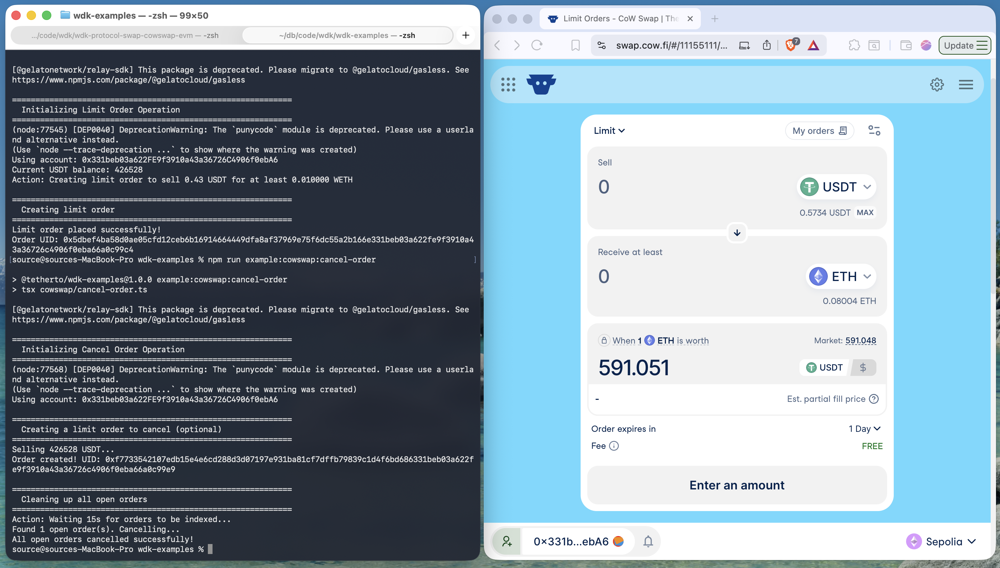

[WDK CowSwap](https://github.com/thisonedev/wdk/tree/master/wdk-protocol-swap-cowswap-evm) is a lightweight package that lets EVM wallet accounts swap tokens using the Cowswap protocol. 
It provides a clean SDK for token swaps on EVM chains and works with both standard wallets and ERC-4337 smart accounts.



## Setup

### 1. Clone the repository

```
git clone https://github.com/thisonedev/wdk.git
```

### 2. Enter wdk-protocol-swap-cowswap-evm directory

```
cd wdk-protocol-swap-cowswap-evm
```

### 3. Install dependencies

```
npm install
```

## Tests

To run the test suites for this module, use the following commands:

- Run unit tests (Jest):

```
npm run test:unit
```

- Run integration tests (brittle):
```
npm run test:integration
```

- Run test coverage:
```
npm run test:coverage
```
