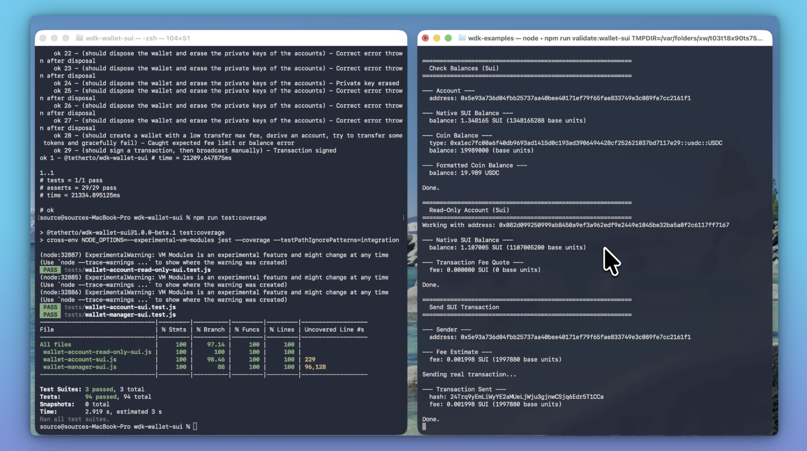

[WDK Sui Wallet](https://github.com/thisonedev/wdk/tree/master/wdk-wallet-sui) is a simple and secure package to manage BIP-44 wallets for the Sui blockchain. 
This package provides a clean API for creating, managing, and interacting with Sui wallets using BIP-39 seed phrases and Sui-specific derivation paths.



## Setup

### 1. Clone the repository

```
git clone https://github.com/thisonedev/wdk.git
```

### 2. Enter wdk-wallet-sui directory

```
cd wdk-wallet-sui
```

### 3. Install dependencies

```
npm install
```

## Tests

To run the test suites for this module, use the following commands:

- Run unit tests (Jest):

```
npm run test:unit
```

- Run integration tests (brittle):
```
npm run test:integration
```

- Run test coverage:
```
npm run test:coverage
```
