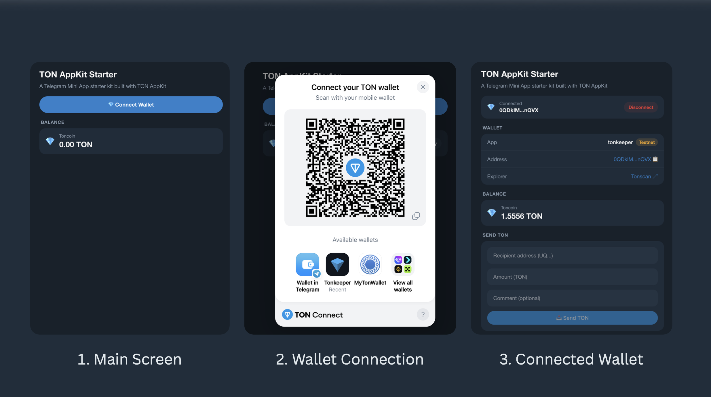
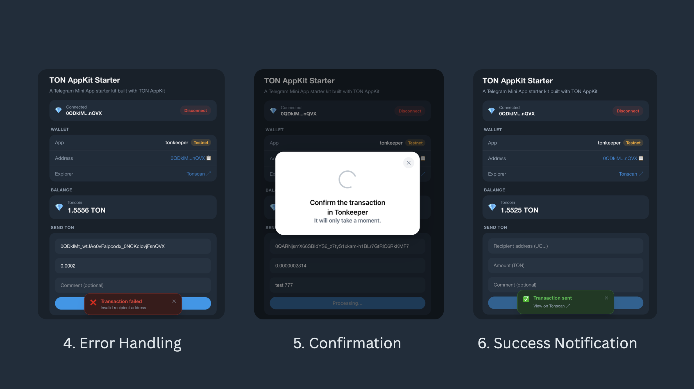

[TON AppKit Starter](https://github.com/thisonedev/vault/tree/master/ton-appkit-starter) is a Telegram Mini App starter kit built with [TON AppKit](https://docs.ton.org/ecosystem/appkit/overview), React, TypeScript, and Vite. Covers main AppKit features: wallet connection, balance monitoring, and TON transfers.

> Runs on **testnet** by default. Switch to mainnet by changing `NETWORK` in `src/utils/constants.ts`.





---

## Features

- 💎 Connect/disconnect TON wallet via TON Connect
- 📊 Real-time balance monitoring with polling
- 📤 Send TON to any address with optional comment
- 🔗 Transaction confirmation with Tonscan explorer link
- 📱 Telegram Mini App ready — theme sync, viewport expand, safe area support
- 👤 Telegram user info — name
- 🌗 Light/dark mode — syncs with Telegram theme, falls back to system preference
- 🌐 Works in a regular browser too

---

## Prerequisites

- Node.js 18+
- A TON wallet (e.g. [Tonkeeper](https://tonkeeper.com)) with testnet mode enabled
- Optional: a free [TonCenter API key](https://t.me/toncenter) for higher rate limits

---

## Setup

### 1. Clone the repository

```
https://github.com/thisonedev/vault.git
```

### 2. Enter ton-appkit-starter directory

```
cd ton-appkit-starter
```

### 3. Install dependencies

```
npm install
```

### 4. Configure environment

```bash
cp .env.example .env
```

Open `.env` and fill in your values:

```bash
# Optional but recommended — avoids rate limit errors
TONCENTER_API_KEY=<your_api_key_here>

# Your app's TON Connect manifest URL
# The demo manifest below works fine for local development
MANIFEST_URL=https://tonconnect-sdk-demo-dapp.vercel.app/tonconnect-manifest.json
```

## Running an app

```bash
npm run dev
```

Open [http://localhost:5173](http://localhost:5173) in your browser.

---

## Running as a Telegram Mini App

Telegram requires a public HTTPS URL to load a Mini App. During development, use ngrok to tunnel your local dev server.

### 1. Start your dev server

```bash
npm run dev
```

### 2. In a separate terminal, start ngrok

```bash
npx ngrok http 5173
```

Copy the `https://` URL ngrok gives you, e.g. `https://abc123.ngrok-free.app`

**3. Create a Telegram bot**

- Open [@BotFather](https://t.me/BotFather) on Telegram
- Send `/newbot` and follow the prompts — pick a name and username
- BotFather gives you a bot token — save it for later

### 4. Set the Mini App URL

- Send `/mybots` to BotFather
- Select your bot → **Bot Settings** → **Menu Button** → **Configure menu button**
- Paste your ngrok URL

### 5. Open the Mini App

- Open your bot in Telegram
- Tap the **Menu** button (bottom left, next to the message input)
- Your app loads as a Mini App

Your app hot-reloads automatically on code changes — no need to restart ngrok or reconfigure BotFather unless the ngrok URL changes.

> **Note:** Free ngrok generates a new URL every time you restart it. To keep a stable URL during development, keep ngrok running or use a paid plan with a fixed domain.

> **Production:** Deploy to any static host (Vercel, Netlify, Cloudflare Pages) and set that URL in BotFather instead.

---

## Project Structure

```
ton-appkit-starter/
├── index.html                        # Entry point — includes Telegram WebApp script
├── vite.config.ts                    # Vite config with Buffer polyfill and @ alias
├── tsconfig.json                     # Root TypeScript config with project references
├── tsconfig.app.json                 # TypeScript config for src/
├── package.json                      # Dependencies and scripts
├── .env.example                      # Environment variable template
├── .gitignore                        # Ignored files — node_modules, .env, dist
├── eslint.config.js                  # ESLint config
├── README.md                         # Project documentation
│
└── src/
    ├── main.tsx                      # React entry — mounts app
    ├── App.tsx                       # Root — AppKit, QueryClient, and provider setup
    ├── index.css                     # Telegram design tokens, Tailwind, global styles
    ├── polyfills.ts                  # Buffer polyfill required by @ton/core
    │
    ├── components/
    │   ├── shared/                   # Reusable UI primitives
    │   │   ├── Card.tsx              # Rounded surface container
    │   │   ├── CardRow.tsx           # Label/value row with optional divider
    │   │   ├── FormField.tsx         # Input with error message
    │   │   └── SectionTitle.tsx      # Section label above cards
    │   │
    │   ├── telegram/                 # Telegram-specific components
    │   │   └── TelegramProvider.tsx  # SDK init, theme sync, user/colorScheme context
    │   │
    │   ├── transfer/                 # Send flow
    │   │   ├── SendTon.tsx           # Transfer form using SendTonButton
    │   │   └── TransactionStatus.tsx # Success/error toast with Tonscan link
    │   │
    │   └── wallet/                   # Wallet state and display
    │       ├── Balance.tsx           # TON balance with polling
    │       ├── WalletConnect.tsx     # Connect/disconnect button
    │       └── WalletInfo.tsx        # Address, network badge, explorer link
    │
    ├── hooks/
    │   └── useIsConnected.ts         # Returns true if a wallet is connected
    │
    ├── types/
    │   ├── index.ts                  # Shared TypeScript interfaces
    │   └── telegram.d.ts             # Global type declarations for window.Telegram.WebApp
    │
    └── utils/
        ├── constants.ts              # Global constants — network, URLs, intervals
        └── ton.ts                    # Helper functions — formatting, validation, API
```

---

## Components

### `TelegramProvider`

Initialises the Telegram Mini App SDK and syncs Telegram's theme to CSS variables. Wraps the entire app so any component can access the Telegram context via `useTelegram()`.

- Calls `tg.expand()` to make the app full screen
- Calls `tg.ready()` to hide the native loading indicator
- Listens to `themeChanged` events and updates CSS variables in real time
- Exposes `isTMA`, `colorScheme`, `isReady`, and `user` via context

```tsx
import { useTelegram } from '@/components/TelegramProvider';

const { isTMA, colorScheme, isReady, user } = useTelegram();

// Show Telegram username
<p>Welcome, {user?.first_name ?? 'anon'}</p>
```

---

### `WalletConnect`

Connect/disconnect button. Shows a connect button when no wallet is connected, and a connected state with a shortened address and disconnect option when a wallet is connected.

Uses `useTonConnectUI` from `@tonconnect/ui-react` to open the TON Connect modal.

---

### `WalletInfo`

Displays wallet details after connection:

- Wallet app name (e.g. Tonkeeper, MyTonWallet)
- Network badge — **Testnet** (yellow) or **Mainnet** (green), read from `wallet.account.chain`
- Full address with tap-to-copy
- Link to the wallet on Tonscan

Only rendered when a wallet is connected.

---

### `Balance`

Displays the connected wallet's TON balance. Polls every `BALANCE_POLL_INTERVAL_MS` (10 seconds by default) to keep the value fresh.

- Shows a skeleton loader while fetching
- Shows the balance formatted to 2–4 decimal places
- Shows a retry button on error

Uses `useBalance()` from `@ton/appkit-react`.

---

### `SendTon`

A transfer form with three fields: recipient address, amount (TON), and an optional comment. Uses `SendTonButton` from `@ton/appkit-react` which handles the wallet interaction internally.

- Validates the recipient address format and amount before sending
- Disables the button while a transaction is pending
- Passes success/error results to `TransactionStatus`

Only rendered when a wallet is connected.

---

### `TransactionStatus`

A toast notification shown after a send attempt.

- **Success**: shows "Transaction sent" and polls the TonCenter API every 2 seconds (up to 10 attempts / 20 seconds) until it finds the transaction hash, then shows a direct Tonscan link
- **Error**: shows a human-readable error message (e.g. "Transaction cancelled" instead of the raw SDK error)
- Auto-dismisses after 12 seconds on success, 8 seconds on error
- Can be manually dismissed with the ✕ button

---

## Switching to Mainnet

Change the following values in `src/utils/constants.ts`:

```ts
export const NETWORK = Network.mainnet();
export const TONCENTER_BASE_URL = 'https://toncenter.com';
export const TONSCAN_BASE_URL = 'https://tonscan.org';
```

And update your `.env`:

```bash
TONCENTER_API_KEY=<your_mainnet_key>
```

---

## Tech Stack

| Package | Purpose |
|---|---|
| `@ton/appkit-react` | AppKit React hooks and components |
| `@tonconnect/ui-react` | TON Connect wallet hooks |
| `@tanstack/react-query` | Data fetching and caching |
| `tailwindcss` | Utility-first CSS |
| `buffer` | Node.js Buffer polyfill for the browser |

---

## Resources

- [TON AppKit docs](https://docs.ton.org/ecosystem/appkit/overview)
- [TON Connect manifest](https://docs.ton.org/ecosystem/ton-connect/manifest)
- [TonCenter API](https://docs.ton.org/ecosystem/api/toncenter/introduction)
- [Telegram Mini Apps](https://docs.ton.org/ecosystem/tma)
- [Get a TonCenter API key](https://t.me/toncenter)